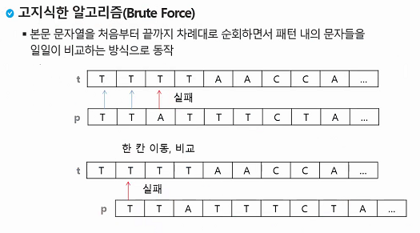

# 문자열(string)

> 문자열, 패턴 매칭, 문자열 암호화, 문자열 압축, 실습1&2


### Python에서의 문자열 처리

- char 타입 없음
- 텍스트 데이터의 취급방법 통일되어 있다.

- 문자열 기호
  - `''`,`""`,`'''`
  - +(연결)
  - 반복
- 시퀀스 자료형, which means 인덱스로 접근이 가능하고, 슬라이싱 연산들도 사용할 수 있다.
- replace(), slpit(), find(),,
- 문자열, 튜플 - immutable


**[연습문제 01]**

1. 문자열을 거꾸로 출력해보자. 두가지 방법을 사용할 수 있는데 첫번째 방법은 처음과 끝을 swap하는거고, 이건 회문에서도 사용할 수 있는 방법이다. 두번째 방법은 그냥 뒤부터 슬라이싱 하는건데, 이건 파이썬에서밖에 구현이 안됨(다른 언어는 슬라이싱 기능 지원 x/`-`인덱스는 파이썬만 지원함)

   ```python
   #<1>
   def str_rev(str):
       #1. str -> list로 바꾸고, 
       arr = list(str)
       for i in range(len(arr)//2):
           #2. swap
           #i값만큼 빼준다? abcd를 거꾸로 바꿔야한다고 하면
           #a와 d를 swap하고, b와 c를 swap해야한다! 
           #a가 0이고 d가 3임. 이거 두개를 바꿔야 하니까
           arr[i],arr[len(arr)-1-i] = arr[len(arr)-1-i],arr[i]
           
   
       #3. list를 str로 다시 바꿈
       str = ''.join(arr)
       return str
       
       
   #----------------------
   str = "algorithm" 
   str1 = str_rev(str)
   print(str1)
   
   ```

   ```python
   #<2>
   str="algorithm"
   str=s[::-1]
   print(str)
   
   
   ```

   

   ```python
   <#오후실습>
   <#3>
   for i in range(len(str)-1,-1,-1):
       print(str[1], end="")
   print()
   
   
   <#4>
   
   str3 = reversed(str1)
   print(''.join(str3)) 
   
   <#5>
   n = len(str1)//2
   
   str4=list(str1)
   #len(str4)-1==-1
   for i in range(n):
       str4[i], str4[-1-i] = str4[-1-i], str[i]
   print(''.join(str4))
   ```


___

### 실습1

#### atoi 함수 구현

```python
#atoi
#'1234'를 1234로 바꾸기(without using int() or str() built-in func)


def atoi(line):
    num=0
    
    for i in range(len(line)): #line의 길이만큼 돌면서
        num *= 10
        num += ord(line[i])-ord('0') 
   	return num

num = atoi("1234")
print(t)
        
    
    
    
```

- #1 : i = 0 일때
- #2 : num=0
- #3 : num = ord('1')-ord('0')=81-80=1 , num=1
- #1 : i : 1일때
- #2 : num = 10
- #3: num += ord('2')-ord('0') = 82-80=2, num=12
- #1 : i가 2일때
- #2: num은 120(12*10)
- #3: num += ord('3')-ord('0'), 120+3, num=123
- ...(생략) -> 1234


##### 오후 수업 ver

```python
def atoi(str):
    value=0
    for i in range(len(str)):
        c=str[i]
        #0~9
        if '0' <= c <= '9':
            digit = ord(c)-ord('0')
        else:
            break
            
        #이게 핵심!!
        value = value * 10 + digit
    return value
```


#### itoa 함수 구현

```python
#몫과 나머지 연산자 사용해서 뒤집기

def itoa(num):
    line=''
    tmp=num
    while tmp>0:
        number = tmp % 10
        line += chr(number+ord('0'))
        tmp//10
        
    return line

line=itoa(1234)
print(type(line),line)

```

- 1234가 있는데, 이걸 뚝 떼서 line=4를 가져오고, 

- 나중에 다시 생각해보기


_____

###### str compare! 문자열 비교

한자씩 한자씩 비교를 해나간것임!! 

```python
def strcmp(s1, s2):

    if len(s1) != len(s2):
        return False
    
    else:
        i=0 #초기식
        while i<len(s1) and i<len(s2): #조건식
            if s1[i] != s2[i]:
                return False
            i+=1 #증강식
   	return True

    
a="abc" 
b="abc"

print(strcmp(a,b)) #ture, false
```


#### 패턴 매칭에 사용되는 알고리즘들

- **고지식한 패턴(Brute Force)**검색 알고리즘(이거 다시 공부하자!)

  - 본문 문자열을 처음부터 끝까지 순회하면서 패턴 내의 문자들을 일일이 비교하는 방식

    

  ```python
  p = "is" #찾을 패턴
  t = "This is a book~!" #전체 텍스트
  M = len(p)
  N = len(t)
  
  def BruteForce(p,t):
      i=0 #t의 인덱스
      j=0 #p의 인덱스
      while j<M and i<N: #j가 m
          if t[i] != p[j]:
              i = i-j
              j = -1
         	i = i+1
          j = j+1
          
      if j == M: return i-M #검색 성공
      else:return -1 #검색 실패 
  ```

  

- 카프-라빈 알고리즘

- KMP 알고리즘

  - 불일치가 발생한 텍스트 스트링의 앞부분에 어떤 문자가 있는지를 미리 알고 있으므로 불일치가 발생한 앞 부분에 대하여 다시 비교하지 않고 매칭을 수행
  - 패턴을 전철해서 배열 next[M]을 구해서 잘못된 시작을 최소화함

  

- **보이어 무어**


_______


**실습2**

- `==`는 값을 비교하는거고 `is`연산자는 객체가 같은지를 비교한는 것!

  ```python
  a = [1,2,3]
  b = a
  #<1>
  print(a==b) #True
  print(a==c) #True
  #<2>
  print(a is b) #True
  print(a is c) #False
  ```

  <1> `==`는 값이 같은지 비교하는것이기 때문에 둘다 Ture

  <2> A와 C의 아이디값이 다름. 가리키는 객체가 다름. 

  

  

- Brute Force

  


```python
str1 = "A pattern matching algirithm"
str2 = "rithm"

def 고지식패턴(str1,str2):
    A = len(str1)
    B = len(str2)
    
    for i in range(A-B+1):  #1
        cnt = 0 
        for j in range(B): #패턴의 길이만큼 돌게
            if str1[i+j] == str2[j]: #2
            	cnt+=1
            
        	else:
            	break
            
            
   		if cnt == B:
    		print("여기부터 일치",i)
    		return i 
        
   	return -1 #반복문이 다 끝날때까지 못찾았다면 -1을 리턴해서 종료시킴

    
고지식패턴(str1,str2)
```

#1 : 중요한 개념! 만약에 길이가 5인 문장이 있고, 3짜리 패턴이 있다. 이걸 브루트 포스로 비교할때, 총 3번 비교하게 된다. 4번째부터는 길이가 벗어나기 때문에 검색할 필요가 없음

그래서 5-3인데 range함수에서는 마지막을 포함하지 않기 때문에 1을 더해줘서 0,1,2 총 3번을 시도하게 만들어준다

#2 : str1는 j만큼 이동한 값을 해야하기 때문에 i+j를 함으로써 이동시킴

```python
str1 = "lemon"
str2 = "on"

def 고지식패턴(str1,str2):
    A = len(str1)
    B = len(str2)
    
    for i in range(A-B+1):
        cnt=0
        for j in range(B):
            if str1[i+j] == str2[j]: #1
                cnt += 1
            else:
                break
        
        if cnt == B:
            
            
            
            
```

#1 : 안에 있는 for문을 돌면서 "on" 둘다 돌아야 함.  만약에 str1[i] == str2[i] 이렇게 가면 i가 고정이 됨. o와 o가 같으면 그 다음 str1의 n과 str2의 n이 같은지 확인해야 하기 때문에!! 


### 문자열 암호화

시저 암호

bit열의 암호화 : 배타적 연산 사용, 

버블정렬 다시 봐야지 - 보충시간때 했던것