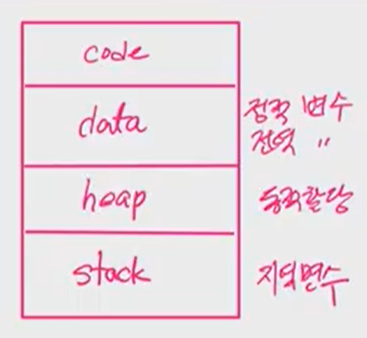
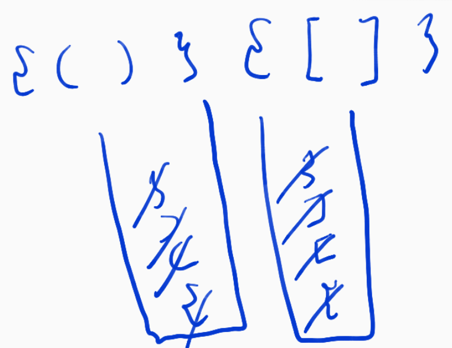
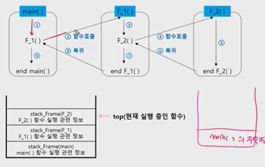
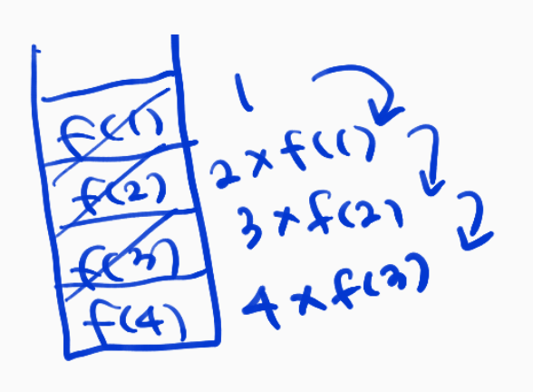
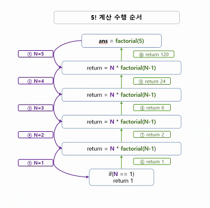
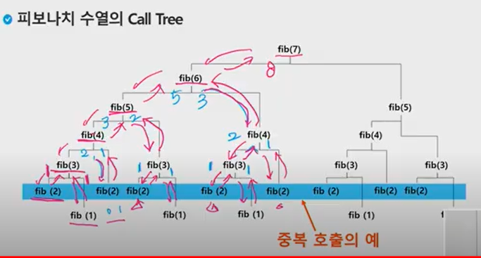
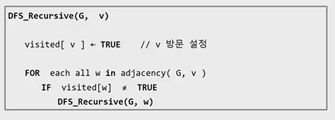
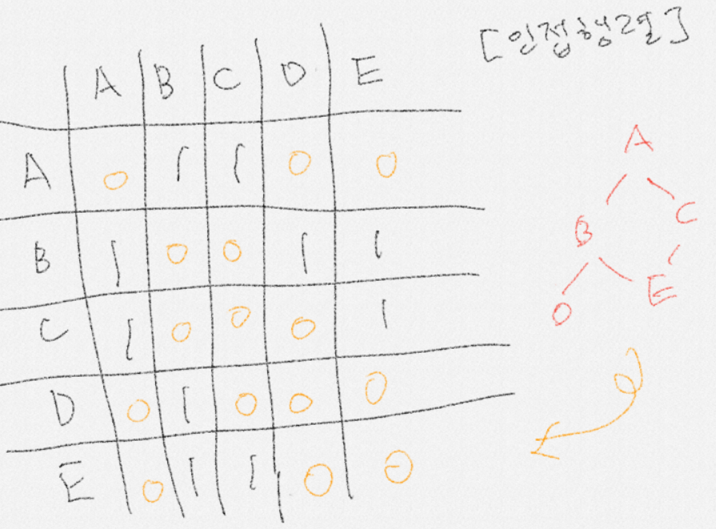

## 스택1

> - 스택1
> - 재귀호출
> - Memorization
> - DP
> - DFS(매우중요, depth first search, 깊이 우선 탐색)
> - 실습 1,2,3




### 스택의 특성

- 물건을 쌓듯 자료를 쌓아 올린 자료구조
- 마지막에 삽입한 자료를 가장 먼저 꺼낸다, which is LIFO(LAST-IN-FIRST-OUT)
  - 참고로, 큐는 FIFO임
- 스택에 저장된 자료는 선형 자료 구조를 갖는다
  - 선형구조: 자료 간의 관계 1:1
  - 비선형구조: 자료 간의 관게가 1대N의 관계


- 자료 구조: 자료를 선형으로 저장할 저장소
  - 저장소 자체를 스택이라 부름
  - 스택의 마지막 삽입 원소의 위치 -> called "TOP"
  - 스택이 공백인지 아닌지 확인하는 연산 `isEmpty`
  - 스택의 TOP에 있는 원소를 반환하는 연산, `peek`


### 스택의 pop/push 알고리즘

> c-style은 [0]*n 이렇게 만들어놓고, 인덱스접근만해서 넣다뺐다 하기 때문에 속도가 빠름. 하지만 크기는 적당히 넉넉하게 잡아놔야 함! 

```python
def push(item):
    s.append(item)
```

**참고, insert(value, position) 은 넣은 위치까지도 정해줄 수 있음**

- list같은 경우는 계속 이어붙일 수 있기 때문에 `isfull` 이런 검사 안해도 됨.

```python
def pop():
    if len(s)==0: #1
        return
    else:
        return s.pop(-1) #2 항상 스택이 비어있는지 염두해야함
```

- 항상 스택이 비어있는지 염두해야함 -> "`if len(s)==0:`"
- #1 값이 아무것도 없으면 그냥 리턴하고, #2 아니라면 가장 맨 뒤에 있는 것을 꺼낸다!


### 스택의 응용1: 괄호검사

- 스택을 이용한 괄호 검사
- 문자열에 있는 괄호를 차례대로 조사하면서 왼쪽 괄호 만나면 스택에 삽입하고, 오른쪽 괄호 만나면 스택에서 top괄호를 삭제한 후 오른쪽 괄호와 짝이 맞는지를 검사한다.
- 이때 스택이 비어있으면 조건 1 또는 조건 2에 위배되고 괄호의 짝이 맞지 않으면 조건 3에 위배된다.
- 마지막 괄호까지를 조사한 후에도 스택에 괄호가 남아있으면 조건 1에 위배된다.


#### 괄호의 짝을 검사하는 프로그램 작성

```python
arr='()()((()))'
def check(arr):
    for i in range(len(arr)):
        if arr[i] == '(' : #push 왼쪽괄호 만나면 push #1
            stack.append(arr[i]) #2 
        elif arr[i] == ')' : #pop하고 비교해야함 
            if len(stack) == 0: 
                return False 
            else:
                stack.pop()

    if stack: return Fasle #스택이 비어이지않다면 뭔가 잘못된것 #3
    else: return True

stack=[]
arr = '()()((()))'
print(check(arr)) #True
```

- #1 : '('면 stack에 추가해줌
- #2 : ')'면 pop을 할건데 만약에 스택안에 쌓인게 아무것도 없다면 그냥 false를 리턴하고, 있다면 스택안에 있는 걸 모두 비운다.
- #3 : 짝대로 되있으면 모두 비워진다. 만약에 stack안에 뭐가 있다면 false가 되고, 아니라면 True!! 


#### 중괄호, 소괄호, 대괄호 모두 검사하는 프로그램



- 열린 괄호면 집어넣고, 만약에 닫힌 괄호를 만나고, 스택의 top에 있는 열린 괄호와 짝이면 pop해버림  

```python
def check(bracket):
    #인자로 넘어온 괄호들을 순회하면서 검사한다
    #여는 괄호라면 무조건 푸쉬
    #닫는 괄호라면 스택의 탑 위치와 비교하여 제 짝이면 pop
    #제 짝이 아니라면 false
    #그리고 모든 검사가 끝까지 순회했을때 스택의 길이가 0이 아니라면 역시 fasle
    stack =[]
    for i in range(len(bracket)):
        if bracket[i] == '(' or bracket[i]=='[' or bracket[i]=='{':
            stack.append(bracket[i])
        elif bracket[i] == ')' or bracket[i]==']' or bracket[i]=='}':
            if len(stack) == 0: #닫힌경우가 먼저 나온경우!!
                return False
            tmp=stack.pop()

            if bracket[i] == ')' and tmp == '(':
                continue
            elif bracket[i] == '}' and tmp == '{':
                continue
            elif bracket[i] == ']' and tmp == '[':
                continue
            return False

    if len(stack)>0:
        return False
    return True

# for _ in range(int(input())):
#     brcket=input()
#
#     print(check(bracket))

print(check('{()}{[]})'))
```


- 오잉 컨티뉴 뭐였지
  - `continue`를 만나면 다시 모든 조건문을 빠져나와서 위 코드에서는 다시 for문으로 올라간다! 


### 스택의 응용2: Function call

#### 함수 호출과 복귀에 따른 전체 프로그램의 수행순서




#### 함수호출(연습장에 있는 쌤 노트참고하기!!)

```python
def func2():
    print("함수 2 시작")
    print("함수 2 종료")

def func1():
    print("함수 1 시작")
    func2()
    print("함수 1 종료")


print('메인시작')
func1()
print('메인끝')
```


### 재귀호출

- 자기 자신을 호출하여 순환 수행됨
- when using 재귀호출방식, more simple than general

#### factorial 




```python
def fact(n): #f(n)=n*f(n-1)
    if n==1: #part1. basic
        return 1
    else: #part2. inductive(유도)
        return n*fact(n-1)
    
print(fact(4))
```


```
#재귀의 기본은
#종료조건(basis)과 반복조건으로 이뤄져있음
#종료조건이 없게 되면? 스택에 계속 쌓이게 되고 메모리가 버틸 수 없기 때문에 stackoverflow가 됨
#그래서 그런걸 막기 위해서 보통은 위와 같이 종료조건, 반복조건을 주게 됨.
```





### 피보나치

```python
def fibo(n):
    if n < 2: #멈추는 부분, 기본파트
        return n #0일때는 0, 1일때는 1
    else:
        return fibo(n-1)+fibo(n-2)

print(fibo(4))
```


### 피보나치 수열의 Call Tree 




- 재귀를 잘 할려면 어떻게 돌아가는지 알아야 함.
- 코드는 심플하지만 내부적으로 저런 일이 일어나고 있음
- 디버깅이 어려움! 
- 문제점은? 위 파란줄처럼 엄청난 중복호출 존재!!
- 신기한 사실 : 중복호출 되는 횟수도 피보나치 수열을 따른다
- 이렇게 중복해서 스택에 쌓으면 can raise "overflow"
- 그럼 어떻게 해야하지??? -> Momoziation


### Meomiziation

> 컴퓨터 프로그램을 실핼할때 이전에 계산한 값을 메모리에 저장해서 매번 다시 계산하지 않도록 하여 전체적인 실행속도를 빠르게 하는 기술임. DP의 핵심 기술

```python
#MEMMO를 위한 배열을 할당하고, 모두 0 으로 초기화
#MEMO[0] 을 0으로 MEMO[1]은 1로 초기화

def fibo2(n):
    global memo #이거 왜있는지 잘 모르겠닷
    if n >=2 and len(memo) <= n:
        memo.append(fibo2(n-2)+fibo2(n-1))
    return memo[n]

memo=[0,1] #참조형(read and write),
print(fibo2(7))
```

- 중복적으로 다시 계산하지 않겠다 ! 


### DP(Dynamic Programming)

> 최적화 문제를 해결하는 알고리즘! 
>
> 완전탐색을 재귀로!! 
>
> dp의 핵심기술은 memoization임


```python
def fibo3(n):
    f = [0,1] #memoization table
    for i in range(2,n+1):
        f.append(f[i-1]+f[i-2])
    return f[n]

print(fibo3(3))
```


- 재귀 방식 : fib2() < 오버헤드 발생
- 반복적 dp : fib3() < 이게 더 성능적으로 좋음


### DFS(깊이 우선 탐색)

> 비선형구조인 그래프 구조는 그래프로 표현된 모든 자료를 빠짐없이 검색하는게 중요함

`APS 응용 p.80`

##### *DFS 알고리즘 - 재귀



1[]()

- A를 시작점으로 고르고, v가 시작점이 되는거임.
- 들어가자마자 visited를 체크함
- A가 v, a


```python
def DFS(v):
    #노드에 가자마자 찍히니까 프린트하고
    print(v,end=" ")
    #방문값을 1로 만들고
    visited[v] = 1
    #GLOBAL을 사용하지않았는데도 V를 쓸 수 있는건 우리는 V를 수정하지 않고 그대로 이용하는것이기때문
    for i in range(1,V+1):
        #현재 내 정점 v와 연결되어 있는지 확인/그리고 아직 방문하지 않은곳일때
        if arr[v][i] ==1 and visited[i]==0 :
            DFS(i)


#입력 먼저
V,E = map(int,input().split())
#7칸이라고 하고 0으로 초기화된 7*7 칸 만든것!한칸 크게 만든것임 읽기 편할려고,인덱스 맞출려고!!
arr = [[0]*(V+1) for _ in range(V+1)]


#0으로 초기화된 보드를 만들고, 33번 코드로 인접행렬을 완성시킴
for i in range(E):
    st, ed = map(int,input().split())
    # since 무향 그래프, 서로 연결되있음을 표시
    arr[st][ed] = arr[ed][st] = 1


#정점,방문 표를 만드는거임(방문배열 선언)
visited=[0]*(V+1)

DFS(1)

```


##### *DFS 알고리즘 -반복


