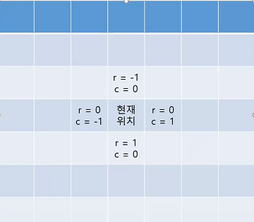
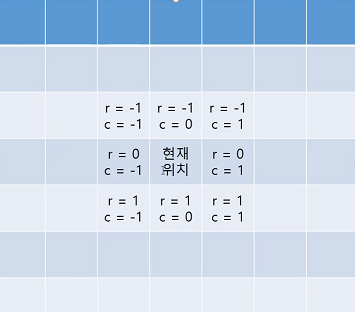
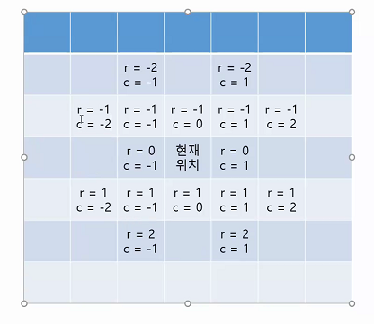
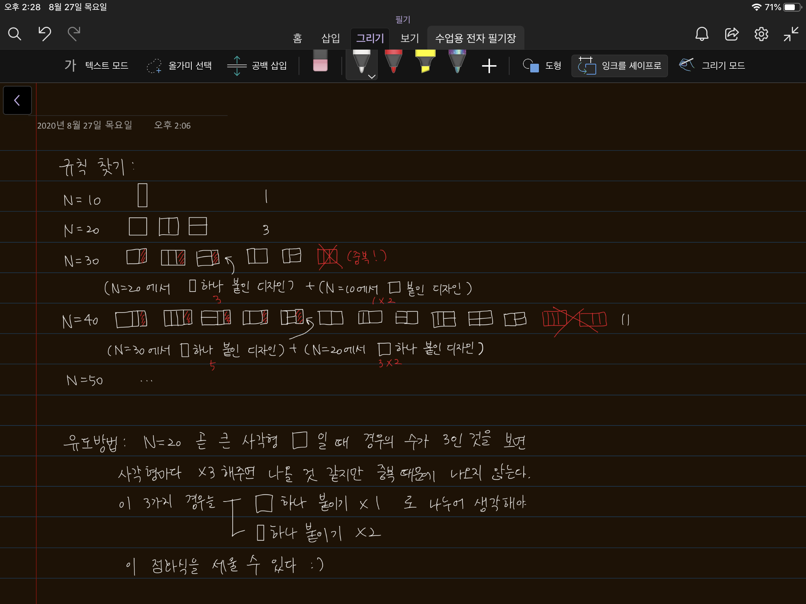

> 이번주 문자열 비교/회문 1 2/글자수 과제를 풀이한다.


## swea_4864_문자열 비교

> 'in'을 쓸 수도 있겠지만, 전체탐색하는 brute force 알고리즘을 이용한다.

`for/else`

- for문을 진행할때 한번도 break에 걸리지 않으면 else에 들ㅇ

```python
for i in range(1,11):
    if i ==15:
        break
        
else:
    print("중간에 멈추지 않음")

#중간에 멈추지 않음
```

- 끝날때까지 break문이 실행되지 않으면 else 구문을 실행한다. 


### T Code

> used "brute force"

```python
def check(str1,str2):
    for i in range(len(str2)-len(str1)+1): #1
        for j in range(len(str1)): #찾고 싶은 패턴이니까 얘를 계속 돌아야지
            #긴거는 한칸씩 옆으로 가면서 이동
            #만약에 현재 사이클에 다르다면 브레이크
            if str2[i+j] != str1[j]: #2
                break
        #중간에 걸리지 않았따면? 완벽히 찾은것! else구문 실행
        else:
            return 1
    #완벽히 찾지 못했다면 리턴0
    return 0 #3

    

T=int(input())
for tc in range(1,T+1):
    str1=input()
    str2=input()
    print("#{} {}".format(tc,check(str1,str2)))
```

#1 : 포인트는 범위 지정이다. 

#2 : 만약에 str1과 str2가 다르다면 바로 break를 걸고, for문을 모두 돌동안 break문을 실행하지 않았다면? 값이 있다는 것이므로 return 1!

***#3 : 오잉, 이거 else가 생략된건가? 돌려보기***


- 그 밖에도 두가지 방법을 추가로 학습했다. 

```python
T=int(input())
for tc in range(1,T+1):
    str1=input()
    str2=input()
    
    print("#{} {}".format(tc,check(str1,str2)))
    
    #1. 'in' 이용
    #in활용해서
    if str1 in str2:
        print("#{} {}".format(tc,1))
    else:
        print("#{} {}".format(tc,0))
        
    #2. `find`함수 이용    
    ans=0
    #현재 str2안에 str1이 들어있다면!
    #값이 없으면 -1 을 돌려줌. 따라서 값이 -1가 아니라면? 
    if str2.find(str1) != -1: #1
        ans=1
    print("#{} {}".format(tc,ans))
        
        
```


#### find()

The `find()` method returns -1 if the value is not found.

The `find()` method is almost the same as the `index()` method, the only difference is that the `index()` method raises an exception if the value is not found. (See example below)

**syntax**

`*string*.find(*value, start, end*)`

```python
txt = "Hello, welcome to my world."

x = txt.find("e", 5, 10)

print(x) #8
```

```python
txt = "Hello, welcome to my world."

x = txt.find("e")

print(x) #1
```

```python
txt = "Hello, welcome to my world."

print(txt.find("q")) #-1
print(txt.index("q"))
```

- find()와 index()의 역할은 거의 똑같으나, 위에서 사용한건 find만이 갖고 있는 예외처리를 이용한 것이다. 

  #1 : `str2.find(str1) != -1` 이 말은 str2안에 str1의 값이 있다는 것이다. 그래서 만약에 있다면? ans=1 ! 

  


### 추가학습(델타이동)




```python
#상하좌우
dr=[-1,1,0,0]
dc=[0,0,-1,1]

#한번에 쓰는 것도 가능
drc = [[-1,0],[1,0],[0,-1],[0,1]]


r=1
c=2

for i in range(4):
    nr=
    
```

- 8방향 탐색




- 대각선 이동?




## swea_4865_글자수(itoa, atoi 다시보기)

### T Code 1

> used only 'array'

```PYTHON
#쌤풀이
#카운트 배열, 체크배열 만들자, 내장함수 안쓸거임

T=int(input())
for tc in range(1,tc+1):
    str1=input()
    str2=input()

    check_arr=[0]*26
    count=[0]*26

    #1.str1을 순회하면서 알파벳 체크
    #첫번째 주어진 문장을 돌면서 사용된 글자를 전부 체크하는거임
    for i in str1:
         check_arr[ord(i)-ord('A')] =1
        

    #2. 체크된 알파벳의 카운트 세기
    for i in str2:
        if check_arr[ord[i]-65]==1:
            count_arr[ord[i]-65]+=1
    
    print('#{} {}'.format(tc,max(count_arr)))
```

- 이해가 필요할듯


### T Code 2

> dict = {}
>
> 파이썬 필살기, DO NOT USE AS MAIN! 

```python
dict = {}
for i in str1:
    if i not in dict:
        dict1[i] = str2.count(i)
        
print("#{} {}".format(tc, max(dict.values())))
```


### swea_1954_달팽이 숫자 설명(델타 이해 복습 필요)

- ver1

```python
dr= [0,1,0,-1]
dc= [1,0,-1,0]

T = int(input())

for t in range(1,T+1):
    N=int(input())

    arr=[[0]*N for _ in range(N)]

    d=0 #방향 0: 우, 1:하, 2:좌, 3:상, 각각의 번호는 인덱스를 의미한다.
    r=0
    c=0
    num=1

    while num <= N*N:
        arr[r][c] =num #현재칸에 값을 저장
        num += 1 #다음 숫자 준비

        #다음칸을 결정
        nr = r+dr[d]
        nc = c+dc[d]
        #범위를 벗어나기 전에 방향을 꺾어줘야 함

        if 0<=nr<N and 0<=nc<N and arr[nr][nc]==0:
            #현재좌표를 nr,nc로 갱신
            r,c = nr,nc
        else:
            #상까지 갔을때 우로 바꿔야 하는데 상은 3이고, 우는 0이다.그래서
            #모듈러 연산으로!! 좌표를 바꿔주고 한칸씩 답을 갱신
            #1,2로 바꿔줌줌
            d = (d+1)%4
            r += dr[d]
            c += dc[d]
    print('#{}'.format(t))
    for i in range(N):
        for j in range(N):
            print(arr[i][j],end=" ")
        print()


```


- ver2

> 수직에서 수평으로 갈때 증감이 바뀐다. 

```python
T=int(input())
for tc in range(1,T+1):
    N=int(input())
    nums = [[0]*N for _ in range(N)]

    K=N #이동거리
    d=1 #방향
    row=0 #행
    col=-1 #열, 초기에는 수평이동이므로 -1로 초기화
    num =1 #넣을 값

    while True:
        #수평이동
        for c in range(K):
            col+=d
            nums[row][col] =num
            num+=1
        #수평이동 끝 이제 수직 이동
        #포인트@ 수평끝나고 수직할때 k=-1해주고
        K -=1
        if K ==0:
            break
        #수직이동
        for r in range(K):
            row+=d
            nums[row][col] = num
            num += 1
        #수직이동이 끝 수평이동
        #방향이 바뀔때 d를 -곱해주고, 뭐그런식, 뭔가 어제내가푼거랑 비슷한느낌,,,
        d *= -1
    print('#{}'.format(tc))
    for i in range(N):
        for j in range(N):
            print(nums[i][j],end=" ")
        print()
```


## swea_회문1(복습!!!!!)

```python
def check(K):
    for i in range(N):
        for j in range(N-M+1):
            #가로
            tmp = words[i][j:j+M]

            #세로
            tmp2 = zwords[i][j:j+M]

            if tmp == tmp[::-1] or tmp2==tmp2[::-1]:
                return M
    return 0

for tc in range(10):
    tc_num=int(input())
    N=100 #100*100
    words=[list(input()) for _ in range(N)]
    zwords = list(zip(*words)) #2중리스트니까 언패킹, 하나 벗겨서 가져옴

    for k in range(100,0,-1):
        ans =check()
        if ans!=0:
            break
    print("#{} {}".format(tc_num,ans))
```


```
#선생님 코드
#뒤에서부터 구하는게 편함?
#3칸짜리를 찾는게 가장 길다는 보장이 없어서 계속 늘려서 찾아야하는데
#애초에 제일 긴상태에서 확인하고, 그게 안되면 한칸 줄여서 확인하고, 이런식으로 찾다보면 더 효율적
```


### zip

```python
test1= [1,2,3,4]
test2= [5,6,7,8]
test3 =list(zip(test1,test2))
print(test3) #[(1,5),(2,6),(3,7),(4,8)]

#2차원 리스트도 가능
nums = [[1,2,3],[1,2,3]]
#모든 요소를 넣어줘도 되고
nums2 =list(zip(nums[0],nums[1]))
#언패킹을 하여 한번에 처리도 가능
nums3 =list(zip(*nums))
print(nums2)
print(nums3)
```

`*` unpacking연산자

```python
tmp = [1,2,3,4]
print(tmp) #리스트형태
print(*tmp) #언패킹연산자를 쓰면 리스트가 제거된 상태로 나옴
print(list(zip(tmp))) #[(1,),(2,),(3,),(4,)] 튜플은 요소하나는 이렇게 표현함
```

- 열의 개수가 안맞으면 맞는것끼리만 묶어줌


### swea_회문2(복습 !important!!!!!!!!!!!!)

```python
#선생님풀이
def check():
    #전체 크기가 N
    for i in range(N):
        #가로 검사
        for j in range(N-M+1):
            tmp = words[j][j:j+M]
            if tmp == tmp[::-1]:
                return tmp
        #세로 검사
        for j in range(N-M+1):
            tmp = []
            for k in range(M):
                tmp.append(words[j+k][i])
            if tmp == tmp[::-1]:
                return tmp
    return []

T = int(input())
for tc in range(1,T+1):
    N,M = map(int,input().split())
    words=[list(input()) for _ in range(N)]
    ans=check()

    print("#{} {}".format(tc, ''.join(ans)))

```


### SWEA_4871_그래프 경로(복습하자)

> DFS

```python
def DFS(start):
    global result
    visited[start] =1
    for i in range(1,V+1):
        if arr[start][i] == 1 and visited[i] != 1:
            if i == end:
                result=1
                return
            DFS(i)


for tc in range(1,int(input())+1):
    V,E=map(int,input().split())
    arr = [[0]*(V+1) for _ in range(V+1)]
    visited = [0] * (V + 1)

    for i in range(E):
        st, ed = map(int,input().split())
        arr[st][ed]=1

    start,end=map(int,input().split())
    result=0
    DFS(start)
    print("#{} {}".format(tc, DFS(start)))
```


### swea_4871_종이 붙이기(복습하자)

> dp, 점화식

```python
for tc in range(1,int(input())+1):
    N=int(input())
    dp=[]
    dp.append(1)
    dp.append(3)
    for i in range(2,N//10):
        dp.append(dp[i-1]+(dp[i-2]*2))
    print('#{} {}'.format(tc,dp.pop(-1)))
```

 ::angel: **하영이가 준 풀이** ::heart:

### swea_4873_반복문자 지우기(복습하자)

> 스택

```python
for tc in range(1,int(input())+1):
    string = input()
    stack = []
    for i in range(len(string)):
        stack.append(string[i])
        #만약에 stack에 들어와있는 가장 윗값 두개가 같다면 두개를 모두 삭제한다.
        if len(stack) > 1:
            if stack[-1] == stack[-2]:
                del stack[-2:]
    print('#{} {}'.format(tc,len(stack)))

```


>#### 맨날 헷갈리고 맨날 찾아보는 슬라이싱
>
>swea 4873에서 스택을 이용해서 푸는데, 맨 마지막 두 값을 삭제해야했음. 아래처럼 하는거야!! 제발 이제 찾아보지말자,, -2부터 끝까지 삭제하는거니까, L안에 남은건 1,2,3이다.
>
>```python
>>>> L = [1,2,3, 4, 5]
>>>> del L[-2:]
>[1, 2, 3]
>```


