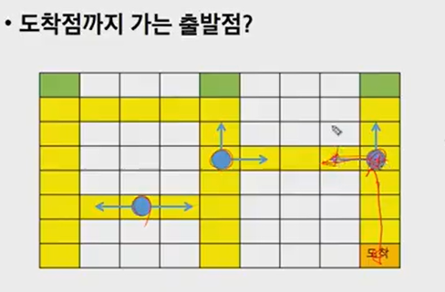
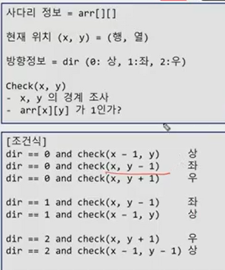
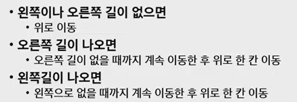
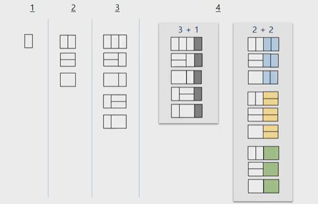

## REVIEW!!

우와 금요일에 리뷰해서 너무좋다~~~~~~~


### 1. 괄호 판별_4866

스택의 응용 문제이다. 

**조건1 : n(왼쪽 괄호) == n(오른쪽 괄호)**

**조건2 : 같은 괄호에서 왼쪽 괄호는 오른쪽 괄호보다 먼저 나와야 한다**

**조건3 : 괄호 사에아는 포함 관계만 존재**

(잘못된 포함 관계의 예 > { ( [ ] } )


알고리즘 개요!

- 문자열에 있는 괄호를 차례대로 조사하면서 왼쪽 괄호만나면 스택에 넣고, 오른쪽 괄호만나면 스택에서 top 괄호를 삭제하고 오른쪽 괄호와 짝이 맞는지 확인
- 이 때 스택이 비어있으면 조건1또는 조건2에 위배되고, 괄호의 짝이 안맞으면 조건3에 위배
- 마지막 괄호까지도 조사한 후에 스택에 괄호가 남아 있으면 조건 1에 위배


```python
for tc in range(1,int(input())+1):
    arr=input()
    
    S=[]
    #한 문자씩 읽어서 처리
    ans=1 #1
    for ch in arr:
        #여는 괄호 push
        #닫는 괄호
        	#빈 스택, 꺼내오려고 했는데 빈 스택이야? 안돼! exception!
            #ch와 S[-1] 비교
            #같다면 스택에 제거
        if ch =='(' or ch=='{':
            S.append(ch)
        if ch ==')' or ch=='}':
            if len(S) == 0:
               	ans=0; break
            t=S.pop(-1)
            if (ch==')' and t != '(') or (ch=='}' and t != '{'):
                ans=0 ; break
        
            
    if len(S)>0:#빈스택인지 조사 #2
        ans=0
    print(ans)
```


#1 애초에 맞다고 가정하고 만약에 틀리면 0으로


### 2. 반복문 문자 지우기_4873

```Python
for tc in range(1,int(input())+1):
    arr=input()
    S=[]
    
    for ch in arr:
        if not S: #1
            S.append(ch)
        elif ch != S[-1]:
            S.append(ch)
        else:
            S.pop()
    print(len(S))
        #빈스택인 경우!! 이때는 무조건 집어넣아죠, 꺼낼게없잖아
        #ch와 S[-1] 비교해서 다르면 스택에 PUSH, 같으면 ch와 S[-1]날려버림
        	
       		
```

```PYTHON
#이 코드를 줄이고 싶다면?
for ch in arr:
    if not S: #1
        S.append(ch)
    elif ch != S[-1]:
        S.append(ch)
            

#이렇게@ 근데 코드가 꼬일 가능성이 있다 이유는 아래와 같다        
for ch in arr:
    if not S or ch!= S[-1]:
            S.append(ch)
```


**내가 헷갈렸던것!!!!!!!!!!!!!!!!이거!!!!!!!or, and 수식 순서가 달라져서 헷갈렸음. 사다리에서 헷갈림 보러가 다시!!!**

- or같은 경우는 앞에꺼가 true면 뒤에꺼 안봄

- 앞에꺼가 false인경우 뒤에꺼를 본다. 그래서 뒤에꺼 동작함

- 근데 앞에꺼가 true면 뒤에 있는애를 할 필요가 없으니까 건너뛴다.

  

#1 : 빈 스택


- 재귀로 푸는 방법도 있다! 하영이코드

```python
def check(text):
    for i in range(len(text)):
        if i >= 1 and text[i - 1] == text[i]:
            text.pop(i)
            text.pop(i-1)
            return check(text)
    return len(text)
```


### 3. Ladder1


> 한칸씩 움직이기, 도착점부터 시작점을 찾아간다고 생각했을때, 도착점의 위치를 xy라고 생각하면 갈수 있는길을 찾아서 올라가거나 왼쪽으로 가거나, or rignt changing 위치!
>
> 




> **1. 첫번째 방법**
>
> 내가 이렇게 함
>
> 근데 한 방향으로만 가야됨. 아래에서 올라왔다면 오른쪽으로 가야하고(2), 오른쪽에서 왼쪽으로 왔다면 위로 가야함(3). 판단을 해야함.
>
> - 위로 올라왔다면 위, 왼, 오 갈 수 있고 / 왼쪽에서 왔던 경우는? 계속 왼쪽으로 가거나 아니면 위로 가거나 / 오른쪽에서 왔던 경우는 계속 오른쪽으로 가거나 위로 가거나 
>
> - 중간에 있는거는(2) 오른쪽으로 왔으면 계속 오른쪽으로가고, 왼쪽에서 왔으면 왼쪽으로 가고, 이런식으로 가야함(main point!!!!!) 이거 안하면 좌우이동 무한루프
>
> 
>
> **2. 두번째 방법**
>
> 
>
> 판단해야 할 상황을 안만드는 방법이다. 
>
> 1번 방법
>
> ```python
> for tc in range(1,11):
>     case_num = input()
>     arr=[list(map,int(input().split())) for _ in range(100)]
>     
>     
> ```
>
> 

- 1번 방법

```python
def check(x,y): #가독성을 위해 함수만듦
    if x<0 or x>=100 or y<0 or y>=100: return Fasle
    if arr[x][y]==0: return False
    return True


for tc in range(1,11):
    case_num = input()
    arr=[list(map,int(input().split())) for _ in range(100)]
    
    #도착점을 찾는다.
    x,y=0
    for i in range(100):
        #도착점을 찾고, 그걸 현재 위치로 놓고, 좌표를 바꿔가면서 따라갈꺼야
        
       	#행과 열을 위치를 저장하는 분수 필요하니까 for 밖에 넣고
        if arr[99][i]==2:
            x,y=99,i
            break
 	dir=0 #방향정보 저장, 0은 위, 1은 좌, 2는 오른
    
    while x: #x가 0이 아닐때까지 갈꺼야
        #왼쪽으로 가는 경우
        if dir != 2 and check(x,y,-1):
            y-=1 ; dir=1
        #오른쪽으로 가는 경우    
        elif dir!=1 and check(x,y,+1):
            y+=1 ; dir=2
        #그 외, 위로 가는 경우
        else:
            x-=1 ;dir=0
        
    print(y)
            
```


- 2번 방법

> 고민하기싫어 나오면 갈때까지 갔다가 한칸위로 쫙 올려줄래 , 방향정보 필요없음

```python
def check(x,y): #가독성을 위해 함수만듦
    if x<0 or x>=100 or y<0 or y>=100: return Fasle
    if arr[x][y]==0: return False
    return True


for tc in range(1,11):
    case_num = input()
    arr=[list(map,int(input().split())) for _ in range(100)]
    
    #도착점을 찾는다.
    x,y=0
    for i in range(100):
        #도착점을 찾고, 그걸 현재 위치로 놓고, 좌표를 바꿔가면서 따라갈꺼야
        
       	#행과 열을 위치를 저장하는 분수 필요하니까 for 밖에 넣고
        if arr[99][i]==2:
            x,y=99,i
            break
    
    while x: #x가 0이 아닐때까지 갈꺼야
        #왼쪽으로 가는 경우
        if check(x,y,-1):
            while check(x,y,-1): #왼쪽에 길이있을때까지!!!!
            	y-=1;
            x-=1 #왼쪽으로 갈때까지 가고, 끝나면 한칸 올려줌. 이래야 왔다갔다 좌우반복x
        #오른쪽으로 가는 경우    
        elif check(x,y,+1):
            while check(x,y,+1): 
                y+=1
            x-=1
        #그 외, 위로 가는 경우
        else:
            x-=1 ;
        
    print(y)
```


**꿀팁, 코드 줄이기! **

```python
    while x: #x가 0이 아닐때까지 갈꺼야
        #왼쪽으로 가는 경우
        if check(x,y,-1):
            while check(x,y,-1): #왼쪽에 길이있을때까지!!!!
            	y-=1;
            
        elif check(x,y,+1):
            while check(x,y,+1): 
                y+=1
   
        x-=1 ;
```

x-=1가 다 똑같으니까 아래에 적어줌


음 몰라

```python
def check(x,y):...
    
def ladder(x,y):
    if x==0:
        return y
    else:
        
    	arr[x][y]==0
        if check(x,y-1):
            return ladder(x,y-1)
        elif check(x,y+1):
            return ladder(x,y+1)
        else:
            return ladder(x-1,y)

            
            
for tc in range(1,11):
    case_num = input()
    arr=[list(map,int(input().split())) for _ in range(100)]
    
    #도착점을 찾는다.
    x,y=0
    for i in range(100):
        #도착점을 찾고, 그걸 현재 위치로 놓고, 좌표를 바꿔가면서 따라갈꺼야
        
       	#행과 열을 위치를 저장하는 분수 필요하니까 for 밖에 넣고
        if arr[99][i]==2:
            x,y=99,i
            break
    print(ladder(x,y))
```


### 4. 그래프 경로

> DFS(깊이 우선 탐색)
>
> 그래프를 메모리에 저장한다는건? 간선을 저장한다는것, which means 각 정점들마다 반대편에 있는 정점(--인접 정점--)이 뭐가 있는지를 저장하는거다.
>
> 각 정점들마다 인접정점 저장, 그래서 수업시간때 인접행렬 배웠다. 
>
> 정점이 5개 있다하면, 각 정점마다 인접정점이 최대 4개씩 있을 수 있다. 당연한 말
>
> 최대 있을 수있는 인접정점을 만들어놓고, 연결되있는 걸 표시해놓자!
>
> 유향 그래프? 1-2 
>
> 1번의 인접정점이 2번은 맞지만, 그 반대는 아님(무향그래프와 다른점!)


### 5. 종이붙이기

> 

```python
def f(n):#n: 문제의 크기(식별값)
    #기저사례
    if n==1 : return 1
    if n==3 : return 3
    
    #일반 사례 
    if memo[n]: return memo[n]
    
    memo[n]=f(n-1)+(f(n-2)*2)
    return memo[n]


for i in range(1,int(input())+1):
    N=int(input())//10
    memo = [0]*(N+1)
    print(f(N))
```

- 이 N과 n이 같은거야?

  print(f(N)) , f(n)

- 점화식을 찾으면 끝난다. 근데 점화식으로 풀게 되면, N의 크기가 커지면 중복된 계산을 많이 하게 된다. 그러면 재귀호출에 memoization 적용해보자
  - how?

    기저사례 그대로 두고, 기저사례 아닌경우에, 테이블에 이미 답을 구했는지 안구했는지 확인하고 이미 구했다고 하면 리턴하면 되고, 만약에 그렇지 않으면 원래대로 하고, 답을 저장해두고 리턴해줌!!!! 


```python
for tc in range(1,int(input())+1):
    N=int(input())//10
    memo = [0]*(N+1)
    memo[1],memo[2]=1,3
    
    for i in range(3,N+1):#i --> 문제의 크기를 나타내는 값
        memo[i]=memo[i-1]+memo[i-2]*2
        
        
```

