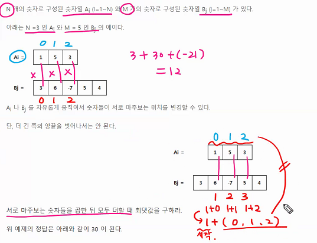
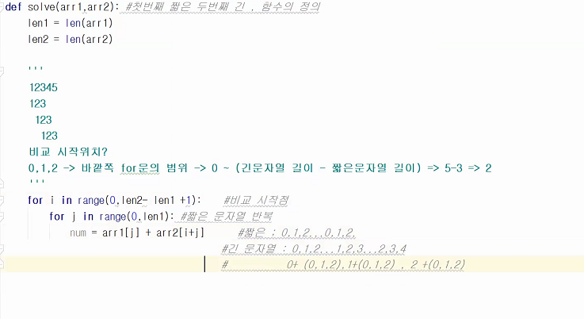

### swea_두개의 숫자열

- 구간합과 비슷







```python
def solve(arr1,arr2): #첫번째 짧은 두번째 긴, 함수의 정의
    len1=len(arr1)
    len2=len(arr2)
    maxV=0 #최소값으로 초기화

    
    
    for i in range(0,len2-len1+1): #비교시작점
        sum=0
        for j in range(0,len(1)): #짧은 문자열 반복
            num = arr1[j] * arr2[i+j] #
            sum+= num
        print(sum,end="")
        
        if sum>maxV:
            maxV=sum
        
        return maxV

T=int(input())
for tc in range(1,T+1):
    N,M=map(int,input().split())
    A = list(map(int,input().split()))
    B = list(map(int,input().split()))
    #print(A)
    #print(B)

    #숫자열 길이를 비교해서
    #짧은 숫자열, 긴 숫자열 순으로 매개변수로 해서 함수로 넘김
    
    if len(A) < len(B):
        result=solve(A,B) #첫번째: 짧은, 두번째: 긴
    else:
        result=solve(B,A)
    print('#{} {}'.format(tc,result))

```

