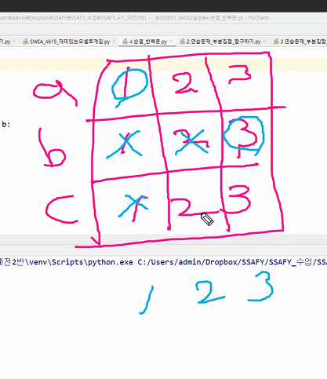

## 0901


### 순열

```python
#(1,2,3)의 조합중에 값이 중복되지 않으면서 모든 경우
#1
for a in range(3):
    for b in range(3):
        if a!=b:
            continue
        for c in range(3):
            if a==c and c==b:
                continue
            print(a,b,c)
```



그런데 저기 있는 조건문을 재귀를 이용해서 작성해보자


