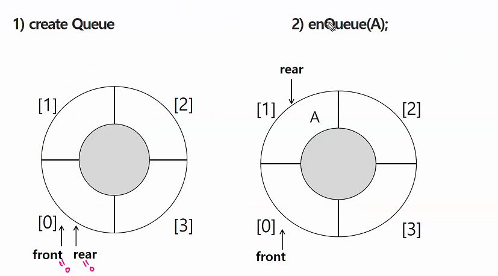

## 0902


**백트래킹**

- 백트래킹은 해를 찾는 도중에 막히면 되돌아가서 다시 해를 찾아 가는 기법임. 최적화 문제와 결정 문제를 해결할 수 있다. 결정 문제는 문제의 조건을 만족하는 해가 존재하는지의 여부를 'yes'또는 'no'가 답하는 문제

**[백트래킹과 깊이우선탐색의 차이]**

- 백트래킹은 DFS에 가지치기를 한것임. DFS는 완전검색임. 그래프에서 모든 정점을 빠짐없이 모두 방문하는게 DFS(재귀로 만드는게 수월함) 


**조합적 문제 1.부분집합 2.순열 3. 중복순열 4. 조합 5.중복조합 ! 이 문제를 재귀로 풀 수 있는 법을 꼭 알고 있어야 함!** 


**1.부분집합-재귀**

```python
N = 3

arr = [1, 2, 3]

sel = [0] * N

def powerset(idx):
    #도착을 했을때
    if idx == N:
        print(sel , " : ", end=" ")
        for i in range(N):
            if sel[i]:
                print(arr[i], end=' ')
        print()
        return

    #해당자리를 뽑고 가고
    sel[idx] = 1
    powerset(idx+1)
    #해당자리를 안뽑고 가고
    sel[idx] = 0
    powerset(idx+1)


powerset(0)
```


#### 순열

뽑아서 줄세우기, nPn(n개 중에 nㄱ)

```python
for i1 in range(1,4):
    for i2 in range(1,4):
        if i1 != i2:
            for i3 in range(1,4):
                if i3 != i1 and i3 !=i2:
                    print(i1,i2,i3)
```


 

'


### 큐

> 큐, 우선순위 큐, BFS


큐는 FIFO 구조임. 큐에 삽입한 순서대로 원소가 저장되어, 가장 먼저 삽입된 원소는 가장 먼저 삭제된다. 


큐의 기본 연산

- 삽입: enQueue
- 삭제:deQueue


***선형큐***

- 1차원 배열을 이용한 큐
- 큐의 크기=배열의 크기
- front: 저장된 첫번째 원소의 인덱스
- rear: 저장된 마지막 원소의 인덱스

**상태표현**

- 초기상태: front=rear=-1
- 공백상태:front=rear


***원형큐***

- front 변수 ; 공백 상태와 포화 상태 구분을 쉽게 하기 위해 




### BFS

표현방법: 인접행렬, 인접리스트, 

순회:DFS, BFS

BFS는 탐색 시작점의 인접한 정점들을 먼저 모두 차례로 방문한 후에, 방문했던 정점을 시작점으로 하여 다시 인접한 정점들을 차례로 방문하는 방식. 인접한 정점들에 탐색을 한후 차례로 다시 ,, 뭐 해야하므로 FIFO 방식

DFS는 A-B-E-F-C-D-G-H-I 처럼 가는데(스택이용)

BFS는 A-B-C-D-E-F-G-H-I 이렇게돔(큐 이용)


정점t와인접한 정점 w에 대해 방문하지 않은 곳이라면 인큐!


출발점에서 얼만큼 떨어져 있는지 visit를 통해서 확인가능

