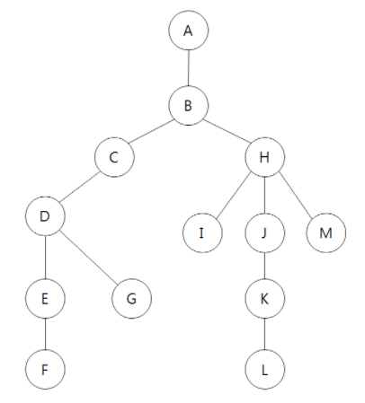

### 




### BFS

위 그래프와 시작 노드를 받아서 BFS 방식으로 그래프를 순회하는 함수이다

```python
def BFS(graph,start_node): 
    visit=list() #1
    queue=list() #2
    
    queue.append(start_node) #3
    
    while queue: #4
        node=queue.pop(0) #5
        if node not in visit: #6
            visit.append(node) #7
            queue.extend(graph[node]) #8
    
    return visit
```

#1 , #2 : 방문했던 노드 목록을 차례대로 저장할 리스트와, 다음으로 방문할 노드의 목록을 차례대로 저장할 리스트(큐)를 만든다

#3 : 맨 처음에는 시작 노드를 큐에 넣어준다.

#4 : 큐의 목록이 바닥날때까지(더 이상 방문할 노드가 없을때까지) loop를 돌려준다

#5 : 큐의 맨 앞에 있는 노드를 꺼내온다

#6 : 해당 노드가아직 방문 리스트에 없다면, 

#7 : 방문 리스트에 추가해주고,

#8 : 해당 노드의 자식들을 큐에 추가해준다


자식 노드들을 큐에 추가하면서 큐에 먼저 추가됐던 노드부터 순차적으로 방문하게 되면 결국엔 BFS형태로 순회하게 된다. 


### DFS

코드기준으로는 BFS와 거의 똑같고, 큐 대신 스택만 사용한다는 점이 다르다

```python
def dfs(graph,start_node):
    visit=list()
    stack=list()
    
    stack.append(start_node)
    
    while stack:
        node=stack.pop()
        if node not in visit:
            visit.append(node)
            stack.extend(graph[node])
    return visit
```

queue의 변수명이 stack으로 바뀌었고, 8번 라인에서 pop(0) 을 하던 부분이 pop() 으로 바뀌었다.

리스트에서 pop()을 하게되면 맨 마지막에 넣었던 아이템을 가져오게 되므로 stack과 동일하게 동작하게 된다.

반대로 pop(0)을 하게되면 맨 앞에있는 요소를 가져오므로 queue와 동일하게 동작했던 것이다.


##swea_5015 미로의 거리 

다시 이해하자! 물어보기

```python
#현우오빠 코드 참고!!! 다시 이해하기!

di=[0,0,1,-1]
dj=[1,-1,0,0]

def BFS(i,j):
    q=[]
    q.append([i,j])
    visited[i][j]=-1 #이게 무슨말일까??

    while q:
        temp=q.pop(0)
        pi,pj=temp[0],temp[1]

        if maze[pi][pj]==3:
            return visited[pi][pj]

        for d in range(4):
            ni=pi+di[d]
            nj=pj+dj[d]

            if ni<0 or ni>=N or nj<0 or nj>=N:
                continue

            if maze[ni][nj]==1:
                continue
            if visited[ni][nj] != 0:
                continue

            q.append([ni,nj])
            visited[ni][nj]=visited[pi][pj]+1
    return 0 ##retur이 여기위치에 있는 이유


for tc in range(1,int(input())+1):
    N=int(input())
    maze=[list(map(int,input())) for _ in range(N)]
    visited=[[0]*N for _ in range(N)]
    distance=0
    for i in range(N):
        for j in range(N):
            if maze[i][j]==2:
                result=BFS(i,j) #이거 왜 bfs(i,j)가 result가 되는거지???
    print('#{} {}'.format(tc,result))
```

