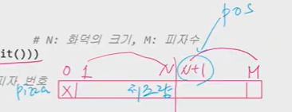
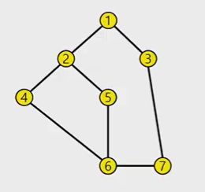
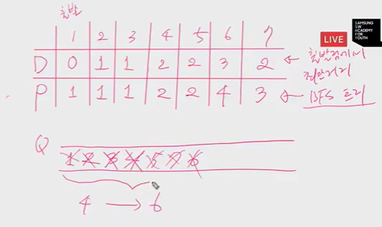
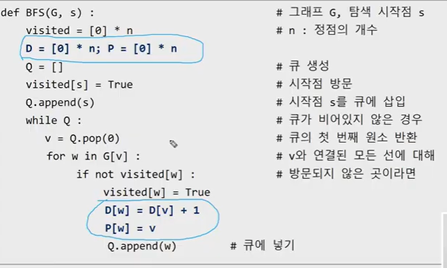

### 9월 첫째주 문제풀이


#### 회전

#1

```python
for tc in range(1,int(input())+1):
    N,M=map(int,input().split())
    Q = list(map(int,input().split()))
    
    for _ in range(M):
        Q.append(Q.pop(0))
   	print(Q[0])
```

#2

```python
for tc in range(1,int(input())+1):
    N,M=map(int,input().split())
    Q = list(map(int,input().split()))
    
    print(Q[M % N])
```

#3 선형큐 ver

```python
for tc in range(1,int(input())+1):
    N,M=map(int,input().split())
    Q = list(map(int,input().split())) + ([0]*M) #M은 최대 1000
    
  	f,r= -1,N-1
    
    for _ in range(M):
        f+=1
        r+=1
        Q[r]=Q[f]
   print(Q[f+1])
```

#4  원형큐 ver

```python
for tc in range(1,int(input())+1):
    N,M=map(int,input().split())
    Q = [0]+list(map(int,input().split())) #N+1개를 만듦
    f,r=0,N
    SIZE=N+1
    
    for _ in range(M):
        f=(f+1)%SIZE
        r=(r+1)%SIZE
        Q[r]=Q[f]
    print(Q[f+1]%SIZE)
```


#### 피자굽기

3 

3 5 (화덕의 크기, 피자의 개수)

7 2 6 5 3 (치즈의 양)



**ver1**

```python
for tc in range(1,int(input())+1):
    N,M=map(int,input().split()) #N:화덕의 크기/M:피자수
    pizza = [0]+list(map(int,input().split())) #1
    
    oven= [i for i in rnage(1,N+1)] #2, 피자번호
    pos=N+1 #추가될 피자번호
    
    while len(oven)>1: #한개가 되면 팝할거임
        num=oven.pop(0)
        pizza[num] = pizza[num]//2
        if pizza[num]:#원래위치에 집어넣는게아니라 뒤쪽에 집어넣어도 같은 결과
          	oven.append(num)
        else:
            if pos<=M:
            	oven.append(pos)
            	pos+=1
   print(oven[0])

    
```

#1 : 피자에 대응하는 인덱스값을 피자의 번호와 mapping을 시켜서 처리하는게 편함. 피자의 번호 1부터 M까지! 그럼 순서대로 1번인덱스부터 M번 인덱스까지 쓰는게 편함. 물론 0부터 m-1까지 쓸수도있지만? 편하게 하기 위해!  -> 피자의 번호 1번부터 M번까지 피자를 저장!! 


#2 : 화덕을 원형큐처럼 써보자! 일반적으로 리스트의 팝과 어펜드를 쓰면 원형큐처럼 돌아감


**ver2** 번호와 치즈를 같이 묶어서 주면 인덱스에러 줄어듦

```python
for tc in range(1,int(input())+1):
    N,M=map(int,input().split()) #N:화덕의 크기/M:피자수
    pizza = [0]+list(map(int,input().split())) #1
    
    oven= [[i,pizza[i]] for i in rnage(1,N+1)] #2, 피자번호
    pos=N+1 #추가될 피자번호
    
    while len(oven)>1: #한개가 되면 팝할거임
        num,cheese=oven.pop(0)
        cheeze = cheeze//2
        if cheeze:#원래위치에 집어넣는게아니라 뒤쪽에 집어넣어도 같은 결과
          	oven.append([num,cheeze])
        else:
            if pos<=M:
            	oven.append([pos,pizza[pos])
            	pos+=1
   print(oven[0])

    
```

**ver3** remain추가

```python
for tc in range(1,int(input())+1):
    N,M=map(int,input().split()) #N:화덕의 크기/M:피자수
    pizza = [0]+list(map(int,input().split())) #1
    
    oven= [[i,pizza[i]] for i in rnage(1,N+1)] #2, 피자번호
    remain=[[i,pizza[i]] for i in rnage(1,N+1)]
    pos=N+1 #추가될 피자번호
    
    while len(oven)>1: #한개가 되면 팝할거임
        num,cheese=oven.pop(0)
        cheeze = cheeze//2
        if cheeze:#원래위치에 집어넣는게아니라 뒤쪽에 집어넣어도 같은 결과
          	oven.append([num,cheeze])
        else:
            if remain:
            	oven.append(remain.pop(0))

   print(oven[0])
```


> ### BFS 개념 REVIEW
>
> #### BFS
>
>  DFS든 BFS든 탐색을 하게되면 출발점에서 도달가능한 정점을 찾을 수 있다. 
>
> BFS : V에서 W로 가는 경로가 있다고 하면, 경로를 구성하는 간선의 수가 거리가 됨. 출발점에서 가장 가까운 데부터 멀어지는 데까지 찾게 됨. 거리 계산. 
>
> 그렇게 찾다보니까, BFS탐색을 하다보면 출발~도착까지 가게되는 가장 가까운 거리(최단 경로)를 언제 발견? ''출발점에서 도착점에 처음 방문할때!" 
>
> 출발점에서 도달가능한 모든정점을 방문할때 항상 최단으로 처음방문한다, which is difference from DFS, DFS dont gurantee !! DFS는 빙 둘러서 방문할 수 있음. 깊이우선 탐색으로 BFS효과를 얻으려면, 수정 필요!
>
> 
>
> #### BFS 알고리즘
>
> > 그냥 방문표시만 하는게 아니라, visit+1하면 거리를 계산하는것임. 방문표시와 거리계산을 같이묶어서 하는 것. 구분을 하면 덜 헷갈림. 아래 코드 그렇게 할 것임. 복습차원
>
> 
>
> 
>
> 
>
> 
>
> D: 출발점에서 최단거리
>
> P: BFS트리 저장
>
> Q에서 꺼내온 정점을 v라고 치면, v에서 w로 갈때, w를 방문표시하고(visit[w]=1), D에는 D[w]=D[v]+1, P[w]=v
>
> 최단거리를 알면? 그때의 최단경로도 알 수 있다! 
>
> 


#### 노드의 거리_5102

```PYTHON
for tc in range(1,int(input())+1):
    V,E=map(int,input().split())
    
    G=[[0]*(V+1) for _ in range(V+1)]
    
    for _ in range(E):
        u,v=map(int,input().split())
        G[u][v]=G[v][u]=1
        
    s,e=map(int,input().split()) #출발노드, 도착노드
    
    visit=[0]*(V+1)
    Q=[s] #q에 출발점미리넣어두고 시작~
    visit[s]=1 #출발점 방문하고 큐에 삽입
    
    while Q:#빈큐가 아닐동안
        v=Q.pop(0) #큐를 뺀다. 
        		   #v에 방문하지 않은 인접정점을 찾는다
        
        for w in range(1,V+1):
            if G[v][w] and not visit[w]:
            visit[w]=visit[v]+1 #거리계산
            Q.append(w)
            
    print(visit[e]-1) #출발점에서 도착점까지 가는 실제거리는 1을 빼줘야함 왜냐면 출발점에서 출발점까지는 거리가 0인데 위에서 1을 더해줬으므로
    
            
        
```


그런데 이미 도착점에 오면 답을 알게됨. 얼마나 떨어져있는지. 그러면 도착점에 도착했을때 나머지 방문하지 않은 정점들에 대해서는 굳이 알 필요가 없음 그러면 도착했을때 끝내자!

```python
for tc in range(1,int(input())+1):
    V,E=map(int,input().split())
    
    G=[[0]*(V+1) for _ in range(V+1)]
    
    for _ in range(E):
        u,v=map(int,input().split())
        G[u][v]=G[v][u]=1
        
    s,e=map(int,input().split()) #출발노드, 도착노드
    
    visit=[0]*(V+1)
    Q=[s] #q에 출발점미리넣어두고 시작~
    visit[s]=1 #출발점 방문하고 큐에 삽입
    
    while Q:#빈큐가 아닐동안
        v=Q.pop(0) #큐를 뺀다. 
        		   #v에 방문하지 않은 인접정점을 찾는다
        
        for w in range(1,V+1):
            if G[v][w] and not visit[w]:
            visit[w]=visit[v]+1 #거리계산
            if w==e: Q.clear() break #여기서 그냥 브레이크하면 바로 위for문만 도니까! Q.clear()해줘서 while문 빠져나오게
            Q.append(w)
            
    print(visit[e]-1) #출발점에서 도착점까지 가는 실제거리는 1을 빼줘야함 왜냐면 출발점에서 출발점까지는 거리가 0인데 위에서 1을 더해줬으므로
    
            
```

- 인접리스트를 쓰는게 더 효율적이고 코드가 심플해짐. 

```python
for tc in range(1,int(input())+1):
    V,E=map(int,input().split())
    
    G=[[] for _ in range(V+1)]
    
    for _ in range(E):
        u,v=map(int,input().split())
        G[u].append(v)
        G[v].append(u)
        
    s,e=map(int,input().split()) #출발노드, 도착노드
    
    visit=[0]*(V+1)
    Q=[s] #q에 출발점미리넣어두고 시작~
    visit[s]=1 #출발점 방문하고 큐에 삽입
    
    while Q:#빈큐가 아닐동안
        v=Q.pop(0) #큐를 뺀다. 
        		   #v에 방문하지 않은 인접정점을 찾는다
        
        for w in G[v]:
            if visit[w]==0:
                visit[w]=visit[v]+1
                Q.append(w)
    print(visit[e]-1)
```


#### CONTACT_1238

위 노드의 거리와 똑같은 문제임

```python
for tc in range(1,11):
    N,s=map(int,input().split())
    arr=list(map(int,input().split()))
    
    G=[[0]*101 for _ in range(101)] #정점번호 1~100
    
    for i in range(0,N,2): #arr[i] --> arr[i+1] 
        G[arr[i]][arr[i+1]] = 1
        
    visit=[0]*101
    Q=[s]
    visit[s]=1
    
    while Q:
        v=Q.pop(0)
        for w in range(1,101):
            if G[v][w] and not visit[w]:
                visit[w]=visit[v]+1
                Q.append(w) #visit에 뒤에있는 애를 찾으면 됨.
    
    ans=1
    for i in range(2,100):
        if visit[ans] < visit[i]:
            ans=i
    print(ans)
```


#### 미로의 거리_5105_BFS

```python
dx=[0,0,1,-1]
dy=[1,-1,0,0] #우,좌,하,상
for tc in range(1,int(input())+1):
    N=int(input())
    maze=[input() for _ in range(N)]
    
    sx= sy = ex = ey=0
    for i in range(N):
        for j in range(N):
            if maze[i][j] == '2':
                sx,sy=i,j
            elif maze[i][j] == '3':
                ex,ey=i,j
                
    visit=[[0]*N for _ in range(N)]
    Q=[[sx,sy]] #시작점을 넣어두고,
    visit[sx][sy]=1
    
    while Q:
        x,y = Q.pop(0)
        #종료조건
        if x==ex and y==ey:
            break
        for i in range(4):
            tx,ty= x+dx[i], y+dy[i]
            #경계체크,통로인지,방문정보
            
            if tx<0 or tx>=N or ty<0 or ty>=N:continue
            if maze[tx][ty] == '1':continue #0,3 모두 갈 수 있음.
            if visit[tx][ty] == 1: continue   
            visit[tx][ty]=visit[x][y]+1

            Q.append([tx,ty])
   
   if visit[ex][ey]: visit[ex][ey]-=2
   print(visit[ex][ey]-2)
```


> 순열 생성하는 방법, 유튜브를 다시보기 
>
> ```python
> arr=[1,2,3]
> N=len(arr)
> 
> for i in range(0,N):
>     arr[0],arr[i]=arr[i],arr[0] #0번인덱스 기준으로 교환함
> 
> 	for j in range(1,N):
>     	arr[1],arr[j]=arr[j],arr[1] 
>         
> 		for k in range(2,N):
>     		arr[2],arr[k]=arr[k],arr[2] 
>     		print(arr)
>     		arr[2],arr[k]=arr[k],arr[2]
>             
>     	arr[1],arr[j]=arr[j],arr[1]
>     
>     arr[0],arr[i] = arr[i],arr[0]
> ```
>
> ```python
> arr=[1,2,3]
> N=len(arr)
> 
> def perm(k):
>     if k==N:
>         print(arr)
>     else:
>         for i in range(0,N):
>             arr[k],arr[i]=arr[i],arr[k]
>             
>             perm(k+1)
>             
>             arr[k],arr[i]=arr[i],arr[k]
> perm(0)
> ```
>
> 


### 배열 최소합_4881

```python

def perm(k,cur_sum): #cur_sum : 0~k-1 행에 선택한 값들의 합
    global ans;
    if ans<= cur_sum:return
    
    if k==N:
        ans=min(ans,cur_sum)
            
    else:
        for i in range(k,N):
            cols[k],cols[i]=cols[i],cols[k]
            perm(k+1)
            cols[k],cols[i]=cols[i],cols[k]

for tc in range(1,int(input())+1):
    N=int(input())
    arr=[list(map(int,input().split())) for _ in range(N)]
    
    cols=[i for i in range(N)]
	ans=0xffffff
    perm(0)
```

