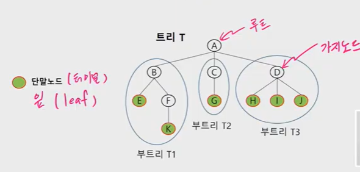
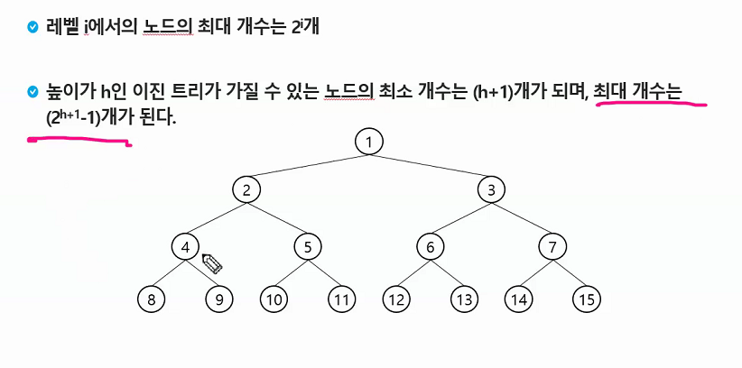
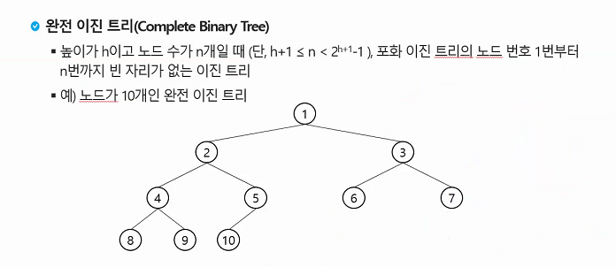
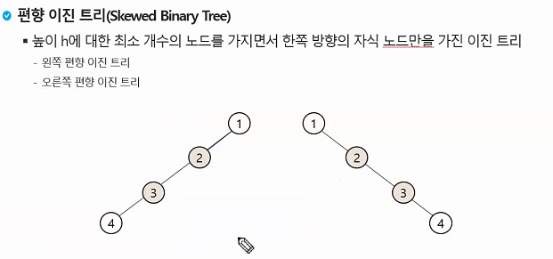
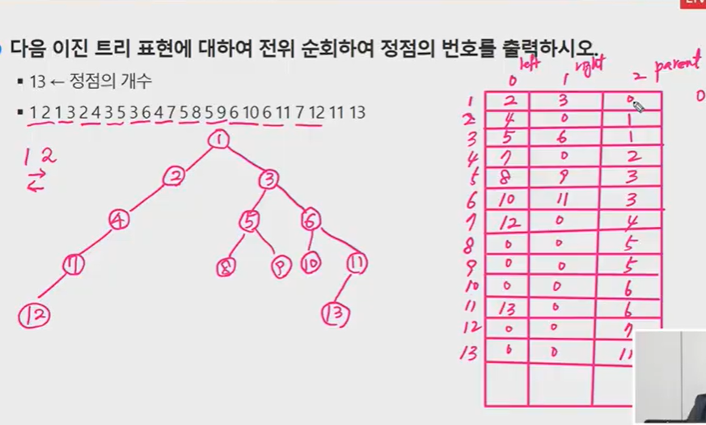
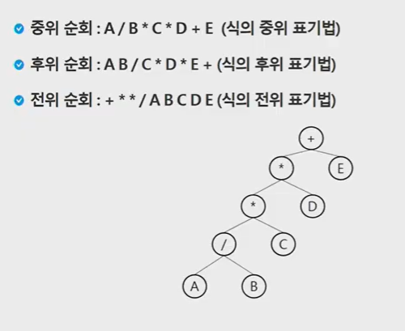
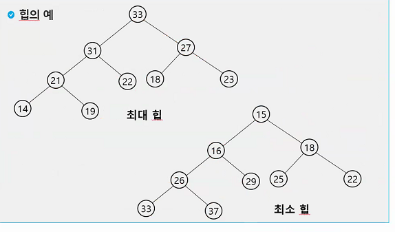
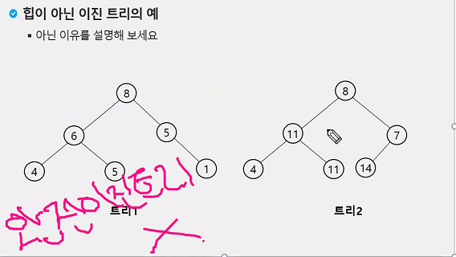

# 트리

> - 트리
>
> - 이진 트리
>
> - 이진트리 탐색
>
> - 힙


## 트리란?

한 개 이상의 노드로 이루어진 유한 집합이며, 다음 조건을 만족한다

	- 노드 중 최상위 노드를 루트라고 한다
	- 나머지 노드들은 n개의 분리집합 T1,...,TN으로 분리될 수 있다.

이들 중 T1,...,TN은 각각 하나의 트리가 되며(재귀적 정의) 루트의 부 트리(subtree)라 한다.





## 이진 트리



- 전부 다 차있는 이진트리가 포화 이진 트리, full binary tree


- 완전 이진 트리

  


- 편향 이진 트리

  


## 이진트리의 표현




## 수식트리의 순회




## 힙

> 루트에는 우선순위가 최고인 값이 존재한다. min이거나 max이거나!!

힙은 완전 이진 트리이다. 완전 이진 트리에 있는 노드 중에서 키 값이 가장 큰 노드나 가장 작은 노드를 찾기 위해 만든 자료구조이다. 

**최대 힙**

- 키 값이 가장 큰 노드를 찾기 위한 완전 이진 트리
- 부모노드의 키 값> 자식 노드의 키값
- 루트 노드: 키값이 가증 큰 노드

**최소 힙**

- 키 값이 가장 작은 노드를 찾기 위한 완전 이진 트리
- 부모 노드의 키값<자식 노드의 키값
- 루트 노드:키 갑싱 가장 작은 노드




최대 힙: 부모가 항상 자식보다 크다.

최소 힙: 부모가 항상 자식보다 작다.





트리 1은 완전이진 트리가 이니라서 힙이 아니다.


## 힙 삽입

```python
heap_count=0

temp=[7,2,5,3,4,6]
N=len(temp)


```


## 힙 삭제

> 힙에서는 루트 노드의 원소만을 삭제 할 수 있다. 루
>
> 루트 노드의 원소를 삭제하여 반환한다.
>
> 힙의 종류에 따라 최대값 또는 최소값을 구할 수 있다

```python
def
```

