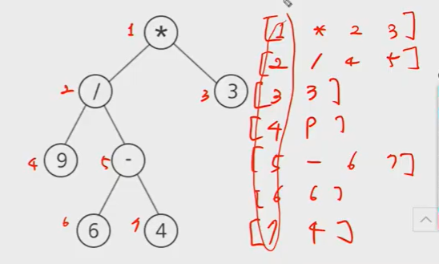

## 이진탐색

문제처럼 저장하려면 

리스트에 [0,4,2,6,1,3,5] 이렇게 저장해야한다.

어떻게 적을 수 있을까?

그런데 이안에 들어가는 값ㅇ

4,2,5,1,6,3 노드 순으로 중위순회로 하면 방문하게 된다!!!! 

이건? 왼쪽자식은 `부모자식*2`, 오른쪽자식은 `부모자식*2+1`

그럼 list[node]=1 , 이런식!!


```python
for tc in range(1,int(input())+1):
    N=int(input())
    T=[0]*(N+1)
    
    cnt=1
    def inorder(v):
        global cnt
        #4,2,5,1,6,3 노드 순으로 중위순회로 하면 방문하게 된다!!!! 
        #근데 만약에 v값(노드값)이 n을 넘으면? 공백노드처럼 간주할수있다!
        if v>N:return #끊어 돌아가
        
        inorder(v*2)
        T[v]=cnt
        cnt+=1
        inorder(v*2+1)
    
    inorder(1)
    print(T[1],T[N//2])
```


## 노드의 합

이건 후위순회라고 볼 수 있다.  공백노드에서는 0을 리턴해주면 되겠다.

왼쪽노드+오른쪽노드-> 원래있던값에 누적

```python
for tc in range(1,int(input())+1):
    N,M,L=map(int,input().split())
    
    T=[0]*(N+1)
    
    for _ in range(M):
        #num은 노드번호, val은 그 안의 값
        num, val = map(int,input().split())
        T[num]=val
        
    def dfs(v):
        if v>N: return
        l=dfs(v*2)
        r=dfs(v*2+1)
        T[v] += l + r #v에 대한 작업을 왼쪽,오른쪽 모두 방문하고 이 작업을 하는거임
		return T[v] #리턴값 두개가 결정되야 한다. 
    
    dfs(1)
    print(T[L])
```


## 이진 힙

```PYTHON
def push(item): 
    global hsize
    hsize +=1
    #완전이진트리의 형태를 유지하기위해 이렇게함
    H[hsize]=item
    
    #child,parent
    #hsize는 바뀌면 안되니까
    c=hsize; p=hsize//2
	
    #부모와 자식 비교해보자,계속 비교할건데 p가 루트가 될때까지!!
    #while p: #p가 1일때는 해야함. 자식이 2,3될수있으니까 그런데 0이 되면 할 필요x 
    	#if H[p] > H[c]:
        	#H[p],H[c]=H[c],H[p]
   	 	#else:
        	#return
        
    while p and  H[p] > H[c]:
        H[p],H[c]=H[c],H[p]
        c=p ; p=c//2
        
____________________________________________________________________________
for tc in range(1,int(input())+1):
    N=int(input())
    arr=list(map(int,input().split()))
    
    H=[0]*(N+1)
    hsize=0 #스택의 탑
    
    for val in arr:
        hsize += 1
        H[size]=val
        
        c=hsize; p=hsize//2
    	while p and  H[p] > H[c]:
        	H[p],H[c]=H[c],H[p]
        	c=p ; p=c//2
    v=N//2
    while v:
        ans+=H[v]
        v=v//2
    print('#{} {}'.format(tc,ans))
```


## 사칙연산

후위순위를 해야함

9 6 4 - 3 / * 후위순회에서 루트는 가장 마지막에 방문하게 된다. 

단말노드(자식이없는) 인지 아닌지 구분하는게 중요하다. 

후위순회를 하게 되면, 단말노드(피연산자)일 경우와 내부노드(연산자)인 경우를 구분한다. 피연산자일경우는, 부모한테 값을 전달해줌. 연산자입장에서는, 왼쪽 자식의 값을 가져오고, 오른쪽 자식의 값을 가져옴. 

입력으로 주어질때는 정수로만 주어진다.

정점이 단순한 수이면? 정점이 피연산자.



```python
for tc in range(1,11):
    N=int(input())
    T=[[]]
    
    for i in range(1,N):
        T.append(list(input().split())) #0번인덱스에 들어감, 
        
        #연산자일경우
        if len(T[i]) == 4:
            T[i][2]=int(T[i][2])
            T[i][3]=int(T[i][3])
        #피연산자
        else:
            T[i][1]=int(T[i][1])
    
    
    def calc(v):
        if len(T[v]) == 2: #피연산자
            return T[v][1]
        else:
            #연산자
            l=calc(T[v][2])
            r=calc(T[v][3])
            
            if T[v][1]=='+' : return l+r
            elif T[v][1] == '-': return l-r
            elif T[v][1] == '*': return l*r
            else: return l/r
   print(calc(1))
```


## 가능한 시험점수


```python
for tc in range(1,int(input())+1):
    N=int(input())
    score=list(map(int,input().split()))
    
    visit=[0]*(sum(score)+1) #마지막에 중복을 제거
    
    #k는 depth
    def dfs(k,s):
        if k==N:
            print(s,end=" ")
            visit[s]=1
        
        else:
            dfs(k+1,s)
            dfs(k+1,s+score[k])
    dfs(0,0)
    pirnt(sum(visit))
    
    
```


```python
for tc in range(1,int(input())+1):
    N=int(input())
    score=list(map(int,input().split()))
    
    visit=[[0]*(sum(score)+1) for _ in range(N+1)] #레벨별로 visit만들어서 중복제거
    
    #k는 depth
    def dfs(k,s):
        if visit[k][s]:return
        visit[k][s]=1
        
        if k==N:
            return
        
        else:
            dfs(k+1,s)
            dfs(k+1,s+score[k])
    dfs(0,0)
    pirnt(sum(visit))
    
```

`


```python
for tc in range(1,int(input())+1):
    N=int(input())
    score=list(map(int,input().split()))
    
    visit=[0]*(sum(score)+1)
    Q=[[0,0]] #k,s
    
    while Q:
        k,s=Q.pop(0)
        if k == N:
            visit[s]=1
        else:
            Q.append([k+1,s]) #틀릴경우
            Q.append([k+1,s+score[k]])
   print(sum(visit)) 
```


```python
'''
영준이 N개의 문제를 만들었음
각 문제의 배점은 문제마다 다를 수 있고, 틀리면 0점
받을 수 있는 점수로 가능한 경우의 수 몇가지?
모든 경우를 체계적으로 조사하는 방법 -> 백트래킹 활용
모든 문제의 부분집합의 합을 구해서 경우의 수르 구하면 된다!
너비우선탐색을 이용해서 풀기
같은 위치의 중복을 제거해가며 풀기
'''
T = int(input())
for tc in range(1,T+1):
    #문제 수
    N = int(input())
    score = list(map(int,input().split()))
    #방문표시에 해당 idx에 나온 값을 저장해줌
    visited = [0] * (sum(score)+1)
 
    #너비우선탐색으로 풀건데 Q에 각 레벨별로 값들을 추가! 만약 이미 방문했다면 지나가!
    Q = [0] 
 
    for val in score:
        #Q의 길이만큼 돌거야!
        for i in range(len(Q)):
            if visited[Q[i] + val]: #Q에 들어있는 수들과 val의 합이 이미 나왔다면, 방문을 했다면 지나가라아
                continue
            #방문하지 않았다면 방문표시를 해줌
            visited[Q[i] + val] = 1
            #해당 합을 추가해줘라
            Q.append(Q[i] + val)
    print('#{} {}'.format(tc,len(Q)))
            
```

