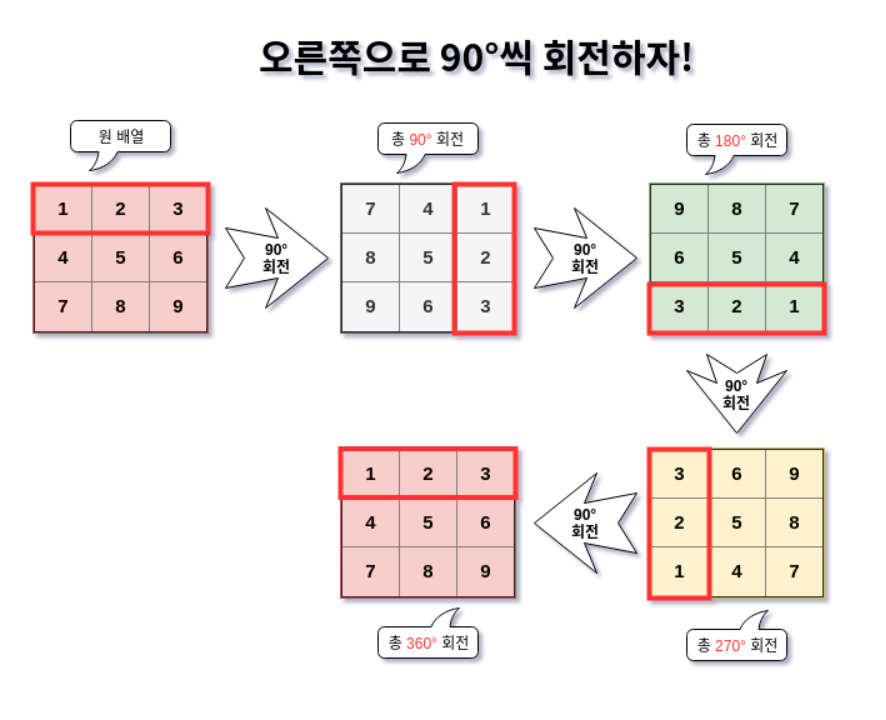
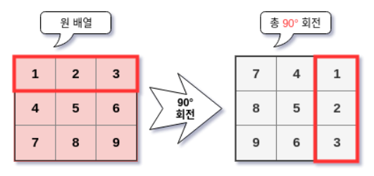

### 2차원 배열 회전 알고리즘

ref:https://shoark7.github.io/programming/algorithm/rotate-2d-array

> 이번에는 이 블로그를 따라가면서 2차원 행렬을 회전하는 알고리즘을 공부한다. 




### 1.알고리즘

90도, 180도, 270도를 회전하는 알고리즘을 구현할 것이다. 


### 1.1 90도 회전




어떻게 바꿔야 할까. 전체적인 그림을 보니까 정리가 안된다. 하이라이팅된 첫행을 보자. 이 첫행이 어떻게 변화되는지 보고, 나머지도 적용시켜보자.

 

N=1, (0,0) -> (0,2) 

N=2, (0,1) -> (1,2)

N=3, (0,2) -> (2,2)

찾은 두개의 규칙!

**ONE 회전 전의 열번호와 회전후의 행 번호가 일치한다.**

**TWO 회전 후의 열은 N-1에서 회전 전의 행을 뺀 값과 같다**(고 하는데 이건 도대체 어떻게 발견할 수 있을까,,,,)


코드로 보자! 

```python
def rotate_90(m):
    N=len(m)
    ret = [[0]*N for _ in range(N)] 
    
    for r in range(N):
        for c in range(N):
            ret[c][N-1-3]=m[r][c] #1
   	return ret


```

- m은 2차원 배열이다. 그래서 m이 들어오면 각각의 값을 90도 회전한 것을 ret에 넣어주고, ret를 리턴하는 것이다
- 이 식은 위에서 찾은 규칙에서 비롯됨. 
  - 1번 규칙에서 회전 전(m)의 열번호와 회전 후의 행번호가 일치한다고 하였으므로 c가 저렇게 들어감
  - 2번 규칙에서 회전 후의 열은 N-1에서 회전 전의 행을 뺀 값과 같다고 하였으니 저렇게 식을 쓰면 됨***~~(근데 이부분을 어떻게 생각해내야 하는지 모르겠음)~~***

```PYTHON
ret[c][N-1-3]=m[r][c]
```

- 이 부분이 핵심이다!! 아까의 단서에서 회전 전의 열과 후의 행이 일치한다고 하였으므로 두 곳에서 c 값을 그대로 준다. 
- **다음으로 회전 후의 열은 N-1에서 회전 전의 행을 뺀 값이라고 했다. 회전 전의 행 번호가 r일때, N-1(2)에서 r(0)을 빼줌으로써 이 값을 만들 수 있다.** (어려워 이 생각을 어떻게 혼자 하지?)

```PYTHON
>>> test = [[1,2,3], [4,5,6], [7,8,9]]
>>> print(rotate_90(test))


[[7, 4, 1], [8, 5, 2], [9, 6, 3]] 
```

