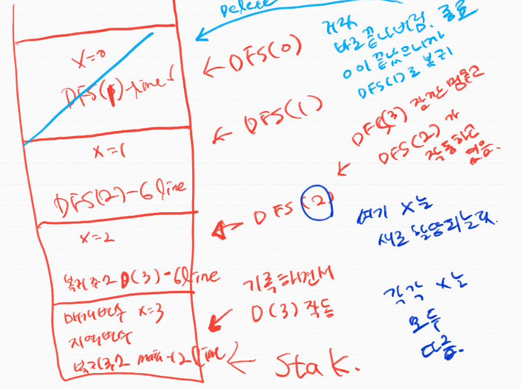
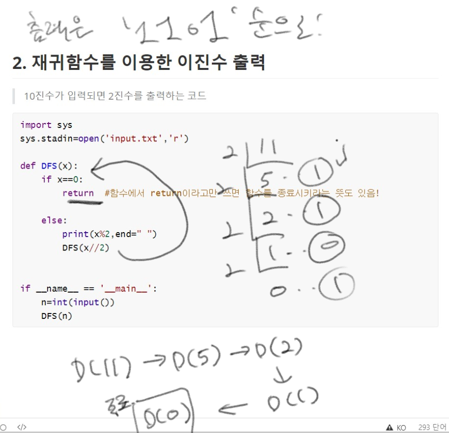
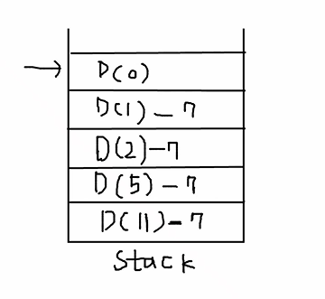
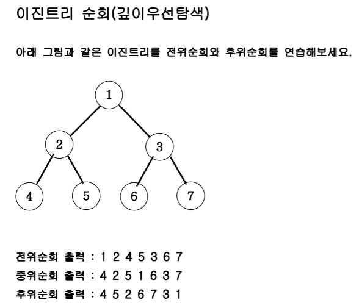
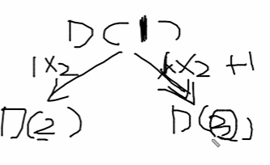
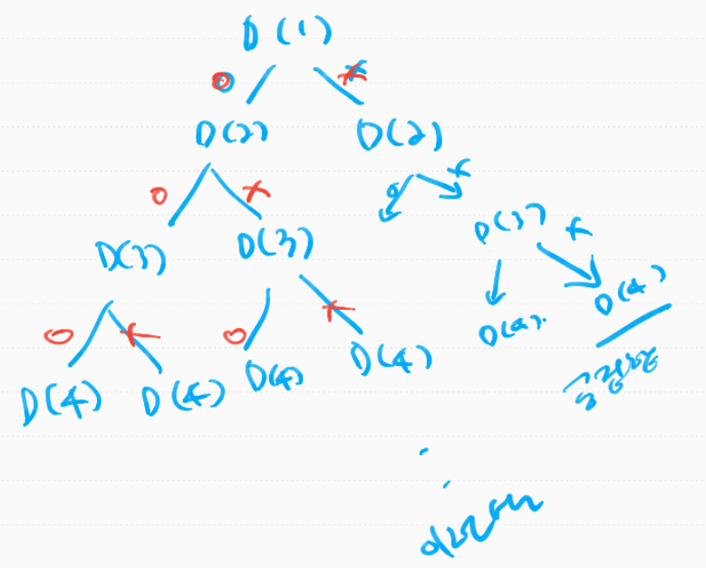
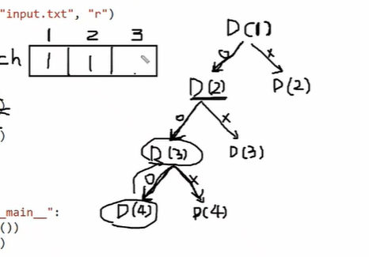
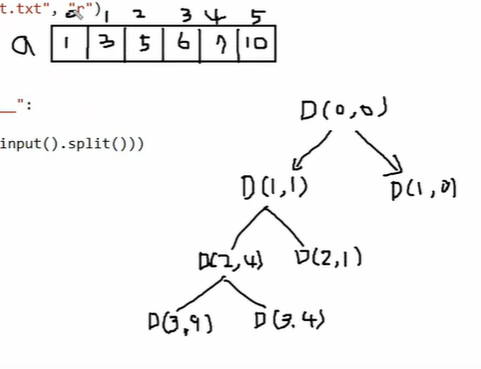

## 1. 재귀함수와 스택

재귀함수는 반복문의 대체재. 코드의 유연성을 위해 사용.


- 3이 입력되면 1,2,3 이 입력되는 코드를 작성해보자

```python
import sys
sys.stadin=open('input.txt','r')

def DFS(x):
    print(x)
  	DFS(x-1)

if __name__=='__main__':
    n=int(input())
    DFS(n)
```

위 함수는 3이 입력되면, DFS(3)이 호출되고, DFS(2)이 호출되고, 그런식으로 무한하게 돌게 됨. 종료지점이 없기 때문에!!

그래서 아래처럼 종료조건을 준다.

```python
import sys
sys.stadin=open('input.txt','r')

def DFS(x):
	if x>0:
    	print(x)
  		DFS(x-1)

if __name__=='__main__':
    n=int(input())
    DFS(n)
```


그런데 1,2,3 이렇게 호출하고 싶으면? 아래처럼  코드의 순서를 바꿔주면 됨.

`DFS(x-1)`와 `print(x)`을 거꾸로 해주면 됨. 왜일까? 

```python
import sys
sys.stadin=open('input.txt','r')

def DFS(x):
	if x>0:
  		DFS(x-1)
		print(x)
        
if __name__=='__main__':
    n=int(input())
    DFS(n)
```

**스택구조!!때문이다**




DFS(0)이 거짓임. 그래서 바로 끝내버리면서 종료됨. 그리고 종료될때 스택위에있는 메모리를 모두 지우는데 그때 복귀해야할 주소를 참조해서 DFS(1)-line 6로 복귀함. 그러면 DFS(1)이 작동한 것임. 그럼?? DFS(1)로 오면서 그 아래 print(x) 1출력, 하고 나면 또 자기 할일 다했으니까 종료, 하면서 메모리 지움. 지우면서 복귀해야 할 라인 기억! 어디로? DFS(2) -line6으로 복귀하면서 DFS(2)작동한다고 보면됨. 내려가면서 print(x) 하면서 2를 출력. 할일다했으니까 pop되버림. dfs(2)가 끝났으니까 dfs(3)의 6line으로 복귀하고, 3이 출력됨. 그리고 또 dfs(3)이 자기할일 다 하고 끝남! 그리고 모두 할당해제되면서 지워짐. 그리고 없어지면서 main12라인으로 복귀함. 그리고 거기서 할일이 있으면 하고, 없으면 그냥 끝나는거임. 


## 2. 재귀함수를 이용한 이진수 출력

> 10진수가 입력되면 2진수를 출력하는 코드

```python
import sys
sys.stadin=open('input.txt','r')

def DFS(x):
    if x==0:
        return  #함수에서 return이라고만 쓰면 함수를 종료시키라는 뜻도 있음!
    
	else:
        print(x%2,end=" ")
		DFS(x//2)


if __name__ == '__main__':
    n=int(input())
    DFS(n)
```




저렇게 하면 1101이 된다 근데 11을 2진수로 바꾸면? 1011이다!그러면 어떻게 해야할까?

아래처럼!!! 

```python
import sys
sys.stadin=open('input.txt','r')

def DFS(x):
    if x==0:
        return  #함수에서 return이라고만 쓰면 함수를 종료시키라는 뜻도 있음!
    
	else:
        DFS(x//2)
        print(x%2,end=" ")


if __name__ == '__main__':
    n=int(input())
    DFS(n)
```




## 3. 이진트리 순회(DFS탐색)

> 


왼쪽자식 오른쪽 자식을 어떻게 호출? 부모자식인 D(1) `1*2`는 왼쪽자식, `1*2+1`은 오른쪽 자식




#### 전위 순회 방식

호출하기 전에 자기 본연의 일을  먼저 하면!! 

```python
import sys
sys.stdin=open('input.txt','r')

def DFS(v):
    #종료조건
    if v>7:
        return 
    
    else:
        #함수 본연의 일! 출력
        print(v,end=" ")
        #왼쪽자식 호출
        DFS(v*2)
        #오른쪽자식 호출
        DFS(v*2+1)


if __name__=="__main__":
    DFS(1)
```

>  1 2 4 5 3 6 7


반면, 자기 본연의 일(출력)을  왼쪽 자식과 오른쪽 자식 사이에 넣으면? 중위순회

```python
import sys
sys.stdin=open('input.txt','r')

def DFS(v):
    #종료조건
    if v>7:
        return 
    
    else:
        #왼쪽자식 호출
        DFS(v*2)
        #함수 본연의 일! 출력
        print(v,end=" ")
        #오른쪽자식 호출
        DFS(v*2+1)


if __name__=="__main__":
    DFS(1)
```


후위 순회는? 제일 끝에! 왼쪽자식, 오른쪽 자식 다 처리하고! 자기본연의 일을 할때! 병합정렬이 후위순회의 대표적 문제임

```python
import sys
sys.stdin=open('input.txt','r')

def DFS(v):
    #종료조건
    if v>7:
        return 
    
    else:
        #왼쪽자식 호출
        DFS(v*2)
        #오른쪽자식 호출
        DFS(v*2+1)
        #함수 본연의 일! 출력
        print(v,end=" ")


if __name__=="__main__":
    DFS(1)
```


## 4. 부분집합 구하기(DFS)

> 3이 들어오면 
>
> 1 2 3
>
> 1 2 
>
> 1 3
>
> 1 
>
> 2 3 
>
> 2
>
> 2 3
>
> 을 출력하세요


- [1,2,3]이 있으면 1이 들어가는지 안들어가는지 경우의 수 2가지 `2*2*2`총 8가지임.

  


- 1이라는 사용하는 상태트리, 사용하지 않는 상태트리로 뻗어 나가는 것임. 앞으로 DFS를 잘하려면 상태트리를 잘 구성해야한다.


```python
import sys
sys.stdin=open('input.txt','r')

def DFS(v):
    if v==n+1:
        for i in range(1,n+1):
            if check[i]==1:
                print(i,end=" ")
        print() #줄바꿈
              
    
    #여기서 뻗어나가는거다. 사용한다.사용하지 않는다
    else:
        check[v]=1
        DFS(v+1)
        check[v]=0
        DFS(v+1)


if __name__=="__main__":
    n=int(input())
    check=[0]*(n+1) #어떨때 사용하는지,안했는지 체크변수
    
```




## 5. 합이 같은 부분집합(DFS)

> 입력
>
> 6
>
> 1 3 5 6 7 10
>
> 출력
>
> YES


**[Approach]**

전체원소의 합을 total이라고 구함.

그리고 내가 부분집합을 만들어서 sum에 원소를 누적함. 그리고 total-sum을 하면 또 다른 부분집합(내가 만들지 않은 또다른 부분집합의 합임) 

따라서 total-sum==sum이면, yes!



```python
import sys
sys.stdin=open('input.txt','r')

def DFS(L,sum): #sum에 내가 만든 부분집합의 원소를 다 누적할거임, L은 Level
    if L==n:
        if sum==(total-sum):
            print('YES')
            sys.exit() #함수 종료가 아닌 프로그램 전체 종료
    else:
        DFS(L+1,sum+a[L]) #L은 인덱스번호라고 생각하자
        DFS(L+1,sum)

if __name__=="__main__":
    n=int(input())
    a=list(map(int,input().split()))
    total=sum(a)
    DFS(0,0)
    print("NO")#만약에 아무경우가 없어서 재귀가 끝나버린 케이스라면, 돌아와서 NO가 찍힘
```

- L이 n이 되면! 그때가 종료 지점

그런데 sum(내가 만든 부분집합의 총합)이 total의 절반을 넘어가면? 그럼 더 아래로 내려갈 필요가 없음. 그 아래에서 같은 경우가 존재할 수가 없음. 이걸 cut!

```python
import sys
sys.stdin=open('input.txt','r')

def DFS(L,sum): #sum에 내가 만든 부분집합의 원소를 다 누적할거임, L은 Level
    if sum>total//2: #이렇게 하면 속도가 좀 더 올라감, 시간복잡도 단축됨
        return 
    if L==n:
        if sum==(total-sum):
            print('YES')
            sys.exit() #함수 종료가 아닌 프로그램 전체 종료
    else:
        DFS(L+1,sum+a[L]) #L은 인덱스번호라고 생각하자
        DFS(L+1,sum)

if __name__=="__main__":
    n=int(input())
    a=list(map(int,input().split()))
    total=sum(a)
    DFS(0,0)
    print("NO")#만약에 아무경우가 없어서 재귀가 끝나버린 케이스라면, 돌아와서 NO가 찍힘
```

