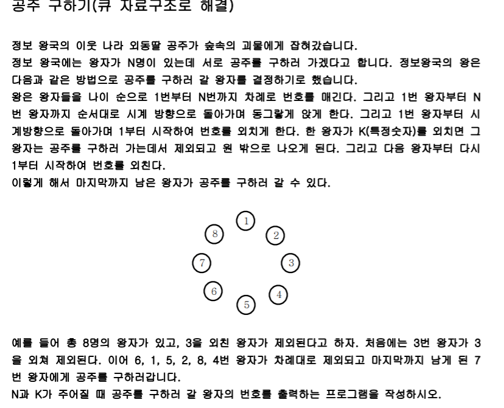
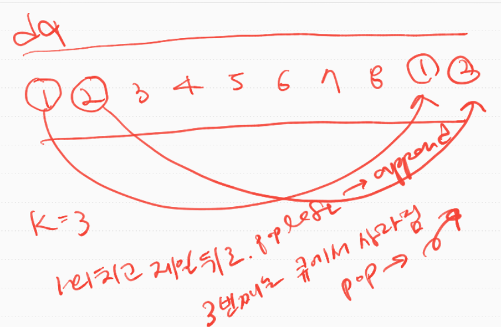
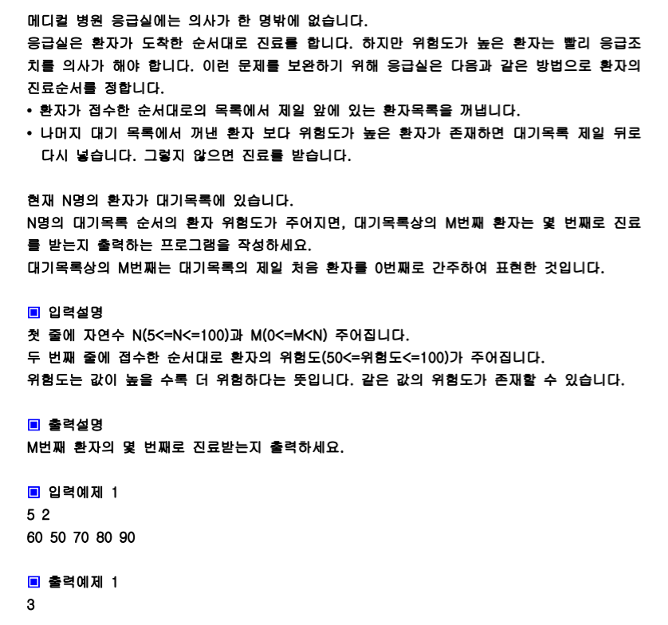

### 큐

first in first out! 들어가는 곳과 나가는 곳이 다른 곳임. 스택과 다른점. 누가 먼저 나오느냐에 대한 개념으로 구분하면 됨. 파이썬에서는 deque라는 라이브러리를 제공한다. 

deque란, 뒤쪽에서 넣고(append)뒤쪽에서 꺼냄(pop)

근데 deque는 앞에서도 넣을 수 있고, 앞에서도 꺼낼 수 있음. 앞쪽(left지점이라고 생각)에서 넣는걸 `appendleft`, 앞쪽에서 꺼내는건 `popleft`, 

그럼 큐라는 자료구조를 이용하기위해서는 `append`와 `popleft`를 쓰면 된다!! 


### 공주 구하기

> 

>  1,2는 popleft되고, 뒤로 append. 근데 3번째(k번째)는 그냥 pop해서 사라짐. 마치 원형으로 도는것과 같은 논리임.




```python
import sys
from collections import deque

N,K=map(int,input().split())
dq=list(range(1,N+1)) #리스트를 만들고
princes=deque(dq) #dq함수를 쓰기 위해 dq자료형으로 변환

while princes: 
    for _ in range(K-1):
        cur=princes.popleft()
        #원형으로 앉아있으니까, 그효과를 내기 위해 뒤로 가는거임
        #앞에서 빼서 뒤로 append(회전)
        princes.append(cur)
    #K번째 사람은 그냥 pop하고 없애버림
    princes.popleft()
    if len(princes)==1:
        print(princes[0])
        # break
        princes.popleft() #while문 빠져나오기 위해 break써도 되지만, prices를 비워서 while문을 빠져나오게!

```


### 응급실

boj_1966과 비슷한 문제인듯????

> 

```python
import sys
from collections import deque

'''
5 2
60 50 70 80 90
'''

n,m=map(int,input().split())
Q=[(pos, val) for pos,val in enumerate(list(map(int,input().split())))]

#[60,50,70]을 받고, 그걸 enumerate로 접근해서 pos,val을 접근한다면
#(0,60),(1,50),(2,70) 이런식으로 튜플로 받아진다. pos를 하는 이유는 n번째를 알기 위해서!
#이걸 queue 자료구조로 만들거다

Q=deque(Q)
cnt=0 #몇번째인지 물어보는거니까

while True:#m번째 사람이 진료를 받는 순간 출력하고 브레이크해야지
    cur=Q.popleft()
    #이제 대기목록중에 위험도가 cur보다 높으면 진료받지 못하고 뒤로 append되게됨 이걸 어떻게 처리할까?
    #any라는 함수가 있다.
    #cur=(0,60), 이거의 cur[1]은 위험도에 해당함
    #Q에있는 자료를 도는데,x는 튜플값,
    if any(cur[1]<x[1] for x in Q):
        Q.append(cur)
    else: #이말은 한개도 참이 아닌것임.any함수.이사람의 위험도가 제일 높다는뜻.진료받자
        cnt+=1
        if cur[0] == m:#m번째 사람이 몇번만에 진료받는지 찾는거니까
            print(cnt)
            break
```


### boj_1966_프린터 큐

```python
import sys
sys.stdin = open("input.txt", "r")
from collections import deque
'''
3
1 0
5
4 2
1 2 3 4
6 0
1 1 9 1 1 1
'''
for tc in range(1,int(input())+1):
    N,M=map(int,input().split())
    Q=[(pos,val) for pos,val in enumerate(list(map(int,input().split())))]
    Q=deque(Q)
    cnt=0

    while True: #M이 되면 멈추고,그때의 cnt를 뽑아야지
        cur=Q.popleft()
        #만약에 cur의 중요도가 Q안에 있는 중요도보다 크면? 제일 크면? 그걸 그냥 pop하고,
        #cnt를 프린트하면 됨.
        #아니라면? cur을 뒤로 append해줌
        if any(cur[1]<x[1] for x in Q):
            Q.append(cur)
        else:
            cnt+=1
            if cur[0] == M:
                print(cnt)
                break
```

근데 런타임 에러났다 짜증나,,,어쩌라고 