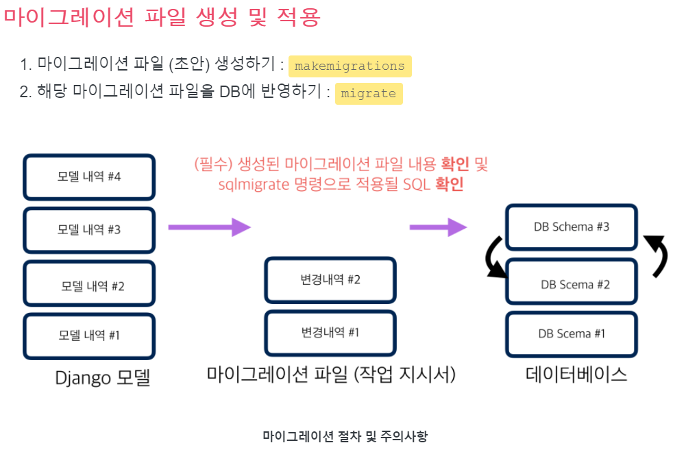
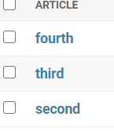

***[references]***

[http://pythonstudy.xyz/python/article/308-Django-%EB%AA%A8%EB%8D%B8-Model](http://pythonstudy.xyz/python/article/308-Django-모델-Model)

https://wayhome25.github.io/django/2017/03/20/django-ep5-model/

[http://pythonstudy.xyz/python/article/310-Django-%EB%AA%A8%EB%8D%B8-API](http://pythonstudy.xyz/python/article/310-Django-모델-API)


# django model

> 장고 모델
>
> - 뷰 함수에서 데이터베이스에 어떤 작업을 요청할때는 SQL 구문이 필요하다.


### SQL

- Query: 정보수집에 대한 요청에 쓰이는 컴퓨터 언어
- SQL : 관계형 데이터베이스 관리 시스템(Relational Database Management System)의 데이터를 관리하기 위해 설계된 특수목적의 프로그래밍 언어


### Django Model

- 모델은 단일한 데이터에 대한 정보를 가지고 있다.
- 필수적인 필드(칼럼)과 데이터(레코드)에 대한 정보를 포함한다.
- 일반적으로 각각의 모델(클래스)는 단일한 데이터 베이스 테이블과 매핑된다.
- 모델은 부가적인 메타데이터를 가진 DB 구조(layout)를 의미
- 사용자가 저장하는 데이터들의 필수적인 필드와 동작 포함

- 장고 내장 ORM
- ORM의 역할: SQL을 직접 작성하지 않아도 장고 모델을 통해 데이터 베이스로 접근한다(조회/추가/수정/삭제)
- 보통 하나의 장고 프로젝트에서 하나의 DB를 사용한다.


**DB의 기본 구조**

- 데이터베이스 (DB)

  - 체계화된 데이터의 모임

- 쿼리(Query)

  - 데이터를 조회하기 위한 명령어
  - (주로 테이블형 자료구조에서) 조건에 맞는 데이터를 추출하거나 조작하는 명령어
  - Query를 날린다 → 데이터를 DB에 요청 → 응답 데이터는 QuerySet (Model의 인스턴스)

- 스키마 (Schema) / 뼈대(Structure)

  - 데이터베이스에서 자료의 구조, 표현 방법, 관계 등을 정의한 구조
  - 데이터베이스 관리 시스템(DBMS)이 주어진 설정에 따라 데이터베이스 스키마를 생상하며, 데이터베이스 사용자가 자료를 저장, 조회, 삭제, 변경할 때 DBMS는 자신이 생성한 데이터베이스 스키마를 참조하여 명령을 수행

- 테이블 (Table) / 관계(Relation)

  - 필드(field): 속성, 컬럼(Column)

    - 모델 안에 정의한 클래스에서 클래스 변수가 필드가 된다.

  - 레코드(record): 튜플, 행(Row)

    - 우리가 ORM을 통해 해당하는 필드에 넣은 데이터(값)을 의미한다.


## ORM

- 'Object-Relational-Mapping'은 객체 지향 프로그래밍 언어를 사용하여 호환되지 않는 유형의 시스템간에(Django-SQL) 데이터를 변환하는 프로그래밍 기술이다. 이것은 프로그래밍 언어에서 사용할 수 있는 '가상 객체 데이터베이스'를 만들어 사용한다.

- OOP 프로그래밍에서 RDMSM을 연동할때, 데이터베이스와 객체 지향 프로그래밍 언어 간의 호환되지 않는 데이터를 변환하는 프로그래밍 기법이다. 객체 관계 매핑이라고도 부른다.

- 객체 지향 언어에서 사용할 수 있는 '가상' 객체 데이터베이스를 구축하는 방법이다.

- 현대 대부분의 프레임 워크는 ORM 사용

  

**정리**

- 객체 지향 프로그래밍에서 DB를 편리하게 관리하게 위해 ORM 프레임워크를 도입
- **"우리는 DB를 객체(object)로 조작하기 위해 ORM을 사용한다."**


### Django 모델 정의

- 위치: 특정앱/models.py
- 데이터 베이스 테이블 구조/타입을 먼저 설계를 한 다음에 모델을 정의한다.
- 모델 클래스명은 단수형을 사용한다.

**0819 수업 실습**

```python
from django.db import models

# Create your models here.
#models.py안에 Model이라는클래스가 있는데, 그MODEL이 기본적인 기능을 다 갖고 있어서 그걸 상속받는것
class Article(models.Model):
    #게시글 제목/내용/언제작성, 아래 세줄이 다 필드임(열)/id는 작성안해도 됨.자동생성
    #charfield에는 필수 인자가 필요함 like below
    title = models.CharField(max_length=10)
    #textfield의 필수인자는 없음
    content = models.TextField()
    #auto_now_add=True, 날짜 수정되지 않음
    created_at = models.DateTimeField(auto_now_add=True)
    #갱신될때마다 장고가 알아서 시간을 새로 넣어줌 
    updated_at = models.DateTimeField(auto_now=True)
    
```

**대표 필드**

- `CharField(max_length=None, **options)`
  - 길이의 제한이 있는 문자열을 넣을 때 사용
  - CharField의 max_length는 필수 인자
  - 필드의 최대 길이(문자), 데이터 베이스 레벨과 django의 유효성 검사(값을 검증하는 것)에서 활용
  - 문자열 필드 -> 텍스트 양이 많을 경우 `TextField()`사용
  - 기본 양식 위젯은 **TextInput**
- `TextField(**options)`
  - **글의 수가 많을 때 사용**
  - max_length 옵션을 주면 자동양식필드의 textarea 위젯에 반영은 되지만 모델과 데이터베이스 수준에는 적용되지 않는다.(CharField 를 사용)
  - 기본 양식 위젯은 Textarea
- `DateTimeField(auto_now=False, auto_now_add=False, **options)`
  - 최초 생성 일자
    - `auto_now_add=True`
    - django ORM이 최초 insert(테이블에 데이터 입력)시에만 현재 날짜와 시간으로 갱신(테이블에 어떤 값을 최초로 넣을때)
  - 최초 수정 일자
    - `auto_now=True`
    - django ORM이 save를 할 때마다 현재 날짜와 시간으로 갱신

> **[추가학습]**
>
> ### ++ 필드(Fields) 
>
> - 모델은 모든 타입의, 임의의 숫자의 필드를 가질 수 있다 - 각각의 필드는 우리의 데이터베이스 목록(table)에 저장하길 원하는 데이터 열을 나타난대. 각각의 데이터베이스 레코드는 각 필드 값들 중 하나로 구성되어 있다. 
>
> ```python
> my_field_name = models.CharField(max_length=20, help_text='Enter field documentation')
> ```
>
> - 위 예제는 `my_field_name`이라는 하나의 필드를 가지고 있고, `models.CharField`타입이다. 필드 타입들은 특정한 클래스들을 사용하여 등록되며, HTML 양삭에서 값을 수신할때 사용할 유효성 검증 기준과 함께 데이터베이스에 데이터를 저장하는데 사용되는 레코드의 타입을 결정한다. 또한 필드 타입은 필드가 어떻게 저장되고 사용될지 지정하는 인수를 지정할 수 있다. 위 예제에서는 필드에 두 가지 인수를 준다:
>
>   - `my_length=20`- 이 필드 값의 최대 길이는 20자
>   - `help_text='Enter field documentation'` — 이 값이 HTML 양식(form)에서 사용자들에게 입력될 때 어떤 값을 입력해야 하는지 사용자들에게 알려주기 위해 보여주는 텍스트 라벨을 제공합니다.(이건 아직 모르겠다)
>
>   
>
> #### * 필드 타입
>
> 모델의 필드에는 다양한 타입들이 있는데, 필드 타입에 대한 자세한 정보는 [여기 Django 필드 타입 링크](https://docs.djangoproject.com/en/1.11/ref/models/fields/#field-types)를 참고하면 된다. 모든 필드 타입 클래스들은 추상클래스인 "Field" 클래스의 파생클래스들이다. 아래는 주요 필드 타입에 대한 간단한 요약이다.
>
> | Field Type    | 설명                                                         |
> | :------------ | :----------------------------------------------------------- |
> | CharField     | 제한된 문자열 필드 타입. 최대 길이를 max_length 옵션에 지정해야 한다. 문자열의 특별한 용도에 따라 CharField의 파생클래스로서, 이메일 주소를 체크를 하는 EmailField, IP 주소를 체크를 하는 GenericIPAddressField, 콤마로 정수를 분리한 CommaSeparatedIntegerField, 특정 폴더의 파일 패스를 표현하는 FilePathField, URL을 표현하는 URLField 등이 있다. |
> | TextField     | 대용량 문자열을 갖는 필드                                    |
> | IntegerField  | 32 비트 정수형 필드. 정수 사이즈에 따라 BigIntegerField, SmallIntegerField 을 사용할 수도 있다. |
> | BooleanField  | true/false 필드. Null 을 허용하기 위해서는 NullBooleanField를 사용한다. |
> | DateTimeField | 날짜와 시간을 갖는 필드. 날짜만 가질 경우는 DateField, 시간만 가질 경우는 TimeField를 사용한다. |
> | DecimalField  | 소숫점을 갖는 decimal 필드                                   |
> | BinaryField   | 바이너리 데이타를 저장하는 필드                              |
> | FileField     | 파일 업로드 필드                                             |
> | ImageField    | FileField의 파생클래스로서 이미지 파일인지 체크한다.         |
> | UUIDField     | GUID (UUID)를 저장하는 필드                                  |
>
> 
>
> #### * 필드 옵션
>
> 모델의 필드는 필드 타입에 따라 여러 옵션(혹은 Argument)를 가질 수 있다. 예를 들어, CharField는 문자열 최대 길이를 의미하는 max_length 라는 옵션을 갖는다. 필드 옵션은 일반적으로 생성자에서 아규먼트로 지정한다. 다음은 모든 필드 타입에 적용 가능한 옵션들 중 자주 사용되는 몇가지를 요약한 것이다.
>
> | 필드 옵션                       | 설명                                                         |
> | :------------------------------ | :----------------------------------------------------------- |
> | null (Field.null)               | null=True 이면, Empty 값을 DB에 NULL로 저장한다. DB에서 Null이 허용된다. 예: models.IntegerField(null=True) |
> | blank (Field.blank)             | blank=False 이면, 필드가 Required 필드이다. blank=True 이면, Optional 필드이다. 예: models.DateTimeField(blank=True) |
> | primary_key (Field.primary_key) | 해당 필드가 Primary Key임을 표시한다. 예: models.CharField(max_length=10, primary_key=True) |
> | unique (Field.unique)           | 해당 필드가 테이블에서 Unique함을 표시한다. 해당 컬럼에 대해 Unique Index를 생성한다. 예: models.IntegerField(unique=True) |
> | default (Field.default)         | 필드의 디폴트값을 지정한다. 예: models.CharField(max_length=2, default="WA") |
> | db_column (Field.db_column)     | 컬럼명은 디폴트로 필드명을 사용하는데, 만약 다르게 쓸 경우 지정한다. |
>
> 


# DB 설정과 Migrations


> ### 1. Migrations

Django에서 Model 클래스를 생성하고 난 후, 해당 모델에 상응하는 테이블을 데이터 베이스에서 생성할 수 있다. python 모델 클래스의 수정을 DB에 적용하는 과정을 Migrations이라고 부른다. 이는 Django가 기본적으로 제공하는 ORM 서비스를 통해 진행된다.


```
# 마이그레이션 파일 생성
$ python manage.py makemigrations <app-name>

# 마이그레이션 적용
$ python manage.py migrate <app-name>

# 지정 마이그레이션의 SQL 내역
 python manage.py sqlmigrate <app-name> <migration-name>

# 마이그레이션 적용 현황
$ python manage.py showmigrations <app-name>

```




### tip

- makemigrations 이후에는 migration 폴더를 확인하는 습관을 갖는게 좋다. DB는 중요하기 때문에 무엇이 수정되었는지 다시 한번 확인하는 습관.
- makemigrations [app-name] 처럼 app 이름을 명시하는 것이 좋다. (예상치 못한 migration을 방지)
- showmigrations 를 통해서 적용 상태를 조회할 수 있다. [x] : 적용 후 []: 적용 전
- 실제 DB에는 sql 쿼리로 명령이 전달이 된다. migration 파일은 쿼리는 아니다. 따라서 `sqlmigrate` 명령을 통해 sql로도 확인하는 습관이 필요하다.
- 이미 적용한 migration 파일은 절대로 지우면 안된다.
- 프로젝트/앱 생성 후 처음 migrate 할 때는 app 이름을 명시하지 않는다. 이는 장고 기본 앱에, 여러 앱에 걸쳐서 적용할 migrate가 있기 때문이다.
- no such table, column 등의 오류는 migration 관련 문제이다.


Django 모델 클래스로부터 테이블을 생성하기 위해서는 크게 Migration을 준비하는 과정과 이를 적용하는 과정으로 나뉘는데, 구체적으로는 다음과 같은 절차를 따른다.


> 1. settings.py 파일 안의 INSTALLED_APPS(만약 이미 추가되지 않았다면) 해당 Django app을 추가한다.
>
>    
>
> 2. `makemigrations`
>
>    모델 클래스로부터 테이블 스키마를 생성 혹은 수정하기 위해 아래 명령을 실행한다. 이 명령이 실행되면 해당 django app 안에 migrations 라는 서브폴더를 만들고 테이블 생성 및 수정을 위한 파이썬 마이그레이션 파일들을 생성한다.
>
>    ```py
>    $  ./manage.py makemigrations
>    ```
>
>    - 모델을 변경한 것에 기반한 새로운 마이그레이션(설계도)을 만들 때 사용
>    - 모델을 활성화 하기 전에 DB 설계도를 작성
>    - 생성된 마이그레이션 파일은 데이터베이스 스키마를 위한 버전관리 시스템이라고 생각하자.
>
>    - `0001_initial.py`생성 확인
>
>    
>
> 3. `migrate`
>
>    모델 클래스로부터 실제 DB에 테이블을 생성하거나 수정하기 위해 명령을 실행한다. 이는 실제 migrations을 db에 적용하는 명령이다(설계도를 실제 DB에 반영하는 과정)
>
>    ```sh
>    $ ./manage.py migrate
>    ```
>
>    - 이 시점에 데이터 베이스가 작성됨(전까지는 db가 비어있는 상태)
>    - 작성된 마이그레이션 파일들을 기반으로 실제 DB에 반영
>    - db.sqlite3라는 데이터베이스 파일에 테이블을 생성
>    - 모델에서의 변경 사항들과 DB의 스키마가 동기화를 이룸
>
>    
>
> 4. `sqlmigrate`
>
>    해당 migrations 설계도가 SQL 문으로 어떻게 해석되어서 동작할지 미리 확인할 수 있다
>
>    ```sh
>    $ python manage.py sqlmigrate app_name 0001
>    ```
>
>    
>
> 5. `showmigrations`
>
>    migrations 설계도들이 migrate 됐는지 안됐는지 여부를 확인할 수 있다
>
>    ```sh
>    $ pythob manange.py showmigrations
>    ```
>
>    


#### Model 중요 3단계

- `models.py`: 변경사항 발생(생성/수정)
- `makemigrations`: migration 파일 만들기 (설계도)
- `migrate`: DB에 적용(테이블 생성)


**실제 DB 테이블 확인**

- vs code extension - sqlite3 검색 후 설치

  - `F1` → `sqlite` 검색 후 Open Database 클릭 → `db.sqlite3` 클릭 → 왼쪽 EXPLORER 하단에 보면 `SQLITE EXPLORER` 라고 되어있는 거 클릭

- 테이블을 확인해보면 `articles_article`이라는 이름으로 테이블 생성

  - INSTALLED_APPS 중 몇몇은 최소 하나 이상의 DB 테이블을 사용하기 때문에 migrate 와 함께 테이블이 만들어진다.

  - 테이블의 이름은 app의 이름과 model 의 이름이 조합(모두 소문자)되어 자동으로 생성된다. (소문자)

    - `app이름(articles)_소문자 모델이름(article)`


## Django 모델 API

> django가 기본적으로 orm을 제공함에 따른 것으로 db를 편하게 조작할 수 있도록 도와줌.
>
> 앞의 Django 모델에서처럼 모델 클래스를 정의하게 되면, django 데이터를 추가/갱신하고 읽어 들일 수 있는 다양한 데이터베이스 API들을 자동으로 제공한다. 이러한 기능을 Django가 ORM서비스를 기본적으로 제공함에 따른 것으로 데이터베이스를 편리하게 핸들링할 수 있게 도와준다.


**Django shell**

- 일반 파이썬 쉘을 통해서는 장고 프로젝트 환경에 접근할 수 없음

- 그래서 장고 프로젝트 설정이 로딩된 파이썬 쉘을 활용

- Django 프로젝트 내의 각종 모듈 패키지를 활용 할 수 있다.

  ```bash
  $ pip install ipython django-extensions
  ```

  ```python
  # settings.py
  
  INSTALLED_APPS = [
      ...
      'django_extensions',
      ...
  ]
  ```

  ```bash
  $ python manage.py shell_plus
  ```

  


`Articles.objsect.all()`

- article : class name

- objects 

  - 파이썬 모델과 db의 연결 역할
  - model manager과 django model 사이의 ***Qurey 연산의 인터페이스 역할***을 해줌!
  - ORM이 클래스로 만든 인스턴스 객체와 DB를 연결하는데 그 사이에서 통역 역할을 하는게 ORM의 역할이라고 생각하면 됨. 즉, DB를 Python class로 조작할 수 있는 manager
    - **Python Class(`models.py`) ——— objects ——— DB**
  - Django는 기본적으로 모든 Django 모델 클래스에 대해 '`objects`' 라는 Manager(django.db.models.Manager) 객체를 자동으로 추가한다.
  - Manager(objects)를 통해 특정 데이터를 조작(메서드)할 수 있다.

  

- all() : query set api, objects가 all()을 제공해준다.

  - Queryset

    - 데이터베이스로부터 데이터를 읽고, 필터를 걸거나 정렬 등를 수행. 쿼리(질문)를 DB에게 던져서 글을 읽거나, 생성하거나 삭제
    - 데이터 베이스에서 전달받은 객체의 목록
    - django orm에서 발생한 자료형
    - objects를 사용하여 복수의 데이터를 가져오는 함수를 사용할때 반환되는 객체
    - 단일한 객체를 리턴할때는 테이블의 인스턴스로 리턴됨.

    

- orm이 이 코드를 받으면 sql로 바꿔서 db로 보낸다. 그럼 db가 응답을 하고, orm이 다시 그것을 파이썬 코드로 바꿔서 쿼리셋으로 우리에게 넘겨주게 된다. 쿼리셋이란? 데이터베이스로부터 전달받은 객체 목록/ 당연히 없을 수도 또는 1개 또는 여러개 일수 있고, 데이터베이스로부터 조회, 필터, 정렬 등을 수행할 수 있다. 


> [추가학습]
>
> Django는 디폴트로 모든 Django 모델 클래스에 대해 "objects" 라는 Manager (django.db.models.Manager) 객체를 자동으로 추가한다 (이 objects라는 이름을 변경할 수도 있지만, 대부분 그대로 사용한다). Django 에서 제공하는 이 Manager를 통해 특정 데이타를 필터링 할 수도 있고 정렬할 수도 있으며 기타 여러 기능들을 사용할 수 있다.
>
> 데이타를 읽어오기 위해서는 Django 모델의 Manager 즉 "모델클래스.objects" 를 사용한다. 예를 들어, Feedback 이라는 모델의 경우 "Feedback.objects" 를 사용한다 (객체명이 아니라 클래스명을 사용함에 주의).
>
> Django Model API에는 기본적으로 제공하는 여러 쿼리 메서드들이 있는데, 여기서는 자주 사용되는 주요 메서드 몇 가지만 살펴보자. (Feedback 모델 클래스를 기준으로 설명)
>
> - all()
>
>   : 테이블 데이터를 전부 가져오기 위한 메서드
>
> - get()
>
>   : 하나의 row만을 가져오기 위한 메서드. 예를 들어 primary key(일반적으로 id칼럼)가 1인 row를 가져온다.
>
> - filter()
>
>   : 특정 조건에 맞는 row를 가져오기 위해서 filter() 메서드 사용
>
> - exclude()
>
>   : 특정 조건을 제외한 나머지 row들을 가져오기 위해서는 exclude() 메서드를 사용한다.
>
> - 이외에도 여러가지 많다.


## CRUD

> 대부분의 컴퓨터 소프트웨어가 가지는 기본적인 데이터 처리 기능인 
> Create(생성), Read(읽기), Update(갱신), Delete(삭제)를 묶어서 일컫는 말
>
> 이러한 4개의 조작을 모두 할 수 없다면 그 소프트웨어는 완전하다고 할 수 없다. 
>
> 이들 기능은 매우 기본적이기 때문에, 한 묶음으로 설명되는 경우가 많다.


## Create

**기초 설정**

- `articles_article`테이블을 사용하기 위해서는 import가 필요하다.

  ```py
  # DB에 앤스턴스 객체를 얻기 위한 쿼리문 날리기
  >>> Article.objects.all()
  <QuerySet []>
  ```

  

**데이터 객체를 만드는(생성하는) 3가지 방법**

**첫번째 방식**

- ORM을 쓰는 이유는 DB 조작을 객체 지향 프로그래밍(클래스)처럼 하기 위해
  - `article = Article()` :  클래스로부터 인스턴스 생성
  - `article.title` : 인스턴스로 클래스 변수에 접근해 해당 인스턴스 변수를 변경
  - `article.save()` : 인스턴스로 메소드를 호출


```python
>>> article = Article() # Article(class)로부터 article(instance)
>>> article
<Article: Article object (None)>

>>> article.title = 'first' # 인스턴스 변수(title)에 값을 할당
>>> article.content = 'django!' # 인스턴스 변수(content)에 값을 할당

# save 를 하지 않으면 아직 DB에 값이 저장되지 않음
>>> article
<Article: Article object (None)>

>>> Article.objects.all()                            
<QuerySet []>

# save 를 하고 확인하면 저장된 것을 확인할 수 있다
>>> article.save()
>>> article
<Article: Article object (1)>
>>> Article.objects.all()
<QuerySet [Article: Article object (1)]>

# 인스턴스인 article을 활용하여 변수에 접근해보자(저장된걸 확인)
>>> article.title
'first'
>>> article.content
'django!'
>>> article.created_at
datetime.datetime(2019, 8, 21, 2, 43, 56, 49345, tzinfo=<UTC>)
```


**두번째 방식**

- 함수에서 keyword 인자를 넘기는 방식과 동일

```python
>>> article = Article(title='second', content='django!!')

# 아직 저장이 안되어 있음
>>> article
<Article: Article object (None)>

# save를 해주면 저장이 된다.
>>> article.save()
>>> article
<Article: Article object (2)>
>>> Article.objects.all()
<QuerySet [<Article: Article object (1)>, <Article: Article object (2)>]>

# 값을 확인해보자
>>> article.pk
2
>>> article.title
'second'
>>> article.content
'django!'
```


**세번째 방식**

- `create()`를 사용하면 쿼리셋 객체를 생성하고 저장하는 로직이 한번의 스텝으로 가능

```
>>> Article.objects.create(title='third', content='django!')
<Article: Article object (3)>
**__str__**
```


`__str__`

- 모든 모델마다 표준 파이썬 클래스의 메소드인 **str**() 을 정의하여 각각의 object가 사람이 읽을 수 있는 문자열을 반환(return)하도록 한다.

  ```python
  class Article(models.Model):
      title = models.CharField(max_length=10)
      content = models.TextField()
      created_at = models.DateTimeField(auto_now_add=True)
      updated_at = models.DateTimeField(auto_now=True)
  
      def __str__(self):
          return self.title
  ```


**`save()`**

> https://docs.djangoproject.com/en/3.1/ref/models/instances/#saving-objects

- `.save()` 메서드 호출을 통해 데이터를 DB에 저장한다.


> [my note]
>
> ```python
> In [5]: Article.objects.all()
> Out[5]: <QuerySet [<Article: Article object (1)>, <Article: Article object (2)>, <Article: Article object (3)>]> 
> ```
>
> - 객체가 3개임, 객체가 3개라는 말은 데이터가 세개라는 뜻이고 그말은 행이 3줄이라는 뜻이다. 오늘 계속 db를 object로 관리하고 있는 것이다! 계속 이걸 생각해야함.궁극적으로 crud를 하기 위해 object로 관리하고 있는 것이다!! 하나의 리스트에 세개의 요소가 있다.
>
> - 모델의 변경사항이 생기면 makemigrations을 해야한느는데 함수에 def str__이거 추가하는(필드가 변하는거아니고 데이터에 영향주지않음) 이거는 make migrations안해도됨, can check below 
>
>   ```python
>   $ python manage.py makemigrations
>   No changes detected
>   ```
>
>   


## Read

`all()`

- QuerySet return
- 리스트는 아니지만 리스트와 거의 비슷하게 동작

```python
>>> Article.objects.all()
<QuerySet [<Article: Article object (1)>, <Article: Article object (2)>, <Article: Article object (3)>, <Article: Article object (4)>]>
get()
```


`get()`

- 객체가 없으면 doesnotexist 에러가 나오고 객체가 여러개일 경우 multipleobjectreturned 오류를 띄움
- 위와 같은 특징을 가지고 있기 때문에  unique 혹은 not null 특징을 가지고 있으면 사용할 수 있다
- dict.get()과 다름/ dict.get()은 객체가 없으면 none값을 주고, 여기서 .get은 doesnotexist 에러발생시킴
- 만약에 .get으로 찾았는데 중복되는 객체가 여러개일 경우는 'MultipleObjectReturned'에러가 발생됨
- 위와 같은 특징을 가지고 있기 때문에 unique 혹은 not null 특징을 가지고 있으면 사용할 수 있다. 완벽하게 충족하는 것은 pk! ㄱ그래서 pk값을 조회할때 사용한다.

```py
>>> article = Article.objects.get(pk=100)
DoesNotExist: Article matching query does not exist.

>>> Article.objects.get(content='django!')
MultipleObjectsReturned: get() returned more than one Article -- it returned 2!
**filter()**
```


`filter()`

- 지정된 조회 매개 변수와 일치하는 객체를 포함하는 새 QuerySet을 반환

- 찾는게 없어도 무조건 쿼리셋을 줌, 빈 쿼리셋

  

  ```python
  >>> Article.objects.filter(content='django!')
  <QuerySet [<Article: first>, <Article: fourth>]>
  
  >>> Article.objects.filter(title='first')
  <QuerySet [<Article: first>]>
  ```


**The `pk` lookup shortcut**

- 또한, 우리가 `.get(id=1)` 형태 뿐만 아니라 `.get(pk=1)` 로 사용할 수 있는 이유는(DB에는 id로 필드 이름이 지정 됨에도) `.get(pk=1)` 이`.get(id__exact=1)` 와 동일한 의미이기 때문이다. 

- pk는 `id__exact` 의 shortcut 이다.


## Update

- article 인스턴스 객체 생성
- `article.title='byebye'`: article 인스턴스 객체의 인스턴스 변수에 접근하여 기존의 값을 `byebye`로 변경
- `article.save()`: article 인스턴스를 활용하여 `save()`메서드 실행

```python
# UPDATE articles SET title='byebye' WHERE id=1;
>>> article = Article.objects.get(pk=1)
>>> article.title
'first'

# 값을 변경하고 저장
>>> article.title = 'byebye'
>>> article.save()

# 정상적으로 변경된 것을 확인
>>> article.title
'byebye'
```

> [my note]
>
> 수정하고자 하는 specific thing을 하나로 잡아야함(using get())
>
> 그리고 바꿔서 다시 저장하면 끝
>
> ```python
> In [1]: article= Article.objects.get(pk=1)
> 
> In [2]: article.pk
> Out[2]: 1
> 
> In [3]: article
> Out[3]: <Article: first>
> 
> In [4]: article.title
> Out[4]: 'first'
> 
> In [5]: article.title = 'byebye'
> 
> In [6]: article.save()
> 
> In [7]: article.title
> Out[7]: 'byebye'
> ```
>
> updated_at 필드값도 바껴있음! 
>
> save를 안하면, shell에서는 바껴있음 그런데 db에서는 바껴있지 않는다.


## Delete

-  article 인스턴스 생성 후 `.delete()`메서드 호출

```python
>>> article = Article.objects.get(pk=1)

# 삭제
>>> article.delete()
(1, {'articles.Article': 1})

# 다시 1번 글을 찾으려고 하면 없다고 나온다.
>>> Article.objects.get(pk=1)
DoesNotExist: Article matching query does not exist.
```

_________________


## Admin

개념

- 사용자가 아닌 서버의 관리자가 활용하기 위한 페이지
- Article class를 `admin.py`에 등록하고 관리
- `django.contrib.auth`모듈에서 제공하는 것 -> Django에서 제공되는 Authentication 인증 프레임워크
- record 생성 여부 확인에 매우 유용하고 CRUD 로직을 확인하기에 편리하다.


**관리자 생성**

- 관리자 계정 생성 후 서버를 실행한 다음 `/admin` 으로 가서 관리자 페이지 로그인

- 계정만 만들면 실제로 Django 관리자 화면에서 아무 것도 보이지 않는다.

- `admin.py` 로 가서 관리자 사이트에 등록하여 내가 만든 record를 보기 위해서는 Django 서버에 등록

- 처음에 auth 관련된 기본 테이블이 생성되지 않으면 관리자를 생성할 수 없다.

  ```bash
  $ python manage.py createsuperuser
  ```


**admin 페이지 확인**

- admin 사이트에 방문해서 우리가 현재까지 작성한 글들을 확인 해보자.
- `admin.py` 는 관리자 사이트에 Article 객체가 관리 인터페이스를 가지고 있다는 것을 알려주는 것이다.
- 이렇게 admin 사이트에 등록된 모습이 어딘가 익숙하다? 바로 `models.py` 에 정의한 `__str__` 의 형태로 객체가 표현된다. (`list_display` 를 설정하지 않은 경우 1개의 column으로 표현됨)
- 실제로 `__str__` 부분을 주석처리 하고 reload를 하면 객체 자체가 출력 되는 것을 볼 수 있다.


**작성**

```python
# articles/admin.py

from django.contrib import admin
from .models import Article # 명시적 상대경로 표현

admin.site.register(Article)
```

- admin에 Article 모델을 사용하하겠다고 또 등록해야함. 그건 app의 `admin.py`에서!
- `admin.site.register(모델명)` : 어드민에 사이트를 등록하겠다. 누구를? 특정 모델을, 모델은 파일트리를 열어봤을때 모델은 model.py에 있다. 거기 있는 article을 가져와야 한다(which is `from .models import Article`)

- 이렇게 하고 서버새로고침해보면 article생겨았고, 거기서 수정가능!

  (admin을 만들면 crud가 가능하다. shell에서 했던 과정을 이제 장고어디민에서 편하게 할 수 있다! 

  

  article에서 이렇게 되있는건`__str__`때문임

- 반드시 db를 구축한 이후에 superuser를 만들어야 한다. 즉 맨처음에 migrate를 한번하고 나서 슈퍼유저를 해야한다.
- 테이블 없이 슈퍼유저 x, 저장될 곳이 없는것임. 반드시 db구축하고 슈퍼유저만들기!! 저장될 테이블이 있어야함!!! 마이그레이트르 안한 상태(디비가 텅텅 빈 상태)에서 슈퍼유저가 안만들어져요 이러면 안됨(항상 마이그레이트 작업 끝나고, 테이블이 생상되엇을때, 슈퍼유저를 만들어야 어딘가에 저장되고~ 이런식 )

**summary 0819**

> 모델 - 데이터 베이스를 조작하고 관리하는 차원에서 장고의 모델을 학습했다.
>
> DB - 모델이 디비를 관리하는데 이 디비는 데이터들의 체계화된 집합. 즉 디비안의 여러 테이블이 존재하고, 모델이 디비를 조작해야하는데 서로 쓰는 언어가 다름. 장고 모델은 파이썬이고 디비는 SQL을 쓰고 있다. 그러면 우리는 파이썬을 이용해서 DB를 조작해야 하는데 중간에 인터페이스가 필요하다. 그게 바로 ORM
>
> ORM - 우리는 DB를 객체로 조작하겠다. 조작에 대한 명령어는? DATABASE API!! 이걸로 쿼리셋을 만들던지 또는 쿼리셋을 생성하지 않는 API도 존재함. 이걸 통해서 오늘 CRUD를 해봄.

