## web test 준비

https://www.google.com/search?q=css+dinner&oq=css+dinner&aqs=chrome..69i57j0l7.3961j0j7&sourceid=chrome&ie=UTF-8 css dinner

### HTML

> 웹 컨텐츠의 의미와 구조를 정의할때 사용하는 언어

**Hyper**

- 텍스트 등의 정보가 동일 선상에 있는 것이 아니라 다중으로 연결되어 있는 상태

**Hyper text**

- 하이퍼링크를 통해 사용자가 한 문서에서 다른 문서로 즉시 접근할 수 있는 텍스트
- 하이퍼 텍스트가 쓰인 기술등 중 가장 중요한 2가지 (http, html)

**Markup Language**

- 특정 텍스트에 역할을 부여하는, 따라서 "마크업을 한다" 라고 하는 건 제목이 제목이라하고 본문이 본문이라고 마킹을 하는 것이다. 이건 단순히 글자가 커지는게 아니고, 의미론적으로 가장 핵심 주제를 의미한다!


### HTML 기본구조

**DOM**

**요소(element)**

**속성(attribute)**

~~**이 세가지가 있는데, 일단 지금 안외워짐. 넘어가고 다시하는걸로**~~


#### 기본 html 구성

```html
<!DOCTYPE html> 
<html>
    <head> #1
        <meta charset="UTF-8"> #2
        <title>건강 설문</title> #3
    </head>
    <body>
        #4
    </body>
</html>
```

- #1 : head 안에 있는 내용은 이 페이지의 정보! 
- #2 : 인코딩 작업인데, 인코딩을 지정해주는 것이 매우 중요하다. 인코딩이란?? 컴퓨터는 이진법으로 이루어진 수들만 저장할 수 있는데 어떻게 저장할지 방식을 지정해주는 것이고, 인코딩을 하면 다른 컴퓨터에서 열었을때도 같게 보인다.
- #3 : title은 페이지의 제목 이름을 나타낸다.
- html에서 들여쓰기는 필수가 아님. 가독성을 위해서 함. 


#### html 기능 설명

```html
#1
<body>
   
</body>


#2
<body>
	<h1>싸피 데일리 건강 설문</h1>
    <p>싸피에서는 교육생 여러분들의 건강 상태를 매일 매일 확입합니다. 협조 바랍니다.</p>
</body>


#3
<body>
	<form action="https://www.naver.com"> 
</body>   
```


- #1 : 이미지 삽입하는 img 태그이다. 

- #2 :`h1`은 제목으로 보여지는 태그, `p`태그는 paragraph 태그, 제목과는 다르게 본문 느낌으로 글자가 쓰여진다.

- #3 : `form` 이란 사용자의 데이터를 서버에 전송하는 방법이다. 일반적으로 로그인을 위해 아이디/비밀번호를 입력할때/ 회원가입을 위해 개인정보 입력할때/ 블로그나 게시판에 글을 작성하거나, 파일을 전송할때/ 폼을 이용한다. method는 전송방식인데, 두가지가 있는데 하나는 get이고 하나는 post이다

  - GET: 데이터 조회용(서버의 데이터를 변경할 목적이 아니고, 조회만!) 전송할 데이터를 문자열 형태로 URL 뒤에 인수로 붙여서 전송한다. 그래서 보안성이 없어서 누구나 전송의 내용을 볼 수 있다!! A태그를 이용할 경우 일반적으로 GET방식 전송만 가능하나 자바스크립트를 이용하면 POST방식으로 전송이 가능하다! 
  - POST: 데이터 수정용, 서버의 데이터를 변경할 목적! 파일의 형태로 전송됨으로써 url 상에 나타나지 않아 보안성이 있다. 일반적으로 from은 post형식으로 전송된다! 

  

```html
<body>
    <div>
        <p>체온</p>
        <label for="under">37.5도 미만</label> #1
        <input type="radio" name="temp" id="under" value="37.5미만"> #2
        <label for="upper">37.5도 이상</label>
        <input type="radio" name="temp" id="upper" value="37.5미만">
    </div>
</body>    
```


- #1 : `id`를 `label`과 같게 주면 글자를 클릭했을때 체크가 된다!! 그 말은 글자를 선택하면 옆에 있는 체크에 표시가 된다는 것. 더 편함 
- #2 : 만약에 두 개 각각의 name이 다르면 두개 다 선택이 가능함. 그렇게 되면 안되니까 name을 똑같이 줘서 둘 중 하나만 선택가능하게 한다!! 


#### 구글 검색기 만들어보기

```python
<!DOCTYPE html>
<html lang="en">
<head>
    <meta charset="UTF-8">
    <title>구글 검색기</title>
</head>
<body>
    <h1>구글 검색기</h1>
    <form action="http://www.google.com/search">
        <label for="keyword">검색어를 입력하세요:</label>
        <input type="text" id="keyword" name="q">       #1
        <input type="submit" value="검색">
    </form>
</body>
</html>
```

- `name`값은 실제 구글이 검색할때 쓰는 key값(쿼리의 약자)
- `https://www.google.com/search?q=`


### 각 기능 설명!!! 이거 헷갈림

- `label` 입력란 앞에 정보를 적음

- `for`에 name을 적고 아래 `input`에서 `id`로 name을 주면 실제 web에서 label 글을 클릭했을때 input창에 커서가 감(연결이 된다는 것)

- `input`사용자로부터 정보를 입력받을 수 있다.

  - `name`을 그냥 키 값으로 생각하면 된다. `name`에 fullname이라는 `key`로 내가 적은 이름(input값)이 value로 전달됨

    ex) `http://naver.com/?fullname=내가적은이름&class-no=2&temp=37.5미만` 이런식으로 전달되는 것임

  - `name`을 똑같이 주면 여러개 중 하나가 선택됨(input type이 체크하는 형태인데 여러개 모두 선택되지 않고 한개만 선택되게 하기 위해 사용)

- 태그사이에 있는 이름은 화면에 표시될 text이고, value에 적은 것은 정보가 전달될때 사용됨


### 시맨틱 태그

> 모두에게!! 콘텐츠의 의미를 명확히 설명하는 태그이다.

**장점은?**

1. 개발자에게 가독성이 좋아진다.
   - 개발자가 의도한 요소의 의미가 명확히 드러나고, 코드의 가독성 up, 유지보수 eaiser


2. 접근성이 좋아진다.
   - HTML 문서는 HTML 언어와 사람이 읽을 수 있는 content의 조합인데, 검색엔진은 HTML 코드만 잘 읽는다.  그래서 이 검색엔진이 HTML을 잘 이해하도록 시맨틱 태그 사용이 권장되고, 그러면 검색엔진도 무슨 내용인지 이해할 수 있게 된다!! 


**시멘틱 웹**

- 웹에 존재하는 수많은 웹페이지들에 메타데이터를 부여하여, 기존의 단순한 데이터 집합이었던 웹페이지를 '의미'와 '관련성'을 가지는 거대한 데이터베이스로 구축하고자 하는 발상이다....

  div같은 태그가 아니라 h1 의미론적인 걸 부여하면서 가독성도 높이고!! 그런 말임!! 


#### 그룹컨텐츠

- `<p>`
- `<hr>`
- `<ol>` 등


#### 텍스트 관련 요소

- `<a>` : 하이퍼링크

  ```
  <a href="https://www.naver.com">네어비로 고고!</a>
  ```

  ```html
  <p>A link to my <a href="https://www.mozilla.org/" title="The Mozilla homepage" target="_blank">favorite website</a>.</p>
  ```

  - `href`: 이 속성에는 연결하고 싶은 웹주소 지정

  - `title`: `title` 속성은 링크에 대한 추가 정보를 나타낸다!! 마우스를 링크에 대면 타이틀값이 나옴

  - `target`: 링크가 어떻게 열릴 것인지 지정함.`target="blank"` 이건 링크를 새탭에서 보여주고,현재 탭에서 링크를 보여주고싶다면 이 속성을 생략한다!!

  

- `<b>`vs `<strong>` : 글자를 굵게 만들어줌. b는 그냥 굵게, strong은 강조를 한다. 스크린리더가 읽을때 강조를 해줌

- `<i> `vs `<em>`: 글자 기울림(i는 그냥 이탤릭체이고, em은 이탤릭체로 강조를 한다는 의미가 부여되어 있다)

- `<br>`: 줄바꿈

- `<form>`: 서버에서 처리될 데이터를 제공하는 역할, 기본속성은 action과 method가 있는데 자세한건 위에 있음.

- `<input>`: 다양한 타입을 가지는 입력 데이터 필드임. 공통속성으로는 name, placeholder/required/autofocus가 있음

  

#### LISTS

- **Unordered**

  쇼핑 리스트 항목이 예이다. 순서 없는 리스트를 정렬하기 위해 `ul` 요소로 감싸준다. 그리고 마지막으로 그 안의 리스트 항목을 `<li>`(list items) 태그로 감싸준다.

  ```html
  <ul>
      <li>milk</li>
      <li>eggs</li>
      <li>bread</li>
      <li>hummus</li>
  </ul>
  ```

  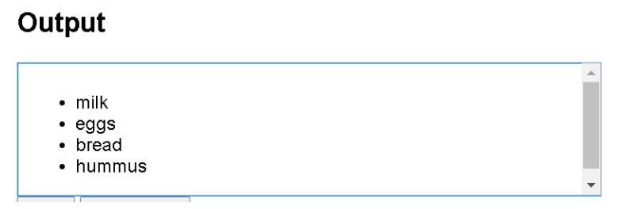

  

- **Ordered**

  `<ol>`태그로 감싸는 것 제외하고 마크업 구조는 순서가 없는 리스트와 동일하다.


#### `<div> and <span>`

- `<span>`

  : inline non-semantic element, which you should only use if you cant think if a better semantic text element to wrap uour element, or you want to add any specific meaning. 

  이 태그 안에 컨텐츠가 없다면 해당 부분은 아무 변화가 없지만, 그 안에 객체가 들어간다면 그 객체의 크기만큼 공간이 할당된다

- `<div>`

  : : block level non-semantic element, which you should only use if you can't think of a better semantic block element to use, or don't want to add any specific meaning. For example, imagine a shopping cart widget that you could choose to pull up at any point during your time on an e-commerce site: 

  division의 약자임. 콘텐츠가 어떠한 의미도 갖고 있지 않음을 의미함. 논리적인 구분을 정의하는 태그이고 각각의 블록을 갖는다. 주로 레이아웃을 잡는 용도! class 속성을 같이 사용한다.


#### `table`

- `<table>`: 테이블을 만드는 태그
- `<th>`: 테이블의 헤더부분을 만드는 태그
- `<tr>`: 테이블의 행을 만드는 태그
- `<td>`: 테이블의 열을 만드는 태그
- `<colspan>`: 가로 합병(열 합병)
- `<rowspan>`: 세로 합병(행 합병)
- 각 열의 의미에 따라 thead, tbody, tfoot 태그로 구분지을 수 있다.


## CSS

> 스타일, 레이아웃 등을 통해 HTML이 사용자에게 어떻게 표시되는지를 지정하는 언어이다!
>
> 사용자에게 문서(HTML)를 표시하는 방법을 지정하는 언어이당

- css 구문은 선택자와 함께 열린다. 스타일을 지정할 html 요소를 선택함. 
- 각 쌍은 우리가 선택한 요소의 속성을 지정하고 속성에 부여할 값을 지정한다.


**선언문**

- 속성(Property)
  
- 사람이 읽을 수 있는 식별자
  
- `{}` 선택자(selector) , 선언 요소는 `속성:값;` 이렇게 되어 있음

- 값(Value)

  - 각 속성에는 값을 부여한다. 값은 어떻게(글꼴을 이걸로, 배경 색을 저걸로) 스타일 기능을 변경할 건지 나타낸다. 

- 정의하는 방법은 세가지 있는데

  - 인라인: HTML 태그의 style 속성에 CSS 코드를 넣는 방법

    - 꾸미는데 한계가 있음. 재사용이 불가능한 단점!

  - 내부 참조: HTML 문서 안의 `<style>과 </style>`안에 CSS 코드를 넣는 방법

    - HTML 문서안의 여러 요소를 한번에 꾸밀 수 있는 장점이 있지만 또 다른 HTML문서에는 적용할 수 없는 단점!! 

  - 외부 참조: 외부 css파일을 head 내 link를 통해 불러오기/ 이게 가장 일반적인 방법이다!! 

    - 연결해줘야하기 때문에 적용을 원하는 html 문서와 연결하는 방법이다. 

    - ```html
      <link rel="stylesheet" href="style.css">
      ```

      


#### CSS Selector 선택자

- html 문서에서 특정한 요소를 선택하여 스타일링 하기 위해서는 반드시 선택자라는 개념이 필요함
- 기초 선택자는 "전체, 타입, 클래스, 아이디, 속성"

```html
<head>
    <style>
    * {
      color: red;
    }
    h2 { 
        color: orange;
    }
    h3,
    h4 { 
      font-size: 10px;
    }
    .green { 
      color: green;
    }
    #purple { 
        color: purple;
    }
    .box > p { 
      font-size: 30px;
    }
    .box p {
      color: blue;
    }
  </style>
```

- `*` : 전체 선택자 / 당연히 전체에 적용하겠다는 뜻임
- `.` : 클래스 선택자 / 클래스를 생성, 클래스를 두개 주고 싶다면 공백을 주고 연달아 적으면 되고 쉼표 적으면 안됨 `<h1 class="green box">`
- `#` : id 선택자 / 문서상에서 유일한 선택자만 명시하기 위해 하는것이고, 다중에서 선택해서 하면 안됨. 오류는 안나지만 안쓰는게 convention
- `>`: 자식선택자/  예를 들어 `.box > p` 이렇게 적으면 box 클래스 바로 안에 있는 p태그(두단계아래는 안되고 바로 그 아래만, 직계자손만 )  그리고 `.box p `이렇게 적으면 클래스 안의 모든 p태그를 바꿔준다.


#### 우선순위

```css
<style>
    p {
      color: orange;
    }
    h2 {
      color: darkviolet !important; #1
    }
    .blue 
      color: blue; 
    }
    .green {
      color: green; 
    }
    #red { #3
      color: red; 
    }
  </style>
</head>
<body>
  <p>1</p>
  <p class="blue">2</p>
  <p class="blue green">3</p> #2
  <p class="green blue">4</p>
  <p id="red" class="blue">5</p> #3
  <h2 id="red" class="blue">6</h2> 
  <p id="red" class="blue" style="color: yellow;">7</p> #우선순위가 인라인이 더 높아서 이건 안바뀌고 색 그대로
  <h2 id="red" class="blue" style="color: yellow;">8</h2>
</body>
```


- #1 : `!important `: 사용시 주의!! 반드시 필요한 경우가 아니면 사용하지 말자! css구문은 흐름대로 아래로 떨어지는데 이건 흐름을 끊어버림. 웬만하면 클래스 선택자로 사용!! 이 h2태그는 important에 의해 violet 색으로 되고, 나머지는 blue
- 우선순위는 "인라인 > id 선택자 > class 선택자> 요소 선택자> 소스코드"
  - 전체 선택자는 요소 선택자에 들어간다. 
- #2 : 클래스가 두개 적용되있다. 그래도  마지막에 적힌 클래스에 의헤 green이 되는게 아님. 위에 적힌 style태그의 마지막에 선언된 green 클래스에 의해 green이 적용되는거임 이거주의! 
- #3 : 5번 선택자 우선순위에서 class보다 id가 높기 때문에 바뀜. id는 링크 이동, 라벨테스트할때 주로 쓰고 지양하는게 좋다고 함. 


### CSS 단위 

**(상대) 크기 단위**

**px**

- 모니터 해상도의 한 화소인 '픽셀'을 기준
- 픽셀의 크기는 변하지 않기 때문에 고정적 단위

**%**

- 백분율 단위
- 가변적인 레이아웃에서 자주 사용함 

**em**

- em은 상속의 영향을 받음, rem은 최상위 요소를 기준으로 결정됨
- 상황에 따라 각기 다른 값을 가질 수 있다.

**rem**

- 최상위 요소인 html을 절대 단위를 기준으로 삼음. 상속의 영향 안받음! 상속에 영향을 받지 않기 때문에 대부분의 경우 `rem`을 많이 사용한다!!

**viewport**

- (스크롤을 내리지 않는 상태에서) 웹 페이즈를 방문한 유저에게 현재 보이는 웹 컨텐츠의 영역
- viewport를 기준으로 한 상대적인 사이즈
- 주로 스마트폰이나 태블릿 디바이스의 화면을 일컫는 용어로 사용됨!! 
- vw, vh


```html
<!DOCTYPE html>
<html lang="en">
<head>
  <meta charset="UTF-8">
  <meta name="viewport" content="width=device-width, initial-scale=1.0">
  <title>Document</title>
  <style>
    .em {
      font-size: 1.5em; 
    }
    .rem {
      font-size: 1.5rem; 
    }
  </style>
  
</head>
<body>
  <ul class="em"> 
    <li class="em">em</li> #1
    <li class="rem">rem</li> #2
    <li>no class</li>
  </ul>
</body>
</html>
```


- #1, #2 모두 사이즈를 갖게 주었지만 실제 출력값은 다름
- #1 : 이게 실제 폰트가 36px로 뜬다. html 기본 폰트는 16px임. 부모에 사이즈가 em으로 설정되어 있음. em을 쓰면 고정이 안될 수 있음. rem을 쓰면 내가 원하는 값이 나옴. em은 부모와 상대적 크기 비교때 사용한다. (`16*1.5*1.5(부모사이즈)`)
- #2 : 이건 24px(`16px*1.5`)


### 색상 단위

- **색상 표현 단위**

  1. 색상 키워드
     - 색상 키워드는 대소문자를 구분하지 않는 식별자로, red, blue, black처럼 특정 색을 나타낸다
  2. RGB 색상
     - 빨강, 초록, 파랑을 통해 특정 색을 표현
     - 16진수 표기법이나 함수형 표기법으로 사용
     - a는 alpha(투명도)가 추가된 것
  3. HSL 색상
     - 색상, 채도, 명도를 통해 특정 색상을 표현
     - a는 alpha(투명도)가 추가된 것


### Box Model

> 웹 디자인은 contents를 담을 box model을 정의하고, CSS 속성을 통해 스타일(배경, 폰트와 텍스트 등)과 위치 및 정렬을 지정하는 것

- 모든 html 요소는 box형태임. 
- 하나의 박스는 네개의 영역으로 되어있음(content/padding/border/margin)


1. Content

   - 글이나 이미지, 비디오 등 요소의 실제 내용

     

2. Padding(안쪽 여백)

   - Border 안쪽의 내부 여백/배경색, 이미지 지정 가능

   

3. Border(테두리 여백)

   

4. Margin(바깥쪽 여백)

   - 테두리 바깥의 외부 여백
   - 배경색 지정 불가


**실제 코드예시로 알아보자~~~**

#### Box model 구성(margin/padding)

- 상하좌우

  ```html
  .margin-1{
  margin:10px;
  }
  ```

  

- 상하/좌우

  ```html
  .margin-2{
  margin:10px 20px;
  }
  ```

  

- 상/좌우/하

  ```html
  .margin-3{
  margin:10px 20px 30px;
  }
  ```

  

- 상/우/하/좌

  ```html
  .margin-4{
  margin:10px 20px 30px 40px;
  }
  ```


```html
<head>
  <style>
    .bowl {
      width: 500px;
      border-width: 2px;
      border-style: dashed;
      border-color: black;
      margin-top: 10px ; #1
      margin-bottom: 30px; 
    }
    .box2 {
      width: 500px;
      border: 2px solid red;
      margin: 0 auto;  #2
    }
  </style>
</head>
```

- #1: 만약에 위쪽에 마진을 주면 당연히 아래로 움직인다.
- #2 : 가운데 정렬이다!! 상하에 margin 0이고, auto는 좌우정렬! 그래서 가운데정렬


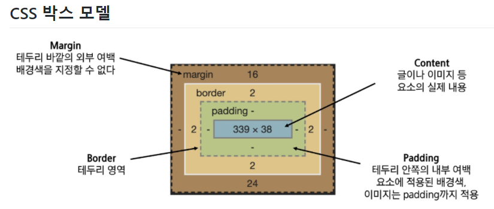


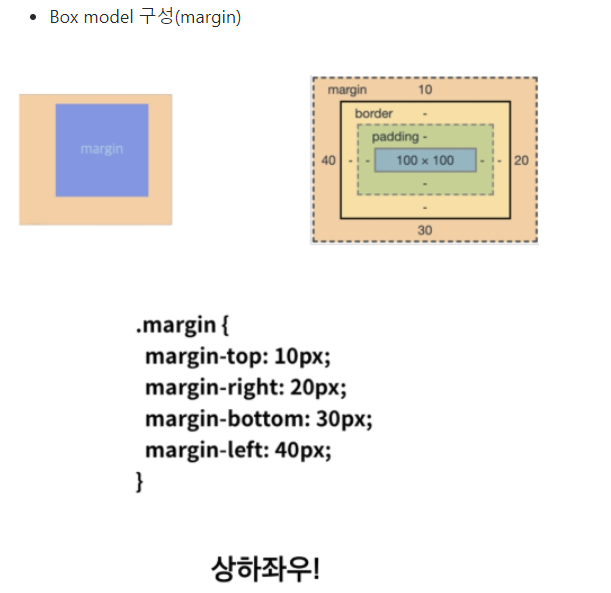


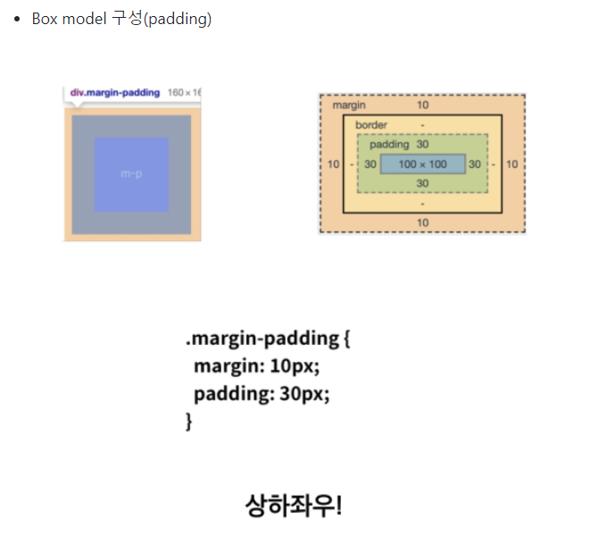


#### box - sizing

- 기본적으로 모든 요소의 box-sizing은 content-box

  - padding을 제외하 순수 contents 영역만들 box로 설정

- 일반적으로 영역을 볼 때는 border까지의 너비를 100px 보는 것을 원하는 경우에는?

  `box-sizing`을 `border-box`로 설정!!

  

#### Display

display 속성은 요소를 어떻게 표시할지를 선택하고, visibility 속성은 요소를 보일지 말지 결정하는 속성이다!! 

속성은 4개가 있는데 none은 보이지 않음 / block은 블록박스/ inline은 인라인 박스/ inline-block은 block과 inline 중간 형태!!

- display :block
  - 이건 요소를 block 요소처럼 표시한다!! 따라서 요소 앞 뒤로 줄바꿈 된다!! 
  - 기본적으로 **가로 영역을 모두 채우며**, block요소 다음에 등장하는 태그는 줄바꿈이 된것처럼 보인다. width, height 속성을 지정할 수 있다. 
  - 화면 크기 전체의 가로폭을 차지함
  - 블록 레벨 요소 안에 인라인 레벨 요소가 들어갈 수 있음
  - ex) div / ul, ol, li/ p/ hr/ form 등

- display : inline
  - span / a / img / input, label / b , em, i, strong 태그 등이 이에 해당한다.
  - 기본값임. 요소를 inline처럼 표시한다. 따라서 앞뒤로 줄바꿈 되지 않는다.
  - 문서에서 볼드, 이탤릭 그랒나 문장에 효과를 주기 위해 존재하는 단위라고 할 수 있음!! 
  - 문서에서 특정 부분에 색상을 입힌다고 다음에 나오는 글이 줄바꿈 되지 않듯이 `inline` 요소 뒤에 나오는 태그 또한 줄바꿈 되지 않고 바로 오른쪽에 표시된다!! 
- display : none
  - 박스가 생성되지 않는다. 따라서 공간을 차지하지도 않는다
- display  : inline-block 
  - 요소는 inline인데, 내부는 block처럼 표시한다. 즉, 박스 모양이 inline 처럼 옆으로 늘어섬


| 속성에 따른 수평 정렬 | block                               | inline            |
| --------------------- | ----------------------------------- | ----------------- |
| 왼쪽 정렬             | margin-right:auto;                  | text-align:left;  |
| 오른쪽 정렬           | margin-left:auto;                   | text-align:right; |
| 가운데 정렬           | margin-right:auto;margin-left:auto; | text-align:center |


## CSS Position (중요)

문서 상에서 요소를 배치하는 방법을 지정함. 

**위치 지정 요소**

- position의 계산값이 relative, absolute, fixed, sticky 중 하나인 요소
- 값이 static이 아닌 모든 요소

**상대 위치 지정 요소**

- position의 계산값이 relative인 요소
- top과 bottom은 원래 위치에서의 세로축 거리를, left와 right는 원래 위치에서의 가로축 거리를 지정
- relative : static 위치를 기준으로 이동(상대 위치)
  - 설정된 조상의 position이 default값이라면
  - 이전의 기존 위치도 기억하고 있음, 옮겨져도 다른 것들의 위치는 바뀌지 않음

**절대 위치 지정 요소**

- absolute : static이 아닌 가장 가까이 있는 부모/조상 요소를 기준으로 이동(절대 위치)
  - 설정된 조상의 position이 default값이 아니라 바로 위 조상을 기준으로!
  - 이전 기존 위치가 없어짐, 옮겨지면 다른 것들의 위치도 바뀜
  - body안에 있는 것처럼 보이지만 따로 떨어진 존재


예시로 보자!!! 

ref : https://aboooks.tistory.com/82

**postion: static**부터 보면, float 설정하지 않은 div는 아래처럼 정렬된다. 주의할 것은 html 문서 body에 margin과 padding을 각각 0으로 지정하지 않으면 아래 화면처럼 공간(파란 부분)이 생긴다. 뒤에서 다룰 relative도 마찬가지다!! 

```html


<html>
<head>
<style type="text/css">
#static1
{
width:100px;
height:100px;
background-color:green;
position: static;
}

#static2
{
width:100px;
height:100px;
background-color:yellow;
position: static;
}
#static3
{
width:100px;
height:100px;
background-color:red;
position: static;
}
</style>
</head>

<body>
<div id="static1">
1. static
</div>
<div id="static2">
2. static
</div>
<div id="static3">
3. static
</div>
</body>
</html>

```

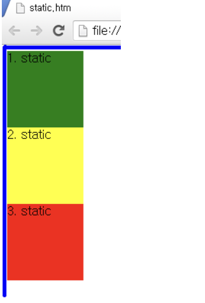


다음은 **position:relative** !! 이건 위치계산을 할때 static의 원래 위치부터 계산한다. 위 static 실행화면을 참조해야 이해가 간다. 2번 노란색 사각형은 원래 위치에서 위 0px, 왼쪽 100px 이동하고 3번 빨간 사각형은 원래의 위치에서 위 0px, 그리고 왼쪽 200px으로 설정해서 아래처럼 그림이 나오게 된다.

```html
#생략
<style type="text/css">
#static
{
width:100px;
height:100px;
background-color:green;
}

#relative2
{
width:100px;
height:100px;
background-color:yellow;
position:relative;
top:0px;
left:100px;
}
#relative3
{
width:100px;
height:100px;
background-color:red;
position:relative;
top:0px;
left:200px;
}
</style>

#후략 
```

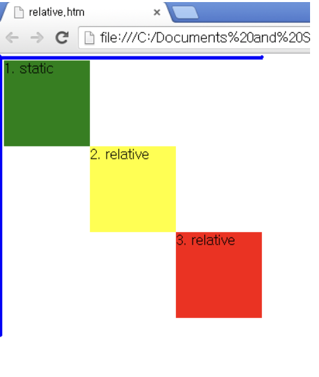


그 다음은 **position:absolute**

이건 relative와 달리 원래 위치와 상관없이 위치를 지정할 수 있다!! 하지만 가장 가까운 상위 요소를 기준으로 (이때 static은 제외) 위치가 결정된다. 상위 요소가 없으면 위치는 html기준으로 설정됨!!

1번은 static, 2번과 3번은 absolute인데 absolute는 static이나 relative와 다르게 바깥 쪽에 공간이 생기지 않는다. 

```html
<style type="text/css">
#static
{
width:100px;
height:100px;
background-color:green;
}

#absolute2
{
width:100px;
height:100px;
background-color:yellow;
position:absolute;
top: 0px;
left:100px;
}
#absolute3
{
width:100px;
height:100px;
background-color:red;
position:absolute;
top: 0px;
left: 200px;
}
</style>
```

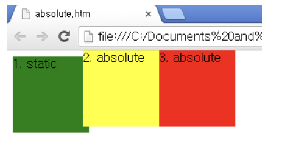


바로 위에서 absolute는 상위요소를 기준으로 위치가 결정된다고 했다. 그러면 예를 보기 위해서 **상위에 div를 만들고, 그 안에 absolute을 2개 넣어**보자!  실행하면 relative(녹색) 안에 설정된 absolute는 녹색 부분으로부터 시작해서 위치가 결정됨을 알 수 있다!! 

```html
<style type="text/css">
#relative
{
width:300px;
height:300px;
background-color:green;
position: relative;
top: 100px;
left: 100px;
}

#absolute2
{
width:100px;
height:100px;
background-color:yellow;
position:absolute;
top:0px;
left:100px;
}
#absolute3
{
width:100px;
height:100px;
background-color:red;
position:absolute;
top: 0px;
left: 200px;
}
</style>
</head>

<body>
<div id="relative">
<div id="absolute2">
2. absolute
</div>
<div id="absolute3">
3. absolute
</div>
</div>
</body>
</html>

```


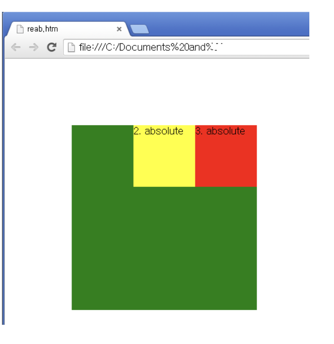


## CSS layout

> 웹 페이지에 포함하는 요소를 취합하고 그것들이 어디에 놓일지 제어하는 기술
>
> display, position, float, flexbox, gird,,


### Float

> 한 요소가 정상흐름으로부터 빠져 나와 텍스트 및 인라인 요소가 그 주위를 감싸 자기 컨테이너의 좌, 우측을 따라 배치되어야 함을 지정한다.
>
> 속성으로는 none, left, right!! left는 당연히 요소를 왼쪽으로 띄우고, right는 오른쪽으로 띄우게!


**clearfix**

- float 요소와 다른 텍스트가 아닌 block 요소간의 레이아웃 깨짐을 막기 위해 다음과 같이 쓴다.


**floatclear 방법**

- float를 했을때 위로 떠서 그 아래공간으로 다른 요소들이 치고 들어가서 겹쳐질 수 있음
- 해결방법으로는 float로 띄운 것 뒤에 가상의 박스를 둔다고 생각하자
- float는 인라인 요소, 텍스트 요소를 감싸는 것, 그래서 그렇지 않은 것들이 겹쳐질 수 있다.
- 가상 높이를 만들어 부모가 만든 높이를 만들어준다!!
  1. 항상 float 속성을 적용한 부모 요소에 적용한다
  2. 스타일 이름은 `.clearfix`라고 짓는다
  3. `header`태그 다음에 가상요소(`::after`)로 내용이 빈 블럭을 만들고
  4. 이 가상요소는 `float left,right(both)`를 초기화한다(무시함=띄운것을 무시한다)
  5. 내용이 빈 컨탠트를 만듦, 
  6. 다른 요소가 올라오지 못하게 블락으로 설정
  7. 오른쪽 왼쪽 둘다 오지못하게 막음

```html
<style>
    .left {
      float: left;
    }
    .clearfix::after {
      content: "";
      display: block;
      clear: both;
    }
</style>
```

```html
<body>
 
  <header class="clearfix">
    <div class="box1 left">div</div>
  </header>
  <div class="box2">div</div>
</body>
```

- clearfix를 적용하면 파란색박스가 올라가지 못함. 뒤에 가상의 블럭이 막고 있음. (처음에는 빨간 박스가 띄워지면서 뒤로 파란박스가 깔림. 그래서 위처럼 clearfix를 설정한거임)


### Flexbox

flexbox라고 불리는 flexible box module을 flexbox 인터페이스 내의 아이템 간 공간 배분과 강력한 정렬기능을 제공하기 위한 1차원 레이아웃 모델로 설계되었다!!

웹 페이지의 컨테이너에 아이템의 폭과 높이 또는 순서를 변경해서 웹페이지의 사용 가능한 공간을 최대한 채우고 이를 디바이스 종류에 따라 유연하게 반영하도록 하는 개념이다!

- css flexible box layout
  - 1차원 레이아웃을 만드는 것임
  - 요소와 축 두가지만 기억하자


**핵심 개념**

- 요소
  - flex container
  - flex items
- 축
  - main axis(메인축)
  - cross axis(교차축)

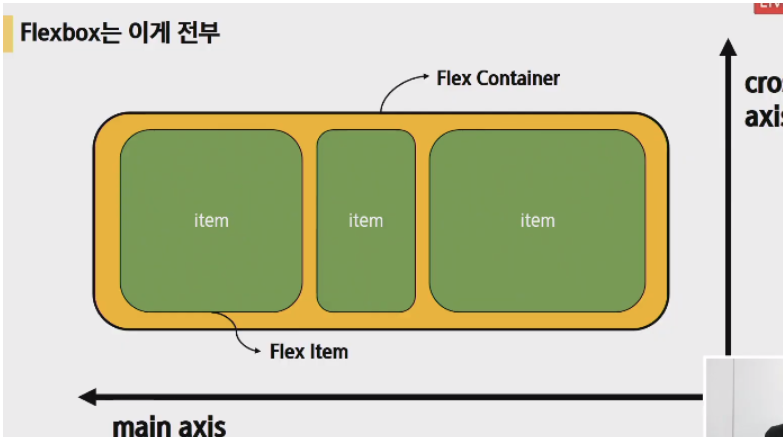

- flex container가 부모고, flex item이 자식이다. 동시에 움직이지 않는다. main 축으로 어떻게 정렬할지, cross축으로 어떻게 정렬할지만 결정한다.
- 부모 요소에 `display:flex` 또는 `inline flex`를 작성하는 것부터 시작한다.

- 속성으로는
  - 속성
    - flex-direction(배치 방향 설정)
    - justify-content(메인 축 방향 정렬),
    - align-items(한 줄), align-content(여러 줄), align-self(개별요소) (교차 축 방향 정렬)
    - flex-wrap, flex-flow, flex-grow


**flex container**

- flexbox 레이아웃을 형성하는 가장 기본적인 모델
- flexbox가 놓여있는 영역
- flex 컨테이너를 생성하려면 영역 내의 컨테이너 요소의 display 값을 flex 혹은 inline-flex로 지정
- flex 컨테이너를 선언시 아래와 같이 기본 값이 지정
  - item은 행으로 나열
  - item은 주축의 시작 선에서 시작
  - item은 교차축의 크기를 채우기 위해 늘어남
  - `flex-wrap` 속성은 `nowrap`으로 지정

```
Tip !

justify - main axis
align - cross axis

content - 여러 줄
items - 한 줄
self - 개별 요소
```


**속성값 포인트를 외우기**

- content
  - 여러줄
  - justify는 content만 있음
- items
  - 한줄
- self
  - 하나를 선택해서 움직임
  - flexitem개별 요소
- justify-content
  - 메인축 기준
  - 여러 줄 정렬
- align-items
  - 교차축 기준
  - 한 줄 정렬
- align-self
  - 교차축 기준
  - 선택한 요소 하나 정렬


**기타**

- flex-wrap, flex-flow, flex-grow, order

- flex-wrap: 부모가 정한 너비를 넘치지 않게 한다 넘으면 아래로 떨어짐.
- flex-flow: column wrap;

- **flexgrow**

  - 1:2:3 아니고, 남은 여백을 쪼개서 나눈거임 1+2+3=6으로 나눈것에서 1개를 주고 2개를 주고 3개를 줌
  - 상대적 비율 아님
  - 남은여백을 어떻게 분배할것인가, 누구한테 얼만큼??음수는 사용안됨

  ```html
  <style>
      /* 한 자식한테 특정해서 self를 지정해줌 */
      .item1 {
          flex-grow: 1;
      }
      .item2 {   
          flex-grow: 2;
      }
      .item3 {
          flex-grow: 3;
      }
  </style>
  ```

  

  - `flex-grow: 1;`
    - 비율을 뜻하는게 아니라 flexgrow준것들을 다 더한것중 1개
  - `flex-grow: 2;`
    - 비율을 뜻하는게 아니라 flexgrow준것들을 다 더한것중 2개
  - `flex-grow: 3;`
    - 비율을 뜻하는게 아니라 flexgrow준것들을 다 더한것중 3개

  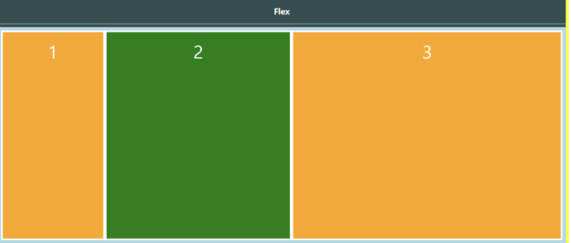


- **order**

  ```html
  <style>
  	.item1 {
        order: 0;
      }
      .item2 {
        order: 1;
      }
      .item3 {
        order: -1;
      }
  </style>
  ```

  

  - `order:0` 기본값이 0이다
  - `order:1`만약에 item1과 3이 0일때, item2에 1을 주면 제일 뒤로 감
  - `order:-1` 제일 앞으로 간다


**이제 예시를 보자!!***

- 부모에게 flex를 주기 전??

  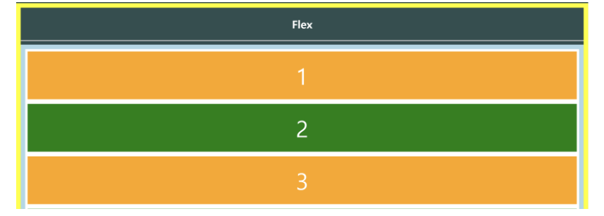


- 부모에게 display flex를 주고 난후
- 메인축 기준(row)으로 기본흐름이 왼쪽부터 오른쪽
- item은 주축에서 시작하고 높이를 다로 주지 않았지만 교차축 기준으로 나머지 여백이 다 채워짐

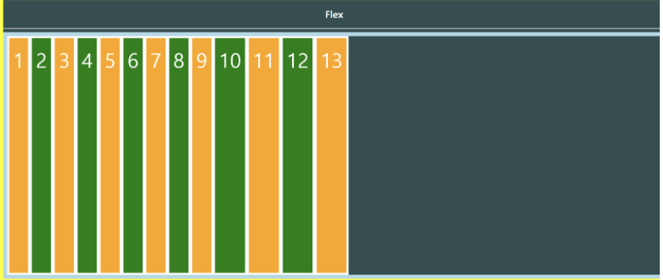


**부모 container에 flex 선언시**

1. item은 행으로 나열된다
2. item은 메인축의 시작선에서 시작
3. item은 크로스축의 크기를 채우기 위해 늘어난다.


**flex에 적용하는 속성**

- 배치 방향 설정(메인축방향 변경: 좌우-> 상하, 상하->좌우 이런식으로 메인축의 수직이 교차축!!


**배치방향 정렬**

- **flex-direction**(쌓이는 방향 설정/ 이 속성은 플렉스 컨테이너 안에서  플렉스 요소가 배치될 방향을 설정한다!! 이 속성은 아래와 같은 속성값을 가질 수 있따!!)
  - main-axis 방향만 바뀜 (크로스축은 그냥 수직!)
  - flexbox는 단방향 레이아웃이기 때문
  - 왼쪽->오른쪽이 기본값
  - row(default) : 기본 설정으로, 왼쪽에서 오른쪽으로, 그리고 위족에서 아래쪽으로 배치된다!! 
  - row-reverse는 반대 : 만약에 direction 속성값이 (left to right)면, 플렉스 요소는 반대로 오른쪽에서 왼쪽으로 배치된다!! 
  - column은 메인축이 위에서 아래로 흐르는 형태로 바뀜, 만약에 쓰기 방식이 수평이면 플렉스 요소는 수직방향으로 위쪽에서 아래쪽으로 배치된다. 
  - column-reverse : 플렉스 요소는 수직 방향으로 아래에서 위로 배치된다. 

```html
<style>
      /* 부모한테 display flex를 주는 것이 시작 */
    .flex-container {
      display: flex;
/* 부모가 정한 너비를 넘치지 않게함, 넘으면 떨어뜨림 */
      flex-wrap: wrap;
      /* 기본값  row */
      flex-direction: row;
      /* 쌓이는 방향이 바뀜 321 */
      flex-direction: row-reverse;
      /* 메인이 y축으로 바뀜 */
      flex-direction: column;
      /* 아래에서 위로 쌓아 올라가는 모습 */
      flex-direction: column-reverse;
      /* flex-direction과 flex-wrap의 약어 */
      flex-flow: column wrap;
</style>
```

- 기본값: `flex-direction:row`

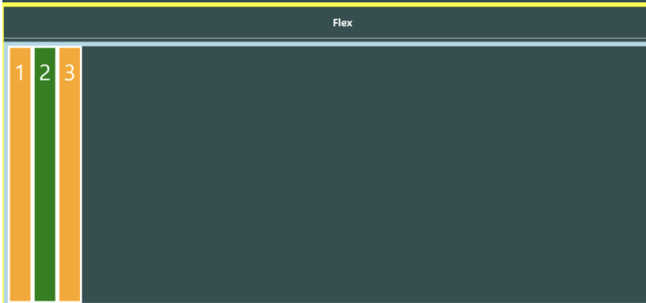


- flex-direction: row-reverse (쌓이는 방향이 바뀜)

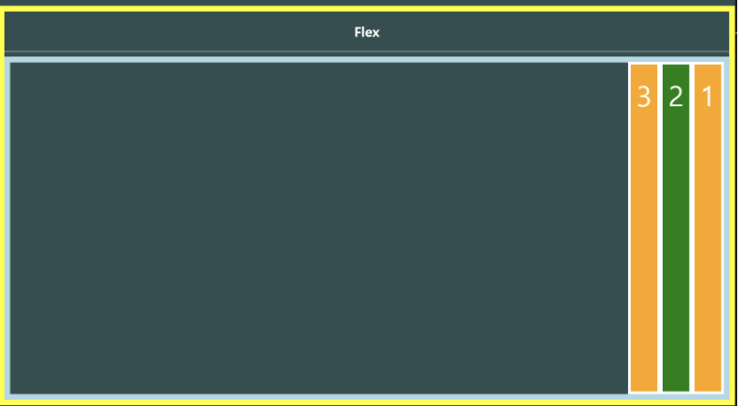


- `flex-direction:column;`

  메인축이 y축으로 바뀜

  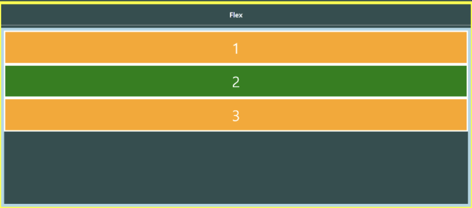


- flex-direction: column-reverse;

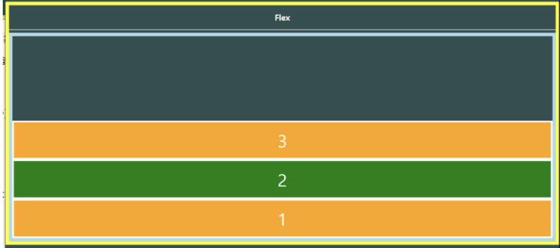


**메인축 방향 정렬**

- justify-content

> justify-content 속성은 플렉스 요소의 수평 방향 정렬 방식을 설정한다. 
>
> justify-content  : flex-start: 기본설정으로 플렉스 요소는 플렉스 컨테이너 앞쪽에서부터 배치된다. 
>
> justify-content  : flex-end: 플렉소 요소는 플렉스 컨테이너의 뒤쪽에서부터 배치된다.
>
> justify-content : center : 플렉스 요소는 플렉스 컨테이너의 가운데에서부터 배치됩니다.
>
> justify-content : space-between : 플렉스 요소는 요소들 사이에만 여유 공간을 두고 배치됩니다.
>
> justify-content : space-around : 플렉스 요소는 앞, 뒤, 그리고 요소들 사이에도 모두 여유 공간을 두고 배치됩니다.

```html
<style>
	/* 정렬시작 */
    /* 메인축 정렬 */
    /* 이게 기본값 */
    justify-content: flex-start;
    /* 흐름의 방향은 바뀌지 않고 정렬만 바꼈기 때문에 순서는 그대로, 우측정렬됨 */
    justify-content: flex-end;
    /* 메인축 기준으로 가운데로 옴 */
    justify-content: center;
    /* 처음과 끝을 각 끝으로 보내고 가운데 것들을 균등하게 나눔 */
    justify-content: space-between;
    /* 균등 좌우 정렬 내부요소의 여백이 외부요소의 여백의 2배 */
    justify-content: space-around;
    /* 균등정렬 균등하게 띄워져 있음 내부요소 여백과 외부요소 여백이 같음*/
    justify-content: space-evenly;

</style>
```


- `justify-content: flex-start;`
  - 이게 기본값

[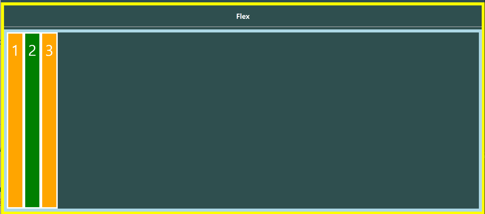](https://github.com/irissooa/irissooa-TIL/blob/master/web/0812_web.assets/image-20200812161637115.png)


- justify-content: flex-end

  - 흐름의 방향은 바뀌지 않고 정렬만 바뀜. 순서는 그대로, 우측정렬된다

  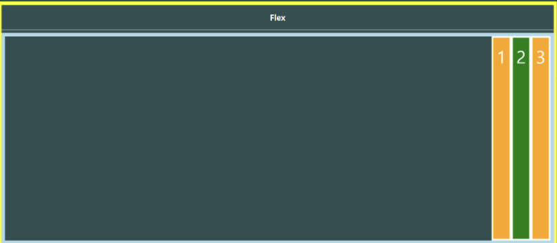


- `justify-content:center`

  메인축 기준으로 가운데로 옴

[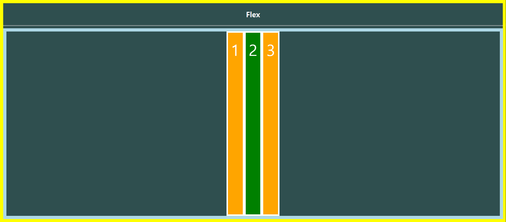](https://github.com/irissooa/irissooa-TIL/blob/master/web/0812_web.assets/image-20200812162059152.png)


- ```
  justify-content: space-between;
  ```

  - 처음과 끝을 각 끝으로 보내고 가운데 것들을 균등하게 나눔

[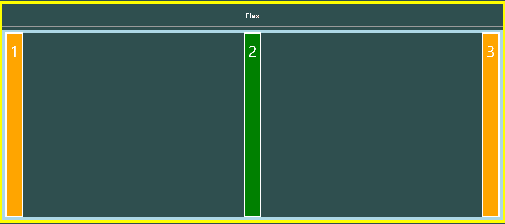](https://github.com/irissooa/irissooa-TIL/blob/master/web/0812_web.assets/image-20200812162231682.png)


- `justify-content: space-around;`

  균등 좌우 정렬/ 내부요소의 여백이 외부요소의 여백의 2배/여백 1:2:2:1

  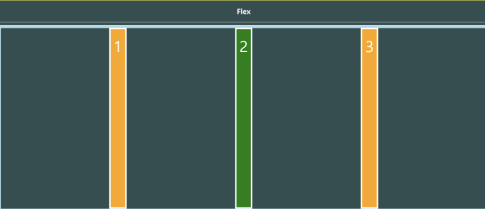

  


##### 교차축 방향 정렬(align이 붙으면 교차축)

- alilgn-items, align-self, align-content
- align-content: 여러 줄 사이의 간격을 지정할 수 있다!!

**align-items**:이 속성은 플렉스 요소의 수직 방향 정렬 방식을 설정한다. 이 속성은 한줄만을 가지는 플렉스 박스에서는 효과가 없으며, 두 줄 이상을 가지는 플렉스 박스에서만 효과가 있다. 

> align-items : flex-start 플렉스 요소는 플렉스 컨테이너의 위쪽에 배치됨
>
> align-items : flex-end 플렉스 요소는 플렉스 컨테이너 아래쪽에 배치된다
>
> align-itmes: center; 플렉스 요소는 플렉스 컨테이너의 가운데에 배치됨
>
> align-itmes : baseline : 플렉스 요소는 플렉스 컨테이너의 기준선(baseline)에 배치됩니다.
>
> 

```
<style>
/* 크로스축 정렬(현재 y축) */
    /* 원래 div 크기대로 줄어듬 위쪽이 스타트기 때문에 붙어있음*/
    align-items: flex-start;
    /* 크로스축 기준 아래 */
    align-items: flex-end;
    /* 상하기준으로 중간 */
    align-items: center;
    /* 글자들의 크기가 달라져야 바뀜 (baseline 구글 사진 찾기)*/
    align-items: baseline;
</style>
```

- ```
  align-items: flex-start;
  ```

  - 여러 줄들을 컨테이너의 꼭대기에 정렬
  - 원래 div 크기대로 줄어듬 위쪽이 스타트기 때문에 붙어있음

[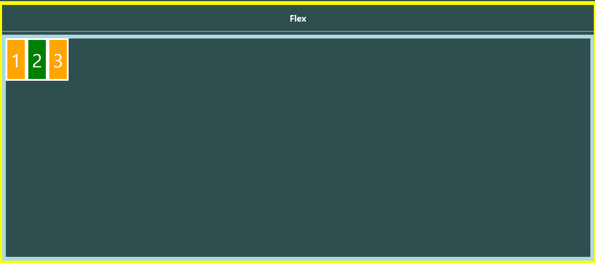](https://github.com/irissooa/irissooa-TIL/blob/master/web/0812_web.assets/image-20200812162710063.png)

- ```
  align-items: flex-end;
  ```

  - 여러 줄들을 컨테이너의 바닥에 정렬
  - 크로스축 기준 아래

[](https://github.com/irissooa/irissooa-TIL/blob/master/web/0812_web.assets/image-20200812162827429.png)

- ```
  align-items: center;
  ```

  - 여러 줄들을 세로선 상의 가운데에 정렬
  - 상하기준으로 중간

[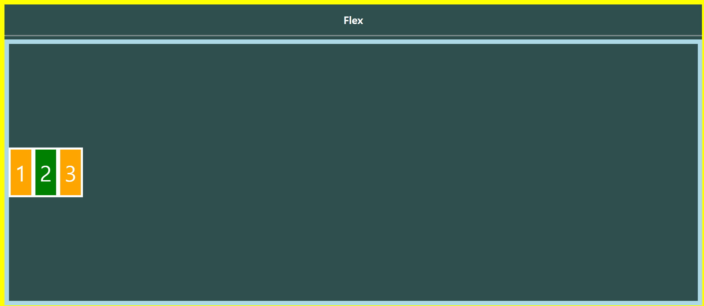](https://github.com/irissooa/irissooa-TIL/blob/master/web/0812_web.assets/image-20200812162946712.png)

- `align-items: baseline;`
  - 글자들의 크기가 달라져야 바뀜 (baseline 구글 사진 찾기)
- `space-between`
  - 여러 줄들 사이에 동일한 간격을 둠
- `space-around`
  - 여러 줄들 주위에 동일한 간격을 둠
- `stretch`
  - 여러 줄들을 컨테이너에 맞도록 늘림


**forggy 마지막 문제를 풀어보자!**

flex-wrap: wrap-reverse;
flex-direction: column-reverse;
justify-content: center;
align-content: space-between; 

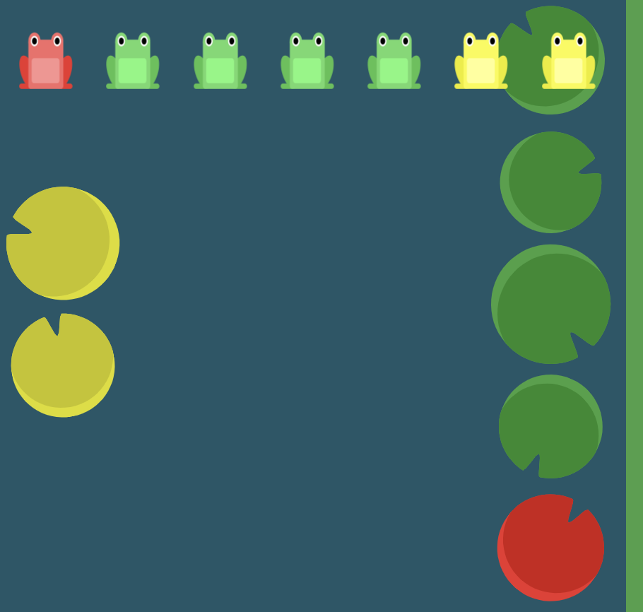

이렇게 되있는데 어떻게 색깔별로 개구리를 정렬시킬 수 있을까??

```html
#pond {
	display:flex;

	flex-wrap: wrap;
	flex-direction: column-reverse #1
	justify-content: center; #2
	align-content: space-between;

}
```

#1 . 첫번째로 메인축을 y축으로 바꿈! 그리고 아래부터 위로 쌓아ㅌ

#2. 여기서 메인축은 세로축임

이거 약간 순서를 모르겠다. 처음부터 어떻게 생각해야하는지 지금은 해보다가 보면 되는 느낌


## Grid system

- 반드시 기억해야할 2가지
- 12개의 column
- 12는 약수가 가장 많다
- 1,2,3,4,6,12 비율을 나눌때 다양하게 레이아웃을 나눌 수 있음
- 5개의 grid breakpoints
- class="row" -> display :flex가 선언이 돼있음
- google news는 정돈이 잘돼있음, 시멘틱태그, 그리드시스템 잘씀
- 12개의 column으로 나뉘어져 있음

**offset**

- `offset-*` 은 지정한 만큼의 column 공간을 무시하고 다음 공간부터 컨텐츠를 적용한다.

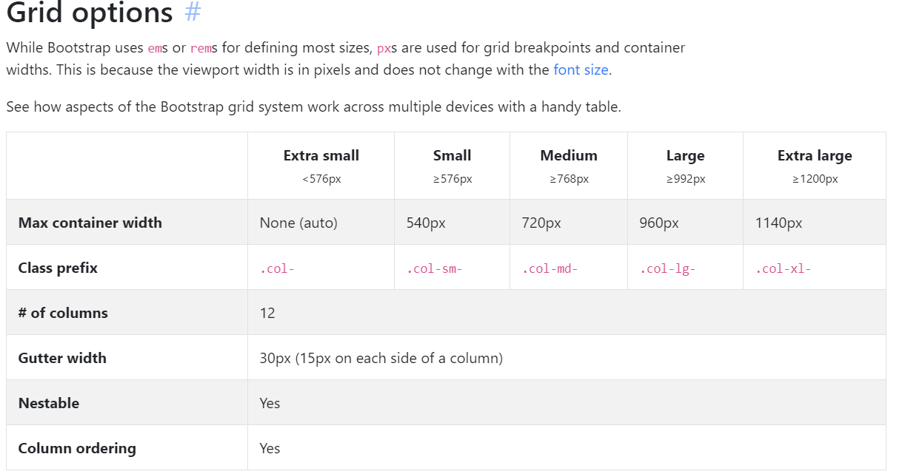