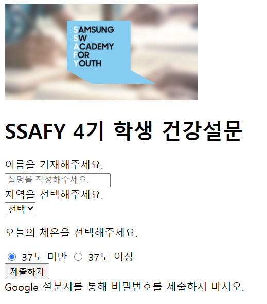

### 0810 html




```html
<!DOCTYPE html>
<html>
<head>
  <meta charset="UTF-8">
  <title>my first markup</title>
</head>
<body>

  <header>
    <a href="https://www.ssafy.com">
      
    </a>
    <h1>SSAFY 4기 학생 건강설문</h1>
  </header>
    
  <section>
    
    #1
    <form action="#" method="GET">
      <div>
        <label for="name">이름을 기재해주세요.</label><br> 
        <input type="text" id="name" placeholder="실명을 작성해주세요." autofocus>
      </div>
      
        
      #2
      <div>
        <label for="region">지역을 선택해주세요.</label><br>
        <select name='region' id="region" required> 
          <option value="">선택</option> 
          <option value="서울" disabled>서울</option>
          <option value="대전">대전</option>
          <option value="광주">광주</option>
          <option value="구미">구미</option>
        </select>
      </div>
      
        
        
      #3
      <div>
        <p>오늘의 체온을 선택해주세요.</p>
        <input type="radio" name="body-heat" id="normal" value="normal" checked>
        <label for="normal">37도 미만</label>
        <input type="radio" name="body-heat" id="warning" value="warning">
        <label for="warning">37도 이상</label>
      </div>

      <input type="submit" value="제출하기">
    </form>
  </section>

  <footer>
    Google 설문지를 통해 비밀번호를 제출하지 마시오.
  </footer>
</body>
</html>
```


#1 : label의 for 값과 양식의 id값이 같으면 연결된다. 라벨값을 누르면 양식에 입력될 수 있도록 커서가 깜빡거리게 된다!!

#2 :

- required 속성값은 폼 데이터가 서버로 제출되기 전에 사용자가 반드시 드롭다운 리스트의 값을 선택해야 함을 명시한다.
- name값은 쉽게 생각하면 키 값으로 생각하면 된다(자세한건 webquiz파일에 있음). name값은 키값으로 사용되서 region=value이런식으로 가게 됨. 그래서 하나만 선택할 수 있는거야
- 그리고 value값은 폼 데이터가 서버로 제출되는 값이다!! 설문조사를 받는 사람은 value값을 갖게 됨


### 0810 CSS

**[00_selector.html]**

```html
#(전략)

  <style>
    * {
      color: red;
    }

    h2 {
      color: orange;
    }

    h3, 
    h4 {
      font-size: 10px;
    }

    .green {
      color: green;
    }

    #purple {
      color: purple;
    }


    #1
    .box > p { 
      font-size: 30px; 
    }
    
    .box p {
      color: blue;
    }
  </style>
</head>
<body>
  <h1 class="green">SSAFY</h1>
  <h2>선택자 연습</h2>
  <div class="green box">
    box content
    <div>
      
      <p>지역 목록</p> #2
      <ul>
        <li>서울</li>
        <li id="purple">대전</li>
        <li>광주</li>
        <li>구미</li>
      </ul>
    </div>
    #3
    <p>Lorem ipsum dolor, sit amet consectetur adipisicing elit. Rem, optio.</p>
  </div>
  <h3>Hello</h3>
  <h4>CSS</h4>
</body>
</html>

```

#1 : box의 직계자손만 이 클래스가 적용된다는 뜻이다. box의 첫번째 줄들여쓰기 된 것들만 해당됨. 바로 밑에 있다고 직계자손이라고 생각하지 말자!!!

#2 : 이건 `.box > p`클래스의 적용을 받지 않는다. 왜냐면 두 단계 안으로 들어옴. 직계자손이 아님. 그래서 자손에 해당이 되지 않기 때문에 30px이 적용이 안됨

#3 : 얘가 box의 직계자손이다!! 그래서 얘가 30px이 적용되고, `.box p `에 의해서 블루 컬러 폰트로도 적용이 된다!!


**[03_em_rem]**

```html
<!DOCTYPE html>
<html lang="en">
<head>
  <meta charset="UTF-8">
  <meta name="viewport" content="width=device-width, initial-scale=1.0">
  <title>Document</title>
  <style>
    .em {
      font-size: 1.5em;
    }

    .rem {
      font-size: 1.5rem;
    }
  </style>
</head>
<body>
  <ul class="em"> 
    <li class="em">em</li> #1
    <li class="rem">rem</li> #2
    <li>no class</li>
  </ul>
</body>
</html>
```


#1 : em이 상대적인거임. 부모의 클래스를 상속받음. html기본 폰트가 16px이기 때문에 `16px*1.5em*1.5em` . em을 쓰면 고정이 안될 수 있음

#2 : rem은 절대적인 거니까 그냥 `16px*1.5`


**[04_box_model.html]**

```html
<!DOCTYPE html>
<html lang="en">
<head>
  <meta charset="UTF-8">
  <meta name="viewport" content="width=device-width, initial-scale=1.0">
  <title>Document</title>
  <style>
    .box1 {
      width: 500px;
      border-width: 2px;
      border-style: dashed;
      border-color: black;
      margin-top: 10px;
      margin-bottom: 30px;
      padding-top: 30px;
    }

    .box2 {
      width: 500px;
      border: 2px solid red;
      margin: 0 auto;
    }
  </style>
</head>
<body>
  <div class="box1">div</div>
  <div class="box2">div</div>
</body>
</html>

```

- margin-bottom이 30px이라는게 border부터 30px이 주어져있다는 것이다. 


**[05_box_sizing]**

```html
<!DOCTYPE html>
<html lang="en">
<head>
  <meta charset="UTF-8">
  <meta name="viewport" content="width=device-width, initial-scale=1.0">
  <title>Document</title>
  <style>
    .box {
      width: 100px;
      margin: 10px auto;
      padding: 20px;
      border: 1px solid black;
      background-color: blueviolet;
      color: white;
      text-align: center;
    }

    #1
    .box-sizing {
      box-sizing: border-box;
    }
  </style>
</head>
<body>
  <div class="box">div</div>
  <div class="box box-sizing">div</div>
</body>
</html>

```


#1 : border-sizing 은 border까지를 100px로 맞춰주는 것임. 첫번째 box 클래스만 적용시킨 div는 아래보다 당연히 크다


**[06_display.html]**

```html
  <style>
    div {
      width: 100px;
      height: 100px;
      border: 2px solid black;
      background-color: crimson;
      color: white;
    }

    .none {
      display: none;
    }

    .hidden {
      visibility: hidden;
    }

    span {
      display: inline-block;
      width: 100px;
    }
  </style>
</head>
<body>
  <h1>나는 block입니다.</h1>
  <div>block</div>
  <p>나는 <span>inline</span>속성입니다.</p>
  <h2>display none VS visibility hidden</h2>
  <div>1</div>
  <div class="none">2</div>
  <div class="hidden">3</div>
  <div>4</div>
</body>
</html>
```


`display: none`


`visibility: hidden`


`display: inline-block`


이거는 그 다음꺼 하고 다시 채워넣자~~~~

