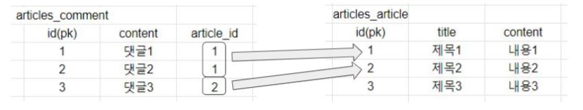

## 1:N 관계

### 1. 기본 용어 정리

#### (1) `ForeignKey`(참조키, 외래키)

- 개념
  - 외래 키는 참조하는 테이블에서 1개의 키, 참조하는 측의 변수는 참조되는 측의 테이블의 키를 가리킨다
  - 하나의 다른 테이블의 기본 키 필드를 가리키는 데이터의 참조 무결성을 하기 위해 사용된다

- 특징
  - 외래 키의 값으로는 부모 테이블에 존재하는 키의 값만 넣을 수 있다.
  - 외래 키를 사용하여 부모 테이블의 유일한 값을 참조한다.


#### (2) on_delete (models.py에서 models.ForeignKey의 필수 속성이다)

- 개념
  - ForeginKey의 필수 인자이며, 참조하고 있는 부모 객체가 사라졌을 때 어떻게 처리할 것인지를 정의

- 속성
  - `CASCADE`: 부모 객체가 삭제 됐을때 이를 참조하는 객체도 삭제한다
  - `PROTECT`: 참조가 되어 있는 경우 오류가 발생한다
  - `SET_NULL`: 부모객체가 삭제 됐을때 참조되는 모든 값을 NULL로 치호나한다.(db 상에 디폴트 조건 값이 있어야 한다)
  - `SET`: 특정 함수를 호출
  - `DO_NOTHING`: 아무것도 하지 않음


#### (3) Relationship Fields

- ForeignKey - 1 : N 관계에서 사용
- ManyToManyField - M : N 관계에서 성립
- OneToOneField - 1 : 1 관계에서 성립 (ex. 내 프로필 페이지 / 잘 사용하지 않는 관계)


#### (4) Meta data

- class Meta 와 같이 선언하여 모델에 대한 모델-레벨의 메타데이터를 선언할 수 있다.
- 유용한 기능들 중 하나는 쿼리할 때 반환되는 기본 레코드 순서를 제어할 수 있다.


### 2. 1:N 관계

`models.py`

```python
class Comment(models.Model):
    article=models.ForeignKey(Article, on_delete=models.CASCADE)
    content=models.CharField(max_length=200)
    created_at = models.DateTimeField(auto_now_add=True)
    updated_at = models.DateTimeField(auto_now=True)
    
    class Meta:
        ordering = ['-pk'] # 이렇게 model에서 선언하면 views.py에서 ordey_by('-pk') 안 쓰고 .all()로 가져와도 역순으로 출력할 수 있다.

    def __str__(self):
        return self.content
```




- comment 등록

  ```python
  In [1]: article = Article.objects.get(pk=1)
  
  In [2]: comment = Comment()
  
  In [3]: comment.content = 'first comment'
  
  In [4]: comment.article_id = article.pk
  
  In [5]: comment.save()
  
  In [6]: comment
  Out[6]: <Comment: <Article(1): Comment(1)-first comment>
  
  In [7]: comment = Comment()
  
  In [8]: comment.content = 'second comment'
  
  In [9]: comment.article = article
  
  In [10]: comment.save()
  
  In [11]: comment
  Out[11]: <Comment: <Article(1): Comment(2)-second comment>
  
  In [12]: comment.pk
  Out[12]: 2
  
  In [13]: comment.article_id
  Out[13]: 1
  
  In [14]: comment.article
  Out[14]: <Article: 제목1>
  
  In [15]: comment.content
  Out[15]: 'second comment'
  
  In [16]: comment.article_id
  Out[16]: 1
  
  In [17]: comment.article.pk
  Out[17]: 1
  
  In [18]: comment.article.title
  Out[18]: '제목1'
  
  In [19]: comment.article.content
  Out[19]: '내용1'
  
  In [20]: exit
  ```


#### (1) 1:N 관계 활용하기

- `참조`: 1:N 에서 N쪽에서 1을 참조하는건 어렵지 않음. 댓글의 입장에서 comment.article이 가능한 이유는 어떤 댓글이든 반드시 자신이 참조하는 article이 있으므로 이와 같이 접근할 수 있다.
- `역참조`: 1:N에서 1쪽에서 N을 참조하는 경우,,
  - `article.comment` 형태로는 가져올수 없다. 게시글에 몇개의 댓글이 있는지 django ORM이 보장할 수 없기 때문이다(본질적으로 Article 모델에 Comment와의 관계에 대해 작성된 것이 존재하지 않는다.)
  - `article.comment_set`로 접근할 수 있다.
  - `Comment` 모델에서 `article = models.ForeignKey(Article, on_delete=models.CASCADE, related_name='comments')` 와 같이 `related_name` 속성을 추가하면 `article.comment_set` 대신에 `article.comments`로 바꿔서 쓸 수 있다.(이건 주로 M : N에서 사용함)

`article.comment_set.all()`로 전부 가져온 다음에 for문을 돌려 하나씩 출력하면 된다.

```python
In [5]: comments = article.comment_set.all()

In [8]: comments.first()
Out[8]: <Comment: <Article(1): Comment(2)-second comment>

In [9]: comments.first().content
Out[9]: 'second comment'

In [10]: comments[0].content
Out[10]: 'second comment'
```

