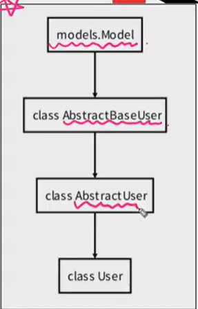

> ***references:***
>
> https://github.com/wally-wally/TIL/blob/master/04_django/%5BSSAFY%5Ddjango_%234.md


지난 시간

- FoerignKey()
  - on_delete option (normally "CASCADE")

- get_object_or_404() -> 일반적으로 get() object를 호출하지만 객체가 없다면 `DOENNOTEXIST`에러를 발생시키는데 얘는 HTTP404에러를 발생시킨다. 전자로 하면 클라이언트에게 500에러를 보내는데, 특정 객체를 찾을 수 없다! 고 말하는 404에러를 보내줌


# Model Relationship

아티클에 작성자 정보, 댓글에 댓글 정보, foreingkey로 

폼 변경하고 ~~ 

Article : comment = 1:N 

장고의 User모델을 사용하기 위해서는 커스텀 유저 모델로 대체해야 한다. 왜냐하면 일부 프로젝트에서는 django의 내장 유저 모델이 제공하는 인증 요구사항이 적절하지 않을 수 있다. 그래서 장고는 유저 지정 모델을 참조하는 AUTH_USER_MODEL 설정 값을 변경해서 기본 유저 모델을 재정의해야 한다. (장고가 커스텀 유저 모델을 설정하라고 함)

**중요한건 프로젝트의 첫 migrate를 실행하기 전에 완료해야한다!! 이 이후에 실행하면 db를 초기화하고 해야 한다.**


## User

### AUTH_USER_MODEL

- User를 나타내는데 사용하는 모델
- auth.User(앱이름.모델명)
- 반드시 커스텀 유저 모델을 만들고 나서 플젝시작해야 한다.


### AbstractBaseUser/AbstractUser

-  **<u>AbstractBaseUser</u>** : password와 last_login만 기본적으로 제공하고, 자유도가 높지만 다른 필드는 모두 작성해여 한다.
- <u>**AbstractUser**</u> : AbstractUser 모델은 관리자 권한과 함께 완 전한 기능을 갖춘 유저 모델을 구현하는 기본 클래스이다!




### AUTH_USER_MODEL

> [settings.py_AUTH_USER_MODEL](https://docs.djangoproject.com/en/3.1/ref/settings/)

- User를 나타내는데 사용하는 모델
- 기본값은 'auth.User'
- 주의사항
  - 프로젝트가 진행되는 동안 AUTH_USER_MODEL 값을 변경할 수 없음(종속된 모델을 만들고 마이그레이션 된 후/ 변경하기 위해서는 많은 시간과 절차가 필요)
  - **프로젝트 시작 시 설정**하기 위한 것이고 custom User로 대체하는 법을 [참고(Substituting a custom User model)](https://docs.djangoproject.com/en/3.1/topics/auth/customizing/)해서 설정

### AbstractBaseUser & AbstractUser

- AbstractBaseUser
  - password와 last_login만 기본적으로 제공
  - 자유도가 높지만 다른 필요한 필드는 모두 작성해야 함
- AbstractUser
  - 관리자 권한과 함께 완전한 기능을 갖춘 유저 모델을 구현하는 기본 클래스
  - 여기서 상속받은 User를 사용하고 있었음!(실제로 모든 일을 다함, User는 유저를 표현하기 위한 것일 뿐!)

### Custom users and the built_in auth forms

- AbstractBaseUser의 모든 subclass와 호환되는 forms

  - AuthenticationForm, SetpasswordForm, PasswordChangeForm, AdminpasswordChangeForm

- User와 연결되어 있어 커스텀 유저모델을 사용하려면 다시 작성하거나 확장해야하는 forms(

  다시 커스텀유저모델로 작성할거야!

  )

  - UserCreationForm
  - UserChangeForm

### Referencing the User model(유저 모델 참조하기)

- settings.AUTH_USER_MODEL(문자열로됨)
  - 유저 모델에 대한 외래 키 또는 다 대 다 관계를 정의 할 때 사용
  - **즉, models.py에서 유저 모델을 참조할 때 사용**
  - `accounts`에 User모델이 있는데 articles가 끝난다음에 accounts가 실행되기 때문에 오류가 뜰 수 있음, 그래서 모델에서는 객체가 등장하는게 아니라 문자열로 됨 AUTH_USER_MODEL을 써야됨
- get_user_model()
  - django는 유저 모델을 직접 참조하는 대신 get_user_model()을 사용하여 유저 모델을 참조하라고 권장
  - 현재 활성(active) 유저 모델(지정된 커스텀 유저 모델, 그렇지 않은 User)을 반환
  - **즉, models.py가 아닌 다른 모든 곳에서 유저 모델을 참조할 때 사용**

________


#### (1) settings.AUTH_USER_MODEL

>articls>models.py
>
>- settigs.py에 auth_user_model에 나와있지 않음
>- auth_user_model='auth.User'가 기본값이기 때문
>
>```python
>from django.conf import settings
>
># Article 클래스에 추가
>user = models.ForeignKey(settings.AUTH_USER_MODEL, on_delete=models.CASCADE)
>```

> forms.py > ArticleForm
>
> ```python
> fields=('title','content',) #구문 수정
> ```


🏴 **[참고사항] django가 서버가 켜질 때 초기화 순서로 보는 `models.py`에서 `get_user_model()`을 사용하지 못하는 이유**

① `INSTALLED_APPS`의 각 항목을 imports 한다. (단, 순서는 **`위에서 아래로`**)

- 이 과정에서 직접적, 간접적으로 모델을 import 해선 안 된다.
- ①번 단계에서 app을 import 하는 동안에 불필요한 제약들을 피하기 위해 이 단계에서는 모델을 가져오지 않는다.

② 각 어플리케이션의 `models.py`를 import 한다.

- **②번 단계가 완료가 되면**, `get_model()`과 같은 모델에서 작동하는 API들을 사용할 수 있게 된다.
- 그러므로 `models.py`에서 외래키 추가할 때 `get_user_model()`을 사용하지 못한다.

③ `AppConfig`의 ready() 메서드를 실행한다.

- **②번 단계가 완료된 후에야 `get_user_model()`을 사용할 수 있는데 아직 `accounts` app이 `INSTALLED_APP`의 작성 순서 때문에 아직 import가 되지 완료되지 않은 상황이라 `get_user_model()`이 어떤 `User` model을 return해야 하는지 django가 알 수 없는 상태이다.**


▶️ **결론**

- **모든 곳**에서 User model을 호출할 때는 **`get_user_model()`**
- 단, **`models.py`**에서만 **`settings.AUTH_USER_MODEL`**


_________


M:N 관계

[1]

ㅂ


(1) 커스텀 유저 모델을 사용하기 위한 첫번째 스탭 -> settings

```python
from django.db import models
from django.contrib.auth.models import AbstractUser

# Create your models here.
class User(AbstractUser):
    pass


```


(2) accout>forms에서 커스터마이징

UserModel(틀-스키마) 

user들이 이 틀을 통해서 회원가입하면 user는 저 틀을 통해서 발생한 인스턴스이다. modelform은 틀 자체에 접근한다. 회원가입하면 틀을 통해서 이루어지는데, usercreationform이나 userchangeform은 그 틀에 직접적으로 접근을 해야한다. 참조하고 있는 모델 자체를 바꿔줘야 한다.

accounts의 authentication, password ~ 는 모델이 직접적으로 관여하지 않음 그래서 커스터마이징 할 필요없이 그대로 사용하면 된다. ???????

(3) views.py

회원가입, Usercreation->CustomerCreation

userchange->customuserchagne


(4) models.py

아티클, 커멘트 모두 작성자가 있어야 한다. 둘다 외래키 넣는다. 


(5) views.py

article에서 user를 접근할 수 있다. 템플릿에서도 유저접근

commit=False로 일단 저장하고, 그 이후에 user를 할당할 수 있다.

업데이트에서는 commit=false안한느데 그건 이미 아티클 작성할떄 누가 작성했는지 user가 이미 작성되어 있기 때문에 할 필요가 없다.

(5) detail

템플릿에서 


(6)delete는 로그인먼저 해야 맞고, 로그인 유저랑 글쓴 유저랑 똑같아야 삭제할수있으니까 로직추가

어떤 글의 댓글인지 표시하고 comment.article=article, comment.user=request.user 누가 쓴글인지??

ㅁㄹ


