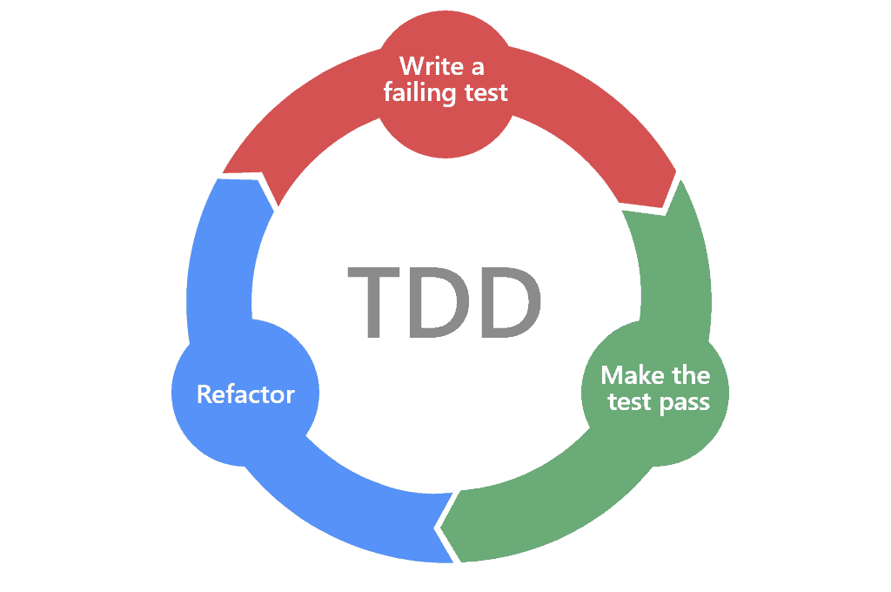
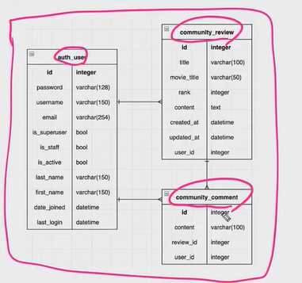

## DB PJT

### TEST


#### TDD



[Test-driven development (TDD)](http://technologyconversations.com/2014/09/30/test-driven-development-tdd/) is a software development process that relies on the repetition of a very short development cycle: first the developer writes an (initially failing) automated test case that defines a desired improvement or new function, then produces the minimum amount of code to pass that test, and finally refactors the new code to acceptable standards.

The following sequence of steps is generally followed:

- Add a test
- Run all tests and see if the new one fails
- Write some code
- Run tests
- Refactor code
- Repeat


### django 가 testing을 하기 위해 제공하는 것은?

예를 들어 artilce create라는 함수를 만들었다고 하자. 이 함수가 완벽하게 짰다고 단언하기 위해서는 어떤 일을 통해서 확인할 수 있을까?

[원래]

- 서버를 킨다
- /articles/create/
- 데이터를 입력한다.
  - 올바른 데이터
  - 올바르지 않은 데이터
- 저장을 누르고
- DB 새로운 article이 저장되었는지 확인

```python
class YourTestClass(TestCase):
    def setUp(self): #테스트 실행전 우리가 미리 실행해야하는 것!
        # Setup run before every test method.
        pass

    def tearDown(self): #실행후 
        # Clean up run after every test method.
        pass

    def test_something_that_will_pass(self): #test_로 시작해야함
        self.assertFalse(False)

    def test_something_that_will_fail(self):
        self.assertTrue(False)
```

>  **name convention**: test_로 시작해야함, 길고 상세하게 작성하는 것을 지향, 테스트를 돌리고 실패한 테스트의 이름을 그대로 출력해주기 때문임


## 1007 PJT description



> - 화살표 관계: 유저:리뷰 =1:N, 이런식
>
> - 기본 USERS 필드 1:N 관계 복습 ! 

