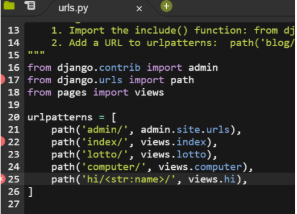
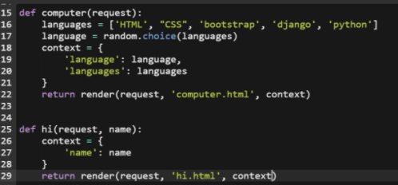
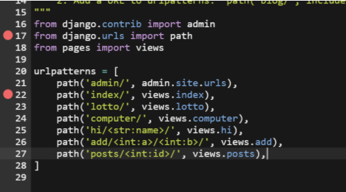
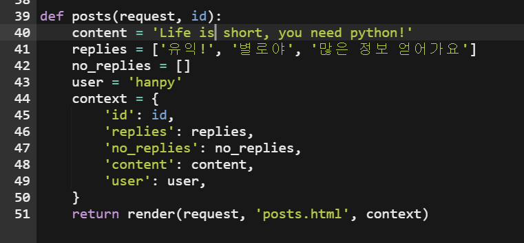
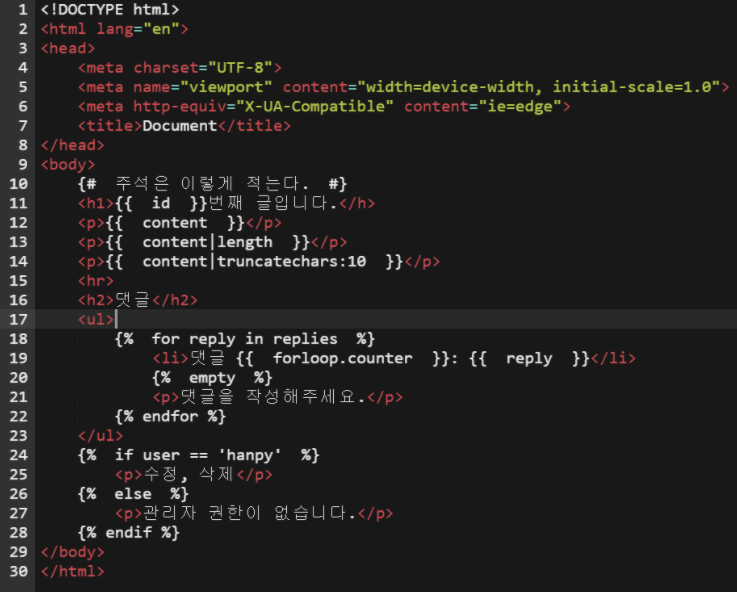

# 1. django 시작

**1. MTV**

장고의 패턴은 MTV 패턴을 따른다.

- Model
  - 우리가 가지는 DB에 대한 설계와 조작을 담당(데이터 관리)
- Template
  - 화면에 보이는 부분(인터페이스)
- View
  - 중간 관리(상호 동작)


**정리하면** 

**urls**에서 모든 요청을 받으면
**view**가 중간관리자로 다시 받는다.
그리고 **model** 에서 db를 읽게 하고 다시 받는다.
마지막으로 **templates**에서 html 받고 응답을 해준다.


**2.언어/시간 설정**

- LANGUAGE_CODE = 'ko-kr' 
- TIME_ZONE = 'Asia/Seoul'


# 2. djang_variable routing 기초(str)

1. urls.py

   

   `path('hi/<str:name>', views.hi)`를 하면 hi/뒤에 값을 변수로 받겠다는 설정이다. 즉, str로 무슨 값이 들어오든 name이라는 변수로 담아 놓겠다는 말이다.


2. views.py

   

   함수 안에 변수쓰려면 request 뒤에 name을 적어서 인자를 받을 준비를 한다.

   25번째 줄에 name을 26번째 줄의 context로 보내고 다시 그 밑에 29번째 줄의 context로 보내서 return 한다.

   이때 중요한것은 **url에서 보낸 name과 views에서 request 옆에 적은 name의 철자가 같아야 한다.**

   그리고 context 안에 있는 'name': name은

   왼쪽 name은 html에서 {{  }} 안에 적은 문자와 같다고 할 수 있다. 오른쪽 name은 urls에서 받아온 name과 같은 거라고 할 수 있다.


# 3.django template language

1. urls.py

   

   int값에 id를 넣자


2. views.py

   

   내부의 keyword인자로 작동하기 때문에 url에 id로 지정했으면 view에도 id로 해야한다. 

   user을 'hanpy'라고 지정하고 html부분(아래 사진)에서 if 조건문에 넣었다는 점을 기억하자. 그리고 hanpy말고 다른 값을 넣으면 if문에서 '관리자 권한이 없습니다'라고 뜬다.

   context 안에 key값과 value 값을 같게 하는 이유는 views에서 넘어온 변수를 확인하기 위해서다.


3. posts.html

   

   - 주석은 {# #}
   - 출력은 {{ }} 중괄호 사용
   - {{ id }} 는 url 마지막에 있는 숫자가 들어간다.
   - {{ content }} 는 내가 적은 글이 들어간다.
   - **|length** 은 content의 **글자수**를 출력한다. (|은 filter를 의미한다.)
   - **|truncatechars:10** 은 글자수를 **10자까지만 출력**한다. 
   - 반복문을 **ul 태그**에 감싸서 한다는 점을 주목하자. 
   - 인덱스랑 같이 쓰고 싶다면 ol 태그 써도 되지만 {{ **forloop.counter }}**를 사용한다.
   - 만약 숫자를 0부터 시작하고 싶다면 {{ **forloop.counter0** }}을 사용한다.
   - 비어있는 배열을 보낸다면 {{ **empty** }}를 사용해서 구문을 출력가능하다.

참고

\+ `<hr>`: 수평선     

+`<br>`:엔터


# 4. Form으로 사용자의 입력받기 + ModelForm

### Django에서 Form을 언제 쓸까?

- 사용자가 정보를 적을 수 있게 form 양식을 사용자에 준다.
- 그 후에 form을 통해 사용자가 보낸 정보를 사용한다.


아래의 예시를 보고 흐름을 이해하자

___

```html
<form action="/boards/complete/">
    제목 : <input type="text" name="title">
    <br>
    내용 : <input type="text" name="content">
    <input type="submit" value="작성">
</form>
```

__________________________________

### form내부의 action에서 /의 중요성

지금부터 하드 타이핑을 했을때 post에서 발생할 수 있는 오류를 알아보자.

뒤의 /를 제외시

ex) action='/article/create' method="POST"

 redirect 할 때, POST 데이터를 들고 다른 곳으로 보낼 수 없다. 즉, 포인트는 장고는 url을 적을때 맨 뒤 / 도 닫아준다. 

______________

### Form 설명

**action** - 어디로 보내면 되는지 적는 곳이다. 요청을 처리할 url을 적는다.

input 안의 **name** - 어떤 변수에 담아서 보내는지를 나타낸다. 사용자가 입력한 것을 담는 변수의 이름이다. 즉, 각각의 내용을 담아서 보내기 위해서는 name이 필요하다.

___________

### 보내지는 과정

action을 통해 어떻게 url이 보내질까??

만약 서버를 실행 후에 제목의 input에 **hanpy**를 적고 내용의 input에 **파이썬**을 적고, **작성**을 눌렀다고 해보자.

그때의 url은

**www.(기본주소).com/borads/complete/?title=hanpy&content=파이썬**

이런식으로 생성되서 보내진다.

즉, form 태그의 action과 name을 통해 새로운 url이 만들어진다.

___

### 보낸 후의 과정

form의 action을 통해 데이터를 보내면,

urls.py의 path('boards/complete/', views.complete), 에서 받고, views의 complete함수로 다시 간다.

그리고 complete함수를 실행한 후에 return 되는 곳으로 이동 하게 된다.

 

이 때 정보가 어떻게 넘어오는지 아래의 코드로 확인을 해보자.

_______

### request

request는 요청과 관련된 객체이면서 **요청되는 모든 정보를 가지고 있다라는 점**을 인지하고, 아래의 출력값들을 이해하자.

**print(request.GET)**

(출력값) <QueryDict: {'title': ['hanpy'], 'content':['파이썬']}> (이렇게 딕셔너리로 넘어간다)

**print(request.method)**

\> GET

**print(request.path)**

\> /boards/complete/

 

그렇다면, 받은 정보를 어떻게 html로 보낼 수 있을까?

**context에 담아서 HTML로 보내기가 가능하다.**

물론 context에 안 담고 아래에 있는 코드의 render의 세번째 인자에 딕셔너리로 바로 보내도 되긴한다. 그러나 매우 길어지는 문제점이 있다.

________

```python
def complete(request):
    title = request.GET.get('title')
    content = request.GET.get('content')
    context = {
        'title': title
        'content' : content
    }
    return render(request, 'boards/complete.html', context)
```

GET.get은 값을 불러오기 위해 정해지는 것이라는 정도로 일단 이해하고 암기하자. title과 content는 request.GET의 QuerySet에서 딕셔너리의 key값으로 값을 가져와서 저장한다.

**+render는 html을 만들기 위해 templates가 작업을 한다.**


___


## ModelForm

Form에서 ModelForm으로 바뀌면서 Create로직이 바뀌는 과정을 이해해야 한다.

### Form

Form을 만들기 위해서는 보통 목록을 만들고, 새글 쓰기를 하면서 아래와 같이 진행한다. app 내부의 파일들을 건든다. 

_______

#### forms.py

from django import **forms**

class ArticleForm(**forms**.Form):

  titile = forms.CharField()

  content = forms.CharField(widget=forms.Textarea)

\+ form에서는 CharField에 max_length가 필수가 아니다. 그리고 widget는 생김새를 결정 하는 거다


#### views.py

from .forms import ArticleForm

def create(request):

  form = ArticleForm()

  context = {

​    'form' : form

  }

  return render(request, 'articles/create.html', context)

 

#### create.html

<form action = "">

  {{ form }}

</form>

+{{ form }} 을  {{ form.as_p }} 로 바꾸면 인라인이 p 태그로 변한다.(한줄에 있는데 title과 content로 2줄로 바뀐다.)

___

form 로직을 만들었다. 그런데 개발자들이 곰곰히 생각하니 forms.py와 models.py가 비슷하다. **그러면 forms.py에서 정의한 ArticleForm이 models.py에서 정의한 Article의 설정을 그대로 가져올 수 없을까?** 라는 생각으로 ModelForm이 탄생했다. 

### ModelForm

ModelForm은 모델에서 정의한 것을 그대로 양식으로 반환해준다. 검증도 해주고, 실패하면 error도 반환해준다.

#### 코드(forms.py)

```python
from django import forms
from .models import Article

class ArticleForm(forms.ModelForm):
    class Meta:
        model=Article #Article과 관련있다고 적은거다
        fields=['title','content'] #Article 클래스에서 적은 내용만 가져오겠다는 내용이다. 
```


MetaDate(메타클래스)

데이터의 데이터라는 의미로 예를 들면 사진이라는 데이터가 있으면 메타데이터는 노출량이던가 찍은 시간 같은 것을 나타낸다. 즉, 필드 정보에 대한 Data를 메타클래스에 담아 놓는다.

1. 필드는 어떤 모델과 연결하는가? Model
2. 어떤 필드를 정의할 것인가? field


#### ModelForm의 장점

1. 모델을 정의하면 자동으로 form을 만들어준다

2. form이 추가적으로 가져야 할 기능이 있다. 그것을 ModelForm이 해결해준다. 

   2-1. 양식을 점검해 준다.(미작성이 있으면 작성하라고 말해준다.)

   request.GET or request.POST를 통해 바로 저장하는것이 아니라 form.is_valid()를 이용해서 미작성을 잡아낸다.

   

#### Q

**from django import forms**

**class ArticleForm(forms.Modelform)**

여기서 굳이 forms내부를 다 불러 올필요 없이 forms안에 있는 Modelform만 불러오면 안되나요?

 

물론 form django.forms import Modelform 으로 불러 와도 됩니다.이런경우에는

class ArticleForm(**Modelform**)

  class Meta;

이런식으로 적어주면된다. 이렇게 적을 경우 단점은 CharField와 TextField를 적으려면 추가를 해야한다.

form django.forms import Modelform, CharField, TextField로 적어야하고 다른 것들도 적을 때 마다 추가를 시켜야 한다.


___________

#### Form 꾸미기

**1.{{form.as_p}}**

**2.위젯을 만들어서 모델 폼 클래스 안에 채워넣는다.**

forms.py

```PYTHON
from .models import Article

 

class ArticleForm(forms.ModelForm):
    title = forms.CharField(
                max_length=100,
                label='제목',
                help_text='제목은 100자이내로 작성하세요.',
                widget=forms.TextInput(
                        attrs={
                            'class': 'my-input',
                            'placeholder': '제목 입력'
                        }
                    )
            )
    content = forms.CharField(
                label='내용',
                help_text='자유롭게 작성해주세요.',
                widget=forms.Textarea(
                        attrs={
                            'row': 5,
                            'col': 50,
                        }
                    )
            )
    class Meta:
        model = Article
        fields = ['title', 'content']
```

widget은 Textinput과 Textarea가 있다. 

field는 불편하더라도 다 적어줘야 한다.

**3.부트스트랩 이용해서 form 꾸미기**

설치) pip install django-bootstrap4

터미널에 치고 installedapp에 등록하자. => **'bootstrap4',**


Quickstart 보니  base.html에 추가하자

<!DOC~ 바로 밑에

**** 

 

</head> 바로위에

****

 

</body> 바로위에

****

을 추가한다.

아래와 같이 코드 적으면 된다.

```python
<!DOCTYPE html>

<html lang="ko">
<head>
    <meta charset="UTF-8">
    <meta name="viewport" content="width=device-width, initial-scale=1.0">
    <meta http-equiv="X-UA-Compatible" content="ie=edge">
    <title>Django Live Session</title>
    
</head>
<body>
    <div class="container">
        
        
    </div>
    
</body>
</html>
```

_______

각각의 html에 각 파일 마다 import 하는것 처럼 **도 모든 html에 넣는다**



**** 



위와 같은 위치에 넣어 주면 된다.

#### bootstrap form 최종

그리고 form은 아래와 같이 적어준다.(편하기 때문에 이거 주로 사용할 거다.)

```html
<form action="" method="post">
    
    
    <button class="btn btn-primary">제출</button>
</form>
```

 

\+ 지금까지는 input type='submit'을 사용 했지만, button을 만들면 타입 지정없이 동작이 가능하다.


# 5.ORM


## ORM(Object Relational Mapping)

- CRUD하기 위해 필요한 개념이 ORM
- 객체조작을 통해 DB를 조작
- 다양한 SQL에 상관없이 개발가능
- DB 조작을 python 코드로 가능
- Object 조작을 통해 데이터 베이스를 조작

 

\>Article

<articles.models.Article

 

\> Article.objects.all() 

< Queryset [<Article: Article object (1)>]

유사 리스트 형태로 전체 데이터를 다 가져온다. 위에 처럼 return타입은 Queryset(유사리스트)로 Article 자체의 object가 리스트 형식으로 뜬다.

즉, ORM은 DB값을 변환해서 object로 보여준다. 변경을 하면 sqp로 바꿔서 변경을 해준다. 만약 SQL문으로 적으면 표(table) 형식으로 보여준다.

 

\> Article.objects.all()[0].title

< 1번글의 내가 적은 title 부분이 출력된다.

\> Article.objects.all()[0].content

< 1번글의 내용이 출력된다.


___

#### Article.objects.all() 

어떤 class(Article)의 쿼리 method(objects.all)를 쓰면 출력이 되고, 그것에 대응되는 SQL 문이 있다. 

____________

### CREATE(생성)

python의 인스턴스 만들기와 비슷하다고 보면 된다.

class Person()

P1 = Person()

P1.name = "hanpy"

 

\>article = Article()              : Article을 비어있는 article 변수에 저장하여 인스턴스를 만든다.

\>article.title = '제목입력'

\>article.content = '내용입력'        :  속성값을 입력

\>article

< <Article : Article object (None)>    : 비어있다고 뜬거다.

\>article.save()                 : 이렇게 저장을 해줘야한다.

 

\>Article.object.all()

<QuerySet [<Article:Article object (1)>, **<Article:Article object (2)>**]>     : <Article:Article object (2)>이 생성됨

 

\>article

<Article:Article object (2)>           : 실제 DB에 값이 저장되었다. 위의 흐름을 기억 할 필요가 있다.

 

\> Article.objects.all()[1]

<Article:Article object (2)>

 

\>Article.objects.all()[1].title

'제목입력'

________

### READ(조회)

#### 모든 데이터 조회

\>Article.object.all()

<QuerySet [<Article:Article object (1)>, <Article:Article object (2)>]>

 

#### 단일 데이터 조회

\>Article.object.get(**id**=2)

< <Article:Article object (2)>

 

조회 시 주민번호, 학번, 군번 등으로 식별번호를 사용한다. (고유값)

일반적으로 id로 식별번호를 부여한다.

id는 식별번호이자 Primary key(PK)라고도 한다. DB는 중복 불가하다.

즉, 일반적으로는 Primary key라고 부르지만 column의 이름을 id라고 한다.

_______

### UPDATE(수정)

\> a2 = Article.objects.get(id=2)              : a2라는 변수로 가지고 온다

\> a2.title = '제목수정'                    : 속성 변경

\> a2.save()                           : save method 호출

 

\> new_a2 = Article.objects.get(id=2)           : 새롭게 불러오니 수정되어진걸 확인 할 수 있다.

\> new_a2.title

< '제목수정'

 

___________

### DELETE(삭제)

\> a1 = Article.objects.get(id=1)

\> a1.delete()                          : 삭제 시 tuple이 리턴되어 나온다.

(1, {'article.Article': 1})

 

\>Article.object.all()

<QuerySet [<Article:Article object (2)>]>


_____________


# 6. Migrations

Model로 정의된 데이터베이스 스키마를 반영한다

쉽게 말해서 DataBase에 반영한다고 생각하자.

```python
class Article(models.Model):
    title = models.CharField(max_length=140)
    content = models.TextField()
    created_at = models.DateTimeField(auto_now_add=True)
    updated_at = models.DateTimeField(auto_now=True)
```


### DB에 반영 할 준비

\> pyrhon manage.py makemigrations

0001_initial.py가 생성된다. 눌러서 들어가 본 후에 오타없나 확인 후의 migrate를 진행한다.

### DB에 반영

\> python manage.py migrate

### DB에 반영 여부를 확인

\> python manage.py showmigrations

[] : 미반영

[x] : 반영

### admin.py

DB반영이 됐는지 확인을 위해 admin.py 아래와 같이 코드를 작성한다.

```python
from .models import Article
admin.site.register(Article)
#모델에서 아티클 불러와서 그 아티클을 어드민 사이트에 등록해줘
```

### 반영 확인

서버 실행전에 관리자 ID를 만들자.

\>python manage.py createsuperuser

절차에 맞게 관리자 아이디를 만든다.

 

\> python manage.py runserver (서버 실행)

서버들어가서 url뒤에 admin 붙임.

로그인 창에서 위에서 만든 아이디로 로그인을 하면, 데이터 관리가 가능하다.


### 단순 오타가 아닌, model에 문제 발생 시

**db.sqlite3**(우리가 쓰고 있는 DB)과 migrations 안에 있는 **마이그레이트 파일(이력)**들을 모두 지운다.

그리고 새롭게 다시 시작하자.(DB가 다 지워진다.)

\+ 단, migrations 폴더를 지우면 안된다. __init__.py 가 있어야 모듈로 관리가 된다. 폴더를 지우고 다시 __init__.py를 만들어도 되지만, 굳이 그럴 이유가 없다.


# 7. Model

```python
class Article(models.Model):
    title = models.CharField(max_length=10)
    content = models.TextField()
    created_at = models.DateTimeField(auto_now_add=True)
    updated_at = models.DateTimeField(auto_now=True)
```

**models.Model**

models의 Model을 상속받아 Article이라는 클래스를 만들었다.

모델 클래스를 만들 떄 반드시 상속을 하도록 하자. 

왜냐하면 앞으로 Article.object.all() 같은 것들로 데이터를 불러오거나 조작을 할 것이다. 

이때, objet.all 은 내가 정의한 메서드가 아니라 Model을 상속 받았기 때문에 쓸 수 있는 method들이다.

**created_at = models.DateTimeField(auto_now_add=True)**

생성시간을 자동으로 저장한다.

+auto가 들어가는 것들은 가용자들이 직접 입력하지 못하게 내부적으로 만들어 져있다.


# 8. **정적파일 넣기 + ImageField(pillow,imagekit)

정적파일을 불러 오려면 **static폴더**를 만들어서 관리하고 가져온다.

 templates에서 정적파일을 모아서 폴더를 만들듯이 app 안에다가 app에서 쓸 정적파일을 모아주면, django가 알아서 가지고 온다.

 

### 파일 위치

app_name/static/app_name/images/jpg파일.jpg

app_name/static/app_name/stylesheets/style.css

 

\+ app_name의 static안에 다시 app_name을적어주는 이유는다른앱과 이름이 중복되는 것을 막기 위함이다.


___

### base.html 코드

++ 보충이 필요함, 오늘 할 수 있을지는 모르겠다


# 9. POST와 GET

form 부분을 get으로 보내면 문제점이 발생한다. 왜냐하면 URL은 길이 제한이 있기 때문이다. 즉, 내용 부분을 길게 적으면 url이 너무 길어지기 때문에 안 넘어간다.

무언가를 가지고 올 떄는 GET방식이지만, 데이터로 무언가를 저장 할 떄는 url로 저장하지 않는다.

브라우저 상에서 JS를 제외하고 유일한 순수 HTML/CSS를 보낼 수 있는 건 GET(**<a >**, **<form >**)과 POST(**<form  >**) 2가지가 유일하다.

 

\+ 그러나 모든 form은 POST라고 할 수 없다. 검색은 **DB의 상태변화**가 아니라 **DB의 검색 결과**를 요청하기 때문이다.

 

#### 따라서 get을 post로 바꾸는 이유는 

\1. url의 길이 제한

\2. 역할이 다르다. GET은 정보를 가져오는 것이고, POST는 DB값을 저장하는 것이다.

 

 

GET을 POST로 바꾸는 방법으로는 2가지 절차가 있다.

\1. form 태그에 method="POST"를 추가하자. 그리고 해킹방지를 위해 도 form에 추가한다.

csrf 이부분은 settings.py의 MIDDLEWARE에서 처리한다.

\2. views에서

article.title = **request.GET**.get('title') 을 article.title = **request.POST**.**get('title')**로 바꿔야 한다.

#### request.GET

GET으로 받았을 때,

<u>GET</u> 요청으로 넘어온 값을 딕셔너리 형태로 저장한다.

POST로 받았을 때, request.GET은

<QueryDict:{}>와 같이 이런식으로 비어있다.(물론 GET으로 보낸걸 받았을 떄는 차있다.)

비어있으니 당연히 저장 불가가 뜨고 IntegrityError뜨면서 NOT NULL제약 조건에 실패 했다고 뜬다.

 

#### request.POST

POST 형태로 넘어온 값을 관리한다.

POST로 받으면 <QueryDict:{'csrfmiddlewaretoken'=['asdfasdf'], 'title'=[''asdf], ~~~~~~}>와 같이 넘어온다.

 

<u>GET(특정리소스의 포시)</u>

url로 보내는 주소창에 치는 모든것이다.

따라서 크기가 제한되어있고 보안 이슈가 있다.

 

<u>POST(특정리소스에 제출)</u>

서버의 상태 변화를 일으키고 HTTP요청 메세지의 body를 통해 보낸다.