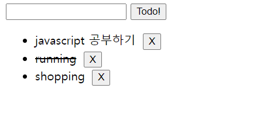

# JavaScript(10/12)


## DOM

프로그래밍적 요소를 사용해서 문서를 조작하는게 가능하다.

html, xml 등과 같은 문서를 다루기 위한 언어 독립적인 문서 모델 인터페이스이다. 그 문서에 있는 어떤걸로 접근해서 할 수 있다. 

주요 객체가 존재한다. 

 - window: DOM을 표현하는 창. 가장 최상위 객체(모든 객체의 부모)
 - document : 페이지 콘텐츠의 Entry Point 역할을 하며, `<body>` 등과 같은 수많은 다른 요소들을 포함
- navigator, location, history, screen


### Todo CRUD 만들기

> 
>
> 바닥부터 만들기, 간단한 todolist 기능을 만들고, list를 만들고, 다 하면 done표시, 삭제기능까지 만든다

```html
<!DOCTYPE html>
<html lang="en">
<head>
  <meta charset="UTF-8">
  <meta name="viewport" content="width=device-width, initial-scale=1.0">
  <title>todo!!</title>
  <style>
    .done{
      text-decoration: line-through;
    }
  </style>
</head>
<body>
  <input type="text">
  <button>Todo!</button>
  <ul></ul>

  <script>
    //1.list만들기(create)
    //input에 입력하고 버튼 누르면 저장되게 하기
    
    //button, input을 가져와서 변수에 담아두기!
    const button = document.querySelector('button')
    const input = document.querySelector('input')

    function addTodoUpdateDelete() {
      const content = input.value 

      if (content !== ''){
        //빈값이 아니면 li라는 요소를 만들건데 그건 li라는 변수에 담아둔다
        const li=document.createElement('li')
        li.innerText=content
		
        //ul안에 li를 넣을거니까 일단 ul태그를 갖고온다
        const ul = document.querySelector('ul')
        //갖고왔으면 append
        ul.appendChild(li)
        //create하고 나면 input에 있는건 지워두는게 좋으니까 ''초기화
        input.value=" "
        
        //update
        //li라는 타겟에서 click이벤트를 하면, function을 실행한다
        
        li.addEventListener('click',function(event){
          event.target.classList.toggle('done')
        })

        //delete
        //일단 각각 li태그 옆에 delete버튼 만들어야 함
        //button이라는 요소를 만들어서, deletebutton에 저장하고
        const deleteButton=document.createElement('button')

        deleteButton.innerText='X'
        deleteButton.style.marginLeft = '10px'
		
        //그 deletebutton을 li에 append한다
        li.appendChild(deleteButton)

        //delete
        deleteButton.addEventListener('click', function(){
          li.remove()
        })

      } else{
        alert('빈값은 안되염')
      }
    }

    button.addEventListener('click',addTodoUpdateDelete)
    input.addEventListener('keydown',function(){
      if (event.code==='Enter'){
        addTodoUpdateDelete()
      }
    })
  </script>
</body>
```


#### Things confunsed

> - toggle개념 뭐지? 
>
>   ```html
>   li.addEventListener('click',function(event){
>   	event.target.classList.toggle('done')
>   })
>   ```
>
> - 어쩔때 ()를 쓰고 어쩔때 ()를 안쓰는지...무슨 차이지?
>
>   ```html
>       button.addEventListener('click',addTodoUpdateDelete)
>       input.addEventListener('keydown',function(){
>         if (event.code==='Enter'){
>           addTodoUpdateDelete()
>         }
>       })
>   ```
>
>   


