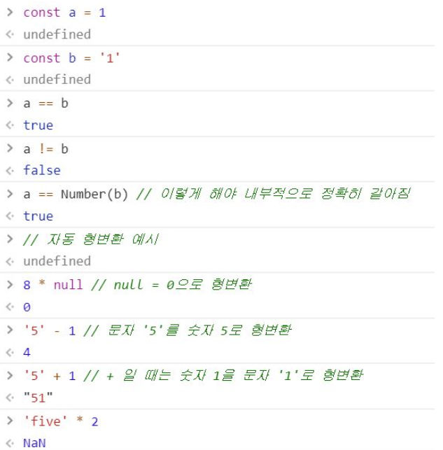

[TOC]


## 1013_JS 문법 

> 출처ㅣ [wally-wally](https://github.com/wally-wally/TIL/blob/master/06_js/%5BSSAFY%5DJavascript_%231.md) TIL을 보면서 정리함 


### 1-1.`let`, `const`, `var` - `00_variable.js`


#### (1) `let` (변수)

- 값을 재할당할 수 있는 변수를 선언
- 단, 각 변수는 한번만 선언할 수 있다(할당은 여러번 가능)
- 블록 유효 범위(block scope)를 가진다
  - if문, for문, 함수와 같이 중괄호 내부가 블록 유효 범위에 해당

```javascript
let x = 1

if (x === 1) {
	let x = 2 
    let x = 3 //불가능
    console.log(x) //2
}

console.log(x) //1
```


#### (2) `const` (상수)

- 값이 변하지 않는 상수를 선언하는 키워드
- 담긴 값이 불변임을 뜻하는건 아님
- 단지 상수의 값은 재할당할 수 없고 재선언도 안된다.
- 블록 유효 범위(block scope)를 가진다
- const는 선언시에 초기값을 생략하면 오류가 발생한다

```javascript
const MY_FAV = 7 


console.log('my favorite number is:' + MY_FAV) //7출력

//상수 재할당하려는 시도는 오류 발생
//MY_FAV = 20 위에 이미 할당되어 있으므로 재할당 불가능

//상수를 재선언하려는 시도는 모두 오류 발생
//const MY_FAV = 20 재선언안되니까 has already been declared 오류 발생
// let MY_FAV = 20 - MY_FAV 자체를 const로 먹고 있기 때문에 오류 발생
// var MY_FAV = 20 - 이것도 불가능

if (MY_FAV === 7){
    // 블록 유효 범위로 지정된 MY_FAV이라는 변수를 만드므로 괜찮다.
    // 즉, 전역이 아닌 범위 안이므로 이름 공간에서 충돌이 나지 않는다.
    // 여기서 CONST는 새로은 블록 유효 범위이므로 const MY_FAV = 20 으로 해도 출력됨
    let MY_FAV = 20
    
    console.log('my favorite number is :' + MY_FAV) //20츨력 
}

console.log(MY_FAV)//7출력 

```


#### (3) `var` (변수)

- ES6 이전의 feature로 예기치 않은 문제를 많이 발생시키는 키워드로 절대 사용하지 않는다
- 함수 유효 범위(function scope)
- var로 선언된 변수의 범위는 현재 실행 문맥인데, 그 문맥이 함수 혹은 함수 외부의 전역으로도 갈 수 있다.
- 할당 및 선언이 자유임


_________

언제 변수, 상수를 써야 할까? 

- `var`은 쓰지 말자
- 날씨와 온도 같은 weather_temp.즉 모호할 경우는 변수가 적절함
- 일단 모든 선언에서 가능한 한 상수(`const`)를 사용해야 한다
- 먼저 상수를 생각하고, 값이 바뀌는 것이 더 자연스러운 상황이면 그때 변수로 바꿔서 사용하는 것을 권장
  - const로 먼저 초기 선언하고 필요한 경웨 따라 let으로 바꿔서 사용하자
  - 무조건 const가 대문자일 필요 없다

#### ~~스코프 ㅁㄹ~~

|       | 할당    | 선언    | 스코프(이거 헷갈린다) |
| ----- | ------- | ------- | --------------------- |
| var   | 자유    | 자유    | 함수 스코프           |
| let   | 자유    | 한 번만 | 블록 스코프           |
| const | 한 번만 | 한 번만 | 블록 소크포           |

______________


### 1.3 식별자(identifier)

- 변수명은 식별자라고 불리며 특정 규칙을 따른다

  - 반드시 문자, 달러($), 또는 밑줄로 시작해야 한다. 이후는 숫자도 가능
  - 대소문자 구분하며 클래스명을 제외하고는 대문자로 시작하지 않는 것이 좋다.
  - 예약어는 사용 불가능(class,super,const,case,function)

- 식별자 작성 스타일

  ```javascript
  //1. 카멜 케이스(camelCase) - 객체, 변수, 함수
  let dog
  let variableName
  
  //배열인 경우는 보통 복수로 쓴다
  const dogs=[]
  
  //정규표현식의 경우 보통 소문자 r로 시작
  const rDecs = /.*/
  
  //함수
  function getPropertyName() {
      return 1
  }
  
  // boolean 을 반환하는 변수나 함수 - 'is'로 시작
  let isAvailable = false
  
  // 2. 파스칼 케이스(PascalCase) - 클래스, 생성자 (=== upper-camel-case)
  class User {
    constructor(options) {
      this.name = option.name
    }
  }
  
  // 3. 대문자 스네이크 케이스(SNAKE_CASE) - 상수
  // 이 표현은 변수와 변수의 속성이 변하지 않는다는 것을 프로그래머에게 알려준다.
  const API_KEY = 'avcavanfjnfsaecklnfealk'
  ```


### 1.4 hoisting 현상

- **선언만 끌어올리고 할당은 끌어올리지 않는다**
- 이 개념은 JS 변수, 함수나 표현이 최상단으로 올려지는 것을 말한다
- 끌어 올려진 변수는 `undefined` 값을 반환한다.
- 변수와 함수를 위한 메모리 공간을 확보하는 과정이다.

```javascript
console.log(a) //undefined
var a = 10 
console.log(a) //10
```

```javascript
//js가 이해한 코드
var a //선언과 초기화가 동시에 이루어짐
console.log(a) //undefined
a = 10
console.log(a)
```

_______________

```javascript
// let은 안 된다.
console.log(b)  // 선언 + TDZ로 이동(초기화는 안 된 상태임 => ReferenceError 발생)
let b = 10
console.log(b)
```

```sh
ReferenceError: Cannot access 'b' before initialization
```

```javascript
// 마찬가지로 아래와 같은 과정을 거친다.
let = b // 선언 + TDZ로 이동(초기화는 안 된 상태임)
console.log(b) // 할당 불가 (초기화가 아직 안 됨, ReferenceError 발생)
b = 10 // 할당
console.log(b)
```

#### ~~모르겠다 이거 왜 let은 안되는거지??? 뭔차이야 몰라~~ 


### 1.5 타입(type)

#### (1) Primitive

- **불변하다**는 특징을 띄고 있다.
- Numbers
  - `Infinity` : 양의 무한대와 음의 무한대로 나뉨
  - `NaN`  : Not a Number의 약자로 표현할 수 없는 값, 자기 자신과 일치하지 않는 유일한 값을 표현
    - 0/0, "문자"*10, Math.sqrt(-9)와 같이 표현할 수 없는 값

- Strings

  ```javascript
  const sentence1 = 'sentence'
  const sentence2 = "sentence"
  const sentence3 = `sentence`
  
  //backtick(``)
  //줄바꿈 기능, python의 f-string같은 기능 사용가능
  //const word ='안녕
  //하세요'
  //console.log(word)
  
  const word1 = '안녕 \n하세요'
  console.log(word1) //안녕 
  					//하세요
  
  const word2 = `안녕
  하세요`
  console.log(word2)
  
  
  // Template Literal
  // JS 에서 문자열을 입력하는 방식
  const age = 20
  const messgae = '홍길동은 ${age}세입니다'
  console.log(message)
  
  
  // 문자열은 + 연산만 가능하다
  const happy = 'hello'
  const hacking = 'world'+'lol'+'!!!'
  console.log(happy,hacking)
  ```

  

- Boolean
  
- javascript의 boolean은 `true`, `false` (모두 소문자)가 있다.
  
- Empty Value -  `null` / `undefined` 

  - 동일한 역할을 하는 이 2개의 키워드가 존재하는 이유는 단순한 JS의 설계 실수

  - 큰 차이를 두지 말고 interchangeable 하게 사용할 수 있도록 권장.

  - `undefined`

    - 값이 없을 경우 JS가 자동으로 할당해주는 값

      ```javascript
      let first_name //선언만 하고 할당안함
      console.log(first_name) // undefined 출력
      ```

  - `null`

    - 값이 없음을 우리가 표현하기 위해서 인위적으로 사용하는 값

      ```javascript
      let last_name = null
      console.log(last_name) // null 출력 - 의도적으로 값이 없음을 표현
      ```


______________________


### 2.1 연산자

#### (1) 할당 연산자

| 연산자 | 의미                                 |
| ------ | ------------------------------------ |
| a++    | a를 평가한 다음에 a에 1을 더한다.    |
| ++a    | a에 1을 더한 다음에 a 값을 평가한다. |
| a--    | a를 평가한 다음에 a에서 1을 뺀다.    |
| --a    | a에 1을 뺀 다음에 a 값을 평가한다.   |


> [출처](https://im-developer.tistory.com/57) 이해가 안가서 추가 정리
>
> 
>
> [증감 연산자의 위치]
>
> - 증감연산자가 피연산자 옆에 위치할때
>
>   1. ex) ++a 
>
>      전체 수식 처리하기 전에 적용됨
>
> - 증감연산자가 피연산자 뒤에 위치
>
>   1. ex) a++
>
>      전체 수식의 처리가 끝난 뒤 적용됨
>
> ```javascript
> var a = 10;
> var b = a++ + 5;
> 
> console.log(a, b); // a = 11, b = 15가 출력됨
> 
> var a = 10;
> var b = ++a + 5;
> 
> console.log(a, b); // a = 11, b = 16이 출력됨
> 
> 
> 출처: https://im-developer.tistory.com/57 [Code Playground]
> ```
>
> 첫번째 경우는 b = a++ + 5에서 ++가 a뒤에 위치하니까 a+5를 먼저 계산해서 b에 15를 할당한다. 그리고 다음줄로 넘어가면서 a++가 계산되서 a=11,b=15가 출력된다
>
> 두번째 경우는 ++a를 만나자마자 a는 바로 11이 된다. 그렇기 때문에 ++a +5 =11+5=16이 되서 b는 16이 된다.


#### (2) 비교 연산자


#### (3) 동등 연산자




#### (4) 일치 연산자

- `==` : 동등 연산자로 단순히 값만 같음
- `===` : 일치 연산자로 값과 타입까지 같음(동등 연산자보다 두 값을 엄격하게 비교함)
  - 예외) `NaN === NaN`의 결과는 `false`이다.


#### (5) 논리 연산자

- `&&` : 논리곱, `||` : 논리합, `!` : 부정


#### (6) 삼항 연산자

- if 문을 한줄로 작성할 수 있으며 `?` 앞의 식이 참일 경우 `:` 왼쪽에 있는 값이 출력되고 거짓일 경우 `:` 오른쪽에 있는 값이 출력된다.


### 2.2 조건문 & 반복문


#### (1) if문

```javascript
const userName = 'ssafy'

if (userName === '1q2w3e4r') {
    message = '<h1>This is admin page</h1>'
}else if (userName === 'ssafy') {
    message = '<h1>You r from ssafy</h1>'
} else {
    message = `<h1>hello ${userName}</h1>`
}
```


#### (2) switch문

##### ~~음 몰라~~ 

```javascript
switch (userName) {
  case '1q2w3e4r': {
    message = '<h1>this is admin</h1>'
    break // 특정 케이스를 만족하면 break로 switch문을 탈출한다.
  }
  case 'ssafy': {
    message = '<h1>you r from ssafy</h1>'
    break
  }
  default: {
    message = `<h1>hello ${userName}</h1>`
    console.log(message)
  }
}
```


#### (3) while문

```javascript
let i = 0

while (i<6){
    console.log(i)
    i++
}
```


#### (4) for문

```javascript
//for - 1

for (let j = 0; j < 6; j++) {
    console.log(j)
} // while문과 같은 구문

//for - 2
const numbers = [0,1,2,3,4,5]

for (let number of numbers) {
    console.log(number)
} //0부터 5까지 한줄에 하나씩 출력

```

```java
// for in
const fruits = { a: 'apple', b: 'banana' }

for (const key in fruits) {
	console.log(key) // a, b
	console.log(fruits[key]) // apple, banana
}


// 2
const fruits = ['apple', 'banana']

for (const idx in fruits) {
    console.log(idx) // 0, 1
 	console.log(fruits[idx]) // apple, banana 
}

```


### 2.3 함수

#### (1) 선언식(statement, declaration)

- 함수 선언식은 코드가 실행되기 전에 로드된다.

  ```javascript
  function add(num1,num2) {
      return num1+num2
  }
  console.log(add(2,7))
  ```


#### (2) 표현식(Expression)

- 함수 표현식은 인터프리터(javascript)가 해당 코드에 도달 했을 때 로드된다.(미리 로드X)

  ```javascript
  const sub = function(num1,num2){ //이것처럼 이름이 없는 함수를 익명함수라고 함 
      return num1 - num2
  }
  
  console.log(sub(7,2)) //5가 출력됨
  
  // [참고]함수도 하나의 값이다.
  console.log(typeof add) // function이라고 출력됨
  console.log(typeof sub) // function이라고 출력됨
  ```


#### (3) 화살표 함수(Arrow Function)

- 화살표 함수의 경우 일반 function 키워드로 정의한 함수와 100% 동일한 것이 아니다.
- 화살표 함수는 항상 익명함수다
- 변수에 할당할 수 있지만 이름 붙은 함수(생성자)로는 만들 수 없다

```javascript
const ssafy1 = function(name){
    return 'hello ${name}'
}

//리팩토링 
//(1) function 키워드 삭제(모든 경우 가능)
const ssafy 1 = (name) => { return `hello ${name}` }

//(2) 매개변수의 '()' 소괄호 생략(단, 함수 매개변수가 하나일 경우에만 생략 가능)
const ssafy1 = name => {return `hello ${name}`}

//(3) {}와 return 생략(단, 함수의 바디에 표현식(return식)이 1개일 경우만 가능)
const ssafy2 = name => `hello ${name}` // 이 식을 보고 위에 있는 함수 표현식으로 바꿀 수 있어야 함
```


- Arrow Function refactoring practice

```javascript
let square = function(num){
    return num**2
}

let square = (num) => {return num**2}
let square = num => {return num**2}
let square = num => num**2
```


- 특수한 경우

  ~~나중에 채워야지~~

- object를 return 시 문제 상황

  ~~나중에 채워야지~~

- 기본 매개변수

  기본 매개변수를 줄 때는 매개변수의 개수와 상관없이 무조건 ()를 써야 한다.

  ```javascript
  const sayHello = (name = 'noName') => `hi ${name}`
  ```

- Anonymous Function(익명함수 / 1회용함수)

  - 기명함수로 만들기(변수/상수에 할당하기) - 생성과 동시에 함수의 인수로 할당

    ```javascript
    const cube = function (num) { return num ** 3} //변수 할당
    const squareRoot = num => num**0.5
    
    console.log(cube(2)) //8이 출력
    console.log(squareRoot(4)) //2가 출력
    ```

  - 익명함수 즉시 실행 - 함수의 표현식을 소괄호로 한번 더 묶어 준다(파이썬의 람다식도 동일)

    ```javascript
    console.log((function (num) {return num *** 3})(2))//8이 출력
    console.log((num => num ** 0.5)(4)) //2가 출력
    ```

    

#### (4) 함수 호이스팅

```javascript
ssafy()

function ssafy() {
  console.log('hoisting!') // 올바르게 출력됨
}
```

- 다만 변수에 할당한 함수(표현식을 쓴 함수)는 호이스팅 되지 않는다.(변수의 유효 범위 규칙을 따르기 때문이다.)

  - `let`

  ```javascript
  ssafy2() 
  
  let ssafy2= function() {
      console.log('hoisting!') // ReferenceError 발생
  }
  
  ```

  ```javascript
  //js가 이해한 코드
  
  let ssafy2 //1.변수 선언
  
  ssafy2() //2.함수 호출 -> ssafy2는 초기화도 안됐는데 함수를 호출??바로 ReferenceError!
  
  ssafy2 = function () {
    console.log('hoisting!')
  } // 3) 변수에 할당단계 (하지만, 함수 호출과정에서 이미 오류 발생함...)
  ```

  
  - `var`

  ```javascript
  ssafy3()
  
  var ssafy3 = function () {
    console.log('hoisting!') // TypeError 발생
  }
  
  // var (JS가 이해한 코드)
  var ssafy3 // 1) 변수 선언(단, var이므로 초기화과정도 진행)
  
  ssafy3() // 2) 변수 호출 -> ssafy3은 변수인데 호출을 한다고?? -> 바로 TypeError!
  
  ssafy3 = function() {
    console.log('hoisting!')
  }
  ```

  

### 2.4 Datastructure : Object와 Array

#### (1) Array - Bulit-in Method

```javascript
const numbers = [1, 2, 3, 4]

console.log(numbers[0]) // 1이 출력
console.log(numbers[-1]) // undefined가 출력(정확한 양의 정수 index만 가능)
console.log(numbers.length) // 4가 출력
```

```javascript
// reverse()는 원본 파괴됨
console.log(numbers.reverse()) // 배열 뒤집기
console.log(numbers)
console.log(numbers.reverse()) // 한 번더 반복하면 원상복구됨
```

```javascript
// push : 배열의 길이를 return
console.log(numbers.push('a'))
console.log(numbers)

// pop : 배열의 가장 마지막 요소 제거 후 return
console.log(numbers.pop())
console.log(numbers)

// unshift : 배열의 가장 앞에 요소를 추가하고 배열의 길이를 return
console.log(numbers.unshift('a'))
console.log(numbers)

// shift : 배열의 가장 앞에 요소를 제거 후 return
console.log(numbers.shift())
console.log(numbers)
```

```javascript
// includes : 배열에 요소가 있으면 true, 없으면 false를 return(boolean return)
console.log(numbers.includes(1))
console.log(numbers.includes(0))
```

```javascript
// indexOf : 중복이 존재한다면 처음 찾은 요소의 index를 return
console.log(numbers.push('a', 'a')) // 현재 배열 상태 : [1, 2, 3, 4, 'a', 'a']
console.log(numbers)
console.log(numbers.indexOf('a')) // 4가 출력
console.log(numbers.indexOf('b')) // 찾고자하는 요소가 없으면 -1을 return
```

```javascript
// join : 배열의 요소를 join 함수의 인자를 기준으로 이어서 문자열로 return
console.log(numbers.join()) // '1,2,3,4,a,a'로 출력 (아무것도 넣지 않으면 , 를 기준으로 가져옴)
console.log(numbers.join('')) // '1234aa'로 출력
console.log(numbers.join('-')) // '1-2-3-4-a-a'로 출력
console.log(numbers) // join은 원본을 변화시키지 않는다.
```


#### (2) Object

~~나중에 채우기~~

#### (3) JSON(JS Object Notation)

~~나중에 채우기~~


#### (4) Array Helper Method


##### ① `.forEach(callback())`

- 주어진 callback을 배열에 있는 각 요소에 대해 오름차순으로 한 번씩 실행

- callback 함수 : 인자로 다른 함수에 전달된 함수

```javascript
//forEach가 나오기 전인 ES5
var colors = ['red', 'blue', 'green']

for (var i = 0; i < colors.length; i++) {
  console.log(colors[i])
}

//ES6에서 forEach 추가됨
const COLORS = ['red', 'blue', 'green']

COLORS.forEach(function(color){
    console.log(color)
})


//리팩토링
COLORS.forEach(color => console.log(color))

//[주의] forEach는 아무것도 return 하지 않는다.(undefined)
const result = COLORS.forEach(color => console.log(color))
console.log(result) // undefined로 출력!
```


- `forEach`연습(1)

  ```javascript
  function handlePosts() {
      const posts = [
      { id: 23, title: 'News'},
      { id: 52, title: 'Code City'},
      { id: 102, title: 'Python'},
      ]
      
      posts.forEach(function (post) {
          console.log(post)
          console.log(post.id)
          console.log(post.title)
      })
  }
  handlePosts()
  ```

- `forEach` 연습(2)

  images 배열 안에 있는 정보를 곱해서 넓이를 구하여 areas 라는 배열에 저장하시오.

  ```javascript
  const images = [
    { height: 10, width: 30},
    { height: 20, width: 90},
    { height: 54, width: 32},
  ]
  
  const areas = []
  images.forEach(function (image) {
      area.push(image.height * image.width)
  })
  console.log(areas) // [ 300, 1800, 1728 ] 출력
  
  
  //축약
  images.forEach(x => areas.push(x.height * x.width)) 
  ```

  

##### ② `.map(callback())`

- 배열 내의 모든 요소에 대하여 각각 주어진 함수(callback)를 호출한 결과를 모아 새로운 배열을 return

- 일정한 형식의 배열을 다른 형식으로 바꿔야 할 때 사용한다.

- map은 사본으로 return하고 원본은 유지한다

  ```javascript
  //map
  const NUMBERS = [1, 2, 3]
  
  const DOUBLE_NUMBERS = NUMBERS.map(function(number) {
      return number * 2
  })
  
  const DOUBLE_NUMBERS = NUMBERS.map(number => number * 2)
  
  console.log(DOUBLE_NUMBERS) // [ 2, 4, 6 ]
  console.log(NUMBERS) // [ 1, 2, 3 ] - 원본 유지
  ```

  

- `map`연습 (1)

  ```javascript
  const newNumbers = [4, 9, 16,]
  
  const roots = newNumbers.map(Math.sqrt)
  
  const.log(roots)
  const.log(newNumbers) //원본유지
  ```

  

- `map` 연습(2)

  ```javascript
  // Q. map을 사용해 images 배열 안의 Object 들의 height 들만 저장되어 있는 heights 배열 만들기
  
  const images = [
    { height: '34px', width: '30px'},
    { height: '12px', width: '11px'},
    { height: '292px', width: '56px'},
  ]
  
  const heights = images.map (function (image) {
      return image.height
  })
  
  //리팩토링
  const heights = images.map(image => image.height)
  console.log(heights)
  ```

  

- `map`연습 (3)

  ```javascript
  // Q. map 을 사용해 trips 배열의 값들을 계산해서 속도 값을 저장하는 배열 speeds 만들기
  
  const trips = [
    {distance: 35, time: 10},
    {distance: 90, time: 10},
    {distance: 60, time: 25},
  ]
  
  const speeds = trips.map(function(trip) {
      return trip.distance / trip.time
  })
  console.log(speeds)
  
  //리팩토링
  const speeds = trips.
  ```

  