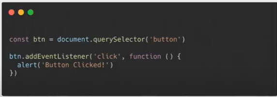
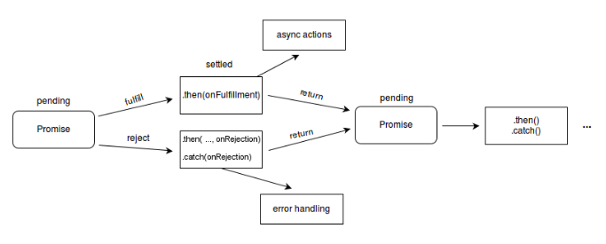
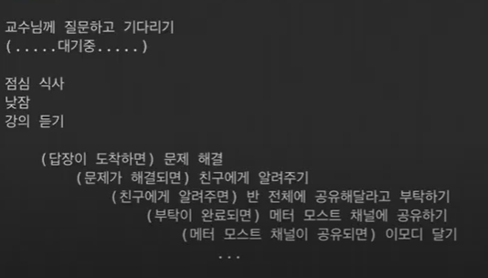
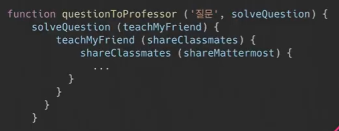
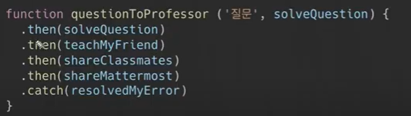
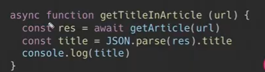
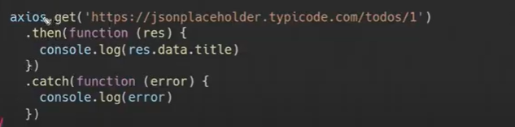
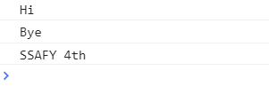

[TOC]


## JS 심화

### 출처: [yejinh.log](https://velog.io/@yejinh/%EB%B9%84%EB%8F%99%EA%B8%B0-%ED%8C%8C%ED%97%A4%EC%B9%98%EA%B8%B0) / [wally-wally](https://github.com/wally-wally/TIL/blob/master/06_js/%5BSSAFY%5DJavascript_%231.md)


✔️ **JS 함수는 `일급객체`** (cf. 파이썬도 `일급객체`)

- 일급 객체가 되기 위한 3가지 조건
  - 변수에 담을 수 있다.
  - 인자로 전달할 수 있다. `콜백함수`
  - 반환값으로 전달할 수 있다. `return n => n + 1`


✔️ **비동기식 처리 모델**

- 비동기식 = 병렬적 처리
- 호출될 함수 (콜백함수)를 미리 매개변수에 전달하고 처리가 종료되면 콜백함수를 호출하는 것.

______________


### 1.AJAX란?

AJAX의 강력한 특징은 페이지 전체를 리프레쉬하지 않고서도 수행되는 '비동기성'이다(리로드가 되지 않고도 수행됨). EVENT가 있으면 전체 페이지가 아닌 일부분을 업데이트 할 수 있게 해준다

	- 페이지 새로고침없이 서버에 요청
	- 서버로부터 데이터를 받고 작업을 수행


### 2.XHR이란?

XMLHttpRequest 객체는 서버와 상호작용하기 위해 사용된다. 전체 페이지의 새로고침없이도 url로부터 데이터를 받아올 수 있다. 이는 웹페이지가 사용하고 있는 것을 방해하지 않으면서 페이지의 일부를 업데이트할 수 있도록 해준다. XHR은 AJAX 프로그래밍에 주로 사용된다.


### 3. How JavaScript works


#### 1.Asychronous

기다려주지 않는다. 왜?

#### 2.Single Thread

이벤트를 처리하는 Call Stack이 하나뿐인 언어이다. 혼자서 일하기 때문. 그럼 어떻게 일해?

#### 3.Event Loop

Event Loop로 동작함


### 4. Event Loop

- Call Stack
  - 요청이 들어올때마다 해당 요청을 순차적으로 처리하는 스택형태의 자료구조
- Web API
  - 자바스크립트 엔진이 아닌 브라우저 영역에서 제공하는 API
- Task Queue
  - 콜백 함수가 대기하는 큐 형태의 자료 구조
- Event Loop
  - Call Stack에 현재 실행 중인 Task가 없는지 확인하고 Task Queue에 Task가 있는지 확인


### 5. Callback Function(~~모.르.겠.어~~)

 Function인데 다른 함수의 인자로 넘어가는 Function이다

> 
>
> //나중에 불러줘, 얘는 사용자가 클릭할때! 호출하는것이다. 그때가 결국 CallBack! 불러달라고 하는 때. 우리가 직접적으로 함수호출을 하는게 아니라 시스템에 의해서
>
> 콜백function은 많이 쓰인다. 기다려주지 않으니까 지금 시점이 아니라 언젠가 사용, 그래서 콜백으로 쓸 수 밖에 없는 케이스가 많이 생긴다. 


#### callback 예제1

```javascript
function test(f) {
	f()
}


test(function(){
	console.log('callback function!')
})
```

** test라는 함수는 함수를 인자로 받는다

** 대부분의 콜백함수는 이렇게 익명함수로 작성됨

(1) 아래에 위치한 test 함수를 호출한다.

(2) 전달된 함수는 1행의 test 함수의 매개변수 f에 저장이 된다

(3) 그리고 f()를 호출하고 있다.

(4) f()는 전달된 함수의 console.log 메세지를 찍는다.


#### callback 예제2

```javascript
var loading = function(path,done) {
    console.log('전달받은 경로':',path)
    done(path+'sample.txt')
}

loading('/folder/text/', function(result) {
    console.log('완료! :', result)
})
```

loading이라는 변수에 함수가 저장되어 있다. 이 함수는 path, done이라는 매개변수를 받는다. 6행에서 loading함수를 호출하며 path인자로 `'/folder/text/'`를 전달하고, done인자로는 함수를 전달하고 있다. 

1행에서 함수를 구현만 해두고, 6행에서 실제로 호출이 진행된다.

(1) path로 넘어간 데이터가 2행에서 출력: '전달 받은 경로 : /folder/text/'

(2) 콜백함수인 done 을 호출하며 기존의 path('/folder/text/') 에 'sample.txt.' 문자열을 이어서 전달한다. : /folder/text/sample.txt.'

(3) 전달된 이어진 문자열이 7행에서 출력 : '완료 ! : /folder/text/sample.txt. '


#### callback 예제3

```javascript
let first = 10;
let second = 20;
let result = 0;

function add (x , y){
	return x + y
}

function getResult(callback){
	setTimeout(function(){
    	result = add (first, second)
        console.log(result)
        callback()
    },500)
}

getResult(function(){
	first = 20;
    result = add (first, second);
    console.log(result)
})
```

위 코드에서 첫번째 console.log 와 두번째 console.log 의 값은 어떻게 찍힐까.


(1) getResult 라는 함수가 실행이되는데 이것은 0.5초 뒤에 실행이 된다.

(2) result 라는 값을 반환하기 위해 add 라는 함수를 통해서

first 값인 10 + second 값인 20 = 30이 result로 첫번째 console.log에 찍힌다.

(3) 그리고 호출된 함수에 first 값이 20 이기 때문에

first 값인 20 + second 값인 20 = 40이 result로 두번째 console.log에 찍힌다.


요즘도 많이 사용된다고는 하지만 고전적인 방식이며 *지옥이라 불리울 만큼* 치명적인 단점들을 가지고 있다.

1. 우선 **가독성이 매우 떨어진다.**
   만약 비동기 처리가 예제처럼 3개로 끝나지 않는다면 끝없이 옆으로 누운 피라미드를 그리게 될 것...
2. 에러처리를 한다면 **모든 콜백에서 각각 에러 핸들링**을 해주어야 한다.
   콜백의 깊이만큼이나 복잡해지는 에러처리... 만약 에러 처리 없이 진행한다면 콜백 함수가 호출되지 않아도 왜- 어디서- 에러가 발생했는지 알아내기가 쉽지 않다.


이러한 불편함을 해소하기 위해 ES6에서 비동기 흐름을 컨트롤하는 방법으로 **`Promise`** 객체가 등장한다.


### 6. `Promise` 객체

> Promise 객체는 **비동기 작업이 맞이할 미래의 완료 또는 실패와 그 결과 값**을 나타냅니다.
> *출처 MDN*

Promise를 사용하여 비동기 작업이 (성공 혹은 실패로) 완료된 후의 결과 값을 받을 수 있다.
**결과 값을 돌려받을 수 있기 때문에 이후 처리를 컨트롤 할 수 있게 된다**

#### Promise의 상태 값

`Promise` 객체는 `new` 키워드로 생성할 수 있으며 총 4개의 상태 값을 가진다.

```shell
Pending: 아직 결과 값이 반환되지 않은 진행 중인 상태

fulfilled: 성공

Rejected: 실패

Settled: 결과 값이 성공 혹은 실패로 반환된 상태
```

상태 값은 크게 `Pending`과 `Settled`로 나눌 수 있으며,
`Settled`은 다시 `fulfilled`와 `Rejected`로 나누어 진다. 

**한번 `Setteld`된 값은 재실행 할 수 없다.**


**생성**

`Promise`는 함수를 인자로 받으며 인자로 들어온 함수는 다시 `resolve`와 `reject` 2개의 함수를 인자로 받게 된다. `resolve` 는 비동기 처리 성공 시 호출되며 `reject`는 비동기 처리 실패시 호출 된다.

코드로 보면 아래와 같은 모습이다.

```javascript
const promise = new Promise(function(res, rej) {
  setTimeout(function() { // 비동기로 진행되는 코드
    res(111);
  }, 1000);
});

// 화살표 함수로 작성해도 동일하다.
cosnt promise = new Promise((res, rej) => {
  setTimeout(() => {
    res(111);
  }, 1000);
});
```

**`new Promise`로 생성된 인스턴스 객체는 '객체'이기 때문에 위와 같이 변수로 할당하거나 함수의 인자로 사용할 수 있다.**


#### 사용

인스턴스 호출 시에는 대표적으로 `then`과 `catch` 메소드를 사용한다.

#### resolve시 then으로

resolve되는 값은 then 메소드의 인자로 넘어간다.

```javascript
const promise = new Promise((res, rej) => {
  setTimeout(() => {
    res(111);
  }, 1000);
});

promise
  .then(res => console.log(res));

// 출력값
111
```


#### reject시 catch로

반대로 reject되는 값은 catch 메소드의 인자로 넘어가서 에러 핸들링을 할 수 있다.

```javascript
const promise = new Promise((res, rej) => {
  setTimeout(() => {
    rej('error!');
  }, 1000);
});

promise
  .then(res => console.log(res))
  .catch(err => console.error(err));

// catch 메소드에 잡혀서 console.error에서 출력된 값
error!
```

 
여기서 하나 또 중요한 점은 **`then` 메소드는 다시 `Promise`를 반환한다**는 것이다.

`Promise` 객체를 반환한다는 것은 `then`, `catch`메소드를 사용할 수 있다는 것을 뜻하며, 이를 통해 연속적으로 `then`메소드를 사용하여 `Promise chaining`이 가능하다는 것을 의미한다.




### 6. 비동기식 처리 모델

#### 1.Synchronous(동기식 처리 모델)

​	교수님께 질문하고 무한 기다리고(til prof answer me)

- 직렬적으로 테스크를 수행
- 테스크는 순차적으로 실행되며 어떤 작업이 수행중이면 다음 작업은 대기
- 예) 서버에서 데이터를 가져와서 화면에 표시하는 작업을 수행할 때, 데이터가 응답될 때까지 이후 테스크들은 **블로킹(blocking)**된다.


#### 2. Asynchronous(비동기식 처리모델)

교수님께 질문하고 기다리기(점심식사->낮잠->강의듣기->(답장오면)문제 해결 -> (문제 해결되면)친구에게 알려주기(이걸 콜백func으로 한다) ~하면 ~한다. 내가 언제 일이 완료되는지 알 수가 없으니까! 

- 병렬적으로 테스크를 수행
- 테스크는 종료되지 않는 상태라 하더라도 대기하지 않고 다음 테스크를 실행
- 예) 서버에서 데이터를 가져와서 화면에 표시하는 작업을 수행할 때, 데이터가 응답될 때까지 **기다리지 않고(non-blocking)** 즉시 다음 테스크를 수행
- JS 대부분의 DOM 이벤트와 Timer 함수, Ajax 요청은 비동기식 처리 모델로 동작





이 구조가 콜백으로 만들 수 있다(like below)





이렇게 가다보면 Callback hell에 빠질 수 있다. 디버깅 매우 어려워짐. 이를 방지하기 위해 Promise 등장


- 이벤트 루프
  - 단 한가지 **콜스택**과 **콜백큐**를 감시하는 역할만 한다.
  - 만약 콜스택이 비어 있으면 이벤트 루프는 콜백큐에서 첫 번째 이벤트를 가져다가 콜스택에 밀어 넣고, 결과적으로 해당 이벤트가 실행된다.
  - 이러한 반복은 이벤트 루프에서 `tick`이라고 한다.
  - 이벤트 루프는 호스팅 환경(브라우저 or nodejs)에 내장된 메커니즘(JS 엔진에 있는게 아니다.)
  - 이것은 시간의 흐름에 따라 코드의 수행을 처리하며 그 때마다 JS 엔진을 작동 시킨다.


### 7. Promise

Promise는 약속이다. 무슨 약속? 미래의 성공or실패를 약속하는 것이다. 위의 예제에서 문제가 해결이 안될 수 도 있고, 친구에게 못알려줄수도 있고. 결국은 되거나 안되거나




- `.then(doSomething)`: ()안에 callbackfunction, 성공하면 무엇을 할지 callback 으로 넣어줌
- `.catch(doSomething)`: 실패하면 에러를 잡자! 역시 Callbackfunc이 들어가야함


### 8.async & await

실제 내부는 동기적으로 실행되지만, 우리가 볼때는 그냥 아래처럼 실행되게 보이게 하는 문법적 설탕이 async & await이다.




>  흐름 정리
>
> async,single thred, event loop
>
> 비동기적으로 동작하는건 콜백함수를 통해서 실행할 수밖에없다(언제 실행될지 모르니까)
>
> ~~하면 ~한다. ~가 콜백함수. 근데 또 ~에 달려있는게 있을 수 있다. 꼬리잡기처럼. 계속 콜백이다. 콜백이 꼬리의 꼬리를 물고 가면 -> callback hell
>
> To get out of Callback Hell, 'Promise concept' 프로미스는 성공과 실패에 대한 약속을 하는건데, 성공하면 `.then()`안에 콜백으로 표현하고 실패하면 `.catch()`안에 콜백
>
> 또 여기에 더해서 async, await / chaining의 복잡성, 그리고 클리어하게 동기적으로 보이게 하기 위해서! 


### 9. Axios

- `axiosXHR`을 요청으로 보내고 응답 받은 결과를 `Promise 객체`로 반환 해주는 라이브러리
- axios는 현재 JS 에서 가장 HOT한 라이브러리 중 하나이며 프론트엔드 프레임워크(react, vue)에서 데이터를 주고 받을 때 필수적으로 사용되고 있음(프론트엔드 프레임워크와 API 서버 간의 데이터를 주고 받을 때!)
- `npm install axios` 로 axios 라이브러리 설치
- 기본 axios 틀

```javascript
const axios = require('axios') // JS에서 import하는 방법

axios.get('http://jsonplaceholder.typicode.com/posts')
  .then(response => {
    console.log(response)
  })
  .catch(err => { // 요청이 잘못되었을 때
    console.log(err)
  })
```


**[실습] 랜덤 강아지, 고양이 이미지 가져오기**

```html
  <script src="https://cdn.jsdelivr.net/npm/axios/dist/axios.min.js"></script>
  <script>
    const API_URI = 'https://dog.ceo/api/breeds/image/random'
    
    function getDog () {
      // axios를 사용하여 API_URI로 GET 요청을 보낸다.
      //get요청을 보낼려면 이렇게 해야한다-외우기
      // .then 메서드를 통해 요청이 성공적인 경우의 콜백함수를 정의한다.
      // 응답객체의 데이터에서 이미지에 대한 리소스를 img 요소의 src 속성으로 할당한다.
      axios.get(API_URI)
          .then((res) => {
         //()안에 있는게 통째로 callback함수이므로, 먼저 res를 console로 찍어서
          //url이 어디있는지 확인하자
        //console.log(res), res가 data에 있네?
        const img_url = res.data.message
        // img 만들기
        const img = document.querySelector('img')
        //img의 src에 img_url
        img.src = img_url
      })

```


**[실습] 랜덤 강아지 이어붙이기, 그리고 누르면 삭제 **

```html
<body>
  <h1>Dog API</h1>
  <button>Get dog</button>
  
  <br>
  
  <script src="https://cdn.jsdelivr.net/npm/axios/dist/axios.min.js"></script>
  <script>
    const API_URI = 'https://dog.ceo/api/breeds/image/random'
    
    function getDog () {
      //요청해서 url받아오기
      //이미지 추가하기
      axios.get(API_URI).then( (res) => {
        const img_url = res.data.message
        const newDogImg = document.createElement('img')
        //console.log(newDogImg)
        newDogImg.src = img_url

        const body = document.querySelector('body')
        body.appendChild(newDogImg)
        newDogImg.addEventListener('click',() => {
          newDogImg.remove()
        })
      })
    }

    const button = document.querySelector('button')
    button.addEventListener('click', getDog)
  </script>
</body>
</html>
```


> Promise based HTTP client for the browser and node.js
>
> Axio로 요청을 날리는 앤데, 프로미스를 기반해서 !! 




흐름 : axio야 .get요청 날려줘 어디로? ()로 그럼 프로미스라는걸 줄건데 .then과 .catch를 줄거다


_______________

### 99.실습.html


#### 00_javascript.html

```javascript
    //1.setTimeout
    function sleep3Seconds () {
      console.log('잘잤다!')
    }

    console.log('이제 잘거다!')
    // sleep3Seconds()
    setTimeout(sleep3Seconds, 3000)
    console.log('학교간다!')
```


이런 결과 나오는 이유는?(일어나지도 않았는데 학교감)

=> setTimeout은 EVENT Loop기반으로 뭔가 동작할때 web api라고 부르는 영역에 있음. call stack-> web api로 넘어감. 코드는 순차적으로 실행되자만 , 이건 결과적으로 task queue로 갔다가 이벤트 루프에 의해서 call stack으로 넘어감!! 그래서 저런 결과가 나온것임


#### 01_eventLoop.html

//[주의!] 3000이든 0이든 출력은 동일 - 이 시간은 콜백큐로 가는 시간이다. 비동기 처리가 모두 끝나야 출력된다!

```javascript
  <script>
    console.log('Hi')

    setTimeout(function ssafy () {
      console.log('SSAFY 4th')
    }, 3000)

    console.log('Bye')
  </script>
```

 

wrong idea : hi -> 3초 대기 -> bye -> ssafy 4th 가 찍힌다 

=> 이벤트 루프라는 메커니즘 안에서 동작하게 만들었기 때문에 이런 결과가 나오는 것! 이렇게 모두 자바스크립트 코드가 동작하는건 아니다(xhr, setinterval, settimeout 등등이 속한다.)


```shell
//sequence//

hi찍히고 -> web api에 넘김 -> bye 찍히고 -> setTimeout이라는 함수가 web api더러 3000ms 세라고 한다. 그래서 webapi는 받자마자 3초 세서 다 세면 task queue에 ssafy 함수를 올려놓고 -> 이벤트 루프가 봐서 콜스텍이 비어있으면 테스크큐에 있는 ssafy를 콜스택에 올려준다. -> 그럼 ssafy가 실행되고 ssafy 4th 출력 -> 종료

```


#### 02.callback_function

```python
def my_func(func):
    return func

def my_argument_func():
    return 'Hello My Func!'

result = my_func(my_argument_func) #얘기 리턴하는 값도 함수고, 인자로 넘어가는것도 함수, 그 값을 변수에 할당한다. 그럼 아까 봤던 변수에 할당할수있고, 리턴값으로 뱉을 수 있다, 인자로 갈수있다 이 조건 3개 모두 만족
print(result())
```

```python
#2. map
numbers = [0, 9, 99]

def plus_one(num):
    return num + 1

print(list(map(plus_one, numbers))) #map이라는 함수가 있는데 그 함수의 인자로 plus_one이라는 함수가 넘어가는 형태!
```


___________

**webex session**

single thread : js는 마치 사람마냥 한번에 한가지 일만 할 수 있다. 예를 들면, 손님이 온다. 주문을 받고 -> 주방에 전달 -> 음식을 서빙 -> 이런식

그런데 주문을 받고, 마냥 기다릴 수 없음. 맡겨 놓고, 할 일이 있으면 일을 해야함! 애초에 일하는 방식이 비동기적임. 주방에서는 받은 주문을 토대로 음식을 만듦. 

`비동기적`! 어떤 일을 했으면, 일->결과가 나올때까지 기다리지 않고 다음일을 시작하는 것, which is 비동기적.`동기적`은 결과가 나올때까지 기다림.

파이썬 코드로 이해해봅시다

```python
import requests
import json

#요청을 보냄, response에 담음, 결과값을 담길때까지
#진행하지 않음! 요청을 보내고 결과가 올때까지 기다림(in python)
#그런데 응답이 언제올지 보장할수없다. 그럼에도 파이썬에서는 기다림
#결과가 오면 결과를 프린트, 결과룰 json으로 만들고, !(모든건 결과를 기다리고 그 다음을 진행함)
response = requests.get('https://jsonplaceholder.typicode.com/todos/1')
# print(response.text)
# print(response.text.get('title'))

todo = response.json()
print(todo)
# todo_title = todo.get('title')

# print(todo_title)
```


이 프로세스가 이렇게 동작함에도 불구하고 불편하지 않았던 이유는? 결과를 담는 과정이 충분히 빨랐기 때문이다. 그동안 파이썬 코드를 작성한 방식이다.

그렇다면, 자바스크립트가 돌아가고 있는 브라우저의 상황을 봅시다.

사용자에게 화면을 보여주는 자바스크립트를 보자. 일이 한번 시작하면 그 일이 완료될때까지 기다리고, 기다리고 ,또 기다리고 이런식이면 어떻게 될까?

예를 들면 네이버라고 하자. 1.요청을 보낸다 -> 2.골격그린다 / 요청을 보내고 골격이 올때까지 브라우저가 아무것도 안하고 기다리고 있을까? (계속 로딩중? 다나감) 그래서 js는 이런식으로 일하면 안됨. 무조건 도와줄수있는 친구들에게 요청보내놓고 js는 할 수 있는 일을 해야함!


js가 친구들(브라우저, web api,,)에게 어떻게 일을 시킴? `callback`을 통해서

예를 들면, 클릭 이벤트가 발생하면 나한테 할일을 하라고 알려줘! 알려주는건 web api가 함. 사용자가 클릭함. 그러면? 그때 web api가 나한테 알려주고, 나는console.log('hello')를 출력함!! 


```javascript
setTimeout(function(){console.log('hello'),0)
```


손님이 들어와서 주문이 쌓이는 과정이 callStack이라고 한다. 

callstack은 직원이 해야할 목록!

web api가 필요한(시간이 필요한, 주방으로) 가는 걸 

주방에서 음식내놓는 건 taskqueue

사장은 eventloop

알바생은 js

알바생이 일을 하다가, settime(시간을 세야함)하면 web api로 보냄. 그리고 hello을 갖고있다가 3초있다가 선반에 올려놓음. 선반에 올려놓으면 내가 일을 처리해야함. 근데 하고있는일이 계속 있어? 그럼 일을 못함. 그래서 callstack이 빌떄까지 기다리고, 만약에 다 일이 비면, 이벤트루프가 그 일을 callstack에 집어넣고, 알바생이 일을 계속 함

또한 아래처럼 콜백이 아래처럼 중첩될 수 있다!

```javascript
//콜백안에 콜백이 있는 경우

setTimeout(()=>{
   setTimeout(()=>{
       
   },3000)
},3000)
```

__________

