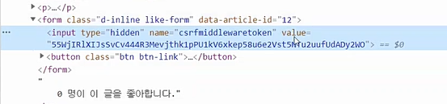

[TOC]


## 좋아요 AJAX

**Logic**

```SHELL
1. like 버튼을 누르면
2. js가 요청을 한다
3. 요청을 받는것은 django의 like 부서이다.
4. like부서는 좋아요를 처리(db에다 그렇게 씀) 응답으로
	지금 요청을 한 애가 좋아하는지 여부, 이 글을 좋아하는 사람 수 두가지 정보를 준다
	
5. js는 응답을 받아서 
6. 좋아요 버튼 색깔과 사람 수 숫자 바꾼다
```

강아지 사진 받아오는 로직을 생각해보자

```shell
1. getDog버튼 누르면
2. 강아지 사진 url 받을 수 있는 api 서버에 요청을 하고
3. 응답이 오면
4. 강아지 사진을 url을 통해 보여준다.
```


차이는 요청을 하는 것은 똑같음(like button, getDog) 근데 어제는 서버는 안만들었는데, 오늘은 서버까지 만드는 것이다. 원하는 응답이 올 수 있게 서버를 고치고, 그 다음부터는 똑같다. 

응답을 받아서 html태그를 바꾼다(both same)

______


### 좋아요 code sequence


일단 like 버튼을 갖고 와야한다. 버튼이 어디있지? 버튼은 폼안에 있다. 버튼을 눌렀을때 index.html에 있는 form action에 있는 url로 post요청이 갈 것이다. 근데 우리는 이걸 원하는게 아니다. 이렇게 되면, 브라우저의 부서가 일을 하게 되고, 페이지가 새로고침되고, 이런식으로 된다. 

그렇다면 이것을 막기 위해서 어떻게 해야할까? 

일단 form안에 있는 method, action을 없앤다. 그럼에도, 버튼을 누르면 form의 기본 동작인 get 요청으로 새로고침 된다. (이것을 자바스크립트에서 막을 수 있다)

어쨌든 form태그 자체를 갖고 와야 한다. 그런데 index페이지에 form태그가 많다. 그 중에서 딱 좋아요가 있는 form태그만 갖고와서 작업을 할려면 어떻게 해야할까? 

폼태그안에 클래스를 줄 수 도있고, id를 줄 수 도있다. 그런데 id를 주는건 안됨. id로 지정을 하게 되면 1,2,3,4,,가 아니라 1,2,3,10 이런식으로 중간에  빠질 수도있다. 그리고 또 id는 하나여야함(유저의 팔로우 처럼) 그래서 클래스를 준다. `like-form`!

그럼 내가 만든 모든 좋아요 폼이 `like-form`클래스를 가진 채로 렌더링이 된다. 그럼 나는 모든 폼을 다 불러와서 한번에 관리할 수 있게 된다. 만족하는 폼 여러개를 모두 갖고 온다. (`querySelectorAll()`)


#### **index.html**

```html
<form class="d-inline like-form" data-article-id="{{article.pk}}"> 
      
      
        <button class="btn btn-link">
           #5-1
          <i id='like-btn-{{article.pk}}' class="fas fa-heart fa-lg" style="color:crimson;"></i>
        </button>
      
        <button class="btn btn-link">
          <i id ="like-btn-{{article.pk}}" class="fas fa-heart fa-lg" style="color:black;"></i>
        </button>
      
    </form>
    <span id='like-count-{{article.pk}}'>{{ article.like_users.all|length }}</span> 명이 이 글을 좋아합니다.<br>
    <a href="">[detail]</a>
    <hr>

```


그럼 like-form 클래스를 가진 모든 폼들을 갖고 오게 된다. forms는 배열의 형태이다. 그럼 이 배열인 forms의 각각 요소에 기본 동작인 submit이 발생하지 않게 막아주자. 그 이후에, submit 할때 like에 요청을 보내서 응답이 오면 색깔, 숫자를 수정하자

각각 폼에 무슨 일을 해야하니까, `forEach` 메서드를 써야한다. 

각각의 form에다가 submit될때, 우리가 원하는 일들을 하게 만들자. 


일단 

1. 기본 이벤트 동작을 막자 `event.preventDefault()`

   이렇게 하면 버튼을 눌러도 아무일도 일어나지 않는다. 

2.  그리고 post요청을 보낼건데, 그때 어떤 article인지 articleId를 알아야 한다!

   현재는 article id가 뭔지 모른다. 어떻게 하면 알 수 있을까?

   index.html로 가서 form태그를 보자. 여기에는 아직 article id에 대한 정보가 담겨져 있지 않다. 그래서 `<form class="d-inline like-form" data-article-id="{{article.pk}}"> `이렇게 하면 form 태그에 원하는 이름(data-article-id)으로 지정할 수 있다. 

   즉, form 태그안에 data 속성을 준 다음 이것을 나중에 class를 js에서 쓴 것처럼 js에서 가져와서 쓸 수 있다. 이렇게 되면 폼태그 하나하나 마다 article id라는 속성이 담겨져 있다. 

   js에서 `form.dataset.articleId`이렇게 뽑을 수 있다. article-id => articleId로 바꿔줌

3. axios로 post요청을 보낼때, url을 쓰고 그다음에 csrf토큰을 같이 줘야 함. 따라서 헤더를 같이 넘겨줘야 한다. 즉, 헤더에다 정보를 담아서 줄 수 있다는 것! 

   3-1.

   장고에서는 csrf토큰을 덤으로 담아서 보내달라고 함! input 태그를 갖고 와야 그 안에 들은 value를 갖고 올 수 있음. (그림 참고) 그리고 한페이지 안에있는 csrf값은 항상 같은 값이다. 

   

   이 태그를 갖고와서 `const csrfTokenInput = document.querySelector('input[name="csrfmiddlewaretoken"]')`

   그리고 이 value값을 알아내기 위해서는 `.value`를 쓰면 된다. 

   `const csrftoken = csrfTokenInput.value`

   3-2.

   그리고 3-2아래처럼 쓴다. 이렇게 헤더에 담아서 보내줘야 함

   그렇게 하면 마침내 js가 요청을 보낸것

4. 그리고 응답으로 2개의 정보(좋아요를 했는지 or not / 몇명이 좋아요했는지 )를 응답으로 넘겨줘야 한다. 따라서 view함수를 수정하자!

   `liked=False` `liked=True` 추가해서 유저가 이 아티클을 좋아하는지 아닌지에 대한 정보fmf context에 담아서 넘겨주고

   또 `'followers_count':article.like_users.count(),`로 몇명이 이 아티클을 좋아하는지에 대해 넘겨준다. 이 딕셔너리에 대한 정보를 리턴해줘야 하는데, 이 딕셔너리를 리턴할건데 `from django.http import jsonResponse`를 import해준다. 이건 html response가아니라 json response를 주는 역할이다. 이전에 강아지 사진 보내주는 api 서버에 요청을 했을때 , json데이터를 받았다.

   똑같이 우리 서버도 json데이터를 보내줄건데 그 json데이터를 보내주기 위해서는 json response를 써야한다(in django) 

   => ` return JsonResponse(context)`

5. 그리고 응답을 받은 다음 마지막으로 해야 할 것은 좋아요 버튼이 바뀌는 것,그리고 몇명이 좋아요 하는지 아는 것! 

   5-1.

   그래서 일단 좋아요 버튼을 갖고와야함. 하트색 바꾸자

   `<i id='like-btn-{{article.pk}}' class="fas fa-heart fa-lg" style="color:crimson;"></i> `이렇게 id값을 줘서 어떤 아티클을 좋아요하는지!를 가져오게 준비하고, 

   또 몇명이 좋아요하는지 카운트해야하는데 그건 `span`태그에 id를 주고 가져오자

   5-2.

   `const likeBtn = document.querySelector(`#like-btn-${articleId}`)`

   `const likeCount = document.querySelector(`#like-count-${articleId}`)`


#### **base.html**

```html
  <script src="https://cdn.jsdelivr.net/npm/axios/dist/axios.min.js"></script>
  <script>
    const forms = document.querySelectorAll('.like-form')
	//3-1
    const csrfTokenInput = document.querySelector('input[name="csrfmiddlewaretoken"]')
    const csrftoken = csrfTokenInput.value

    forms.forEach(form => {
      form.addEventListener('submit',(event) => {
        //1.요청막았다
        event.preventDefault()
        //2.data-article-id로 인덱스.html => 여기로 가져옴
        const articleId = form.dataset.articleId
        //3-2.axios요청을 보낼때 header를 같이 보내줘야 함(rule)
        axios
        .post(
          `/articles/${articleId}/like/`,
          {},
          {headers: {'X-CSRFToken': csrftoken}}
        )
        //4.
        .then((response)=>{
			
            //5-2
            const likeBtn = document.querySelector(`#like-btn-${articleId}`)
            const likeCount = document.querySelector(`#like-count-${articleId}`)

            // if (response.data.liked) {
            //   likeBtn.style.color = 'crimson'
            // } else {
            //   likeBtn.style.color = 'black'
            // }
            likeBtn.style.color = response.data.liked ? 'crimson':'black'
            likeCount.innerText = response.data.count
          })
      })
    })
  </script>
</body>
</html>
```


#### **articles/views.py**

//4

```python
@require_POST
def like(request, article_pk):
    context = {
        'error' : 'unauthorized'
    }
    if request.user.is_authenticated:
        article = get_object_or_404(Article, pk=article_pk)
        user = request.user

        if article.like_users.filter(pk=user.pk).exists():
        # if user in article.like_users.all():
            article.like_users.remove(user)
           	#좋아요x
            liked = False
        else:
            article.like_users.add(user)
            #좋아요o
            liked=True
        # 이 유저가 현재 좋아하는지 안좋아하는지
        context = {
            'liked':liked,
            'followers_count':article.like_users.count(),
        }
    #json 리스펀스 쓰기 위해서 !
    return JsonResponse(context)
```


____________________


## Follow AJAX

**logic**

```shell
1. follow 버튼을 누르면
2. js가 요청을 한다
3. 요청을 받는것은 django의 follow 부서이다.
4. follow 부서는 좋아요를 처리(db에다 그렇게 씀) 응답으로
	지금 요청을 한 애가 팔로우하는지 아닌지 여부, 팔로우 두가지 정보를 준다
	
5. js는 응답을 받아서 
6. 좋아요 버튼 색깔과 사람 수 숫자 바꾼다
```


### Follow code sequence

base.html에 `block script`로 하고(이렇게 안하고 좋아요와 팔로우 js를 base.html에 모두 썼더니 오류가 났음), `_follow.html`로 가자. 

```javascript
<div class="jumbotron text-center text-white bg-dark">
  <p class="lead mb-1">작성자 정보</p>
  <h1 class="display-4">{{ person.username }}</h1>
  <hr>
  
    <p class="lead">
      팔로잉 : <span id = "followings-count-{{person.pk}}">{{ followings|length }}</span> / 팔로워 : <span id = "followers-count-{{person.pk}}">{{ followers|length }}</span>
    </p>
    <!-- 팔로우 버튼 -->
    
		//3-1
      <form class="d-inline follow-form" data-user-pk='{{person.pk}}'>
        
        
          <button id='follow-btn-{{ person.pk }}' class="btn-secondary btn-lg" role="button">Unfollow</button>
        
          <button id='follow-btn-{{ person.pk }}' class="btn-primary btn-lg" role="button">Follow</button>
        
      </form>
    
  
```


```javascript
  <script>
    
     //5
    const csrfTokenInput = document.querySelector('input[name="csrfmiddlewaretoken"]')
    const csrftoken = csrfTokenInput.value
	
    //1
    const follow_form = document.querySelector('.follow-form')
    follow_form.addEventListener('submit', (event) => {
      //2
      event.preventDefault() 
      //3-2
      const userPk = follow_form.dataset.userPk
      
      //4
      axios
      .post(
        `/accounts/follow/${userPk}/`,
        {},
        {headers: {'X-CSRFToken': csrftoken}},
      )
      //5
      .then((response) => {
        //
        const followBtn = document.querySelector(`#follow-btn-${userPk}`)
        const followersCount = document.querySelector(`#followers-count-${userPk}`)
        //7
        followersCount.innerText = response.data.followers_count
        //8
        followBtn.innerText = response.data.followed ? 'Unfollow' : 'Follow'
        followBtn.className = response.data.followed ? 'btn-secondary btn-lg' : 'btn-primary btn-lg'
      })
    })
    </script>
```


위의 시나리오를 생각하면서 코드를 작성하자. 

1. 일단 팔로우 버튼을 갖고 와야 한다. 

2. 그리고 버튼을 눌렀을때 기존의 form태그의 기본 속성인 submit요청을 막아야 한다. 

3. 어떤 유저를 팔로우할지를 알아야 함. 그래서 follow의 form 태그 옆에 

   `<form class="d-inline follow-form" data-user-pk='{{person.pk}}'>`추가한다. 

   그리고 3-2처럼 userPk를 갖고온다.

4. axios야 post요청을 보내줘. `/accounts/follow/${userPk}`로. 그리고 pos요청이기 때문에 csrf토큰을 같이 보내줘야 하는데, 4와 같은 형식으로 쓴다. 여기까지가 요청이다.

5. 그리고 응답으로 좋아요 버튼 색깔 변화, 몇명이 얘를 팔로우하고 있는지 숫자 변화(+1 or -1)를 나타내줘야 한다.

   그래서 view함수를 고쳐야 한다. 두개의 정보가 응답으로 올 수 있게!

   **views.py**

   ```python
   def follow(request,user_pk):
       context = {
           'error':'unauthorized',
       }
       if request.user.is_authenticated:
           person = get_object_or_404(get_user_model(), pk=user_pk)
           user = request.user
           if person != user:
               if person.followers.filter(pk=user.pk).exists():
                   person.followers.remove(user)
                   followed = False
               else:
                   person.followers.add(user)
                   followed = True
           context = {
               'followed':followed,
               'followers_count':person.followers.count(),
           }
       return Jresponse(context)
   ```

6. 그리고 팔로우 버튼과 몇명이 팔로워인지 나타내야되기 때문에 form태그로 가서 

   수정1

   ```html
   <button id='follow-btn-{{ person.pk }}' class="btn-secondary btn-lg" role="button">Unfollow</button>
           
             <button id='follow-btn-{{ person.pk }}' class="btn-primary btn-lg" role="button">Follow</button>
   ```

   

   수정2

   ```html
   `팔로워 : <span id = "followers-count-{{person.pk}}">{{ followers|length }}`
   ```


7. 그리고 버튼 갖고오고(followBtn), 숫자 갖고온다(followerCount)

   숫자에는 innertext로 response로 넘어온 followers_count를 넣어줌

8. 그리고 언팔했으면 언팔로우로 수정, 버튼색깔도 회색으로 해줘야함(반대경우 same)

   ```javascript
   followBtn.innerText = response.data.followed ? 'Unfollow' : 'Follow'
           followBtn.className = response.data.followed ? 'btn-secondary btn-lg' : 'btn-primary btn-lg'
   ```

