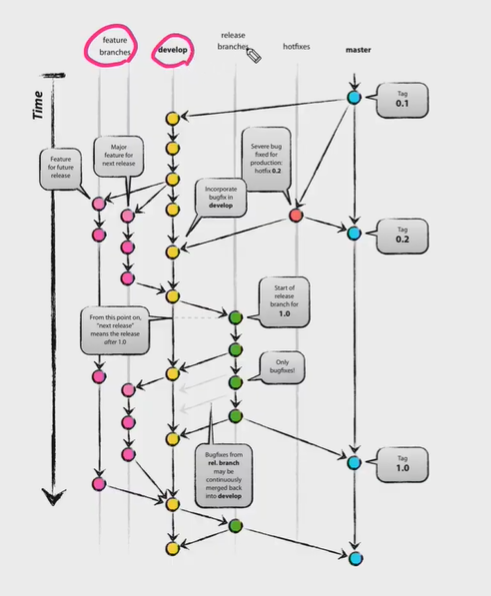

## 1016_PJT

- master : 제품으로 출시될 수 있는 브랜치
- develop : 다음 출시 버전을 개발하는 브랜치
- feature : 기능을 개발하는 브랜치
- release : 이번 출시 버전을 준비하는 브랜치
- hotfix : 출시 버전에서 발생한 버그를 수정하는 브랜치

> 마스터가 가장 중심이 되는 브랜치임. 함부로 테스트하지 않는다.




## pjt sequence

p1이 코드를 수정하려고 하면, 마스터브랜치에서 하면 안된다. 자기의 브랜치로 따로 빼야 한다.

`git branch feature/nav`

`git switch feature/nav`


`git add .`

`git commit -m 'nav'`


p2는 footer를 수정하려고 한다. 

`git branch feature/footer`

`git switch feature/footer`

`git add .`

`git commit -m 'footer'`


status : 마스터브랜치 init => p1은 feature/nav라는 브랜치 만들고, 거기에 commit 쌓고/p2는 feature/footer 만들어서 거기에 commit을 쌓은 상태이다. 아직 마스터 브랜치에는 반영되지 않은 상태이다. 


p1이 push한다. `git push origin feature/nav`

p2도 push한다. `git push origin feature/footer`


그 다음 merge request를 한다. 

**p1**

그리고 `git switch master`로 이동하고, feature/nav branch 삭제한다(`git branch -d feature/nav`)

이때 merge가 된 상태라서 지울 수 없다는 에러코드가 나온다.

이럴때는 최신 정보를 먼저 갖고와서 이 두개가 병합에 문제가 없는지 확인한 이후 지워야 한다. (`git pull orgin master`, 마스터에서 최종적으로 합쳐졌던 코드가 반영된다. 

그 다음 `git branch -d feature/nav`로 지운다. 

**p2**

`git switch master` -> `git branch -d feature/footer`-> git log --online 

을 하면 p1과 p2의 커밋기록, 화면이 똑같은 것을 알 수 있다.


______

### conflict

> p1가 title정보를 수정하고 싶어서 `git branch feature/title`만들어서 코드 수정하고, commit하고, git push origjn feature/title한다. 
>
> 그런데 p2도 동시에 이생각을 한다고 가정. p2도 같은 코드를 수정해서 위와 같은 과정을 진행한다. 
>
> => 브랜치가 총 3개가 있고, 1개를 먼저  merge 한다. 이건 문제가 없다. 반영이 된다. 그런데 p2도 merge request를 하려고 하는데 그때 충돌이 된다. 

이 경우, 충돌 해결 버튼을 클릭하고, discuss => select one

p1은 master로 이동하고, pull하고, branch 삭제한다. p2도 같은 과정을 반복


__________


```shell
1/ 팀원 중 1명 lab ssafy project 생성

2/pjt 06(배포된 것)에서 + 기본셋팅

3/git init, remote add, commit, push 

4/labssafy 멤버에 팀원 메인테이너로 초대

5/팀원들도 clone해서 준비

6/각자 기능을 개발하기 시작할때 `git branch`로 브랜치 만든다.

7/기능 개발 => commit

8/기능 개발이 완료되면 git push origin 'feature/newFunction'

9/merge request 날린다.

10/팀원에게 이 사실을 공유

11/팀원이 mr을 보고 문제가 있지 안은지 확인 

12/문제가 없다면 merge => master에 새로 개발한 기능이 적용된 상태이다

13/또 다른 기능 개발을 시작할때 먼저 git pull orgin master를 해야한다
	(내 master가 병합이 안된 상태이기 때문에 labssafy에 있는애를 땡겨와서 최신화 )

14/내 최종 제출 직전 -> gitignore에서 db.sqlite3 -> 지움

15/dq.sqlite3를 add commit push
```

