[TOC]

## JS 문법

### 1-1. `let`, `const`, `var` 

#### (1) `const`(상수)

- 값이 변하지 않는 상수(담긴 값이 불변임을 뜻하는건 아니다)

- 단지 상수의 값은 재할당할 수 없고 재선언도 안된다

- 블록 유효 범위(block scope)를 가진다

- const는 선언시에 초기값을 생략하면 오류가 발생한다

  **반드시 선언과 동시에 할당이 이루어져야 한다** or, raise SyntaxError

  ```javascript
  const FOO; // SyntaxError: Missing initializer in const declaration
  ```

- const 예시

  ```javascript
  const MY_FAV = 7 
  
  
  console.log('my favorite number is:' + MY_FAV) //7출력
  
  //상수 재할당하려는 시도는 오류 발생
  //MY_FAV = 20 위에 이미 할당되어 있으므로 재할당 불가능
  
  //상수를 재선언하려는 시도는 모두 오류 발생
  //const MY_FAV = 20 재선언안되니까 has already been declared 오류 발생
  // let MY_FAV = 20 - MY_FAV 자체를 const로 먹고 있기 때문에 오류 발생
  // var MY_FAV = 20 - 이것도 불가능
  
  if (MY_FAV === 7){
      // 블록 유효 범위로 지정된 MY_FAV이라는 변수를 만드므로 괜찮다.
      // 즉, 전역이 아닌 범위 안이므로 이름 공간에서 충돌이 나지 않는다.
      // 여기서 CONST는 새로은 블록 유효 범위이므로 const MY_FAV = 20 으로 해도 출력됨
      let MY_FAV = 20
      
      console.log('my favorite number is :' + MY_FAV) //20츨력 
  }
  
  console.log(MY_FAV)//7출력 
  ```


#### (2) `let` (변수)

- 값을 재할당할 수 있는 변수를 선언
- 단, 각 변수는 한번만 선언할 수 있다(할당은 여러번 가능)
- 블록 유효 범위(block scope)를 가진다
  - if문, for문, 함수와 같이 중괄호 내부가 블록 유효 범위에 해당

- let 예시

  ```javascript
  let x = 1
  
  if (x === 1) {
  	let x = 2 
      let x = 3 //불가능
      console.log(x) //2
  }
  
  console.log(x) //1
  ```


#### (3) `var`(변수)


___

##### *let,const와 블록레벨 스코프*

> 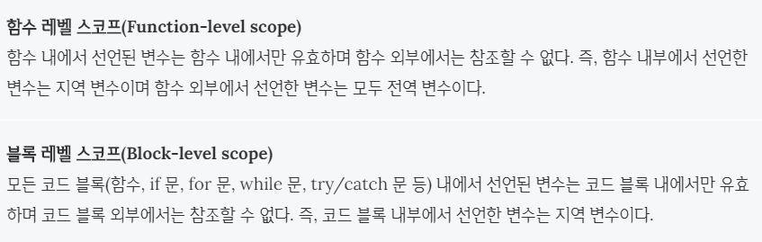
>
> 대부분의 프로그래밍 언어는 블록 레벨 스코프(Block-level scope)를 따르지만 자바스크립트는 함수 레벨 스코프(Function-level scope)를 따른다.
>
> **(1) 예제**
>
> ```javascript
> var foo = 123; // 전역 변수
> 
> console.log(foo); // 123
> 
> {
>   var foo = 456; // 전역 변수
> }
> 
> console.log(foo); // 456
> ```
>
> 블록레벨 스코프를 따르지 않는 var 키워드의 특성상, 코드 블록 내의 변수 foo는 전역변수이다. 그런데 이미 전역 변수 foo가 선언되어 있다. var 키워드를 사용하여 선언한 변수는 중복 선언이 허용되기 때문에 위의 코드는 문법적으로 문제가 없다. 단, 코드 블록 내의 변수 foo는 전역변수이기 때문에 전역에서 선언된 전역 변수 foo의 값 123을 새로운 값 456으로 재할당하여 덮어준다.
>
> 
>
> ES6은 블록레벨스코프를 따라는 변수를 선언하기 위해 `let`키워드를 제공한다.
>
> **(2) 예제**
>
> ```javascript
> let foo = 123; // 전역 변수
> 
> {
>   let foo = 456; // 지역 변수
>   let bar = 456; // 지역 변수
> }
> 
> console.log(foo); // 123
> console.log(bar); // ReferenceError: bar is not defined
> ```
>
> let 키워드로 선언된 변수는 블록 레벨 스코프를 따른다. 위 예제에서 코드 블록 내에 선언된 변수 foo는 블록 레벨 스코프를 갖는 지역 변수이다. 전역에서 선언된 변수 foo와는 별개의 변수이다. 또한 변수 bar도 블록레벨 스코프를 갖는 지역변수이다 따라서 전역에서는 변수 bar를 참조할수 없다.
>
> 
>
> **(3) 예제**
>
>   let 키워드로는 동일한 이름을 갖는 변수를 중복해서 선언할 수 없다. 변수를 중복 선언하면 문법에러가 발생한다(var 키워드로 동일한 이름을 갖는 변수를 중복해서 선언할 수 있다)
>
> ```javascript
> var foo=123;
> var foo=456; // 중복 선언 허용
> 
> 
> let bar=123;
> let bar=456;// Uncaught SyntaxError: Identifier 'bar' has already been declared
> ```
>
> 
>
> ##### 호이스팅
>
> 자바스크립트는 ES6에서 도입된 let, const를 포함하여 모든 선언을 호이스팅한다. 호이스팅이란 var선언문이나 function 선언문 등을 해당 스코프의 선두로 옮긴 것처럼 동작하는 특성을 말한다. 
>
> 하지만 var 키워드로 선언된 변수와는 달리 let 키워드로 선변수를 선언문 이전에 참조하면 참조 에러 발생한다. 이는 let 키워드로 선언된 변수는 스코프의 시작에서 변수의 선언까지 일시적 사각지대에 빠지기 때문이다. 
>
> ```javascript
> console.log(foo); // undefined
> var foo;
> 
> console.log(bar); // Error: Uncaught ReferenceError: bar is not defined
> let bar;
> ```
>
> 
>
> 변수는 3단계에 걸쳐 생성된다.
>
> 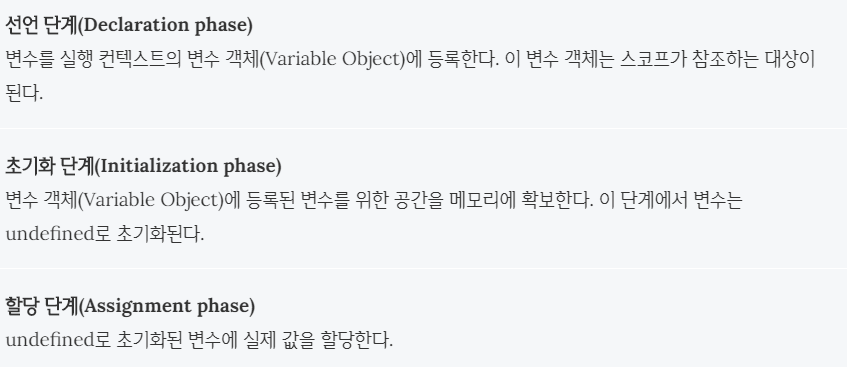
>
> **var 키워드로 선언된 변수는 선언 단계와 초기화 단계가 한번에 이루어진다.** 즉, 스코프에 변수를 등록(선언 단계)하고 메모리에 변수를 위한 공간을 확보한 후, undefined로 초기화(초기화 단계)한다. 따라서 변수 선언문 이전에 변수에 접근하여도 스코프에 변수가 존재하기 때문에 에러가 발생하지 않는다. 다만 undefined를 반환한다. 이후 변수 할당문에 도달하면 비로소 값이 할당된다. 이러한 현상을 [변수 호이스팅(Variable Hoisting)](https://poiemaweb.com/js-data-type-variable#24-변수-호이스팅variable-hoisting)이라 한다.
>
> 
>
> ```javascript
> // 스코프의 선두에서 선언 단계와 초기화 단계가 실행된다.
> // 따라서 변수 선언문 이전에 변수를 참조할 수 있다.
> console.log(foo); // undefined
> 
> var foo;
> console.log(foo); // undefined
> 
> foo = 1; // 할당문에서 할당 단계가 실행된다.
> console.log(foo); // 1
> ```
>
> 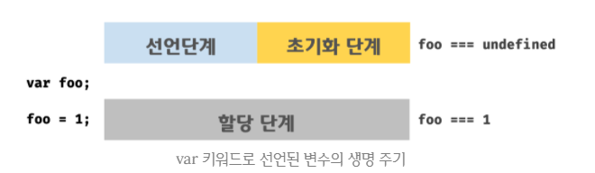
>
> **let 키워드로 선언된 변수는 선언 단계와 초기화 단계가 분리되어 진행된다.** 즉, 스코프에 변수를 등록(선언단계)하지만 초기화 단계는 변수 선언문에 도달했을 때 이루어진다. 초기화 이전에 변수에 접근하려고 하면 참조 에러(ReferenceError)가 발생한다. 이는 변수가 아직 초기화되지 않았기 때문이다. 다시 말하면 변수를 위한 메모리 공간이 아직 확보되지 않았기 때문이다. 따라서 스코프의 시작 지점부터 초기화 시작 지점까지는 변수를 참조할 수 없다. 스코프의 시작 지점부터 초기화 시작 지점까지의 구간을 ‘일시적 사각지대(Temporal Dead Zone; TDZ)’라고 부른다.
>
> ```javascript
> // 스코프의 선두에서 선언 단계가 실행된다.
> // 아직 변수가 초기화(메모리 공간 확보와 undefined로 초기화)되지 않았다.
> // 따라서 변수 선언문 이전에 변수를 참조할 수 없다.
> console.log(foo); // ReferenceError: foo is not defined
> 
> let foo; // 변수 선언문에서 초기화 단계가 실행된다.
> console.log(foo); // undefined
> 
> foo = 1; // 할당문에서 할당 단계가 실행된다.
> console.log(foo); // 1
> ```
>
> 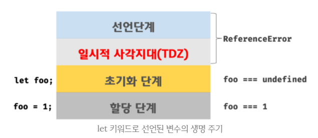
>
> 결국 ES6에서는 호이스팅이 발생하지 않는 것과 차이가 없어 보인다. 하지만 그렇지 않다. 아래 예제를 살펴보자.
>
> ```javascript
> let foo = 1; // 전역 변수
> 
> {
>   console.log(foo); // ReferenceError: foo is not defined
>   let foo = 2; // 지역 변수
> }
> ```
>
> 위 예제의 경우, 전역 변수 foo의 값이 출력될 것처럼 보인다. 하지만 ES6의 선언문도 여전히 호이스팅이 발생하기 때문에 참조 에러(ReferenceError)가 발생한다.
>
> ES6의 let으로 선언된 변수는 블록 레벨 스코프를 가지므로 코드 블록 내에서 선언된 변수 foo는 지역 변수이다. 따라서 지역 변수 foo도 해당 스코프에서 호이스팅되고 코드 블록의 선두부터 초기화가 이루어지는 지점까지 일시적 사각지대(TDZ)에 빠진다. 따라서 전역 변수 foo의 값이 출력되지 않고 참조 에러(ReferenceError)가 발생한다.
>
> 
>
> |       | 할당    | 선언    | 스코프      |
> | ----- | ------- | ------- | ----------- |
> | var   | 자유    | 자유    | 함수 스코프 |
> | let   | 자유    | 한 번만 | 블록 스코프 |
> | const | 한 번만 | 한 번만 | 블록 소크포 |

__________


### 1.2 식별자(identifier)

- 변수명은 식별자라고 불리며 특정 규칙을 따른다

  - 반드시 문자, 달러($), 또는 밑줄로 시작해야 한다. 이후는 숫자도 가능
  - 대소문자 구분하며 클래스명을 제외하고는 대문자로 시작하지 않는 것이 좋다.
  - 예약어는 사용 불가능(class,super,const,case,function)

- 식별자 작성 스타일

  ```javascript
  //1. 카멜 케이스(camelCase) - 객체, 변수, 함수
  let dog
  let variableName
  
  //배열인 경우는 보통 복수로 쓴다
  const dogs=[]
  
  //정규표현식의 경우 보통 소문자 r로 시작
  const rDecs = /.*/
  
  //함수
  function getPropertyName() {
      return 1
  }
  
  // boolean 을 반환하는 변수나 함수 - 'is'로 시작
  let isAvailable = false
  
  // 2. 파스칼 케이스(PascalCase) - 클래스, 생성자 (=== upper-camel-case)
  class User {
    constructor(options) {
      this.name = option.name
    }
  }
  
  // 3. 대문자 스네이크 케이스(SNAKE_CASE) - 상수
  // 이 표현은 변수와 변수의 속성이 변하지 않는다는 것을 프로그래머에게 알려준다.
  const API_KEY = 'avcavanfjnfsaecklnfealk'
  ```

  

### 1.3 hoisting 현상

> 위에 *let,const와 블록레벨 스코프* 참고하기

- 선언만 끌어올리고 할당은 끌어올리지 않는다.
- 끌어 올려진 변수는 `undefined` 값을 반환한다.
- 변수와 함수를 위한 메모리 공간을 확보하는 과정이다.


### 1.4 타입

#### (1) Primitive

> **불변하다**는 특징을 띄고 있다.

- `number`

  - `Infinity` : 양의 무한대와 음의 무한대로 나뉨
  - `NaN`  : Not a Number의 약자로 표현할 수 없는 값, 자기 자신과 일치하지 않는 유일한 값을 표현
    - 0/0, "문자"*10, Math.sqrt(-9)와 같이 표현할 수 없는 값

- `string`

- `boolean` 

  - true/false

- `null`

  - 값이 없음을 우리가 표현하기 위해서 인위적으로 사용하는 값

    ```javascript
    let last_name = null
    console.log(last_name) // null 출력 - 의도적으로 값이 없음을 표현
    ```

- `undefined`

  - 값이 없을 경우 js가 자동으로 할당해주는 값

    ```javascript
    let first_name //선언만 하고 할당안함
    console.log(first_name) // undefined 출력
    ```

- `symbol` (New in ECMAScript 6)

```javascript
// Number
var num1 = 1001;
var num2 = 10.50;

// String
var string1 = 'Hello';
var string2 = "World";

// Boolean
var bool = true;

// null
var foo = null;

// undefined
var bar;

// Object
var obj = { name: 'Lee', gender: 'male' };

// Array
var array = [ 1, 2, 3 ];

// function
var foo = function() {};
```


### 2.1 연산자

#### (1) 할당연산자

> [할당 연산자](https://developer.mozilla.org/ko/docs/Web/JavaScript/Reference/Operators/Assignment_Operators)는 오른쪽 피연산자의 값을 왼쪽 피연산자에 할당합니다. 기본적인 할당 연산자는 오른쪽의 피연산자 값을 왼쪽 피연산자 값에 할당하는 등호(`=`) 입니다. 즉 `x = y` 는 `y` 값을 `x`에 할당합니다.
>
> 다음의 표에 나열된 연산의 약칭인 복합 할당 연산자도 존재합니다
>
> 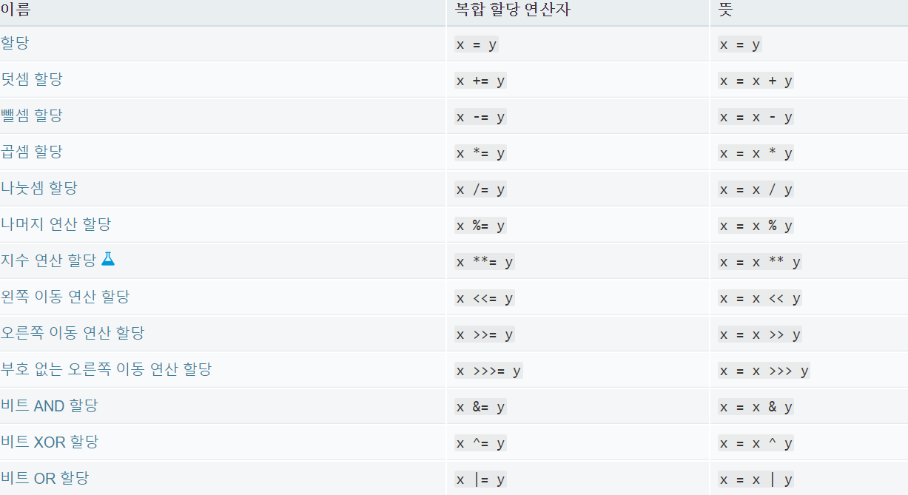


#### (2) 비교 연산자

> 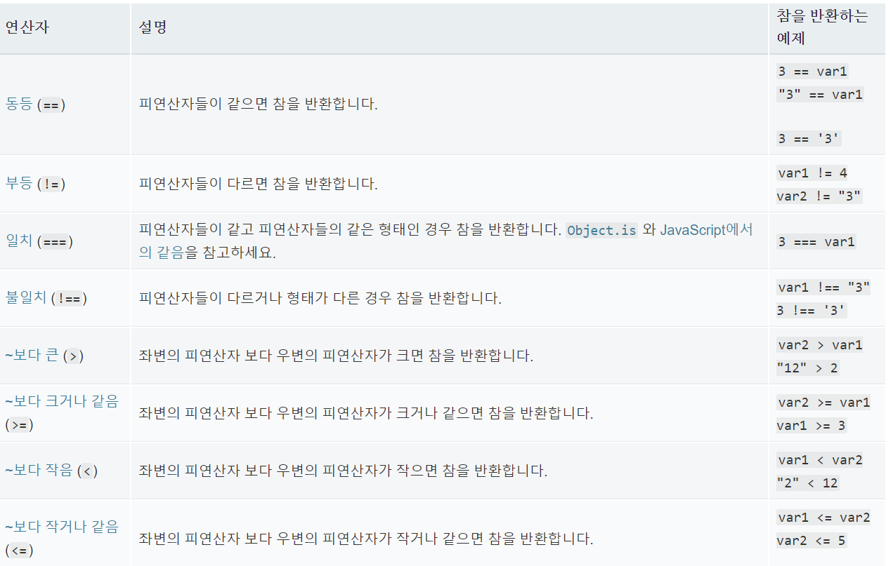


#### (3) 논리 연산자

> [논리 연산자](https://developer.mozilla.org/ko/docs/Web/JavaScript/Reference/Operators/Logical_Operators)는 보통 부울 값과 사용됩니다; 부울 값들과 사용될때, 연산자는 부울값을 반환합니다. `그러나,&& 과 ``||` 연산자는 실제로 명시된 피연자들 중 하나를 반환합니다. 따라서, 만약 이 연산자들이 부울 값이 아닌 값들과 함께 쓰였을때, 그들은 부울 값이 아닌 값을 반환할지도 모릅니다. 논리 연산자들은 다음의 표에서 설명됩니다.
>
> 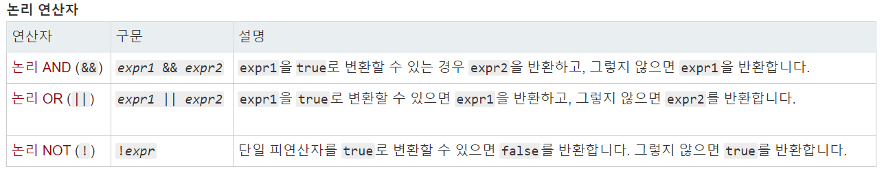
>
> **`&&`**
>
> ```javascript
> var a1 =  true && true;     // t && t returns true
> var a2 =  true && false;    // t && f returns false
> var a3 = false && true;     // f && t returns false
> var a4 = false && (3 == 4); // f && f returns false
> var a5 = "Cat" && "Dog";    // t && t returns Dog
> var a6 = false && "Cat";    // f && t returns false
> var a7 = "Cat" && false;    // t && f returns false
> ```
>
> ` ||`
>
> ```javascript
> var o1 =  true || true;     // t || t returns true
> var o2 = false || true;     // f || t returns true
> var o3 =  true || false;    // t || f returns true
> var o4 = false || (3 == 4); // f || f returns false
> var o5 = "Cat" || "Dog";    // t || t returns Cat
> var o6 = false || "Cat";    // f || t returns Cat
> var o7 = "Cat" || false;    // t || f returns Cat
> ```
>
> 
>
> #### 단축 평가
>
> 논리 연산자가 왼쪽에서 오른쪽으로 평가될때, 논리연산자는 다음의 규칙을 따라서 "단축 계산"으로 검사됩니다:
>
> - `false` && *anything* 는 false로 단축 계산됩니다.
> - `true` || *anything* 는 true로 단축 계산됩니다.
>
> 이 논리 규칙들은 이러한 평가가 언제나 정확하다고 보증합니다. *위에서 anything* 부분은 평가되지 않았고, 어떤 부작용도 아무런 효과를 미치지 못한다는 것에 주목하세요.


#### (4) 삼항 연산자

> [조건 연산자](https://developer.mozilla.org/ko/docs/Web/JavaScript/Reference/Operators/Conditional_Operator) 는 JavaScript에서 3개의 항을 사용하는 유일한 연산자 입니다. 조건 연산자는 조건에 따라 2개의 값중 하나를 가질 수 있습니다. 문법은 다음과 같습니다:
>
> ```javascript
> 조건 ? 값1 : 값2
> ```
>
> `만약 조건이 참이라면, 조건 연산자는 값1을 값으로 갖습니다`.` 그렇지 않은 경우 조건 연산자는 값2을 값으로 갖습니다`. 표준 연산자를 사용하는 어디든 조건연산자를 사용할 수 있습니다.
>
> 예를 들어,
>
> ```javascript
> var status = (age >= 18) ? "adult" : "minor";
> ```
>
> 이 구문은 age 변수가 18보다 같거나 클때 "adult" 값을 `status 변수에 할당합니다`. 그렇지 않은 경우, 이 구문은 "minor"값을` status`변수에 할당합니다.


### 2.2 조건문 & 반복문

#### (1) if문

```python
const userName = 'ssafy'

if (userName === '1q2w3e4r') {
    message = '<h1>This is admin page</h1>'
}else if (userName === 'ssafy') {
    message = '<h1>You r from ssafy</h1>'
} else {
    message = `<h1>hello ${userName}</h1>`
}
```


#### (2) switch문(if문이랑 뭔차인지)

Switch문은 프로그램이 표현식을 평가하고  값을 조건과 비교합니다. 만약 값이 일치한다면, 프로그램은 각 조건의 하위 문장을 실행합니다. Switch문은 아래와 같이 사용합니다.:


아래 예에서, 만약 "fruittype"가 "Bananas"라면, 프로그램은 case "Bananas"와 값이 일치합니다. 그리고 관련된 문장을 실행합니다. 프로그램의 switch문은 break문을 만났을 때 종료됩니다. 그리고 switch문 다음에 나오는 문장을 실행합니다. 만약 break문이 생략되면, 조건문 "Cherries" 와 관련된 문장도 실행됩니다.

```javascript
switch (fruittype) {
  case "Oranges":
    console.log("Oranges are $0.59 a pound.");
    break;
  case "Apples":
    console.log("Apples are $0.32 a pound.");
    break;
  case "Bananas":
    console.log("Bananas are $0.48 a pound.");
    break;
  case "Cherries":
    console.log("Cherries are $3.00 a pound.");
    break;
  case "Mangoes":
    console.log("Mangoes are $0.56 a pound.");
    break;
  case "Papayas":
    console.log("Mangoes and papayas are $2.79 a pound.");
    break;
  default:
   console.log("Sorry, we are out of " + fruittype + ".");
}
console.log("Is there anything else you'd like?");
```


#### (3) while문

```javascript
let i = 0

while (i<6){
    console.log(i)
    i++
}
```

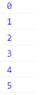

#### (4) for문

```javascript
//for - 1

for (let j = 0; j < 6; j++) {
    console.log(j)
} // while문과 같은 구문

//for - 2
const numbers = [0,1,2,3,4,5]

for (let number of numbers) {
    console.log(number)
} //0부터 5까지 한줄에 하나씩 출력

```

```javascript
// for in
const fruits = { a: 'apple', b: 'banana' }

for (const key in fruits) {
	console.log(key) // a, b
	console.log(fruits[key]) // apple, banana
}


// 2
const fruits = ['apple', 'banana']

for (const idx in fruits) {
    console.log(idx) // 0, 1
 	console.log(fruits[idx]) // apple, banana 
}

```


### 2.3 함수

#### (1) 함수 선언(statement, declaration)

함수 정의(또는 함수 선언)는 다음과 같은 [`함수`](https://developer.mozilla.org/ko/docs/Web/JavaScript/Reference/Statements/function) 키워드로 구성되어 있습니다:

- 함수의 이름
- 괄호 안에서 쉼표로 분리된 함수의 매개변수 목록 
- 중괄호 `{ }` 안에서 함수를 정의하는 자바스크립트 표현

예를 들어, 다음의 코드는 `square`라는 간단한 함수를 정의하였습니다:

```javasc
function square(number) {
  return number * number;
}
```

함수 `square`은 `number`라는 하나의 매개변수를 가집니다. 이 함수는 인수 (즉, `number`) 자체를 곱하여 반환하는 하나의 문장으로 구성되어 있습니다. `return` 문은 함수에 의해 반환된 값을 지정합니다.


#### (2) 표현식(Expression)

- 함수 표현식은 인터프리터(javascript)가 해당 코드에 도달 했을 때 로드된다(미리 로드X)

  ```javascript
  const sub = function(num1,num2){ //이것처럼 이름이 없는 함수를 익명함수라고 함 
      return num1 - num2
  }
  
  console.log(sub(7,2)) //5가 출력됨
  
  // [참고]함수도 하나의 값이다.
  console.log(typeof add) // function이라고 출력됨
  console.log(typeof sub) // function이라고 출력됨
  ```

  

- 위에서 함수 선언은 구문적인 문(statement)이지만, **함수 표현식(** [function expression](https://developer.mozilla.org/ko/docs/Web/JavaScript/Reference/Operators/function)**)**에 의해서 함수가 만들어 질 수도 있습니다. 이 같은 함수를 **익명**이라고 합니다. 이 말은 모든 함수가 이름을 가질 필요는 없다는 것을 뜻합니다. 예를 들어, 함수 `square`은 다음과 같이 정의 될 수도 있습니다:

  ```javascript
  var square = function(number) { return number * number };
  var x = square(4) // x 의 값은 16 입니다.
  ```

  하지만, 함수 표현식에서 함수의 이름을 지정 할 수 있으며, 함수내에서 자신을 참조하는데 사용되거나, 디버거 내 스택 추적에서 함수를 식별하는 데 사용될 수 있습니다.

  ```javascript
  var factorial = function fac(n) { return n<2 ? 1 : n*fac(n-1) };
  
  console.log(factorial(3));
  ```

  

#### (3) 화살표 함수(Arrow Function)

- 화살표 함수의 경우 일반 function 키워드로 정의한 함수와 100% 동일한 것이 아니다.

- 화살표 함수는 항상 익명함수다

- 변수에 할당할 수 있지만 이름 붙은 함수(생성자)로는 만들 수 없다

  ```javascript
  const ssafy1 = function(name){
      return 'hello ${name}'
  }
  
  //리팩토링
  //(1) function 키워드 삭제(모든 경우가능)
  const ssafy1 = (name) => {return 'hello ${name}'}
  
  //(2) 매개변수 '()' 소괄호 생략(단, 함수 매개변수가 하나일 경우에만 생략 가능)
  const ssafy2 = name => {return 'hello ${name}'}
  
  //(3) {}와 return 생략(단, 함수의 바디에 표현식(return식)이 1개일 경우만 가능)
  const ssafy3 = name => `hello ${name}`
  ```

  

- Arrow Function refactoring practice

  ```javascript
  let square = function(num){
      return num**2
  }
  
  let square = (num) => {return num**2}
  let square = num => {return num**2}
  let square = num => num**2
  ```

  

- 특수한 경우

  ~~나중에 채워야지~~

- object를 return 시 문제 상황

  ~~나중에 채워야지~~

- 기본 매개변수

  기본 매개변수를 줄 때는 매개변수의 개수와 상관없이 무조건 ()를 써야 한다.

  ```javascript
  const sayHello = (name = 'noName') => `hi ${name}`
  ```

  

- Anonymous Function(익명함수 / 1회용함수)

  - 기명함수로 만들기(변수/상수에 할당하기) - 생성과 동시에 함수의 인수로 할당

    ```javascript
    const cube = function (num) { return num ** 3} //변수 할당
    const squareRoot = num => num**0.5
    
    console.log(cube(2)) //8이 출력
    console.log(squareRoot(4)) //2가 출력
    ```

  - 익명함수 즉시 실행 - 함수의 표현식을 소괄호로 한번 더 묶어 준다(파이썬의 람다식도 동일)

    ```javascript
    console.log((function (num) {return num *** 3})(2))//8이 출력
    console.log((num => num ** 0.5)(4)) //2가 출력
    ```

    

#### (4) 함수 호이스팅

```javascript
ssafy()

function ssafy() {
  console.log('hoisting!') // 올바르게 출력됨
}
```

다만 변수에 할당한 함수(표현식을 쓴 함수)는 호이스팅 되지 않는다.(변수의 유효 범위 규칙을 따르기 때문이다.)

- `let`

  ```javascript
  ssafy2() 
  
  let ssafy2= function() {
      console.log('hoisting!') // ReferenceError 발생
  }
  ```

  ```javascript
  //js가 이해한 코드
  
  let ssafy2 //1.변수선언
  
  ssafy2() //2.함수 호출 -> ssafy2는 초기화도 안됐는데 함수호출? 바로 ReferenceError!
  
  ssafy2 = function () {
    console.log('hoisting!')
  } // 3) 변수에 할당단계 (하지만, 함수 호출과정에서 이미 오류 발생함...)
  ```

  

- `var`

  ```javascript
  ssafy3()
  
  var ssafy3 = function () {
    console.log('hoisting!') // TypeError 발생
  }
  ```

  ```javascript
  // var (JS가 이해한 코드)
  var ssafy3 // 1) 변수 선언(단, var이므로 초기화과정도 진행)
  
  ssafy3() // 2) 변수 호출 -> ssafy3은 변수인데 호출을 한다고?? -> 바로 TypeError!
  
  ssafy3 = function() {
    console.log('hoisting!')
  }
  ```

  

### 2.4 Datastructure : Object와 Array

#### (1) Array - Bulit-in Method

```javascript
const numbers = [1, 2, 3, 4]

console.log(numbers[0]) // 1이 출력
console.log(numbers[-1]) // undefined가 출력(정확한 양의 정수 index만 가능)
console.log(numbers.length) // 4가 출력
```

```javascript
// reverse()는 원본 파괴됨
console.log(numbers.reverse()) // 배열 뒤집기
console.log(numbers)
console.log(numbers.reverse()) // 한 번더 반복하면 원상복구됨
```

```javascript
// push : 배열의 길이를 return
console.log(numbers.push('a'))
console.log(numbers)

// pop : 배열의 가장 마지막 요소 제거 후 return
console.log(numbers.pop())
console.log(numbers)

// unshift : 배열의 가장 앞에 요소를 추가하고 배열의 길이를 return
console.log(numbers.unshift('a'))
console.log(numbers)

// shift : 배열의 가장 앞에 요소를 제거 후 return
console.log(numbers.shift())
console.log(numbers)
```

```javascript
// includes : 배열에 요소가 있으면 true, 없으면 false를 return(boolean return)
console.log(numbers.includes(1))
console.log(numbers.includes(0))
```

```javascript
// indexOf : 중복이 존재한다면 처음 찾은 요소의 index를 return
console.log(numbers.push('a', 'a')) // 현재 배열 상태 : [1, 2, 3, 4, 'a', 'a']
console.log(numbers)
console.log(numbers.indexOf('a')) // 4가 출력
console.log(numbers.indexOf('b')) // 찾고자하는 요소가 없으면 -1을 return
```

```javascript
// join : 배열의 요소를 join 함수의 인자를 기준으로 이어서 문자열로 return
console.log(numbers.join()) // '1,2,3,4,a,a'로 출력 (아무것도 넣지 않으면 , 를 기준으로 가져옴)
console.log(numbers.join('')) // '1234aa'로 출력
console.log(numbers.join('-')) // '1-2-3-4-a-a'로 출력
console.log(numbers) // join은 원본을 변화시키지 않는다.
```

#### (2) Object

~~나중에 채우기~~


#### (3) JSON(JS Object Notation)

~~나중에 채우기~~


#### (4) Array Helper Method

##### ① `.forEach(callback())`

- 주어진 callback을 배열에 있는 각 요소에 대해 오름차순으로 한 번씩 실행

- callback 함수 : 인자로 다른 함수에 전달된 함수

  ```javascript
  //ES6에서 forEach 추가됨
  const COLORS = ['red', 'blue', 'green']
  
  COLORS.forEach(function(color){
      console.log(color)
  })
  
  
  //리팩토링
  COLORS.forEach(color => console.log(color))
  
  //[주의] forEach는 아무것도 return 하지 않는다.(undefined)
  const result = COLORS.forEach(color => console.log(color))
  console.log(result) // undefined로 출력!
  ```

  

- `forEach`연습(1)

  images 배열 안에 있는 정보를 곱해서 넓이를 구하여 areas 라는 배열에 저장하시오.

  ```javascript
  const images = [
    { height: 10, width: 30},
    { height: 20, width: 90},
    { height: 54, width: 32},
  ]
  
  const areas = []
  images.forEach(function (image) {
      area.push(image.height * image.width)
  })
  console.log(areas) // [ 300, 1800, 1728 ] 출력
  
  
  //축약
  images.forEach(x => areas.push(x.height * x.width)) 
  ```

  

##### ② `.map(callback())`

- 배열 내의 모든 요소에 대하여 각각 주어진 함수(callback)를 호출한 결과를 모아 새로운 배열을 return

- 일정한 형식의 배열을 다른 형식으로 바꿔야 할 때 사용한다.

- map은 사본으로 return하고 원본은 유지한다

  ```javascript
  //map
  const NUMBERS = [1, 2, 3]
  
  const DOUBLE_NUMBERS = NUMBERS.map(function(number) {
      return number * 2
  })
  
  const DOUBLE_NUMBERS = NUMBERS.map(number => number * 2)
  
  console.log(DOUBLE_NUMBERS) // [ 2, 4, 6 ]
  console.log(NUMBERS) // [ 1, 2, 3 ] - 원본 유지
  ```

  

- `map`연습 (1)

  ```javascript
  const newNumbers = [4, 9, 16,]
  
  const roots = newNumbers.map(Math.sqrt)
  
  const.log(roots)
  const.log(newNumbers) //원본유지
  ```

  

- `map` 연습(2)

  ```javascript
  // Q. map을 사용해 images 배열 안의 Object 들의 height 들만 저장되어 있는 heights 배열 만들기
  
  const images = [
    { height: '34px', width: '30px'},
    { height: '12px', width: '11px'},
    { height: '292px', width: '56px'},
  ]
  
  const heights = images.map (function (image) {
      return image.height
  })
  
  //리팩토링
  const heights = images.map(image => image.height)
  console.log(heights)
  ```

  

- `map`연습 (3)

  ```javascript
  // Q. map 을 사용해 trips 배열의 값들을 계산해서 속도 값을 저장하는 배열 speeds 만들기
  
  const trips = [
    {distance: 35, time: 10},
    {distance: 90, time: 10},
    {distance: 60, time: 25},
  ]
  
  const speeds = trips.map(function(trip) {
      return trip.distance / trip.time
  })
  console.log(speeds)
  
  //리팩토링
  const speeds = trips.map(trip=>trip.distance/trip.time)
  ```

  

- `map` 연습(4)

  ```javascript
  // Q. map 을 사용해 trips 배열의 값들을 계산해서 속도 값을 저장하는 배열 speeds 만들기
  
  const trips = [
    {distance: 35, time: 10},
    {distance: 90, time: 10},
    {distance: 60, time: 25},
  ]
  
  const speeds = trips.map(function(trip) {
      return trip.distance / trip.time
  })
  console.log(speeds)
  
  //리팩토링
  const speeds = trips.map(trip=>trip.distance/trip.time)
  ```

  

##### ③ `.filter(callback())`

- 주어진 함수의 테스트를 통과한 모든 요소를 모아 새로운 배열을 반환한다.

- 즉, 주어진 콜백 함수로 원하는 요소만 filtering 할 수 있다.

- map과 마찬가지로 원본은 유지

  ```javascript
  // filter
  const PRODUCTS = [
    { name: 'cucumber', type: 'vegetable' },
    { name: 'banana', type: 'fruit' },
    { name: 'carrot', type: 'vegetable' },
    { name: 'apple', type: 'fruit' },
  ]
  
  const FRUIT_PRODUCTS = PRODUCTS.filter( function(product) {
    return product.type === 'fruit'
    // 해당 조건이 true 를 만족할 경우에 return
  })
  
  const FRUIT_PRODUCTS = PRODUCTS.filter(product => product.type === 'fruit')
  console.log(FRUIT_PRODUCTS)
  ```

  

- `filter` 연습(1)

  ```javascript
  // users 배열에서 admin 레벨이 true 인 user object 들만 filteredUsers 에 저장하고 
  // 배열의 두번째 유저의 이름을 출력
  
  const users = [
    { id: 1, admin: false, name: 'justin'},  
    { id: 2, admin: false, name: 'harry' },
    { id: 3, admin: true, name: 'tak' },
    { id: 4, admin: false, name: 'jason' },
    { id: 5, admin: true, name: 'juan' },
  ]
  
  const filteredUsers = users.filter(function (user) {
      return user.admin === true
  })
  console.log(filteredUsers)
  console.log(filteredUsers[1].name)
  
  //리팩토링
  //const filteredUsers = users.filter(user=>user.admin===true)
  ```

  

##### ④ `.reduce(callback())`

- 배열의 각 요소에 대해 주어진 reduce 함수를 실행하고, 하나의 결과 값을 반환한다.
- reduce는 배열 내의 숫자 총합, 평균 등 배열의 값을 하나로 줄이는 동작을 한다.
- map 은 배열의 각 요소를 변형한다면, reduce는 배열 자체를 변형한다.

```javascript
// 총합
const ssafyTests = [90, 90, 80, 77,]
const sum = ssafyTests.reduce(function (total, x) {
  return total += x // return이 있는 쪽에서는 0을 쓸 수 없다.
}, 0) // 0을 쓰려고 하면 reduce의 세번째 인자로 작성해야 한다.

//리팩토링
//const sum = ssafyTests.reduce( (total,x) => total +=x,0)
//const sum = ssafyTests.reduce( (total, x) => total += x )


// callback 함수의 첫번째 매개변수는 누적 값(전 단계의 결과) === total
// 두번째 매개변수는 현재 배열 요소, 현재 인덱스, 배열 자체 순이다. === x
// 초기값 === 0 ( 첫 total 값 )
// 만약 초기값이 생략되면 배열의 첫번째 요소가 초기값이 된다. 즉, 위와 같은 상황이면 초기값은 90이 된다.
```

- `reduce` 연습

```javascript
// 다음 배열 내의 요소의 총합을 구하시오
const arr = [0, 1, 2, 3,]

const totalSum = arr.reduce ( function (total,x) {
    return total += x
},0)
// const totalSum = arr.reduce( (total, x) => total += x, 0)
```


##### ⑤ `.find(callback())`

- 주어진 callback 함수를 만족하는 첫 번째 요소의 값을 반환
- 없다면 undefined 를 반환
- 조건에 맞는 인덱스가 아니라 요소 자체를 원할 때 주로 사용

```javascript
// find
const USERS = [
  { name: 'Tony Stark', age: 45 },
  { name: 'Steve Rogers', age: 32 },
  { name: 'Thor', age: 40 },
  { name: 'Tony Stark', age: 23 },
]

const new_user = USERS.find(function (user) {
  return user.name === 'Tony Stark'
})

// refactoring 적용
// const new_user = USERS.find( user => user.name === 'Tony Stark')
console.log(new_user)
```


##### ⑥ `.some(callback())`

- 배열 안에 어떤 요소라도(===하나라도) 주어진 callback 함수를 통과하는지 테스트하고, 결과에 따라 boolean 을 return 한다.
- 빈 배열은 무조건 false 를 return
- 조건에 맞는 요소를 찾으면 즉시 검색을 멈추고 true 를 return
- 'or' 연산과 유사

```javascript
const arr = [1, 2, 3, 4, 5,]
const result = arr.some(elem => elem % 2 === 0)
console.log(result) // 짝수가 있으므로 true (이 때, arr에서 원소 2에서 멈춘다.)
```


##### ⑦ `.every(callback())`

- 배열 안에 모든 요소가 주어진 callback 함수를 통과하는지 테스트하고, 결과에 따라 boolean 을 return 한다.

- 빈 배열은 무조건 true 를 return

- 배열의 모든 요소가 조건에 맞아야 true, 그렇지 않다면 false

- 조건에 맞지 않는 요소를 찾으면 검색을 멈추고 false 를 return

- 'and' 연산과 유사

  ```javascript
  // every - 모든!
  const result2 = arr.every(elem => elem % 2 === 0)
  console.log(result2) // 모든 원소가 짝수가 아니므로 false(이 때, arr에서 원소 1에서 멈춘다.)
  ```

- **`some`, `every` 연습**

  - ram이 32보다 작으면 everyComputers 를 false로 아니면 someComputers 를 true

    ```javascript
    // some, every
    const COMPUTERS = [
      { name: 'macbook', ram: 8},
      { name: 'gram', ram: 16},
      { name: 'series9', ram: 32},
    ]
    
    // (1)some
    const newsomeComputers = COMPUTERS.some(computer => computer.ram < 32)
    console.log(newsomeComputers) // true
    
    // (2)every
    const neweveryComputers = COMPUTERS.every(computer => computer.ram < 32)
    ```

    

## JS 심화

✔️ **JS 함수는 `일급객체`** (cf. 파이썬도 `일급객체`)

- 일급 객체가 되기 위한 3가지 조건
  - 변수에 담을 수 있다.
  - 인자로 전달할 수 있다. `콜백함수`
  - 반환값으로 전달할 수 있다. `return n => n + 1`


✔️ **비동기식 처리 모델**

- 비동기식 = 병렬적 처리
- 호출될 함수 (콜백함수)를 미리 매개변수에 전달하고 처리가 종료되면 콜백함수를 호출하는 것.

____

### 1.AJAX란?

AJAX의 강력한 특징은 페이지 전체를 리프레쉬하지 않고서도 수행되는 '비동기성'이다(리로드가 되지 않고도 수행됨). EVENT가 있으면 전체 페이지가 아닌 일부분을 업데이트 할 수 있게 해준다

	- 페이지 새로고침없이 서버에 요청
	- 서버로부터 데이터를 받고 작업을 수행


### 2.XHR이란?

XMLHttpRequest 객체는 서버와 상호작용하기 위해 사용된다. 전체 페이지의 새로고침없이도 url로부터 데이터를 받아올 수 있다. 이는 웹페이지가 사용하고 있는 것을 방해하지 않으면서 페이지의 일부를 업데이트할 수 있도록 해준다. XHR은 AJAX 프로그래밍에 주로 사용된다.


### 3. How JavaScript works

#### ①Asychronous

기다려주지 않는다. 왜?

#### ②Single Thread

이벤트를 처리하는 Call Stack이 하나뿐인 언어이다. 혼자서 일하기 때문. 그럼 어떻게 일해?

#### ③Event Loop

Event Loop로 동작함


### 4. Event Loop

- Call Stack
  - 요청이 들어올때마다 해당 요청을 순차적으로 처리하는 스택형태의 자료구조
- Web API
  - 자바스크립트 엔진이 아닌 브라우저 영역에서 제공하는 API
- Task Queue
  - 콜백 함수가 대기하는 큐 형태의 자료 구조
- Event Loop
  - Call Stack에 현재 실행 중인 Task가 없는지 확인하고 Task Queue에 Task가 있는지 확인

___

**✔️DETAIL**

single thread : js는 마치 사람마냥 한번에 한가지 일만 할 수 있다. 예를 들면, 손님이 온다. 주문을 받고 -> 주방에 전달 -> 음식을 서빙 -> 이런식

그런데 주문을 받고, 마냥 기다릴 수 없음. 맡겨 놓고, 할 일이 있으면 일을 해야함! 애초에 일하는 방식이 비동기적임. 주방에서는 받은 주문을 토대로 음식을 만듦. 

`비동기적`! 어떤 일을 했으면, 일->결과가 나올때까지 기다리지 않고 다음일을 시작하는 것, which is 비동기적.`동기적`은 결과가 나올때까지 기다림.


손님이 들어와서 주문이 쌓이는 과정이 callStack이라고 한다. 

callstack은 직원이 해야할 목록!

web api가 필요한(시간이 필요한, 주방으로) 가는 걸 

주방에서 음식내놓는 건 taskqueue

사장은 eventloop

알바생은 js

알바생이 일을 하다가, settime(시간을 세야함)하면 web api로 보냄. 그리고 hello을 갖고있다가 3초있다가 선반에 올려놓음. 선반에 올려놓으면 내가 일을 처리해야함. 근데 하고있는일이 계속 있어? 그럼 일을 못함. 그래서 callstack이 빌떄까지 기다리고, 만약에 다 일이 비면, 이벤트루프가 그 일을 callstack에 집어넣고, 알바생이 일을 계속 함

또한 아래처럼 콜백이 아래처럼 중첩될 수 있다!

```javascript
//콜백안에 콜백이 있는 경우

setTimeout(()=>{
   setTimeout(()=>{
       
   },3000)
},3000)
```

__________


### 5. Callback Function(~~모.르.겠.어~~)

 Function인데 다른 함수의 인자로 넘어가는 Function이다

> 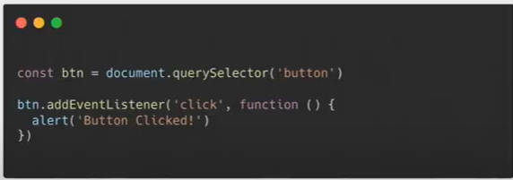
>
> //나중에 불러줘, 얘는 사용자가 클릭할때! 호출하는것이다. 그때가 결국 CallBack! 불러달라고 하는 때. 우리가 직접적으로 함수호출을 하는게 아니라 시스템에 의해서
>
> 콜백function은 많이 쓰인다. 기다려주지 않으니까 지금 시점이 아니라 언젠가 사용, 그래서 콜백으로 쓸 수 밖에 없는 케이스가 많이 생긴다. 

#### callback 예제1

```javascript
function test(f) {
	f()
}


test(function(){
	console.log('callback function!')
})
```

** test라는 함수는 함수를 인자로 받는다

** 대부분의 콜백함수는 이렇게 익명함수로 작성됨

(1) 아래에 위치한 test 함수를 호출한다.

(2) 전달된 함수는 1행의 test 함수의 매개변수 f에 저장이 된다

(3) 그리고 f()를 호출하고 있다.

(4) f()는 전달된 함수의 console.log 메세지를 찍는다.


#### callback 예제2

```javascript
var loading = function(path,done) {
    console.log('전달받은 경로':',path)
    done(path+'sample.txt')
}

loading('/folder/text/', function(result) {
    console.log('완료! :', result)
})
```

loading이라는 변수에 함수가 저장되어 있다. 이 함수는 path, done이라는 매개변수를 받는다. 6행에서 loading함수를 호출하며 path인자로 `'/folder/text/'`를 전달하고, done인자로는 함수를 전달하고 있다. 

1행에서 함수를 구현만 해두고, 6행에서 실제로 호출이 진행된다.

(1) path로 넘어간 데이터가 2행에서 출력: '전달 받은 경로 : /folder/text/'

(2) 콜백함수인 done 을 호출하며 기존의 path('/folder/text/') 에 'sample.txt.' 문자열을 이어서 전달한다. : /folder/text/sample.txt.'

(3) 전달된 이어진 문자열이 7행에서 출력 : '완료 ! : /folder/text/sample.txt. '


#### callback 예제3

```javascript
let first = 10;
let second = 20;
let result = 0;

function add (x , y){
	return x + y
}

function getResult(callback){
	setTimeout(function(){
    	result = add (first, second)
        console.log(result)
        callback()
    },500)
}

getResult(function(){
	first = 20;
    result = add (first, second);
    console.log(result)
})
```

위 코드에서 첫번째 console.log 와 두번째 console.log 의 값은 어떻게 찍힐까.


(1) getResult 라는 함수가 실행이되는데 이것은 0.5초 뒤에 실행이 된다.

(2) result 라는 값을 반환하기 위해 add 라는 함수를 통해서

first 값인 10 + second 값인 20 = 30이 result로 첫번째 console.log에 찍힌다.

(3) 그리고 호출된 함수에 first 값이 20 이기 때문에

first 값인 20 + second 값인 20 = 40이 result로 두번째 console.log에 찍힌다.


요즘도 많이 사용된다고는 하지만 고전적인 방식이며 *지옥이라 불리울 만큼* 치명적인 단점들을 가지고 있다.

1. 우선 **가독성이 매우 떨어진다.**
   만약 비동기 처리가 예제처럼 3개로 끝나지 않는다면 끝없이 옆으로 누운 피라미드를 그리게 될 것...
2. 에러처리를 한다면 **모든 콜백에서 각각 에러 핸들링**을 해주어야 한다.
   콜백의 깊이만큼이나 복잡해지는 에러처리... 만약 에러 처리 없이 진행한다면 콜백 함수가 호출되지 않아도 왜- 어디서- 에러가 발생했는지 알아내기가 쉽지 않다.


이러한 불편함을 해소하기 위해 ES6에서 비동기 흐름을 컨트롤하는 방법으로 **`Promise`** 객체가 등장한다.


### 6. `Promise` 객체

> Promise 객체는 **비동기 작업이 맞이할 미래의 완료 또는 실패와 그 결과 값**을 나타냅니다.
> *출처 MDN*

Promise를 사용하여 비동기 작업이 (성공 혹은 실패로) 완료된 후의 결과 값을 받을 수 있다.
**결과 값을 돌려받을 수 있기 때문에 이후 처리를 컨트롤 할 수 있게 된다**

#### Promise의 상태 값

`Promise` 객체는 `new` 키워드로 생성할 수 있으며 총 4개의 상태 값을 가진다.

```shell
Pending: 아직 결과 값이 반환되지 않은 진행 중인 상태

fulfilled: 성공

Rejected: 실패

Settled: 결과 값이 성공 혹은 실패로 반환된 상태
```

상태 값은 크게 `Pending`과 `Settled`로 나눌 수 있으며,
`Settled`은 다시 `fulfilled`와 `Rejected`로 나누어 진다. 

**한번 `Setteld`된 값은 재실행 할 수 없다.**

**생성**

`Promise`는 함수를 인자로 받으며 인자로 들어온 함수는 다시 `resolve`와 `reject` 2개의 함수를 인자로 받게 된다. `resolve` 는 비동기 처리 성공 시 호출되며 `reject`는 비동기 처리 실패시 호출 된다.

코드로 보면 아래와 같은 모습이다.

```javascript
const promise = new Promise(function(res, rej) {
  setTimeout(function() { // 비동기로 진행되는 코드
    res(111);
  }, 1000);
});

// 화살표 함수로 작성해도 동일하다.
cosnt promise = new Promise((res, rej) => {
  setTimeout(() => {
    res(111);
  }, 1000);
});
```

**`new Promise`로 생성된 인스턴스 객체는 '객체'이기 때문에 위와 같이 변수로 할당하거나 함수의 인자로 사용할 수 있다.**


#### 사용

인스턴스 호출 시에는 대표적으로 `then`과 `catch` 메소드를 사용한다.

#### resolve시 then으로

resolve되는 값은 then 메소드의 인자로 넘어간다.

```javascript
const promise = new Promise((res, rej) => {
  setTimeout(() => {
    res(111);
  }, 1000);
});

promise
  .then(res => console.log(res));

// 출력값
111
```


#### reject시 catch로

반대로 reject되는 값은 catch 메소드의 인자로 넘어가서 에러 핸들링을 할 수 있다.

```javascript
const promise = new Promise((res, rej) => {
  setTimeout(() => {
    rej('error!');
  }, 1000);
});

promise
  .then(res => console.log(res))
  .catch(err => console.error(err));

// catch 메소드에 잡혀서 console.error에서 출력된 값
error!
```


여기서 하나 또 중요한 점은 **`then` 메소드는 다시 `Promise`를 반환한다**는 것이다.

`Promise` 객체를 반환한다는 것은 `then`, `catch`메소드를 사용할 수 있다는 것을 뜻하며, 이를 통해 연속적으로 `then`메소드를 사용하여 `Promise chaining`이 가능하다는 것을 의미한다.


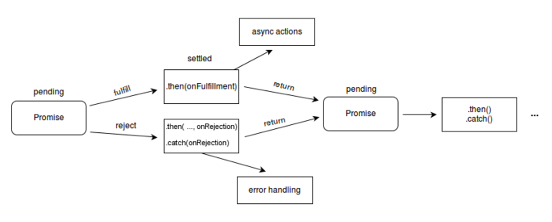

### 6. 비동기식 처리 모델

#### 1.Synchronous(동기식 처리 모델)

​	교수님께 질문하고 무한 기다리고(til prof answer me)

- 직렬적으로 테스크를 수행
- 테스크는 순차적으로 실행되며 어떤 작업이 수행중이면 다음 작업은 대기
- 예) 서버에서 데이터를 가져와서 화면에 표시하는 작업을 수행할 때, 데이터가 응답될 때까지 이후 테스크들은 **블로킹(blocking)**된다.


#### 2. Asynchronous(비동기식 처리모델)

교수님께 질문하고 기다리기(점심식사->낮잠->강의듣기->(답장오면)문제 해결 -> (문제 해결되면)친구에게 알려주기(이걸 콜백func으로 한다) ~하면 ~한다. 내가 언제 일이 완료되는지 알 수가 없으니까! 

- 병렬적으로 테스크를 수행
- 테스크는 종료되지 않는 상태라 하더라도 대기하지 않고 다음 테스크를 실행
- 예) 서버에서 데이터를 가져와서 화면에 표시하는 작업을 수행할 때, 데이터가 응답될 때까지 **기다리지 않고(non-blocking)** 즉시 다음 테스크를 수행
- JS 대부분의 DOM 이벤트와 Timer 함수, Ajax 요청은 비동기식 처리 모델로 동작


이 구조가 콜백으로 만들 수 있다(like below)


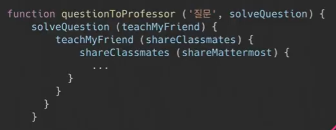


이렇게 가다보면 Callback hell에 빠질 수 있다. 디버깅 매우 어려워짐. 이를 방지하기 위해 Promise 등장


- 이벤트 루프
  - 단 한가지 **콜스택**과 **콜백큐**를 감시하는 역할만 한다.
  - 만약 콜스택이 비어 있으면 이벤트 루프는 콜백큐에서 첫 번째 이벤트를 가져다가 콜스택에 밀어 넣고, 결과적으로 해당 이벤트가 실행된다.
  - 이러한 반복은 이벤트 루프에서 `tick`이라고 한다.
  - 이벤트 루프는 호스팅 환경(브라우저 or nodejs)에 내장된 메커니즘(JS 엔진에 있는게 아니다.)
  - 이것은 시간의 흐름에 따라 코드의 수행을 처리하며 그 때마다 JS 엔진을 작동 시킨다.


### 7. Promise

Promise는 약속이다. 무슨 약속? 미래의 성공or실패를 약속하는 것이다. 위의 예제에서 문제가 해결이 안될 수 도 있고, 친구에게 못알려줄수도 있고. 결국은 되거나 안되거나

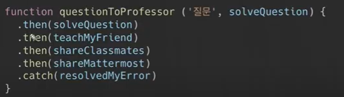


- `.then(doSomething)`: ()안에 callbackfunction, 성공하면 무엇을 할지 callback 으로 넣어줌
- `.catch(doSomething)`: 실패하면 에러를 잡자! 역시 Callbackfunc이 들어가야함


### 8.async & await

실제 내부는 동기적으로 실행되지만, 우리가 볼때는 그냥 아래처럼 실행되게 보이게 하는 문법적 설탕이 async & await이다.

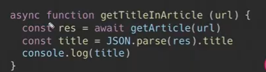


>  흐름 정리
>
>  async,single thred, event loop
>
>  비동기적으로 동작하는건 콜백함수를 통해서 실행할 수밖에없다(언제 실행될지 모르니까)
>
>  ~~하면 ~한다. ~가 콜백함수. 근데 또 ~에 달려있는게 있을 수 있다. 꼬리잡기처럼. 계속 콜백이다. 콜백이 꼬리의 꼬리를 물고 가면 -> callback hell
>
>  To get out of Callback Hell, 'Promise concept' 프로미스는 성공과 실패에 대한 약속을 하는건데, 성공하면 `.then()`안에 콜백으로 표현하고 실패하면 `.catch()`안에 콜백
>
>  또 여기에 더해서 async, await / chaining의 복잡성, 그리고 클리어하게 동기적으로 보이게 하기 위해서! 


### 9. Axios

- `axiosXHR`을 요청으로 보내고 응답 받은 결과를 `Promise 객체`로 반환 해주는 라이브러리
- axios는 현재 JS 에서 가장 HOT한 라이브러리 중 하나이며 프론트엔드 프레임워크(react, vue)에서 데이터를 주고 받을 때 필수적으로 사용되고 있음(프론트엔드 프레임워크와 API 서버 간의 데이터를 주고 받을 때!)
- `npm install axios` 로 axios 라이브러리 설치
- 기본 axios 틀

```javascript
const axios = require('axios') // JS에서 import하는 방법

axios.get('http://jsonplaceholder.typicode.com/posts')
  .then(response => {
    console.log(response)
  })
  .catch(err => { // 요청이 잘못되었을 때
    console.log(err)
  })
```

