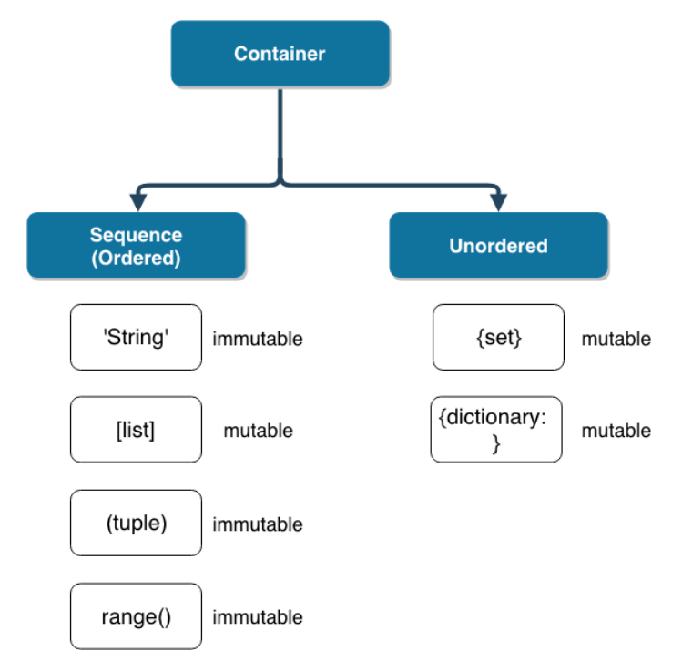
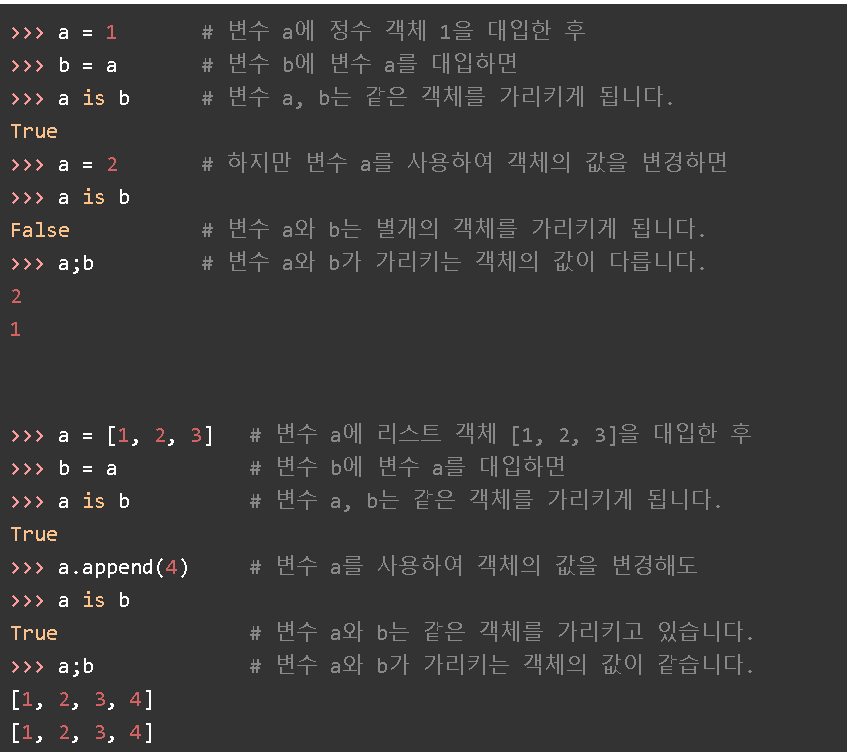
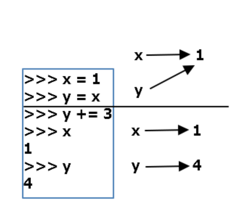
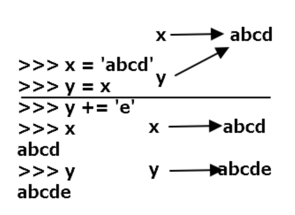
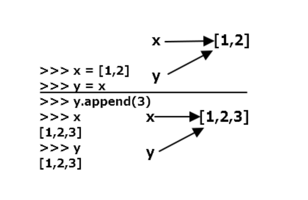
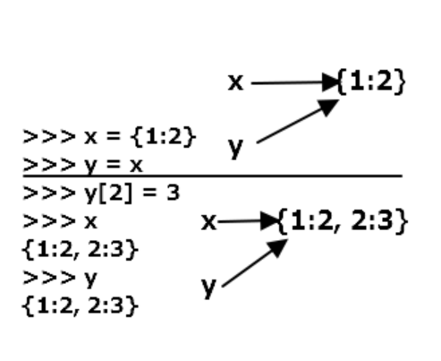
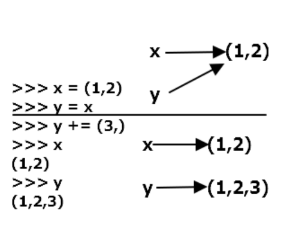
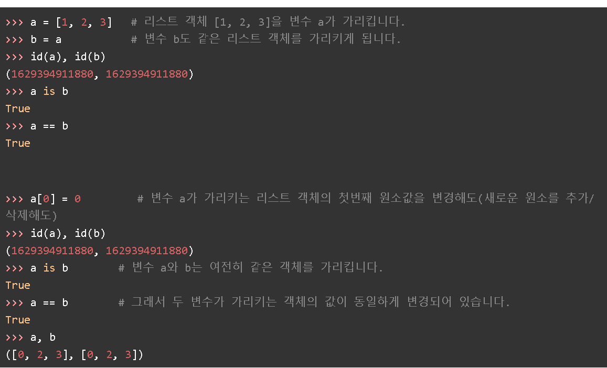
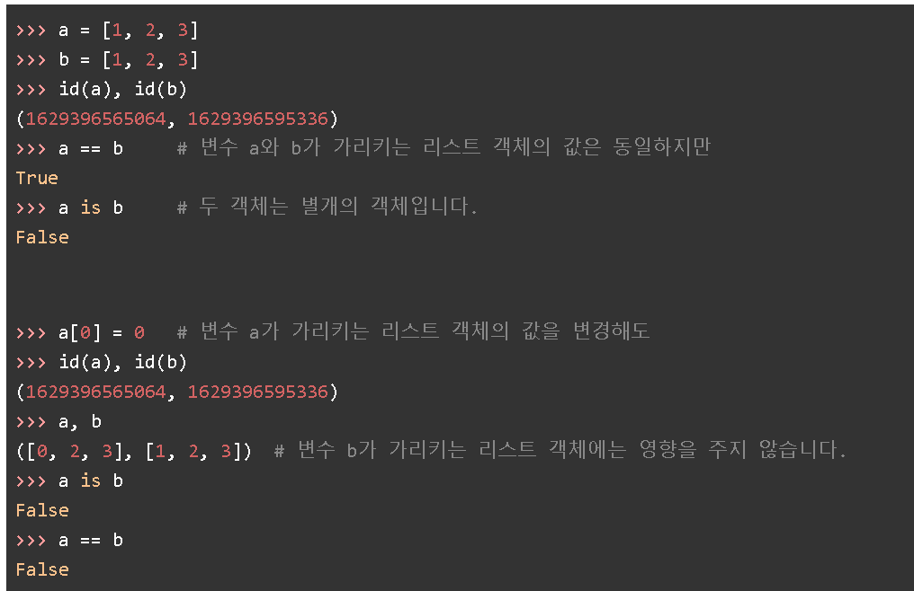

# 컨테이너(Container)

여러 개의 값을 저장할 수 있는 것

- 시퀀스(Sequence)형 : 순서가 있는(ordered) 데이터 

- 비 시퀀스(Non-sequence)형 : 순서가 없는(unordered) 데이터 

  


## 1. 시퀀스(sequence) 형 컨테이너

`시퀀스`는 데이터가 순서대로 나열된(ordered) 형식을 나타냅니다.

- **주의! 순서대로 나열된 것이 `정렬되었다(sorted)`라는 뜻은 아니다.**


### 특징

1. 순서를 가질 수 있다.
2. **특정 위치의 데이터를 가리킬 수 있다.**


### 종류

파이썬에서 기본적인 시퀀스 타입은 다음과 같습니다.

- 리스트(list)
- 튜플(tuple)
- 레인지(range)
- *문자형(string)*
- *바이너리(binary)* : 따로 다루지는 않습니다.


## 1.1 리스트

활용법

`[value1, value2, value3]`


- 리스트는 대괄호`[]` 및 `list()` 를 통해 만들 수 있습니다.

- 값에 대한 접근은 `list[i]`를 통해 합니다

```python
numbers = [1,3,5,7,9]

numbers[3]

>7 
```

- 리스트의 다양한 형태 

```
>>> a = []
>>> b = [1, 2, 3]
>>> c = ['Life', 'is', 'too', 'short']
>>> d = [1, 2, 'Life', 'is']
>>> e = [1, 2, ['Life', 'is']]
```

리스트는 a처럼 아무것도 포함하지 않아 비어 있는 리스트([ ])일 수도 있고 b처럼 숫자를 요솟값으로 가질 수도 있고 c처럼 문자열을 요솟값으로 가질 수도 있다. 또한 d처럼 숫자와 문자열을 함께 요솟값으로 가질 수도 있으며 e처럼 리스트 자체를 요솟값으로 가질 수도 있다. 즉 리스트 안에는 어떠한 자료형도 포함시킬 수 있다.

- 리스트에 포함된 리스트 불러오기 

```python
>>> a = [1, 2, 3, ['a', 'b', 'c']]

#'a'라는 인덱스는 어떻게 꺼낼 수 있을까? 

>>>a[-1][0] #a 출력
```

- 리스트의 수정

```python
>>> a = [1, 2, 3]
>>> a[2] = 4
>>> a
[1, 2, 4] #a[2]의 요솟값 3이 4로 바뀌었다
```

- 리스트의 삭제 

```
>>> a = [1, 2, 3]
>>> del a[1]
>>> a
[1, 3]
```

del a[x]는 x번째 요솟값을 삭제한다. 여기에서는 a 리스트에서 a[1]을 삭제하는 방법을 보여준다. del 함수는 파이썬이 자체적으로 가지고 있는 삭제 함수이며 다음과 같이 사용한다.

- 리스트 관련 함수들

  - **리스트에 요소 추가(append)**

    ```python
    >>> a = [1, 2, 3]
    >>> a.append(4)
    >>> a
    [1, 2, 3, 4]
    
    
    >>> a.append([5,6])
    >>> a
    [1, 2, 3, 4, [5, 6]] #리스트 안에는 어떤 자료형도 추가할 수 있다.
    ```

  - **리스트 정렬(sort)**

    sort 함수는 리스트의 요소를 순서대로 정렬해 준다.

    ```
    >>> a = [1, 4, 3, 2]
    >>> a.sort()
    >>> a
    [1, 2, 3, 4]
    ```

    문자 역시 알파벳 순서로 정렬할 수 있다.

    ```python
    >>> a = ['a', 'c', 'b']
    >>> a.sort()
    >>> a
    ['a', 'b', 'c']
    ```

    

  - **위치 반환(index)**

    index(x) 함수는 리스트에 x 값이 있으면 x의 위치 값을 돌려준다.

    ```
    >>> a = [1,2,3]
    >>> a.index(3)
    2
    >>> a.index(1)
    0
    ```

    위 예에서 리스트 a에 있는 숫자 3의 위치는 a[2]이므로 2를 돌려주고, 숫자 1의 위치는 a[0]이므로 0을 돌려준다.

    다음 예에서 값 0은 a 리스트에 존재하지 않기 때문에 값 오류(ValueError)가 발생한다.

    ```
    >>> a.index(0)
    Traceback (most recent call last):
      File "<stdin>", line 1, in <module>
    ValueError: 0 is not in list
    ```

  - 

  - **리스트에 요소 삽입(insert)**

    insert(a, b)는 리스트의 a번째 위치에 b를 삽입하는 함수이다. 파이썬에서는 숫자를 0부터 센다는 것을 반드시 기억하자.

    ```
    >>> a = [1, 2, 3]
    >>> a.insert(0, 4)
    >>> a
    [4, 1, 2, 3]
    ```

    위 예는 0번째 자리, 즉 첫 번째 요소(a[0]) 위치에 값 4를 삽입하라는 뜻이다.

    ```
    >>> a.insert(3, 5)
    >>> a
    [4, 1, 2, 5, 3]
    ```

    위 예는 리스트 a의 a[3], 즉 네 번째 요소 위치에 값 5를 삽입하라는 뜻이다.

    

  - **리스트 요소 제거(remove)**

    remove(x)는 리스트에서 첫 번째로 나오는 x를 삭제하는 함수이다.

    ```
    >>> a = [1, 2, 3, 1, 2, 3]
    >>> a.remove(3)
    >>> a
    [1, 2, 1, 2, 3]
    ```

    a가 3이라는 값을 2개 가지고 있을 경우 첫 번째 3만 제거되는 것을 알 수 있다.

    ```
    >>> a.remove(3)
    >>> a
    [1, 2, 1, 2]
    ```

    remove(3)을 한 번 더 실행하면 다시 3이 삭제된다.

    

  - **리스트 요소 **

    pop()은 리스트의 맨 마지막 요소를 돌려주고 그 요소는 삭제한다.

    ```
    >>> a = [1,2,3]
    >>> a.pop()
    3
    >>> a
    [1, 2]
    ```

    a 리스트 [1, 2, 3]에서 3을 끄집어내고 최종적으로 [1, 2]만 남는 것을 볼 수 있다.

    pop(x)는 리스트의 x번째 요소를 돌려주고 그 요소는 삭제한다.

    ```
    >>> a = [1,2,3]
    >>> a.pop(1)
    2
    >>> a
    [1, 3]
    ```

    a.pop(1)은 a[1]의 값을 끄집어낸다. 다시 a를 출력해 보면 끄집어낸 값이 삭제된 것을 확인할 수 있다.

    

  - **리스트 확장 (extend)**

    extend(x)에서 x에는 리스트만 올 수 있으며 원래의 a 리스트에 x 리스트를 더하게 된다.

    ```
    >>> a = [1,2,3]
    >>> a.extend([4,5])
    >>> a
    [1, 2, 3, 4, 5]
    >>> b = [6, 7]
    >>> a.extend(b)
    >>> a
    [1, 2, 3, 4, 5, 6, 7]
    ```

    a.extend([4, 5])는 a += [4, 5]와 동일하다.

    

  - **리스트에 포함된 요소 x의 개수 세기(count)**

    count(x)는 리스트 안에 x가 몇 개 있는지 조사하여 그 개수를 돌려주는 함수이다.

    ```
    >>> a = [1,2,3,1]
    >>> a.count(1)
    2
    ```

    1이라는 값이 리스트 a에 2개 들어 있으므로 2를 돌려준다.


## 1.2 튜플

활용법

`(value1, value2)`

- 튜플은 리스트와 유사하지만, `()`로 묶어서 표현합니다.

- *그리고 tuple은 수정 불가능(불변, immutable)하고, 읽을 수 밖에 없습니다.

- 직접 사용하기 보다는 파이썬 내부에서 다양한 용도로 활용되고 있습니다.

- 튜플(tuple)은 몇 가지 점을 제외하곤 리스트와 거의 비슷하며 리스트와 다른 점은 다음과 같다.

  - 리스트는 [ ]으로 둘러싸지만 튜플은 ( )으로 둘러싼다.
  - 리스트는 그 값의 생성, 삭제, 수정이 가능하지만 튜플은 그 값을 바꿀 수 없다.

  튜플의 모습은 다음과 같다.

  ```
  >>> t1 = ()
  >>> t2 = (1,)
  >>> t3 = (1, 2, 3)
  >>> t4 = 1, 2, 3
  >>> t5 = ('a', 'b', ('ab', 'cd'))
  ```

  리스트와 모습은 거의 비슷하지만 튜플에서는 리스트와 다른 2가지 차이점을 찾아볼 수 있다. t2 = (1,)처럼 단지 1개의 요소만을 가질 때는 요소 뒤에 콤마(,)를 반드시 붙여야 한다는 것과 t4 = 1, 2, 3처럼 괄호( )를 생략해도 무방하다는 점이다.

  얼핏 보면 튜플과 리스트는 비슷한 역할을 하지만 프로그래밍을 할 때 튜플과 리스트는 구별해서 사용하는 것이 유리하다. 튜플과 리스트의 가장 큰 차이는 값을 변화시킬 수 있는가 여부이다. 즉 리스트의 항목 값은 변화가 가능하고 튜플의 항목 값은 변화가 불가능하다. 따라서 프로그램이 실행되는 동안 그 값이 항상 변하지 않기를 바란다거나 값이 바뀔까 걱정하고 싶지 않다면 주저하지 말고 튜플을 사용해야 한다. 이와는 반대로 수시로 그 값을 변화시켜야할 경우라면 리스트를 사용해야 한다. 실제 프로그램에서는 값이 변경되는 형태의 변수가 훨씬 많기 때문에 평균적으로 튜플보다는 리스트를 더 많이 사용한다. 

  튜플은 리스트처럼 요솟값을 삭제하려고 할때 del 함수로 지울 수 없다. 또한 요솟값을 변경하려고 해도 마찬가지로 오류가 발생함을 알 수 있다.

  ```python
  #요솟값 삭제 불가
  >>> t1 = (1, 2, 'a', 'b')
  >>> del t1[0]
  
  Traceback (most recent call last):
    File "<stdin>", line 1, in <module>
  TypeError: 'tuple' object doesn't support item deletion
  ```

  ```python
  #요솟값 수정 불가 
  >>> t1 = (1, 2, 'a', 'b')
  >>> t1[0] = 'c'
  Traceback (most recent call last):
    File "<stdin>", line 1, in <module>
  TypeError: 'tuple' object does not support item assignment
  ```


#### 튜플 다루기

> 튜플은 값을 변화시킬 수 없다는 것만 제외하면 리스트와 완전히 동일하므로 간단히만 살펴보자.

- **인덱싱하기**

```python
>>> t1 = (1, 2, 'a', 'b')
>>> t1[0]
1
>>> t1[3]
'b'
```

문자열, 리스트와 마찬가지로 t1[0], t1[3] 처럼 인덱싱이 가능하다. 


- **슬라이싱하기**

```pytohn
>>> t1 = (1, 2, 'a', 'b')
>>> t1[1:]
(2, 'a', 'b')
```


- **튜플 더하기**

```python
>>> t1 = (1, 2, 'a', 'b')
>>> t2 = (3, 4)
>>> t1 + t2
(1, 2, 'a', 'b', 3, 4)
```


- **튜플 곱하기(반복)**

```python
>>> t2 = (3, 4)
>>> t2 * 3
(3,4,3,4,3,4)
```


- **튜플 길이 구하기**

```python
>>> t1 = (1, 2, 'a', 'b')
>>> len(t1)
4
```


### 1.3 레인지(range())

`range` 는 숫자의 시퀀스를 나타내기 위해 사용됩니다.

기본형 : `range(n)`

> 0부터 n-1까지 값을 가짐

범위 지정 : `range(n, m)`

> n부터 m-1까지 값을 가짐

범위 및 스텝 지정 : `range(n, m, s)`

> n부터 m-1까지 +s만큼 증가한다


## 2. 비 시퀀스형(Non-sequence) 컨테이너 

- 셋(set)

- 딕셔너리(dictionary)

  

### 2.1 set 

집합(set)은 파이썬 2,3부터 지원하기 시작한 자료형으로, 집합에 관련된 것을 쉽게 처리하기 위해 만든 자료형이다. 

#### 활용법

```
{value1, value2, value3}
```

집합 자료형은 다음과 같이 set 키워드를 사용해 만들 수 있다.

```python
>>> s1 = set([1,2,3])
>>> s1
{1, 2, 3}
```

위와 같이 set()의 괄호 안에 리스트를 입력하여 만들거나 다음과 같이 문자열을 입력하여 만들 수 있다.

```python
>>> s2 = set("Hello")
>>> s2
{'e', 'H', 'l', 'o'}
```

※ 비어 있는 집합 자료형은 s = set()로 만들수 있다.


#### 집합 자료형의 특징

위에서 살펴본 set("Hello")의 결과가 이상하다! 분명 'Hello' 문자열로 set 자료형을 만들었는데 생성된 자료형에는 l 문자도 빠져 있고 순서도 뒤죽박죽이다. 그 이유는 바로 set 의 2가지 특징 때문!

- 중복을 허용하지 않는다.
- 순서가 없다(unordered)

리스트나 튜플은 순서가 있기 때문에 인덱싱을 통해 자료형의 값을 얻을 수 있지만 set 자료형은 순서가 없기 때문에 인덱싱으로 값을 얻을 수 없다. 이는 마치 딕셔너리와 비슷하다. 딕셔너리 역시 순서가 없는 자료향이라 인덱싱을 지원하지 않는다. 

만약 set 자료형에 저장된 값을 인덱싱으로 접근하려면 다음과 같이 리스트나 튜플로 변환한 후 해야 한다. 

> ※ 중복을 허용하지 않는 set의 특징은 자료형의 중복을 제거하기 위한 필터 역할로 종종 사용하기도 한다.

```python
>>> s1 = set([1,2,3])
>>> l1 = list(s1)
>>> l1
[1, 2, 3]
>>> l1[0]
1
>>> t1 = tuple(s1)
>>> t1
(1, 2, 3)
>>> t1[0]
1
```


#### 교집합, 합칩합, 차집합 구하기

set 자료형을 정말 유용하게 사용하는 경우는 교집합, 합집합, 차집합을 구할 때이다. 

우선 다음과 같이 2개의 set 자료형을 만든 후 따라해보자. s1은 1부터 6까지의 값을 가지게 되었고, s2는 4부터  9까지의 값을 가지게 되었다.

```python
>>> s1 = set([1, 2, 3, 4, 5, 6])
>>> s2 = set([4, 5, 6, 7, 8, 9])
```

**(1) 교집합 **

s1과 s2의 교집합을 구해 보자.

```python
#"&" 기호를 이용하면 교집합을 간단히 구할 수 있다.
>>> s1 & s2
{4, 5, 6}
```

또는 다음과 같이 intersection 함수를 사용해도 동일한 결과를 돌려준다.

```python
>>> s1.intersection(s2)
{4, 5, 6}
```

**(2) 합집합**

합집합은 다음과 같이 구할 수 있다. 이때 4, 5, 6처럼 중복해서 포함된 값은 한 개씩만 표현된다.

```python
#"|"기호를 이용한 방법!
>>> s1 | s2
{1, 2, 3, 4, 5, 6, 7, 8, 9}
```

또는 union함수를 사용하면 된다. 

```python
>>> s1.union(s2)
{1, 2, 3, 4, 5, 6, 7, 8, 9}
```

**(3) 차집합**

```python
#빼기(-) 기호를 사용한 방법!
>>> s1 - s2
{1, 2, 3}
>>> s2 - s1
{8, 9, 7}
```

또는 difference 함수를 사용해도 차집합을 구할 수 있다.

```python
>>> s1.difference(s2)
{1, 2, 3}
>>> s2.difference(s1)
{8, 9, 7}
```


#### 집합 자료형 관련 함수들

- **값 1개 추가하기(add)**

  이미 만들어진 set 자료형에 값을 추가할 수 있다. 1개의 값만 추가할 경우 다음과 같이 한다.

  ```python
  >>> s1 = set([1, 2, 3])
  >>> s1.add(4)
  >>> s1
  {1, 2, 3, 4}
  ```

- **값 여러개 추가하기(update)**

  여러 개의 값을 한꺼번에 추가(update) 할때는 다음과 같이 하면 된다.

  ```python
  >>> s1 = set([1, 2, 3])
  >>> s1.update([4, 5, 6])
  >>> s1
  {1, 2, 3, 4, 5, 6}
  ```

- 특정 값 제거하기(remove)

  특정 값을 제거하고 싶을때는 다음과 같이 하면 된다.

  ```python
  >>> s1 = set([1, 2, 3])
  >>> s1.remove(2)
  >>> s1
  {1, 3}
  ```

  

### 2.2 dictionary

`dictionary`는 `key`와 `value`가 쌍으로 이뤄져있으며, 궁극의 자료구조이다.


- `{}`를 통해 만들며, `dict()`로 만들 수도 있다.
- `key`는 **변경 불가능(immutable)한 데이터**만 가능하다. (immutable : string, integer, float, boolean, tuple, range)
- `value`는 `list`, `dictionary`를 포함한 모든 것이 가능하다.
- 딕셔너리는 리스트나 튜플처럼 순차적으로(sequential) 해당 요솟값을 구하지 않고 Key를 통해 Value를 얻는다. 이것이 바로 딕셔너리의 가장 큰 특징이다. baseball이라는 단어의 뜻을 찾기 위해 사전의 내용을 순차적으로 모두 검색하는 것이 아니라 baseball이라는 단어가 있는 곳만 펼쳐 보는 것이다.


#### 딕셔너리 쌍 추가, 삭제하기

> 딕셔너리 쌍을 추가하는 방법과 삭제하는 방법 

- **딕셔너리 쌍 추가하기**

  ```python
  >>>a = {1:'a'}
  >>>a[2]='b'
  >>>a
  {1:'a',2:'b'}
  ```

  {1,'a'} 딕셔너리에 a[2]='b' 와 같이 입력하면 딕셔너리 a에 key와 value 값이 각각 2와 'b'인 2:'b'라는 딕셔너리 쌍이 추가된다.

  ```python
  >>> a['name'] = 'pey'
  >>> a
  {1: 'a', 2: 'b', 'name': 'pey'}
  ```

  딕셔너리 a에 'name':'pey'라는 쌍이 추가되었다. 

  ```python
  >>> a[3] = [1,2,3]
  >>> a
  {1: 'a', 2: 'b', 'name': 'pey', 3: [1, 2, 3]}
  ```

  key는 3,Value는 [1,2,3]을 가지는 한 쌍이 또 추가되었다. 

  

- **딕셔너리 요소 삭제하기**

  ```python
  >>>del a[1]
  >>>a
  {2: 'b', 'name': 'pey', 3: [1, 2, 3]}
  ```

  del 함수를 사용해서 del a[key]처럼 입력하면 지정한 Key에 해당하는 {key : value} 쌍이 삭제된다.


#### 딕셔너리를 사용하는 방법 

>  "딕셔너리는 주로 어떤 것을 표현하는 데 사용할까?"라는 의문이 들 것이다. 예를 들어 4명의 사람이 있다고 가정하고, 각자의 특기를 표현할 수 있는 좋은 방법에 대해서 생각해 보자. 리스트나 문자열로는 표현하기가 상당히 까다로울 것이다. 하지만 파이썬의 딕셔너리를 사용한다면 이 상황을 표현하기가 정말 쉽다. 다음 예를 보자.

```
{"김연아":"피겨스케이팅", "류현진":"야구", "박지성":"축구", "귀도":"파이썬"}
```

사람 이름과 특기를 한 쌍으로 하는 딕셔너리이다. 정말 간편하지 않은가?


- **딕셔너리에서 Key 사용해 Value 얻기**

  리스트나 튜플, 문자열은 요솟값을 얻고자 할때 인덱싱이라는 슬라이싱기법을 사용했다. 하지만 딕셔너리는 단 한 가지 방법 뿐이다. 바로 Key를 사용해서 Value를 구하는 방법이다.  아래 예를 살펴보자.

  ```python
  >>> grade = {'pey': 10, 'julliet': 99}
  >>> grade['pey']
  10
  >>> grade['julliet']
  99
  ```

  위 예에서 'pey'라는 Key의 Value를 얻기 위해 grade['pey']를 사용한 것처럼 어떤 Key의 Value를 얻기 위해서는 `딕셔너리변수이름[Key]`를 사용한다.

  

  ```python
  >>> a = {1:'a', 2:'b'}
  >>> a[1]
  'a'
  >>> a[2]
  'b'
  ```

  먼저 a 변수에 {1:'a', 2:'b'} 딕셔너리를 대입하였다. 위 예에서 볼 수 있듯이 a[1]은 'a' 값을 돌려준다. 여기에서 a[1]이 의미하는 것은 리스트나 튜플의 a[1]과는 전혀 다르다. 딕셔너리 변수에서 [ ] 안의 숫자 1은 두 번째 요소를 뜻하는 것이 아니라 Key에 해당하는 1을 나타낸다. 앞에서도 말했듯이 딕셔너리는 리스트나 튜플에 있는 인덱싱 방법을 적용할 수 없다. 따라서 a[1]은 딕셔너리 {1:'a', 2:'b'}에서 Key가 1인 것의 Value인 'a'를 돌려주게 된다. a[2] 역시 마찬가지이다.

  

- **딕셔너리를 만들때 주의사항**

  먼저 딕셔너리에서 Key는 고유한 값이므로 중복되는 Key값을 설정해놓으면 하나를 제외한 나머지 것들이 무시된다. 

  ```python
  >>> a = {1:'a', 1:'b'}
  >>> a
  {1: 'b'} #동일한 key가 2개 존재할 경우 1:'a'쌍이 무시된다. 
  ```

  이렇게 Key가 중복되었을때 1개를 제외한 나머지 key:value 값이 모두 무시되는 이유는 key를 통해서 value를 얻는 딕셔너리의 특징에서 비롯된다. 즉 동일한 key가 존재하면 어떤 key에 해당하는 value를 불러야 할 지 알 수 없기 때문이다. 

  또 한 가지 주의해야 할 사항은 key에 리스트는 쓸 수 없다는 것이다! 하지만 튜플은 key로 쓸 수 있다. 딕셔너리의 key로 쓸 수 있느냐 없느냐는 key가 변하는 값인지 변하지 않는 값인지에 달려 있다. 리스트는 그 값이 변할 수 있기 때문에 key로 쓸 수 없다. 

  ```python
  #리스트를 key로 설정하면 리스트를 키 값으로 사용할 수 없다는 오류가 발생한다.
  >>> a = {[1,2] : 'hi'}
  Traceback (most recent call last):
    File "<stdin>", line 1, in <module>
  TypeError: unhashable type: 'list'
         
  ```

  따라서 딕셔너리의 Key값으로 딕셔너리를 사용할 수 없음은 당연하다!! 단 value에는 변하는 값이든 변하지 않는 값이든 상관없이 아무 값이나 넣을 수 있다. 

  

#### 딕셔너리 관련 함수들

- **Key 리스트 만들기(keys)**

  a.keys()는 딕셔너리 a의 Key만을 모아서 dict_keys 객체를 돌려준다. dict_keys, dict_values, dict_items 등은 리스트로 변환하지 않더라도 기본적인 반복(iterate) 구문(예: for문)을 실행할 수 있다.

  ```python
  >>> a = {'name': 'pey', 'phone': '0119993323', 'birth': '1118'}
  >>> a.keys()
  dict_keys(['name', 'phone', 'birth'])
  ```

  dict_keys 객체는 다음과 같이 사용할 수 있다. 리스트를 사용하는 것과 차이가 없지만, 리스트 고유의 append, insert, pop, remove, sort 함수는 수행할 수 없다. 

  ```python
  >>> for k in a.keys():
  ...    print(k)
  ... 
  name
  phone
  birth
  ```

  dict_keys 객체를 리스트로 변환하려면 다음과 같이 하면 된다.

  ```python
  >>>list(a.keys())
  
  ['name', 'phone', 'birth']
  ```

  

- **Value 리스트 만들기(values)**

  ```python
  >>>a.values()
  dict_values(['pey', '0119993323', '1118'])
  ```


- **Key, Value 쌍 얻기(items)**

  ```python
  >>> a.items()
  dict_items([('name', 'pey'), ('phone', '0119993323'), ('birth', '1118')])
  ```

  items 함수는 key와 Value의 쌍을 튜플로 묶은 값을 dict_items 객체로 돌려준다. dict_values 객체와 dict_items 객체 역시 dict_keys 객체와 마찬가지로 리스트를 사용하는 것과 동일하게 사용할 수 있다. 


- **Key: Value 쌍 모두 지우기**	

  ```python
  >>> a.clear()
  >>> a
  {}
  ```

  clear 함수는 딕셔너리 안의 모든 요소를 삭제한다. 빈 리스트를 [], 빈 튜플을 ()로 표현하는 것과 마찬가지로 빈 딕셔너리도 {}로 표현한다. 

  

- **Key로 Value얻기(get)**

  ```python
  >>> a = {'name':'pey', 'phone':'0119993323', 'birth': '1118'}
  >>> a.get('name')
  'pey'
  >>> a.get('phone')
  '0119993323'
  ```

  get(x) 함수는 x라는 Key에 대응되는 Value를 돌려준다. 앞에서 살펴보았듯이 a.get('name')은 a['name']을 사용했을 때와 동일한 결괏값을 돌려받는다. 

  다만 다음 예제에서 살펴볼 수 있듯이, a['nokey']처럼 존재하지 않는 키(nokey)로 값을 가져오라고 할 경우 a['nokey']는 Key 오류를 발생시키고, a.get('nokey')는 None을 돌려준다는 차이가 있다. 어떤 것을 선택할지는 나의 선택이다~~(**무슨 차이가 있는지 잘 모르겠다**)~~

  ```python
  >>> a = {'name':'pey', 'phone':'0119993323', 'birth': '1118'}
  >>> print(a.get('nokey'))
  None
  >>> print(a['nokey'])
  Traceback (most recent call last):
    File "<stdin>", line 1, in <module>
  KeyError: 'nokey'
  ```

  딕셔너리 안에 찾으려는 Key 값이 없을 경우 미리 정해 둔 디폴트 값을 대신 가져오게 하고 싶을때는 get(x,'디폴트 값')을 사용하면 편리하다.

  ```python
  >>> a.get('foo', 'bar')
  'bar'
  #a 딕셔너리에는 ;foo'에 해당하는 값이 없다. 따라서 디폴트 값인 'bar'을 돌려준다. 
  ```


- **해당 Key가 딕셔너리 안에 있는지 조사하기(in)**

  ```python
  >>> a = {'name':'pey', 'phone':'0119993323', 'birth': '1118'}
  >>> 'name' in a
  True
  >>> 'email' in a
  False
  ```

  'name' 문자열은 a 딕셔너리의 Key 중 하나이다. 따라서  'name' in a를 호출하면 참(True)을 돌려준다. 반대로 'email'은 a 딕셔너리 안에 존재하지 않는 Key이므로 거짓(False)을 돌려준다.


### 3. 데이터의 분류 

> `mutable` vs `immutable`
>
> 데이터는 크게 변경 가능한 것과 변경 불가능한 것으로 나뉘며, python은 각각을 다르게 다룬다. 



**다음 예시로 살펴보자** 




- 숫자형  : immutable

  

- 문자열 : immutable

  

- 리스트 : mutable

  

- 딕셔너리 : mutable

  

- 튜플 : immtable

  

**리스트를 자세히 살펴보자**



두 변수에 대입된 리스트의 원소가 동일할지라도 다른 객체입니다. 




### **`is`와 `==`의 차이 학습**

- `is`는 변수가 같은 `Object(객체)`를 가리키면 True
- `==`는 변수가 같은 `Value(값)`을 가지면 True

#### `'is'`의 예시

- a와 b는 같은 리스트 객체를 가리킨다. 

- a와 b는 같은 객체이기 때문에 True

- a와 c는 값은 같지만 다른 객체이기 때문에 False

  ```python
  >>> a = [1,2,3]
  >>> b = a
  >>> c = [1,2,3]
  >>> a is b
  True
  >>> a is c
  False
  ```


#### `==`의 예시

- a와 b는 같은 리스트 객체를 가리킨다. 

- a와 b는 같은 값들을 가진 리스트이기 때문에 True

- a와 c는 같은 값들을 가진 리스트이기 때문에 True

  ```python
  >>> a = [1,2,3]
  >>> b = a
  >>> c = [1,2,3]
  >>> a == b
  True
  >>> a == c
  True
  ```

  