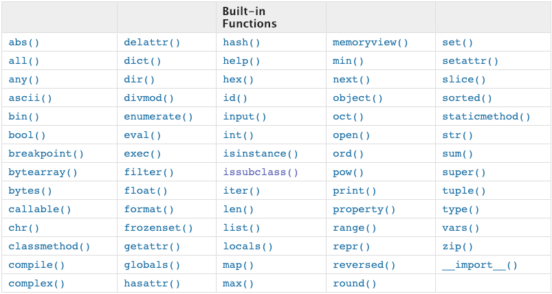
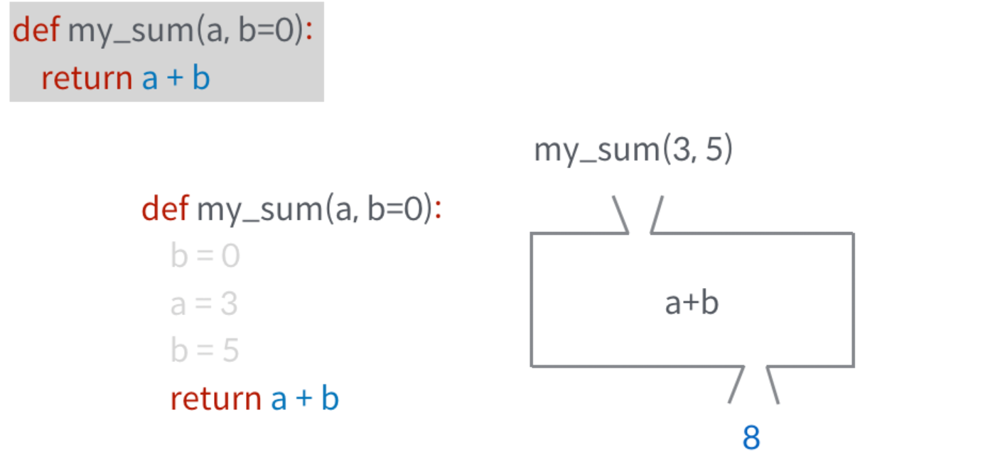
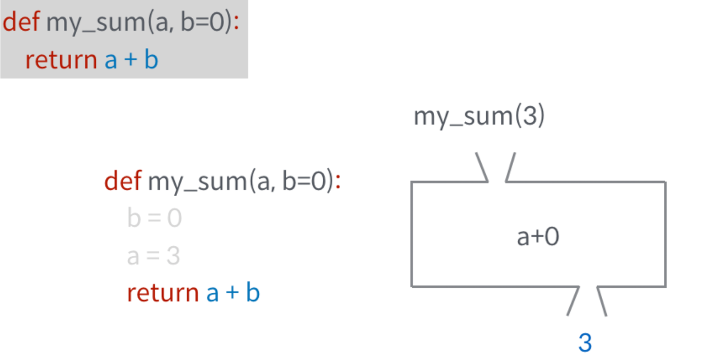

- 함수(function)
- 함수의 Output
- 함수의 Input

> 특정한 기능(function)을 하는 코드의 묶음
>
> 함수를 쓰는 이유? 가독성, 재사용성, 유지보수, 코드를 많이 쓸수록 오류 발생 확률 높아지기 때문


## 함수의 선언과 호출

- 함수 선언은 `def`로 시작하여 `:`으로 끝나고, 다음은 `4spaces 들여쓰기`로 코드 블록을 만든다.

- 함수는 `매개변수(parameter)`를 넘겨줄 수도 있다.

- 함수는 동작후에 `return`을 통해 결과값을 전달 할 수도 있다. (`return` 값이 없으면, `None`을 반환한다.)

- 함수는 호출을 `func()` / `func(val1, val2)`와 같이 한다.

  

  활용법

  ```python
  def <함수이름>(parameter1,parameter2):
      <코드 블럭>
      return value
  ```


- 매개변수와 인수가 계속 헷갈렸다. 

  매개변수(parameter)와 인수(arguments)! 매개변수는 함수에 입력으로 전달된 값을 받는 변수를 의미하고, 인수는 함수를 호출할때 전달하는 입력값을 의미한다고 한다.

  ```python
  def add(a,b): #a와 b는 매개변수
      return a+b
  
  print(add(3,4)) #3,4는 인수
  ```


### 입력값이 없는 함수

입력값이 없는 함수도 존재한다. 

```python
def say(): #매개변수가 비어있다
    return 'hi'
```

어떻게 활용하나? 

```python
a = say()
print(a) #Hi 출력 
```

위 함수를 쓰기 위해서는 `say()`처럼 괄호 안에 아무 값도 넣지 않아야 한다. 이 함수는 입력값은 없지만 결괏값으로 Hi라는 문자열을 돌려준다. `a = say()`처럼 작성하면 a에 Hi 문자열이 대입되는 것이다.

이처럼 입력값이 없고 결괏값만 있는 함수는 다음과 같이 사용된다.

> 결괏값을 받을 변수 = 함수이름()


### 결과값이 없는 함수

```python
def add(a, b): 
    print("%d, %d의 합은 %d입니다." % (a, b, a+b))
    
a = add(3,4)
print(a)
    
```

> 3, 4의 합은 7입니다.
>
> None

print문은 함수의 구성 요소 중 하나인 `<수행할 문장>`에 해당하는 부분일 뿐이다. 결괏값은 당연히 없다. 결괏값은 오직 return 명령어로만 돌려받을 수 있다.


### [연습] 세제곱 함수

> 입력 받은 수를 세제곱하여 반환(return)하는 함수 cube()를 작성해보시오

```python
#def가 함수를 시작하겠다, cube는 함수이름
#()는 파라미터

def cube(num):
    cubed=num**3
    return cubed #아웃풋 코드

cube(2)
```

```python
def cube(num):
    return num**3 #return에는 식으로 바로 쓸 수 있음
	return 10 #이 코드는 실행되지 않음

#함수는 입력 여러개 받을 수 있지만, 출력은 하나의 값만! 
```


### [연습] 사각형의 넓이와 둘레를 구하는 함수

> 밑변(width)과 높이(height)를 입력받아 사각형의 넓이와 둘레를 반환(return)하는 함수 `rectangle()`을 작성해보세요.

```python
def rectangle(width, height):
    area=width*height
    perimeter= (width+height)*2
    return(area,perimeter)

rectangle(30,20)
```

- 내장함수 목록

  `dir(__builtins__)`

  


### [연습] 함수를 만들기

> 아래의 코드와 동일한 `my_max`함수를 만들어 주세요
>
> 정수를 두 개받아서, 큰 값을 출력합니다. 두 숫자가 같으면 앞의 숫자를 출력합니다. 

my_max(1,5)

예시 출력) 5가 더 큽니다.

```python
def my_max(a,b):
    if a >= b:
        return f'{a}가 더 큽니다'
    else:
        return f'{b}가 더 큽니다'
    
my_max(2,3)
```

> '3'가 더 큽니다'


## 함수의 Output

### 함수의 `return`

함수는 반환되는 값이 있으며, 이는 어떠한 종류라도 상관없습니다. 

단, 오직 한 개의 객체만 반환됩니다. 

함수가 return되거나 종료되면, 함수를 호출한 곳으로 돌아갑니다.

#### [연습] 함수를 정의하고 값을 반환해봅시다.

> 리스트두개를 받아 각각 더한 결과를 비교하여 값이  큰 리스트를 반환하는 함수를 만들어보시오

my_list_max([10,3],[5,9])

예시 출력) [5,9]

```python
#sum()이용

del my_list_max(a,b):
    if sum(a) >= sum(b):
        return a 
   	else:
        return b
my_list_max([10,3],[5,9])
```

> [5,9]

```python
#sum 함수를 못쓴다고 가정

def my_list_max(a,b):
    sum_a = 0
    for item in a :
        sum_a += item
    #print(sum_a)
    
    sum_b=0
    for item in b:
        sum_b += item
    #print(sum_b)
    
    if sum_a >= sum_b :
        return a
    else:
        return b
        
my_list_max([10, 3], [5, 9])
```

> [5,9]


## 함수의 입력(Input)

### 매개변수(parameter) & 인자(argument)


#### (1) 매개변수(paratmeter)

```python
def func(x):
    return x + 2
```

- `x`는 매개변수(parameter)
- 입력을 받아 함수 내부에서 활용할 `변수`라고 생각하면 된다.
- 함수의 정의 부분에서 볼 수 있다.

##### 매개변수 지정하여 호출하기

함수를 호출할때 매개변수를 지정할 수 있다

```python
def add(a,b):
    return a+b
```

```python
result = add(a=3,b=7)
print(result) #10 출력
```

```python
result = add(b=5,a=3) #b에 5, a에 3을 전달
print(result) #8 출력
```


#### (2) 전달인자(argument)

```python
func(2)
```

- `2`는 (전달)인자(argument)
- 실제로 전달되는 `입력값`이라고 생각하면 된다.
- 함수를 호출하는 부분에서 볼 수 있다.


### 함수의 인자

함수는 입력값(input)으로 `인자(argument)`를 넘겨줄 수 있다.


#### 위치 인자(Positional Argument)

함수는 기본적으로 인자를 위치로 판단한다.

##### [연습] 원기둥의 부피

> 원기둥의 반지름(r)과 높이(h)를 받아서 부피를 return 하는 함수 cylinder()를 작성하세요.
>
> 원기둥 부피 = 밑면의 넓이*높이

```python
def cylinder(r,h):
    area=3.14*r*r
    volume = area*h
    return volume

print(cylinder(5,2))
```


#### 기본 인자 값(Default Argument Values)

함수가 호출될 때, 인자를 지정하지 않아도 기본값을 설정할 수 있다.

[활용법]

```python
def func(p1=v1):
    return p1
```


##### [연습] 기본 인자값 활용

> 이름을 받아서 다음과 같이 인사하는 함수 `greeting()`을 작성하세요. 이름이 채린이면, "채린,안녕?" 이름이 없으면 "익명, 안녕?"으로 출력하세요 

```python
def greeting(name):
    if name:
        name = name
    else:
        name ='익명'
    return f'{name}, 안녕?'
```

아무것도 안넣으면 기본 인자값을 설정할 수 있다. 인자를 지정하지 않아도 

```python
def greeting(name='익명'):
    return f'{name}, 안녕?'
```

- 기본 인자 값이 설정되어 있더라고 기존의 함수와 동일하게 호출 가능하다.

  


- 호출시 인자가 없으면 기본 인자 값이 활용된다. 

  

- ```python
  def func(a,b=3):
      return a+b
  
  print(func(10,10)) #20 출력
  print(func(10)) #13 출력 
  ```

  위 함수는 함수 안에 매개변수 `b`의 값이 기본값 3을 가지고 있습니다. 인자를 모두 넘겨준다면 기본값을 무시한 결과를 출력하고, (10+10)

  만약 매개변수에 매칭되는 인자가 없다면 기본값을 사용하여 연산합니다.

  이때 기본값도 없다면 함수는 에러를 발생시킵니다.

  

- **주의** , 단 기본 인자값(Defalut Argument Value)을 가지는 인자 다음에 기본 값이 없는 인자를 사용할 수는 없습니다. 

  아래 오류를 확인해보자

  ```python
  def greeting(name='익명',grade):
      return f'{grade}학년 {name}님, 환영합니다'
  
  
  #SyntaxError: non-default argument follows default argument
  #왜 에러? 
  #greeting(4)를 입력하면 컴퓨터가 헷갈림.
  #순서를 바꾸면 된다
  
  #수정 버전
  def greeting(grade,name='익명'):
      return f'{grade}학년 {name}님 환영합니다'
  ```

  

  #### 키워드 인자 (Keyword Arguments)

  키워드 인자는 직접 변수의 이름으로 특정 인자를 전달할 수 있다.

  - 인자와 매개변수에 위치와 일치시키는 인자를 **위치인자**,매개변수에 이름으로 일치시키는 인자를 **키워드인자**라고 합니다.

    어떤방식으로 인자를 함수에 보내도 상관없습니다.

    하지만 위치인자는 항상 키워드 인자보다 먼저 작성해야합니다.

  ```python
  def func(a,b):
      print(a,b,sep='-')
      
  #위치로 매칭하는 방법
  func('py','thon')
  
  #키워드로 매칭하는 방법
  func(b='thon',a='py')
  
  #가능
  func('py',b='thon')
  
  #불가능
  func(a='py','thon') #SyntaxError
  ```


#### 가변(임의) 인자 리스트(Arbitrary Argument Lists)

입력값이 몇개가 될지 모를때! 

>  `print()`처럼 개수가 정해지지 않은 임의의 인자를 받기 위해서는 가변 인자 리스트`*args`를 활용합니다.
>
> 가변 인자 리스트는 `tuple` 형태로 처리가 되며, 매개변수에 `*`로 표현합니다.

**활용법**

```python
def func(a,b,*args):

#`args`: 임의의 개수의 위치인자를 받음을 의미
#보통, 이 가변 인자 리스트는 매개변수 목록의 마지막에 옵니다.
```

```python
def func(*args): 
    for i in args:
        if i*2==0:
            print(i)
            
func(1,2,3,4,5,6)

#튜플은 컨테이너 중에 시퀀스형임
#튜플은 immutable
#args의 본질은 튜플이다
```

> 2
>
> 4
>
> 6

***args처럼 매개변수 이름 앞에 *을 붙이면 입력값을 전부 모아서 튜플로 만들어 준다!

**활용 예시**


```python
def add_mul(choice,*args):
    if choice == 'add':
        result = 0
        for i in args:
            result += i
    
    elif choice == 'mul':
        result = 1
        for i in args:
            result *= i 
    return result 
```

```python
add_mul('add',1,2,3,4,5) #15출력
add_mul('mul',1,2,3,4,5) #120출력
```


##### [연습] 가변 인자 리스트를 사용해봅시다.

> 정수를 여러개 받아서 가장 큰 값을 반환(return)하는 함수 `my_max()`를 작성하세요

```python
def my_max(*args):
    return max(args)

my_max(-1, -2, -3, -4) #-1 출력
```

```python
import sys

def my_max(*args):
    max_value = -sys.maxsize
    for i in args:
        if max_value < i :
            max_value = i
            
    return max_value

my_max(-1, -2, -3, -4) #-1 출력 
```


#### 가변(임의) 키워드 인자(Arbitrary Keyword Arguments)

정해지지 않은 키워드 인자들은 **`dict`** 형태로 처리가 되며, `**`로 표현합니다.

보통 `kwagrs`라는 이름을 사용하며, `**kwargs`를 통해 인자를 받아 처리할 수 있습니다.

##### [연습] 정의되지 않은 키워드 인자를 처리

> `my_dict()` 함수를 만들어 실제로 dictionary 모습처럼 출력 함수를 작성하세요. 

```python
def my_dict(**kwargs):
    return kwargs

my_dict(한국어='안녕', 독일어='신세영')

```

> {'한국어' : '안녕', '독일어' : '신세영'}  #출력 


```python
def print_kwargs(**kwargs):
    print(kwargs)
   
```

print_kwargs 함수는 매개변수 kwargs를 출력하는 함수이다. 

```python
print_kwargs(a=1) #{'a':1} 출력
print_kwargs(name='foo',age=3) #{'age'=3,'name'='foo'}
```

`**args`매개변수 이름 앞에 `**`를 붙이면 매개변수 kwargs는 딕셔너리가 되고, 모든 `key=value`형태의 결괏값이 그 딕셔너리에 저장된다. 


### 매개변수에 초깃값 미리 설정하기

매개변수에 초깃값을 미리 설정해 주는 경우를 학습해보자

```python
#say_myself 함수는 3개의 매개변수를 받아서 마지막 인수인 man이 True이면 "남자입니다",False이면 "여자입니다."를 출력한다

def say_myself(name,old,man=True):
    print(f'나의 이름은 {name}입니다.')
    print(f'나이는 {old}살입니다.')
    
    if man:
        print("남자입니다.")
    else:
        print('여자입니다')
```

이 함수는 매개변수가 `name,old,man=True` 3개다. 여기서 배웠던 것은 `man=True` 처럼 매개변수에 미리 값을 넣어 준것이다. 이것이 바로 함수의 매개변수 초깃값을 설정하는 것이다! 함수의 매개변수에 들어갈 값이 항상 변하는 것이 아니라면 이렇게 함수의 초깃값을 미리 설정해 두면 유용하다고 한다.

```python
say_myself('강동원',27)
say_myself('강동원',27,True)
```

출력 결과 모두 동일한 결과가 나온다

> 나의 이름은 강동원입니다. 
>
> 나이는 27살입니다. 
>
> 남자입니다.

만약 초깃값으로 설정된 부분을 False로 한다면??

```python
say_myself('김채린','24',False)
```

> 나의 이름은 김채린입니다.
>
> 나이는 24살입니다.
>
> 여자입니다.

**주의할 점**

```python
def say_myself(name, man=True, old): 
    print("나의 이름은 %s 입니다." % name) 
    print("나이는 %d살입니다." % old) 
    if man: 
        print("남자입니다.") 
    else: 
        print("여자입니다.")

```

매개변수의 위치가 매우 중요하다. 이렇게 하면 오류 발생한다.

**SyntaxError: non-default argument follows default argument**

뜻은 초깃값을 설정해 놓은 매개변수 뒤에 초깃값을 설정해 놓지 않은 매개변수는 사용할 수 없다는 뜻이다. 즉 매개변수로 `(name,old,man=True)`는 되지만 `(name,man=True,old)`는 안된다는 것이다. 초기화시키고 싶은 매개변수를 항상 뒤쪽에 놓아야 한다!!! 


### 헷갈리는 것 정리

- 함수의 결괏값은 언제나 하나이다

```python
#add_and_mul함수는 2개의 입력인수를 입력받아 더한값과 곱한 값을 돌려주는 함수
def add_and_mul(a,b):  
    result =a+b, a*b
    return result #(7,12)로 돌려줌 
```

결괏값으로 (7,12)라는 튜플 값을 가지게 된다. 하지만 아래처럼 쓰면 안됨

```python
def add_and_mul(a,b):
    return a+b 
	return a*b #두번째 return문은 실행되지 않는다
```

즉, 함수는 return 문을 만나는 순간 결괏값을 돌려준 다음 함수를 빠져나간다.


