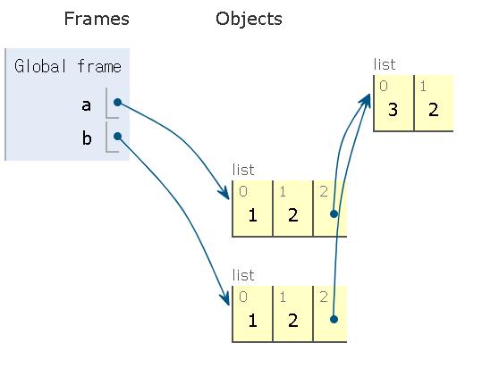
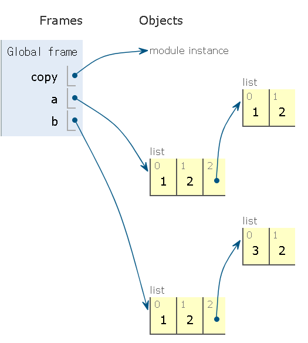

# 0727_TIL

- Data Structure


# 데이터 구조(Data Structure) 

데이터 구조(Data Structure)란 데이터에 편리하게 접근하고, 변경하기 위해서 데이터를 저장하거나 조작하는 방법을 말한다. 

- 알고리즘에 빈번히 활용되는 순서가 있는(ordered) 데이터 구조

  - 문자열(String)
  - 리스트(List)

- 데이터 구조에 적용 가능한 Built-in Function

  - `map()`
  - `filter()`

  

두가지가 중요하다. 뭐가 들어와서 나가는지를 정의하기 위해 함수를 쓰는데, 여기서 중요한건 뭐를 집어넣을 수 있고, 어떤 것이 나오는지가 중요하다.

for more detail, 어떤 값을 자유롭게 넣을 수 있고(가변인자리스트,args) 더 중요한건 아웃풋파트에서 return값이 있는지! 값을 반환하는건지 아니면 원본 데이터를 수정하는지!

대부분 원본 데이터를 수정하는 코드들은 리턴값이 없는 경우가 많다.


## 문자열(String)

변경불가(immtable), 순서 있고(ordered), 순회 가능(iterable)

순서가 있으면 무조건 순회가능함


### (1) 조회/탐색

`.find(x)`

x의 첫번째 위치를 반환한다. 없으면 `-1`을 반환한다. 

```python
'apple'.find('p') #1 리턴
```

`.index(x)`

x의 첫번째 위치를 반환한다. 없으면 오류가 발생한다.

```python
'apple'.index('k') 
#ValueError: substring not found

#그런데 'apple'.find('k')은 -1을 반환해줌
```

- 핸들링을 해보자

  ```python
  try:
      'apple'.index('k')
      
  except ValueError:
      print('해당하는 값이 없습니다')
  ```


### (2) 값 변경

`.replace(old,new[,count])`

바꿀대상을 새로운 글자로 바꿔서 반환환다. count를 지정하면 해당 갯수만큼만 시행한다. 

이 함수는 리턴값이 있는 함수다

```python
#
result = 'yay!'.replace('a', '_')
print(result) 

#리턴 값이 있다면, result라는 변수에 담고 그걸 실행하면 결괏값이 있으면 리턴을
#하는 함수구나
#replace()는 return값이 있구나
```


`.strip([chars])`

특정한 문자들을 지정하면, 양쪽을 제거하거나 왼쪽을 제거하거나(lstrip), 오른쪽을 제거합니다(rstrip). 지정하지 않으면 공백을 제거합니다.

```python
'    oh!\n'.strip() #아무것도 안넣으면 공백제거, 'oh!'반환
```

```python
'hehehihihihihi'.rstrip('hi') #hi라고 되어있는 패턴을 다 지움
#hehe 반환
```


`.split()`

문자열을 특정한 단위로 나누어 **리스트**로 반환합니다.

```python
#
'a_b_c'.split('_')
#리턴값이 있다.
#리턴값의 타입은 리스트
#split은 글자를 쪼개서 리스트를 반환한다. 
```

```
['a', 'b', 'c']
```


`'seperator'.join(iterable)`

특정한 문자열로 만들어 반환합니다.

반복가능한(iterable) 컨테이너의 요소들을 separator를 구분자로 합쳐(`join()`) **문자열**로 반환합니다.

```python
word = '배고파'

words = ['안녕', 'hello']

'!'.join(word)  #'배!고!파!'

' '.join(words) #'안녕 hello'
```

`.capitalize()` `title()` `upper()`

- `.capitalize()` : 앞글자를 대문자로 만들어 반환한다.
- `title()` : 어포스트로피나 공백 이후를 대문자로 만들어 반환
- `upper()` : 모두 대문자로 만들어 반환

```python
a='hi!Everyone, I\'m kim'
```

```python
b=a.capitalize()
c=a.title()
d=a.upper()

print(b) #Hi!everyone, i'm kim
print(c) #Hi!Everyone, I'M Kim
print(d) #HI!EVERYONE, I'M KIM
```


### `.lower()`, `.swapcase()`

- `lower()` : 모두 소문자로 만들어 반환한다.
- `swapcase()` : 대 <-> 소문자로 변경하여 반환한다.


##  리스트(list)

변경 가능하고(mutable), 순서가 있고(ordered), 순회 가능한(iterable) 리스트는 변경가능함. str는 변경불가하다. 변경하면 새로운게 튀어나온다. 

리스트는 변경가능하기 때문에, 원본을 변경하는 애와 원본을 변경하지 않는애랑 크게 둘로 나뉘게 됨. 

원본 변경하는 건 `return None`인 경우가 많고, 원본 변경 x는 변경된 데이터가 return되게끔 되어 있다. 이 둘 차이가 매우매우 중요합니다.


### (1) 값 추가 및 삭제

`.append(x)`: 리스트에 값을 추가할 수 있다

```python
# 카페 리스트를 만들어봅시다.
cafe = ['starbucks', 'tomntoms', 'hollys']
print(cafe)

cafe.append('banapresso')
print(cafe) #['starbucks', 'tomntoms', 'hollys', 'banapresso']

new_cafe = cafe.append('banapresso')
print(new_cafe) #그레서 이게 안됨
```

#원본을 조작하고, 리턴값이 없는 함수구나

`.extend(iterable)`

리스트에 iterable(list, range, tuple, string**[주의]**) 값을 붙일 수가 있습니다.

.append()는 ()안에 값이 들어간다. .extend()는 [1,2,3]+[4,5,6] > [1+2+3+4+5+6] 와 같다.

~~**이거 append랑 뭐가 다른지 비교하는거 추가해놓기**~~

**append와 비교해보자**

```python
cafe.append(['coffeenie'])
print(cafe)
#['starbucks', 'tomntoms', 'hollys', 'banapresso',['coffeenie']]

cafe.extend('kyocoffee')
#['starbucks', 'tomntoms', 'hollys', 'banapresso',['coffeenie'],'k','y','o','c','o','f','f','e','e' ]
```


`.insert(i,x)` : 정해진 위치 i에 값을 추가한다.

```python
cafe=[1,2,3,4]
cafe.insert(0,'start')
print(cafe) #['start',1,2,3,4]
```

```python
cafe.insert(len(cafe),'end')
print(cafe) #['start',1,2,3,4,'end']
```

-리스트의 길이를 넘어서는 인덱스는 마지막에 아이템이 추가된다. 매우 유용한 함수인것 같다.

```python
cafe.insert(len(cafe)+1,'!')
print(cafe) #['start', 1, 2, 3, 4, 'end', '!']
```

`.remove() `: 리스트에서 값이 x인것을 삭제한다.

```python
numbers=[1,2,3,1,2]

numbers.remove(1) #인덱스가 1인게 아니라 값이 1인점을 삭제한다는 것을 주의하자
print(numbers) #[2,3,1,2]

numbers.remove(1)
print(numbers) #[2,3,2]
```

`.pop(i)`: 정해진위치 i에 있는 값을 삭제하며, 그 항목을 반환한다.i가 정해지지 않으면 마지막 항목을 삭제하고 되돌려준다.

```python
a=[1,2,3,4,5,6]
print(a.pop(0)) #0
print(a) #[2,3,4,5,6]
```

`.index(x)` : x 값을 찾아 해당 index 반환합니다.

`.count(x)` : 원하는 값의 개수를 확인할 수 있다.

`.sort()`: 정렬을 한다. 내장함수 `sorted()`와는 다르게 원본 list를 변형시키고, None을 리턴한다. 

`.reverse()`:반대로 뒤집는다. 정렬아님!


## 리스트 복사 방법

(1) 슬라이스 연산자 사용

원본 변경이 아니라 새로운 값을 리턴한다.

```python
a=[1,2,3]
b=a[:]

b[0]=5
print(a) #[1,2,3]
```

```python
a=[1,2,3]
b=a #이건 원본변경이다.
```

(2) 리스트 활용

```python
a=[1,2,3]
b=list(a) #일부상황에서만 하는 얕은 복사이다

b[0]=5
print(a)
```

- 이거 깊은복사가 뭔지 얕은 복사가 뭔지 이해가 안감
- 추가 필요


(3)  2차원 배열 복사. 아래처럼 하면 복사가 안된다

```python
a = [1, 2, [1, 2]] #이건 나중에 하게 돔
#안에 잇는애는 그 slice라는 수혜를 못받음 
                  # google python tutor! 그리고 복사해서 왜 복사안되는지 바로 알 수 있음
b = a[:]

b[2][0] = 3
print(a)
```




- 이때는 깊은 복사를 해야한다.

```python
import copy

a=[1,2,[1,2]]
b=copy.deepcopy(a)

b[2][0]=3
print(a) 

```




## 데이터의 분류

변경 불가능한 데이터 

- 숫자
- 글자
- 참/거짓
- range(),  tuple(), frozenset()


# 데이터 구조에 적용가능한 Built-in Function

순회가능한(iterable) 데이터 구조에 적용가능한 Built-in Function

> iterable 타입 - `list`, `dict`, `set`, `str`, `bytes`, `tuple`, `range`

- `map()`
- `filter()`
- `zip()`


- filter()

```python
list(filter(lambda x: x > 0, range(-5,10)))

>>> [1, 2, 3, 4, 5, 6, 7, 8, 9]

출처: https://bluese05.tistory.com/66 [ㅍㅍㅋㄷ]
```

```python
map, filter, reduce 를 람다함수를 이용하여 작성해보겠습니다.

l = list(range(1,11))
print(l)
# [1, 2, 3, 4, 5, 6, 7, 8, 9, 10]
 
m = list(map(lambda n:n*n, l))
print(m)
# [1, 4, 9, 16, 25, 36, 49, 64, 81, 100]
 
f = list(filter(lambda n:n%2==0, l))
print(f)
# [2, 4, 6, 8, 10]
 
r = reduce(lambda n,m:n*m, l)
print(r)
# 3628800
출처:https://dpdpwl.tistory.com/87
```

