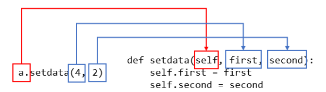

# 0729_TIL

- OOP 
- 객체
- 객체지향프로그래밍
- 클래스와 객체 


## 객체(Object) 의 특징?

- 타입: 연산(operator)과 조작(method)이 가능한가?
- 속성:어떤 상태(data)를 가지는가?
- 조작법(method):어떤 행위(함수)를 할 수 있는가?


### 타입(type)과 인스턴스(instance)

|  type  |         instance         |
| :----: | :----------------------: |
| `int`  |      `0`, `1`, `2`       |
| `str`  | `''`, `'hello'`, `'123'` |
| `list` |    `[]`, `['a', 'b']`    |
| `dict` | `{}`, `{'key': 'value'}` |

타입은 공통된 속성과 조작법을 가진 객체들의 분류이다. 그리고 인스턴스는 특정 타입의 실제 데이터 예시(instance)이다. 파이썬에서 모든 것은 객체고, 모든 객체는 특정 타입의 인스턴스이다. 예를 들면 hello는 list라는 타입의 하나의 예시이다. 

a=int(10)

b=int(20)

#a,b 는 객체

#a,b,는 int 타입(type)의 인스턴스 

`isinstance(데이터, 타입)`을 하면, True or False로 반환한다.

```python 
isinstance('hello',str) #True
isinstance('hello',int) #False
```


### 속성(Attribute)과 메서드(Method)

객체의 속성(상태, 데이터)과 조작법(함수)을 명확히 구분해 봅시다.

|   type    |    attributes    | methods                                |
| :-------: | :--------------: | -------------------------------------- |
| `complex` | `.real`, `.imag` |                                        |
|   `str`   |        _         | `.capitalize()`, `.join()`, `.split()` |
|  `list`   |        _         | `.append()`, `.reverse()`, `.sort()`   |
|  `dict`   |        _         | `.keys()`, `.values()`, `.ite`         |

- `" ".join(list)`은 리스트에서 문자열로, `.split()` 은 문자열에서 리스트로!! 

**속성**은 객체의 상태/데이터를 뜻한다.

```python
print((3+4j).real) #3.0
print((3+4j).imag) #4.0
```


**메서드**는 특정 객체에 적용할 수 있는 행위를 뜻한다.

```python
[3,2,1].sort() 
#이대로 실행하면 아무것도 안나옴. 리턴하는 함수아님.(리스트는 변경가능하고, 원본을 변경가능하기 때문에 )
```

```python
a=[3,2,1]
a.sort()
a #[1,2,3]
```


 ## 객체 지향 프로그래밍

Object가 중심(oriented)이 되는 프로그래밍.

객체 지향 프로그램(OOP)은 컴퓨터 프로그래밍의 패러다임의 하나이다. 객체 지향 프로그래밍은 컴퓨터 프로그램을 명령어의 목록으로 보는 시각에서 벗어나 여러 개의 독립된 단위, 즉 "객체"들의 모임으로 파악하고자 하는 것이다.


#### 절차 중심 vs Object 중심

> 프로그래밍 패러다임: 어떻게 프로그램을 정돈(organize)할 것인가


#### 절차 중심의 장점

**<wikipedia - 객체지향 프로그래밍>**

> 객체 지향 프로그래밍은 프로그램을 유연하고 변경이 용이하게 만들기 때문에 대규모 소프트웨어 개발에 많이 사용된다.
>
> 또한 프로그래밍을 더 배우기 쉽게 하고 소프트웨어 개발과 보수를 간편하게 하며,
>
> 보다 직관적인 코드 분석을 가능하게 하는 장점을 갖고 있다.

- 코드의 **직관성**
- 활용의 **용이성**
- 변경의 **유연성**


## 클래스와 객체

> `type`: 공통 속성을 가진 객체들의 분류(class)

> `class`: 객체들의 분류(class)를 정의할 때 쓰이는 키워드


## 클래스와 객체


과자를 만드는 과자 틀과 그것을 사용해 만든 과자이다.

- 과자 틀 → 클래스 (class)
- 과자 틀에 의해서 만들어진 과자 → 객체 (object)

여기에서 설명할 클래스는 과자 틀과 비슷하다. 클래스(class)란 똑같은 무엇인가를 계속해서 만들어 낼 수 있는 설계 도면이고(과자 틀), 객체(object)란 클래스로 만든 피조물(과자 틀을 사용해 만든 과자)을 뜻한다.

클래스로 만든 객체에는 중요한 특징이 있다. 바로 객체마다 고유한 성격을 가진다는 것이다. 과자 틀로 만든 과자에 구멍을 뚫거나 조금 베어 먹더라도 다른 과자에는 아무 영향이 없는 것과 마찬가지로 동일한 클래스로 만든 객체들은 서로 전혀 영향을 주지 않는다.

다음은 파이썬 클래스의 가장 간단한 예이다.

```
>>> class Cookie:
>>>    pass
```

위의 클래스는 아무 기능도 갖고 있지 않은 껍질뿐인 클래스이다. 하지만 이렇게 껍질뿐인 클래스도 객체를 생성하는 기능이 있다. "과자 틀"로 "과자"를 만드는 것처럼 말이다.

객체는 클래스로 만들며 1개의 클래스는 무수히 많은 객체를 만들어 낼 수 있다. 위에서 만든 Cookie 클래스의 객체를 만드는 방법은 다음과 같다.

```
>>> a = Cookie()
>>> b = Cookie()
```

`Cookie()`의 결괏값을 돌려받은 a와 b가 바로 객체이다. 마치 함수를 사용해서 그 결괏값을 돌려받는 모습과 비슷하다.**a와 b의 id를 찍어보면 다른 값이 나옴**


**[객체와 인스턴스의 차이]**

클래스로 만든 객체를 인스턴스라고도 한다. 그렇다면 객체와 인스턴스의 차이는 무엇일까? 이렇게 생각해 보자. a = Cookie() 이렇게 만든 a는 객체이다. 그리고 a 객체는 Cookie의 인스턴스이다. 즉 인스턴스라는 말은 특정 객체(a)가 어떤 클래스(Cookie)의 객체인지를 관계 위주로 설명할 때 사용한다. "a는 인스턴스"보다는 "a는 객체"라는 표현이 어울리며 "a는 Cookie의 객체"보다는 "a는 Cookie의 인스턴스"라는 표현이 훨씬 잘 어울린다.


### 클래스(Class) 생성

- 클래스는 분류, 타입이라고 생각하면 됨.

- 클래스의 생성은 class 키워드와 정의하고자 하는 <클래스의 이름>으로 가능하다.

- <클래스의 이름>은 PascalCase로 정의한다.

- 클래스 내부에는 데이터 함수를 정의할 수 있고, 이때 정의된 함수는 메서드로 불린다.

  **활용법**

  ```python
  class <클래스이름>:
      <메소드>
  class ClassName:
      methods
  ```

  ```python
  class Person:
      pass
  
  
  print(type(Person))
  ```

  

### 인스턴스 생성

- 정의된 클래스(`class`)에 속하는 객체를 해당 클래스의 인스턴스(instance)라고 한다.
- `Person` 클래스의 인스턴스는 `Person()`을 호출함으로써 생성된다.
- `type()` 함수를 통해 생성된 객체의 클래스를 확인할 수 있다.


### 메서드 정의

- 특정 데이터 타입의 객체에 공통적으로 적용가능한 행위들을 의미한다.

  #### 활용법

  ```python
  class Person:
      #Person의 인스턴스는 talk 이라는 공통적 특징 갖고 있음
      #slef는 인스턴스들이 공유하는 메서드라고 생각하면 됨.
      def talk(self):    # 인자로 self를 붙여줍니다.
          return '안녕'
  ```
```
  
  ```python
  p1=Person()
  p1.talk() #'안녕'
```

- 메서드도 함수이기 때문에 추가적인 인자를 받을 수 있다.

  ```python
  class Person:
      def talk(self):
           return '안녕'
      
      def eat(self,food):
          return f'냠냠 {food}'
  ```

  ```python
  p1=Person()
  p1.eat('수제버거') #'냠냠 수제버거'
  ```

  ```python
  class Person:
      def talk(self):
          return '안녕'
      
      def eat(self, food='(먹을거줘)'):
          return f'{food} 냠냠'
  ```

  ```python
  p1=Person()
  p2=Person()
  
  print(p1.eat('진가와')) #진가와 냠냠 
  print(p2.eat()) #(먹을거줘) 냠냠
  ```


### 생성자(constructor) 메서드  : 인스턴스 객체가 생성될때 호출되는 함수

- 활용법

  ```python
  def __init___(self):
      print('생성될때 자동으로 호출되는 메서드')
  ```

- 생성자를 활용하면 인스턴스가 생성될때 인스턴스의 속성을 정의할 수 있다.

### 소멸자(destructor) 메서드 : 인스턴스 객체가 소멸되기 직전에 호출되는 함수

- 활용법

  ```python
  def __del__(self):
      print('소멸될때 자동으로 호출되는 메서드입니다')
  ```

- 예시

  ```python
  class Person:
      def __init__(self): #생성자함수
          print('응애!')
          
      def __del__(self): #소멸자함수
          print('갈게..')
  ```

  ```python
  p1=Person() #응애
  del p1 #갈게..
  ```

### 속성(Attribute) 정의 : 특정 데이터 타입(또는 클래스)의 객체들이 가지게 될 상태/데이터 의미

- 활용법

  ``` python
  class Person:
      def __init__(self,name):
          self.name=name
      def talk(self):
          return f'안녕, 나는 {self.name}'
  ```

  ```python
  me = Person('홍길동')
  print(me.name) #홍길동
  ```

- 인스턴스 변수의 값을 변경할 수 있다.

  ```python
  me = Person('김싸피')
  print(me.name) #김싸피
  ```

### 매직메서드

> 더블 언더스코어가 있는 메서드는 특별한 일을 하기 위해 만들어진 메서드이기 때문에 스페셜 메서드 또는 매직 메서드라고 불린다.
>
> `__something__`

- 예시

  ```python
  __str__(self)
  #특정 객체를 출력할때 보여줄 내용을 정의할 수 있음
  
  class Person:
      def __str__(self):
          return '객체 출력시 보여줄 내용'
  ```

- **self** : 인스턴스 자신(self)

  python에서 메서드는 호출시 첫번째 인자로 인스턴스 자신이 전달되게 설계되었다.

  보통 매개변수명으로 self를 첫번째 인자로 설정

- ```python
  class Person:
      def __init__(self,name):
          self.name = name
      def talk(self):
          return f'안녕 나는 {self.name}이야'
  ```

  ```python
  lin=Person('lin')
  lin.talk() #안녕 나는 lin
  ```

- 정리

  **객체(object)**

  - 객체는 자신 고유의 속성을 가지며 클래스에서 정의한 행위를 수행할 수 있다.

  **클래스(class)**

  - 공통된 속성과 행위를 정의한 것으로 객체지향 프로램의 기본적인 사용자 정의 데이터형

  **인스턴스(instance)**

  - 특정 class로부터 생성된 해당 클래스의 예시

  **속성(attribite)**

  - 클래스/인스턴스가 가지는 속성(값,데이터)

  **메서드(method)**

  - 클래스/인스턴스에 적용 가능한 조작법(method) & 클래스/인스턴스가 할 수 있는 행위


## [점프 투 파이썬, 클래스]

용어정리가 잘 안되서 사칙연산 FourCal 클래스를 만들어보면서 익히도록 한다.

먼저 `a=FourCal()` 를 입력해서 a라는 객체를 만든다. 그런 다음 `a.setdata(4,2)`처럼 입력해서 4와 2를 a에 지정해 주고, a.add()를 수행하면 6을 돌려주고 a.mul()을 수행하면 4*2 -- , 이렇게 동작하는 FourCal 클래스를 만드는 것이 목표다!

```python
class Fourcal: #클래스 구조 만들기
    #클래스 안에서 구현된 함수를 메서드라고 한다
    def setdata(self, first,second):
        self.first=first #메서드의 수행문1
        self.second = second #메서드의 수행문2
```

setdata 메서드에는 self, first, second 총 3개의 매개변수가 필요한데 실제로는 `a.setdata(4, 2)`처럼 2개 값만 전달했다. 왜 그럴까? 그 이유는 `a.setdata(4, 2)`처럼 호출하면 setdata 메서드의 첫 번째 매개변수 self에는 setdata메서드를 호출한 객체 a가 자동으로 전달되기 때문이다. 다음 그림을 보면 객체를 호출할 때 입력한 값이 메서드에 어떻게 전달되는지 쉽게 이해할 수 있을 것이다.




```python
self.first = 4
self.second=2
```

`a.first=4` 문장이 수행되면 a객체에 객체변수 first가 생성되고 값 4가 저장된다. 마찬가지로 `a.second=2`문장이 수행되면 a객체에 객체변수 second가 생성되고 값 2가 저장된다.

**클래스로 만든 객체의 객체변수는 다른 객체의 객체변수에 상관없이 독립적인 값을 유지한다. **

```python
>>> a = FourCal()
>>> b = FourCal()
>>> a.setdata(4, 2)
>>> b.setdata(3, 7)
>>> id(a.first)   # a의 first 주소값을 확인
1839194944
>>> id(b.first)   # b의 first 주소값을 확인
1839194928
```


### 기능 만들어주기

```python
class FourCal:
    def setdata(self, first, second):
        self.first = first
        self.second = second
    
    def add(self):
        result = self.first + self.second
       	return result
     
     def mul(self):
         result = self.first * self.second
         return result
     
      def sub(self):
         result = self.first - self.second
         return result
    
     def div(self):
         result = self.first / self.second
         return result
    
```

```python
>>> a = FourCal()
>>> b = FourCal()
>>> a.setdata(4, 2)
>>> b.setdata(3, 8)
>>> a.add()
6
>>> a.mul()
8
>>> a.sub()
2
>>> a.div()
2
>>> b.add()
11
>>> b.mul()
24
>>> b.sub()
-5
>>> b.div()
0.375
```


## 생성자 (Constructor)

```python
a = FourCal()
a.add()
Traceback (most recent call last):
  File "<stdin>", line 1, in <module>
  File "<stdin>", line 6, in add
AttributeError: 'FourCal' object has no attribute 'first'
```

오류발생 이유? setdata 메서드를 수행해야 객체 a의 객체변수 first와 second가 생성되기 때문이다

이렇게 객체에 초깃값을 설정해야 할 필요가 있을 때는 setdata와 같은 메서드를 호출하여 초깃값을 설정하기보다는 생성자를 구현하는 것이 안전한 방법이다. **생성자(Constructor)란 객체가 생성될 때 자동으로 호출되는 메서드를 의미한다.**

파이썬 메서드 이름으로 `__init__`를 사용하면 이 메서드는 생성자가 된다. 다음과 같이 FourCal 클래스에 생성자를 추가해 보자.

```python
class FourCal:
    	
     def __init__(self, first, second):
         self.first = first
         self.second = second
     
    def setdata(self, first, second):
        self.first = first
        self.second = second
        
     def add(self):
         result = self.first + self.second
         return result
            
     def mul(self):
         result = self.first * self.second
        return result

     def sub(self):
         result = self.first - self.second
         return result
        
     def div(self):
		result = self.first / self.second
        return result
```

`

`__init__`메서드는 setdata 메서드와 이름만 다르고 모둔게 동일하다. 단 메서드 이름을 `__init__`으로 했기 때문에 생성자로 인식되어 객체가 생성되는 시점에 자동으로 호출되는 차이가 있다.


## 클래스의 상속

상속(Inheritance)이란 "물려받다"라는 뜻으로, "재산을 상속받다"라고 할 때의 상속과 같은 의미이다. 클래스에도 이 개념을 적용할 수 있다. 어떤 클래스를 만들 때 다른 클래스의 기능을 물려받을 수 있게 만드는 것이다. 이번에는 상속 개념을 사용하여 우리가 만든 FourCal 클래스에 ab (a의 b제곱)을 구할 수 있는 기능을 추가해 보자.

클래스를 상속하기 위해서는 다음처럼 클래스 이름 뒤 괄호 안에 상속할 클래스 이름을 넣어주면 된다.

> class 클래스 이름(상속할 클래스 이름)

이제 원래 목적인 a의 b제곱(ab)을 계산하는 MoreFourCal 클래스를 만들어 보자

```python
class MoreFourCal(FourCal):
    def pow(self):
        result = self.first ** self.second
        return result
```

```python
a = MoreFoulCal(4,2)
a.pow() #16
```


## 메서드 오버라이딩

이번에는 FourCal 클래스를 다음과 같이 실행해 보자.

```python
>>> a = FourCal(4, 0)
>>> a.div()
Traceback (most recent call last):
  File "<stdin>", line 1, in <module>
    result = self.first / self.second
ZeroDivisionError: division by zero
```

FourCal 클래스의 객체 a에 4와 0 값을 설정하고 div 메서드를 호출하면 4를 0으로 나누려고 하기 때문에 위와 같은 ZeroDivisionError 오류가 발생한다. 하지만 0으로 나눌 때 오류가 아닌 0을 돌려주도록 만들고 싶다면 어떻게 해야 할까?

다음과 같이 FourCal 클래스를 상속하는 SafeFourCal 클래스를 만들어 보자.

```python
class SafeFourCal(FourCal):
    def div(Self):
        if self.second==0: #나누는 값이 0인 경우 0을 리턴하도록 수정
            return 0
        
        else:
            return self.first/self.second
```

SafeFourCal 클래스는 FourCal 클래스에 있는 div 메서드를 동일한 이름으로 다시 작성하였다. 이렇게 부모 클래스에 있는 메서드를 동일한 이름으로 만드는 것을 **메서드 오버라이딩(덮어쓰기)**라고 한다. 이렇게 메서드를 오버라이딩하면 부모클래스의 메서드 대신 오버라이딩한 메서드가 호출된다.

SafeFourCal 클래스에 오버라이딩한 div 메서드는 나누는 값이 0인 경우에는 0을 돌려주도록 수정했다. 이제 다시 위에서 수행한 예제를 FourCal 클래스 대신 SafeFourCal 클래스를 사용하여 수행해 보자

```python
>>> a = SafeFourCal(4, 0)
>>> a.div()
0
```

FourCal 클래스와는 달리 ZeroDivisionError가 발생하지 않고 의도한 대로 0을 돌려주는 것을 확인할 수 있을 것이다.


## 클래스 변수

객체변수는 다른 객체들에 영향받지 않고 독립적으로 그 값을 유지한다는 점을 이미 알아봤다. 이번에는 객체변수와 성격이 다른 클래스 변수에 대해 알아보자

```python
class Family:
    lastname = '김'
    
    
print(Family.lastname) #김
```

Family 클래스에 선언한 lastname이 바로 클래스 변수이다. 클래스 변수는 클래스 안에 함수를 선언하는 것과 마찬가지로 클래스 안에 변수를 선언하여 생성한다.

클래스 변수는 위 예와 같이 `클래스이름.클래스 변수`로 사용할 수 있다.

만약 Family 클래스의 lastname을 다음과 같이 '박'이라는 문자열로 바꾸면 어떻게 될까? 

```python
Family.lastname = '박'

print(a.lastname) #박
print(b.lastname) #박
```

클래스 변수 값을 변경했더니 클래스로 만든 객체의 lastname 값도 모두 변경되는 것을 확인할 수 있다. 즉 클래스 변수는 클래스로 만든 모든 객체에 공유된다는 특징이 있다.


# 0729 OOP2

> - 인스턴스, 클래스 변수
> - 인스턴스, 클래스간의 이름공간
> - 인스턴스, 클래스 메서드(+스태틱 메서드)


## 인스턴스  변수

- 인스턴스의 속성

- 각 인스턴스들의 고유한 변수

- 메서드 정의에서 `self.변수명`로 정의

- 인스턴스가 생성된 이후 `인스턴스.변수명`로 접근 및 할당

  ```python
  활용법
  
  class Person:
      def __init(self, name): #인스턴스 메서드(생성자)
          self.name =name  #인스턴스 변수
  ```

  

## 클래스 변수

- 클래스의 속성

- 해당 클래스의 모든 인스턴스가 공유

- 클래스 정의 내부에서 선언

- `클래스.변수명` 또는 `인스턴스.변수명`으로 접근(할당)

  ```python
  #활용법
  
  class Person:
      species='human' #클래스 변수
      
      def info(self):
          return Person.species
  ```

  ```python
  john=Person('john')
  eric=Person('eric')
  print(john.species) #human
  print(eric.species) #human
  ```

  ```python
  john.species='developer'
  print(john.species) #developer
  print(eric.species) #human 
  ```

  

## 인스턴스와 클래스 간의 이름공간


### 이름 탐색 순서

- 인스턴스와 클래스 모두에서 같은 속성 이름이 등장하면 속성조회는 인스턴스를 우선한다.

  ```python
  class Person:
      name='김싸피'
      
      def __init__(self,name='ssafy'):
          self.name=name
      def talk(self):
          return f'안녕, 나는 {self.name}'
  ```

  ```python
  p1=Person()
  p1.talk() #안녕 나는 ssafy
  ```


## 이름 공간 원칙

- 인스턴스에서 변수의 이름을 조회를 할 수 없다면, 클래스 객체의 데이터를 조회한다.

- 즉, **인스턴스 => 클래스 (=> 상위 클래스)** 순으로 탐색을 한다.


## 인스턴스 메서드

- 메서드가 인스턴스 변수를 조정하면 인스턴스 메서드
- 메서드가 클래스 변수를 조정하면 클래스 메서드
- 아무것도 조정하지 않으면 스태틱 메서드라고 함
- 인스턴스 메서드란 인스턴스가 사용할 메서드, 클래스 내부에 정의되는 메서드의 기본값은 인스턴스 메서드
- 호출시 첫번째 인자로 인스턴스 자기자신 `self`이 전달됨

```python
#활용법

class MyClass:
    def instance_method(self, arg1, arg2, ...):

my_instance=MyClass()
my_instance.instance_method(arg1,arg2)

MyClass.instance_method(my_instace, arg1, arg2)
```


## 클래스 메서드

- 클래스가 사용할 메서드

- @classmethod 데이코레이터를 사용하여 정의

- 호출시, 첫번째 인자로 클래스  `cls`가 정의됨

  ```python
  #활용법
  
  class MyClass:
      @classmethod
      def class_method(cls,arg1,arg2, ...)
  ```

## 정리

**인스턴스와 메서드**

- 인스턴스는 3가지 종류의 메서드 모두에 접근할 수 있다.
- 하지만 인스턴스에서 클래스 메서드와 스태틱 메서드는 호출하지 않아야 한다.
- 인스턴스가 할 행동운 모두 인스턴스 메서드로 한정 지어서 설계한다

**클래스와 메서드**

- 클래스 또한 3가지 종류의 메서드 모두에 접근할 수 있다.
- 하지만 클래스에서 인스턴스 메서드는 호출하지 않는다.
- 클래스가 할 행동은 다음 원칙에 따라 설계한다
  - 클래스 자체(cls)와 그 속성에 접근할 필요가 있다면 클래스 메서드로 정의한다.
  - 클래스와 클래스 속성에 접근할 필요가 없더만 정적 메서드로 정의한다

**클래스메서드와 정적메서드**

- 클래스 메서드와 정적 메서드는 인스턴스 없이 호출할 수 있다는 점은 같다.
- 하지만 클래스 메서드는 메서드 안에서 클래스 속성, 클래스 메서드에 접근해야 할때 사용하여 그렇지 않을 경우는 정적메서드를 사용한다.


## 상속

상속이란?

- 클래스에서 가장 큰 특징은 상속기능!
- 부모 클래스의 모든 속성이 자식 클래스에게 상속되므로 재사용성이 높아진다.

```python
#활용법

class ChildClass(ParentClass):
    <codeblock>
```

인사만 할 수 있는 간단한 Person클래스가 있다.

```python
class Person:
    population = 0
    
    def __init__(self, name='사람'):
        self.name=name
        Person.population += 1
        
    def greeting(self):
        print(f'반갑습니다. {self.name} 입니다')
```

```python
p = Person()
p.greeting() #반갑습니다.사람입니다
```

Person 클래스를 상속받아 Student 클래스를 만들어보자

```python
class Student(Person):
    def __init__(self, student_id,name='학생'):
        self.name=name
        self.student_id=student_id
        Person.population += 1
        
```

```python
s=Student(1)
s.name #학생
s.student_id #1
```

부모 클래스에 정의된 메서드를 호출할 수 있다.

```python
s.greeting() #반갑습니다.학생입니다
```


### 상속의 이점

코드 중복을 피할 수 있고, 공통된 속성이나 메서드를 부모 클래스에 정의하고 상속함으로써 적은 코드로 다양한 형태의 객체를 만들 수 있다.

```python
issubclass(Student.Person) #True
```

```python
print(isinstance(s,Student), isinstance(s,Person)) #True,True
```


## `super()`

- 자식 클래스에 메서드를 추가로 구현할 수 있다.
- 부모 클래스의 내용을 사용하고자 할때, `super()`를 사용할 수 있다.

```python
#활용법

class ChildClass(ParentClass):
    def method(self,arg):
        super().method(arg)
```

```python
class Person:
    def __init__(self,name,age,number,email):
        self.name=name
        self.age=age
        self.number=number
        self.email=email
        
    def greeting(self):
        print(f'안녕,{self.name}')
        
        
class Student(Person):
    def __init__(self,name,age,number,email,student_id):
        self.name=name
        self.age=age
        self.number=number
        self.email=email
        self.student_id=student_id
```

```python
p1 = Person('홍길동',200,'0101231234','homg@gildong')
s1 = Person('김싸피',20,'12341234','student@naver.com'.190000)
p1.greeting() #안녕,홍길동
s1.greeting #안녕,김싸피
```


위 코드를 보면 상속을 했음에도 불구하고, 동일한 코드가 반복된다.

```python
class Person:
    def __init__(self,name,age,number,email):
        self.name=name
        self.age=age
        self.number=number
        self.email=email
        
    def greeting(self):
        print(f'안녕,{self.name}')
        
class Student(Person):
    def __init__(self,name,age,number,email,student_id):
        super().__init__(name,age,number,email)
        self.student_id=student_id

```

```python
p1 = Person('홍길동',200,'0101231234','homg@gildong')
s1 = Person('김싸피',20,'12341234','student@naver.com'.190000)
p1.greeting() #안녕,홍길동
s1.greeting #안녕,김싸피
```


### [연습] Rectangle & Square

아래의 조건에 만족하는 클래스 `Rentangle` 을 작성하세요.

------

> Rectangle 클래스는 아래와 같은 속성과 메서드를 갖는다.
>
> - 인스턴스 속성
>   - `length`: 가로 길이
>   - `width`: 세로 길이
>
> - 인스턴스 메서드
>   - `area`: 직사각형의 넓이를 리턴한다.
>   - `perimeter`: 직사각형의 둘레의 길이를 리턴한다.


```python
#직사각형 클래스인 rectangle을 먼저 만들고
#상속받은 정사각형 만듦

class Rectangle:
    def __init__(self,length,width):
        self.length=length
        self.width=width
    
    def area(self):
        return self.length*self.width
    
    def perimeter(self):
        return 2*(self.width+self.width)
    

class Square(Rectangle):
    def __init__(self,length):
        #부모클래스에 인자를 두개 넣어주도록 설계됨
        #그래서 length,length
        super().__init__(length,length) 
```

```python
s1=Square(2)
s1.area() #4
```


# 메서드 오버라이딩

자식 클래스에서 부모 클래스의 메서드를 재정의하는 것

- 상속받은 메서드를 재정의할수도 있다.
- 상속받은  클래스에서 같은 이름의 메서드로 덮어쓴다.

```python
#person 클래스의 상속을 받아 군인처럼 인사하는 soldier클래스를 만들어보자

class Person:
    def __init__(self,name,age,number,email):
        self.name=name
        self.age=age
        self.number=number
        self.email=email
        
     def greeting(self):
        print(f'안녕,{self.name}')
        
class Soldier(Person):
    def __init__(self,name,age,number,email,army):
        super().__init__(name,age,number,email)
        self.army=army
    
    def greeting(self):
        print(f'충성! {self.army} {self.name}')
```

```python
s=Soldier('굳건이',25,'0101000','silder@mail.com','하사')
s.greeting() #충성! 하사 굳건이

binsan=Person('송빈산',25,'010101','mail.com')
binsan.greeting() #안녕,송빈산
```


## 상속관계에서의 이름공간

- 기존의 인스턴스 -> 클래스 순으로 이름 공간을 탐색하나가는 과정에서 상속관계에 있으면 아래와 같이 확장된다.
- 인스턴스->클래스
- 인스턴스->자식클래스->부모클래스


### [연습] Person & Animal (메서드 오버라이딩)

> 사실 사람은 포유류입니다.
>
> Animal Class를 만들고, Person Class 가 상속받도록 구성해봅시다.
>
> (변수나, 메서드는 자유롭게 만들어보세요.)


```python
class Animal:
    def __init__(self,life=True):
        self.life=life
    
    def eat(self):
        if self.life:
            print('쩝쩝')

class Person(Animal):
    def __init__(self,name,life=True):
        super().__init__(life)
        self.name=name
        
    def eat(self):
        if self.life:
            print('냠냠')
```

```python
animal=Animal(True)
animal.eat() #쩝쩝

person=Person('ssafy',True)
person.eat() #냠냠
```

