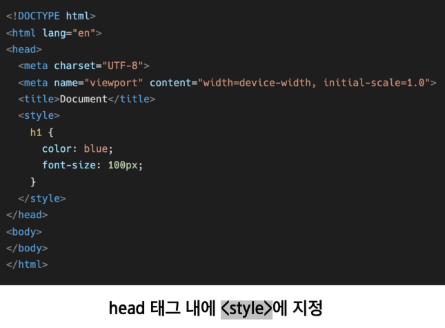
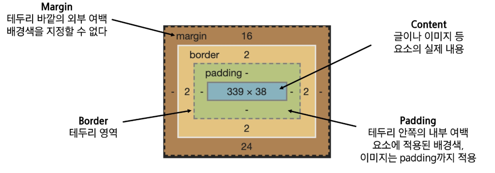
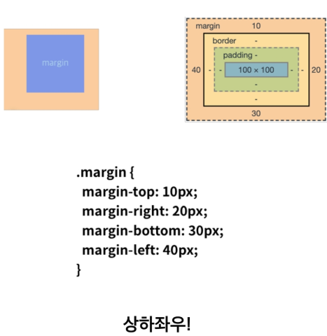
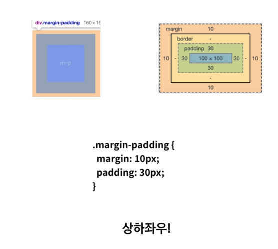

# CSS

Cascading Style Sheets

스타일, 레이아웃을 통해 문서(HTML)를 표시하는 방법을 지정하는 언어


## CSS 구문

```html
h1 {
	color: blue;
	font-size: 15px;
}
```

selector와 함께 열린다. 스타일을 지정할 HTML 요소를 선택한다. 이 경우 level 1제목(<h1>)을 스타일링한다. 

CSS 스타일 시트에는 여러 규칙이 하나씩 포함되어 있다.

```html
h1 {
    color: red;
    font-size: 5em;
}

p {
    color: black;
}
```


## CSS 추가하기

문서에서 해당 유형의 모든 요소가 동일하게 표시되기를 원한다면, 일반적인 방법은 HTML 요소에 class를 추가하고, 해당 class를 대상으로 하는 것이다.


```html
<ul>
    <li>항목 하나</li>
    <li class="special">항목 둘</li>
    <li>항목 <em>셋</em></li>
</ul>
```

CSS에서 마침표 문자로 시작하는 선택자를 작성하여 special class를 대상으로 할 수 있다.

```html
.special {
color:orange;
font-weight:bold;
}
```


## CSS 정의방법

- Inline Style Sheet : HTML 태그의 style 속성에 CSS 코드를 넣는 방법
- Internal Style Sheet: HTML  문서 안의 <style>과 </style>안에 CSS 코드를 넣는 방법
- Linking Style Sheet: 별도의 CSS 파일을 만들고  HTML 문서와 연결하는 방법이다.


### (1)Inline Style Sheet

```html
<p style= "color: blue">
    Lorem ipsum dolor.
</p>
```

해당 태그(위 코드에서는 p)가 선택자(selector)가 되고, CSS 코드에는 속성과 값 만들어간다. 따라서 꾸미는데 한계가 있고, 재사용이 불가능하다는 단점이 있다.


### (2) Internal Style Sheet

```html
<style>
h1 {
    color: blue;
    }
</style>
```

<style>과 </style>안에 CSS코드를 넣는다. 위 같은 경우는 문서 안의 모든 h1요소의 글자는 파란색이 된다.

이 방법은 HTML 문서안의 여러 요소를 한번에 꾸밀 수 있다는 장점이 있으나, 또 다른 HTML 문서에는 적용할 수 없다는 단점이 있다.




### (3) Linking Style Sheet

```html
h1 {
	color:red;
}
```

이 방법은 별도의 CSS 파일을 만들고 HTML 문서와 연결하는 방법이다. 예를 들어 모든 h1 요소의 글자를 빨간색으로 하고 싶다면 위의 내용으로 style.css파일을 만든다.(외부 CSS파일을 <head> 내에 <link>를 통해 불러오기)

```html
<link rel="stylesheet" href="style.css">
```

적용을 원하는 HTML 문서에 다음의 코드를 추가한다.


## CSS 선택자(구분은 아직 모르겠다)

- 기초 선택자
  - 전체 선택자, 타입 선택자
  - 클래스 선택자, 아이디 선택자, 속성 선택자

- 고급 선택자
  - 자식 선택자, 자손 선택자
  - 형제, 인접 형제 선택자

- 의사 클래스


## CSS 적용 우선순위

- CSS 우선순위를 아래와 같이 그룹을 지어볼 수 있다.

  - 중요도
    - !important

  - 우선 순위
    - 인라인/id 선택자/class 선택자/요소 선택자


## CSS 상속

- CSS는 상속을 통해 부모 요소의 속성을 자식에게 상속한다.

- 속성 중에는 상속이 되는 것과 되지 않는 것들이 있다.

  - 상속 되는 것
    - Text관련 요소(font, color,) 등

  - 상속되지 않는 것
    - Box model 관련 요소(width, height, margin, padding, border, display)
    - position 관련 요소


## CSS 단위

- px(픽셀)
- %
- em
  - 배수 단위, 요소에 지정된 사이즈에 상대적인 사이즈를 가짐
- rem
  - 최상위 요소(html)의 사이즈를 기준으로 배수 단위를 가짐
- Viewpoint 기준 단위
  - vw, vh, vmin, vmax


## CSS 박스 모델




- Box model 구성(margin)




- Box model 구성(padding)

****


- box 만드는거,,, 다시 공부해야한다. 일단 스킵
- block , inline 도 내일 추가


## CSS Position

- static: 디폴트 값
  - 기본적인 요소의 배치 순서에 따름
  - 부모 요소 내에서 배치될 때는 부모 요소의 위치를 기준으로 배치 된다.
- 아래 좌표 프로퍼티(top, bottom, left, right) 를 사용하여 이동이 가능하다
  - relative: statice 위치를 기준으로 이동(상대 위치)
  - absolute: static이 아닌 가장 가까이 있는 부모/조상 요소를 기준으로 이동(절대 위치)
  - fixed: 부모 요소와 관계 없이 브라우저를 기준으로 이동(고정 위치), 스크롤시에도 항상 같은 곳에 위치