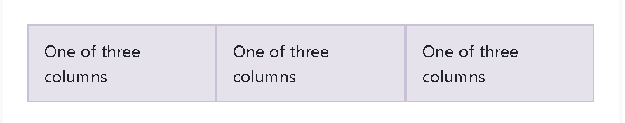
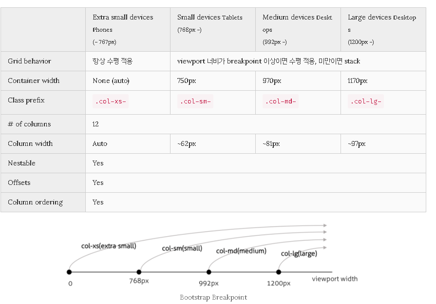
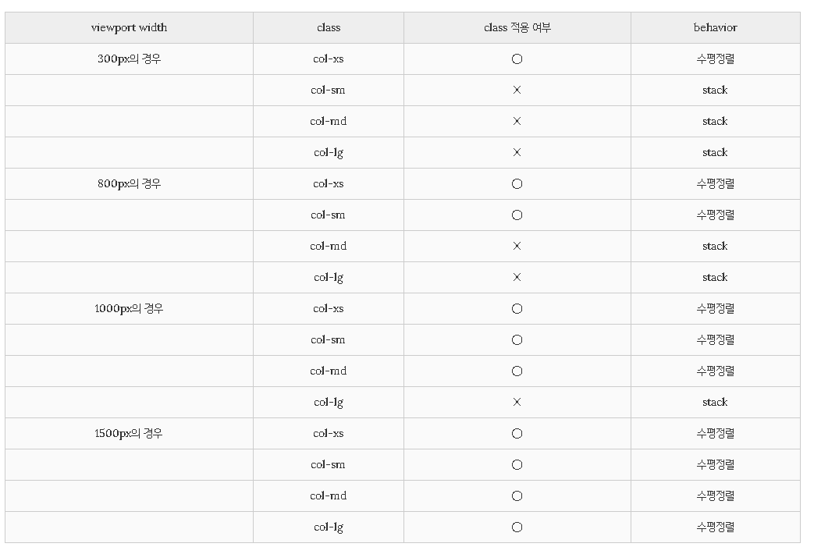
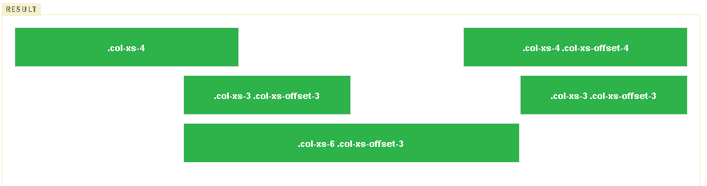

## Booststrap

- 부트 스트랩을 왜 쓰지?

  - css를 바닥부터 작성하려고 하면 time consuming
  - 다른 사람이 미리 작성해둔 것을 이용하기 위해

  - 먼저 css, js 링크를 가져오는 것이 시작이다.


## Layout

### Overview

### Containers

- most basic layout element in Bootstrap and are required when using our default grid system. 
- Containers are used to contain, pad, and center the content within them


Bootstrap comes with three different containers:

- `.container`

   `.container` class is a responsive, fixed-width container, meaning its `max-width` changes at each breakpoint. 반응형 고정폭 콘테이너를 위해 이것을 사용해야한다 

  ```html
  <div class="container">
    <!-- Content here -->
  </div>
  ```

  

- `.container-fluid`, which is `width: 100%` at all breakpoints

- `.container-{breakpoint}`, which is `width: 100%` until the specified breakpoint


나머지 상세 설명은 그리드 하고 다시 와서 하기


## Grid System

Bootstrap's grid system uses a series of containers, rows, and columns to layout and align content. It's built with flexbox and is fully responsive. Example below!!

앞에서 설명한 `.container`와 `.container-fluid`는 콘텐츠 요소를 포함하는 부모 요소로서 container 또는 wrapping 요소라고 부른다. container는 그리드 시스템을 위한 필수 사항이다.

그리드 시스템은 열을 나누어 콘텐츠를 원하는 위치에 배치하는 방법(Layout)을 말한다. Bootstrap은 반응형 12열 그리드 시스템을 제공한다.

그리드 레이아웃을 구성시에는 반드시 `.row`(행)을 먼저 배치하고 행 안에 `.col-*-*`(열) 을 필요한 갯수만큼 배치한다. 즉, container 내에 .row(행)을 먼저 배치하고, 그 안에 `.col-*-*`(열)을 배치한다. 그리고 콘텐츠는 `.col-*-*`내에 배치한다.

- Use `.container` for a responsive pixel width or `.container-fluid` for `width: 100%` across all viewport and device sizes.
- Thanks to flexbox, grid columns without a specified `width` will automatically layout as equal width columns. For example, four instances of `.col-sm` will each automatically be 25% wide from the small breakpoint and up. See the [auto-layout columns](https://getbootstrap.com/docs/4.5/layout/grid/#auto-layout-columns) section for more examples.
- Column classes indicate the number of columns you’d like to use out of the possible 12 per row. So, if you want three equal-width columns across, you can use `.col-4`.
- To make the grid responsive, there are five grid breakpoints, one for each [responsive breakpoint](https://getbootstrap.com/docs/4.5/layout/overview/#responsive-breakpoints): all breakpoints (extra small), small, medium, large, and extra large.
- Grid breakpoints are based on minimum width media queries, meaning **they apply to that one breakpoint and all those above it** (e.g., `.col-sm-4` applies to small, medium, large, and extra large devices, but not the first `xs` breakpoint).



```html
<div class="container">
    <div class="row">
        <div class="col-sm">
            One of three columns
        </div>
        <div class="col-sm">
            One of three columns
        </div>
        <div class="col-sm">
            One of three columns
        </div>
    </div>
</div>
```

위처럼 코드를 작성하면 can create three equal-width columns on small, medium, large and extra large devices using our predefined grid classes. 

(And those columns are centered in the page with the parent `.container`)


## Grid options

While Bootstrap uses `em`s or `rem`s for defining most sizes, `px`s are used for grid breakpoints and container widths. This is because the viewport width is in pixels and does not change with the [font size](https://drafts.csswg.org/mediaqueries-3/#units).

#### 열(`.col-*-*`)의 구성

열은 행(`.row`)내에 배치하여야 한다. `col-*-*`class로 열을 배치하는데 첫번째 *에는 xs, sm, md, lg 중의 하나를 지정한다

**[Grid options]**




- .col-class 가 선언된 요소는 viewport width에 따라 수평정렬 상태에서 수직정렬 상태로 변경된다. 이는 class 적용 여부에 따라 결정되는데, class가 적용되면 수평정렬 상태를 유지한다.
- col-xs-* 클래스가 선언된 요소의 경어, veiwport width에 관계없이 언제나 class가 적용되어 수평정렬 상태를 유지하지만, col-sm, col-md, col-lg 클래스가 선언된 요소인경우, viewport width에 따라 class가 적용 어부가 결정되고 이에 따라 수평정렬 상태에서 수직 정렬 상태로 변경된다. 



- Bootstrap의 그리드 시스템은 12열까지 지원한다. 두번째 *에는 1부터 12까지의 숫자 중의 하나를 지정한다.
- 예를 들어 col-xs-1은 행 너비의 1/12를 열의 너비로 한다는 의미이다. col-xs-6은 행 너비의 6/12를 열의 너비로, col-xs-12은 행 너비의 12/12를 열의 너비로 지정한다. 즉 col-xs-12는 전체 너비, col-xs-6은 전체 너비의 반을 의미한다.
- col-xs-1의 경우, 행에 12개가 들어올 수 있으며 col-xs-6의 경우 2개, col-xs-12의 경우 1개가 들어올 수있다.
- 즉 행에 들어올 수 있는 열은 두번째 *의 합 만큼이다. 12보다 클 경우는 다음 줄로 넘어간다.


### For more details

- `.col-xs-* class`

  viewport width에 관계없이 언제나 적용되어 .col-ws-* 클래스가 선언된 요소는 항상 수평으로 정렬된다. 

- `.col-sm-* class`

  viewport width가 768px이상(768px)일때, 적용된다. 768px 미만일때는 media query에 의해 .col-sm-* class가 적용되지 않고, div 요소의 block 특성에 의해 100% 너비를 가지며 수직으로 쌓이게 된다. 
  
- `col-md-* class`

  viewport width가 992px 이상(992px ~)일 때 .col-md-* class는 적용된다. 992px 미만일 때는 media query에 의해 .col-md-* class가 적용되지 않고 div 요소의 block 특성에 의해 100%의 너비를 가지며 수직으로 쌓이게 된다.

- `col-lg-*`class

  viewport width가 1200px 이상(1200px ~)일 때 .col-lg-* class는 적용된다. 1200px 미만일 때는 media query에 의해 .col-lg-* class가 적용되지 않고 div 요소의 block 특성에 의해 100%의 너비를 가지며 수직으로 쌓이게 된다.

  

### Offsetting columns

열에 `.com-*-offset-*`class 를 추가하면 오른쪽으로 열을 이동시킬 수 있다. 예를 들어 `<div class="col-md-2 col-md-offset-4>"`의 경우, viewpoint 너비가 992px 이상이면, col-md-4만큼 오른쪽으로 이동한 후, col-md-2만큼의 너비를 갖는 열을 표시한다.

```html
<body>
  <div class="container-fluid">
    <div class="row">
      <div class="col-xs-4">.col-xs-4</div>
      <div class="col-xs-4 col-xs-offset-4">.col-xs-4 .col-xs-offset-4</div>
    </div>
    <div class="row">
      <div class="col-xs-3 col-xs-offset-3">.col-xs-3 .col-xs-offset-3</div>
      <div class="col-xs-3 col-xs-offset-3">.col-xs-3 .col-xs-offset-3</div>
    </div>
    <div class="row">
      <div class="col-xs-6 col-xs-offset-3">.col-xs-6 .col-xs-offset-3</div>
    </div>
  </div>
</body>
```




출처 :https://poiemaweb.com/bootstrap-grid-system