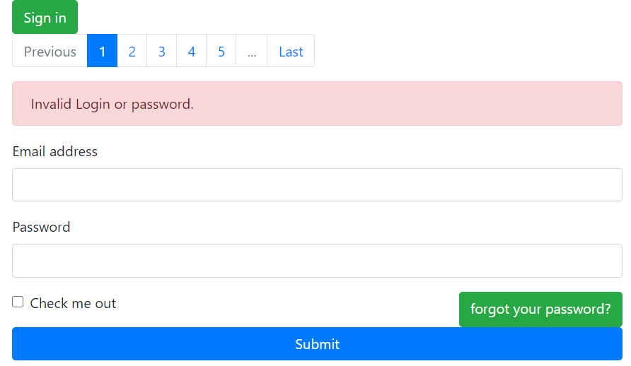
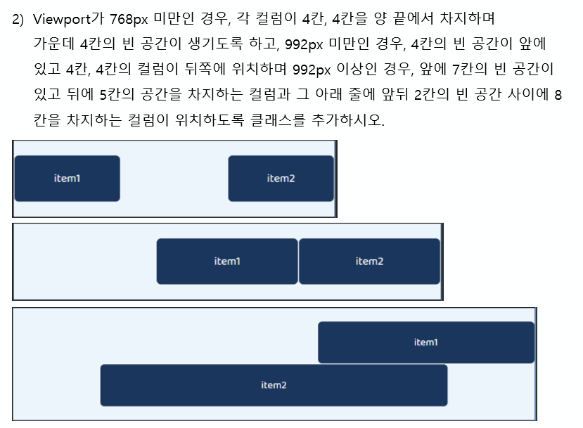

# 0813 FLEXBOX 

## Flexbox 용어정리

#### justify-content

- flex-start: 요소들을 컨테이너의 왼쪽으로 정렬

- flex-end: 요소들을 컨테이너의 오른쪽으로 정렬

- center: 요소들을 컨테이너의 가운데로 정렬

- space-between: 요소들 사이에 동일한 간격을 둠

  

- space-around: 요소들 주위에 동일한 간격을 둠

  

#### align-items

- flex-start: 요소들을 컨테이너의 꼭대기로 정렬
- flex-end: 요소들을 컨테이너의 바닥으로 정렬
- center: 요소들을 컨테이너의 세로선 상의 가운데로 정렬
- baseline: 요소들을 컨테이너의 시작 위치에 정렬
- stretch: 요소들을 컨테이너에 맞도록 늘림

#### flex-direction

- row: 요소들을 텍스트의 방향과 동일하게 정렬
- row-reverse: 요소들을 텍스트의 반대 방향으로 정렬
- column: 요소들을 위에서 아래로 정렬
- column-reverse: 요소들을 아래에서 위로 정렬

#### order

- 때때로 컨테이너의 row나 column의 순서를 역으로 바꾸는 것만으로는 충분하지 않음
- 이러한 경우에는 order 속성을 각 요소에 적용가능
- order의 기본 값은 0이며, 양수나 음수로 바꿀 수 있음

#### flex-wrap

- nowrap: 모든 요소들을 한 줄에 정렬
- wrap: 요소들을 여러 줄에 걸쳐 정렬
- wrap-reverse: 요소들을 여러 줄에 걸쳐 반대로 정렬

#### flex-flow

- flex-direction + flex-wrap

#### align-content

- 여러 줄들 사이의 간격을 지정
- `align-items`는 컨테이너 안에서 어떻게 모든 요소들이 정렬하는지를 지정
- 한 줄만 있는 경우, `align-content`는 효과를 보이지 않음


## 0812 HW



- bootstrap 공식 홈페이지 - components 에서 찾아가면서 필요한 것이 무엇인지 판단하고, 수정해서 사용했다(hwws/0812/hw.html 참고)


## 0812 ws


## 0813 ws

- grid layout



처음에 아래처럼 적었는데, 두번째 그림이 안나왔다.

```html
    <!-- 2. -->
    <div class="row">
      <div class="item col-4 col-md-4 offset-md-4 col-lg-5 offset-lg-7">
        <p>item1</p>
      </div>
      <div class="item col-4 offset-4 col-md-4 col-lg-8 offset-lg-2">
        <p>item2</p>
      </div>
    </div> 
```


- 검사를 해보니까, offset-4도 0에서부터 계속 marginleft 33%가 적용된다. 따로 md를 만나지 않는한 계속 마진이 유지가 됨. md시점이 되면 offset을 0으로  돌려줘야 하는데 그것을 offset-md-0이 된다. 생각한대로 안되면 인스펙터로 검사해보자!! 

> 추가학습
>
> [Grid System Offset]
>
> offset을 적용하는 시키고 싶은 item에 클래스 적용한다.
>
> `offset-md-0`을 통해서 원하는 width에서 offset을 다시 없앨 수 있다.

