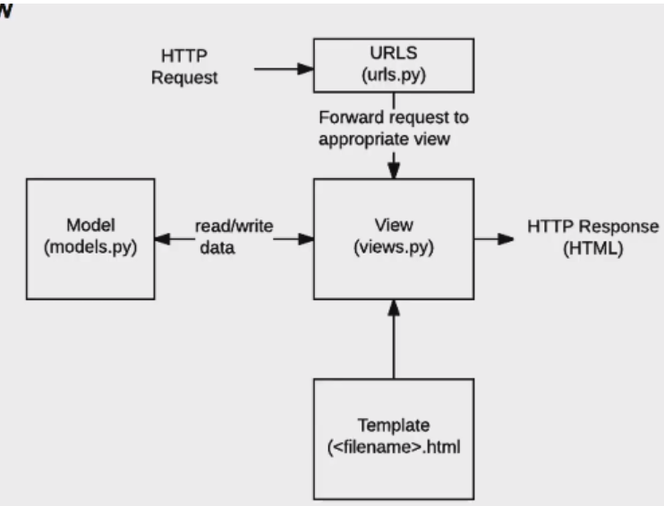
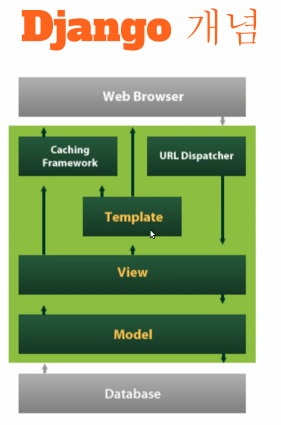
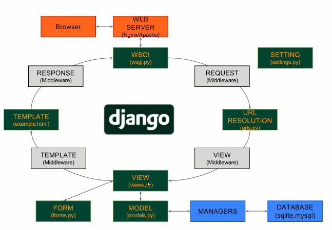

# django





```
**flow**

1. startproject
2. startapp
3. app 등록 - settings.py
4. url - www.binsan.com, www.
5. view 동작
6. template 어떤 모습으로?
```


- 예를 들어, 네이버면 뉴스, 뮤직, 날씨, 인기 검색어 등등 많은 정보가 존재하는데 이런 정보들을 보기 좋게 꾸며서 보여주는게 좋다. 템플릿은 동작을 통해 모은 정보를 어떤 모습으로 보여줄지 결정해주는 역할이다.

  (++ url로 요청하면 어떤 동작을 하게 될지는? 두번째 인자로 주게 됨)


__________________________

> ### Django(python) 개념 정리
>
> MVC & MTV
>
> - Model
>   - 안전하게 데이터를 저장
> - View
>   - 데이터를 적절하게 유저에게 보여줌
> - Control, Template(Django)
>   - 사용자의 입력과 이벤트에 반응하여 Model과 View를 업데이트
>
> ### Django 개념
>
> 
>
> 이렇게 과정을 분리할수록 분업의 효율이 높아지기 때문에 이렇게 분리하는 것임.
>
> 
>
> 
>
> ### [Project와 App]
>
> - 프로젝트 생성 
>   - 하나의 프로젝트가 하나의 웹사이트라고 생각하면되고, 프로젝트 안에 여러가지 기능이 있다.예를 들면 블로그가 큰 기능이 될 것이고, 쇼핑몰이 있다. 그 두개가 각각 App이다.
>
> - app 생성
>   - 프로젝트 내부에 다수의 app 생성
>
> 출처: https://www.youtube.com/watch?v=LYmZB5IIwAI
>
> ### Django 프로젝트 구성요소
>
> `urls.py`파일
>
> > 사용자가 `URL`로 `Django`에 접근을 하면 `Django`는 `URL`로 `URL` 규칙을 보고 내부에서 일치하는 `VIEW`를 찾아 연결시켜줍니다.
>
> 
>
> `settings.py`파일
>
> > settings.py는 프로젝트에 관련된 다양한 설정이 모두 들어있습니다. 물론 파일에 기록되어 있지 않은 내용들이지만 그 내용들은 장고 기본 값으로 사용하게 됩니다. 해당 기본값들은 django/conf/global_settings.py파일에 담겨 있습니다.'
>
> 
>
> `manage.py`파일
>
> > 장고의 다양한 명령어를 실행하기 위한 파일입니다. 임의로 변경하지 않도록 주의하시길 바랍니다
>
> 출처: [https://velog.io/@vlvksbdof12/Python-Django-%EA%B8%B0%EC%B4%88-%EC%A0%9C-2%EA%B0%95-h9k45rme5o](https://velog.io/@vlvksbdof12/Python-Django-기초-제-2강-h9k45rme5o)


## How to use Django

### 1. startproject

- project를 만들때, `-`,`python`,`django`쓰는 이름 안됨

```sh
$ django-admin startproject {원하는 이름}
```


### 2. startapp

- ```sh
  $ python manage.py {동작하길 원하는 것}
  ```

- 프로젝트 파일로 vscode로 다시 연 뒤, 아래 명령어를 입력하면 서버가 열린다.

  ```sh
  $ python manage.py runserver
  ```

  - `runserver`는 서버를 실행하는 명령어로 manage.py가 제공하는 명령어 중 하나이다. 


### 3. 앱 등록(sequence important!!)

1. **앱 생성**

   ```
   $ python manage.py startapp {원하는 앱 이름}
   ```

- `startapp`또한 manage.py에서 제공하는 명령어 중 하나로 앱을 생성해주는 명령어이다.


2. **앱 등록**

- django에서 만든 프로젝트 폴더의 `setting.py`에 만든 앱을 `INSTALLED_APS`에 적어준다.

  - django에서는 마지막에 `,`가 들어간다(convention)

  ```django
  # Application definition
  
  INSTALLED_APPS = [
      #1. local apps
      'articles',
      #2. 3rd party apps
      
      #3. django apps
      'django.contrib.admin',
      'django.contrib.auth',
      'django.contrib.contenttypes',
      'django.contrib.sessions',
      'django.contrib.messages',
      'django.contrib.staticfiles',
  ]
  ```

- 언어를 바꾸고 싶으면 `settings.py`에 `LANGUAGE_CODE`를 바꿔줌

  ```django
  LANGUAGE_CODE = 'ko-kr'
  ```


### 4. 코드작성 순서

**1) urls.py**

- django의 기본 설정 중 `admin`(관리자 페이지)가 있다. django의 열린 서버 뒤에 /admin을 적어주면 관리자페이지로 넘어감

```django
from 함수있는파일 import views(원하는 파일 이름)
```

- index라는 주소를 요청했을때, articles app의 views.py의 특정함수(뷰함수)를 가져올거야

```python
from articles import views

urlpatterens = [
    path('admin/', admin.site.urls),
    path('index/', views.index),
]

```


**2) views.py(동작)**

- 장고와의 약속! 뷰함수는 첫번째 인자로 무조건 request를 받아야 됨

- rendering할 준비를 끝남(사용자에게 보여지기 위해서 render라는 함수가 필요함)

- templates라는 이름이라는 약속이 있음(추가경로를 쓰지 않고 템플릿 이름을 쓸 수 있지만 반드시 폴더이름은 templates으로 셋팅해야하는 약속!)

  ```djnago
  render(request, '템플릿 이름')
  ```

  ```python
  from django.shortcuts import render #뷰함수 쓸거면 너 반드시 render함수를 써야될거야
  
  #Create your views here.
  def index(request):
      return render(request,'index.html')
  ```

  > #### django imports style guide 순서(convention)
  >
  > 1. standard library
  > 2. 3rd party( ex: request)
  > 3. Django
  > 4. local django(내장함수가아니라 다른 모듈에서 가져오거나 내가 만든 것)


**3)templates**

- 앱 안에 templates 폴더를 만들어서 안에 template를 만든다(html 파일)

- 메인 페이지 안에 보여질 홈페이지를 꾸밀곳, example below

  ```sh
  <!DOCTYPE html>
  <html lang="en">
  <head>
    <meta charset="UTF-8">
    <meta name="viewport" content="width=device-width, initial-scale=1.0">
    <title>Document</title>
  </head>
  <body>
    <h1>안녕하세요! 반갑습니다!</h1>
  </body>
  </html>
  ```


#### example

> 저녁 메뉴 추천 서버 만들기

**1.urls.py**

- url에 `dinner` 적으면 `views`에서 `dinner`함수 가져올거야

  ```django
  urlpatterns = [
      path('admin/', admin.site.urls),
      path('index/', views.index),
      path('dinner/',views.dinner),
  ]
  ```

  

**2.views.py**

- 같이 렌더링할 값을 딕셔너리로 적어준다

  ```python
  import random
  from django.shortcuts import render #뷰함수 쓸거면 반드시 render함수를 써야함!
  
  #Create your views here
  def index(request):
      return render(request,'index.html')
  
  def dinner(request):
      menus = ['족발','김치찜','햄버거','연어덮밥','초밥']
      pick = random.choice(menus)
      return render(request, 'dinner.html', {'pick': pick,})
  ```

- `context`라는 dict를 만들어 여러 키값들을 넣어줄수도 있다

  ```python
  def dinner(request):
      menus = ['족발','김치찜','햄버거','연어덮밥','초밥']
      pick = random.choice(menus)
      context = {
          'pick':pick,
      }
      return render(request,'dinner.html',context)
  ```


**3.templates/dinner.html**

- 사용할 `key`이름을 적고 싶다면 중괄호 두개로 감싸줌

  ```html
  <!DOCTYPE html>
  <html lang="en">
  <head>
    <meta charset="UTF-8">
    <meta name="viewport" content="width=device-width, initial-scale=1.0">
    <title>Document</title>
  </head>
  <body>
    <h1>오늘 저녁은 {{ pick }} 입니다.</h1>
  </body>
  </html>
  ```


### Django Template Language(DTL)

- django template system에서 사용하는 built-in template system이다.
- 조건, 반복, 치환, 필터, 변수 등의 기능을 제공
- 프로그래밍적 로직 아니고, 프레젠테이션을 표현하기 위한 것임
- 파이썬처럼 if for 쓸 수 있지만 python code로 실행되는 것 x
- 공식문서는 링크의 링크를 타고 들어가면 자세하게 나와 있다

**syntax:**

- variable : `{{}}`

  - views.py에서 context 딕셔너리를 만들어

- filter

  - `|`뒤에 filter를 적어준다.
  - `:{{ variable | filter}}`

  ```sh
  
     You have lots of messages today!
  
  ```

- tags : 


**variable routing**

- url의 변수화

  ```django
  path('hello/<str(변수의 type):name(변수이름)>/', views.hello)
  ```

- `views.py`

  ```python
  def hellO(request,name): #path에 적은 변수의 이름과 같아야됨
      context = {
          'name':name
      }
  	return render(request, 'hello.html',context)
  ```

- `hello.html`

  ```html
  <!DOCTYPE html>
  <html lang="en">
  <head>
    <meta charset="UTF-8">
    <meta name="viewport" content="width=device-width, initial-scale=1.0">
    <title>Document</title>
  </head>
  <body>
    <h1>안녕하세요, {{ name }}님</h1>
  </body>
  </html>
  ```


### tags

- 파일명말고, 이름 설정할 떄 html은 `-`, python에는 `_`사용

##### `for`

```

    <li>{{ athlete.name }}</li>

```

##### `for ...empty` 예시


```
 path('dtl-practice/', views.dtl_practice),
```

```python
def dtl_practice(request):
    menus = ['짜장면', '탕수육', '짬뽕']
    empty_list = []
    context = {
        'menus' : menus,
        'empty_list' : empty_list
    }
    return render(request, 'dtl_practice.html', context)
```


```html
<!DOCTYPE html>
<html lang="en">
<head>
  <meta charset="UTF-8">
  <meta name="viewport" content="width=device-width, initial-scale=1.0">
  <title>Document</title>
</head>
<body>
  <h1>DTL for, if tags 연습</h1>
  <h2>1.for tag</h2>
  
    {{ menu }}
  
  <hr>
  
    {{ forloop.counter }} : {{ menu }}
  
  <hr>
  
    {{x}}
  
    <p>아무것도 없어요!!</p>
  

</body>
</html>
```

##### `if`

- python의 operator 사용가능 : >, <, ==, is, in, not in ..등

```

    Number of athletes: {{ athlete_list|length }}

    Athletes should be out of the locker room soon!

    No athletes.

```


## 탬플릿 시스템 설계 철학

- 장고는 템플릿 시스템이 표현을 제어하는 도구이자 표현에 관련된 로직일 뿐이라고 생각한다.
- 템플릿 시스템에서는 이러한 기본 목표를 넘어서는 기능을 지원해서는 안된다.


### 주고 받을때 view 함수는 2개가 필요함

1. form을 받을 페이지
   - throw/
   - form- 검색할 수 있는 action
2. 결과를 보내줄 페이지
   - catch/
   - 클라이언트가 보낸 정보를 받아서 그대로 화면에 출력!

```sh
순서

1.throw.html-form태그를 통해 요청 보냄
2./catch/로 요청받음
3.catch view-data를 받아서
4.최종적으로 catch.html 에서 출력
```

> ### [추가학습]
>
> #### 요청 보내기(Throw)
>
> - urls.py
>
>   - `기본주소/throw`라는 주소를 요청받으면, views.py 내 throw 함수를 실행시키는 url 패턴을 작성
>
>   ```python
>   urlpatterns = [
>       path('throw/',views.throw),
>   ]
>   ```
>
>   
>
> - views.py
>
>   - input을 보낼 페이지에 연결하는 함수 throw view.py 작성
>
>   ```python
>   def throw(request):
>       return render(request,'throw.html')
>   ```
>
> 
>
> - throw.html
>
>   - `input`태그를 사용하요 데이터를 입력함
>
>     - 입력되는 값은 `dict`와 유사한 형태로 저장되는데 여기서 `dict`의 key 값이 `input` 태그의 `name` 속성의 값임
>     - 아래의 예시의 경우, {name: 사용자 입력값}의 형태를 띄게 되면, name이라는 key값을 통해 입력값에 접근할 수 있게 됨
>
>   - `form`태그를 사용하여 입력된 값을 넘겨줄 경로와 `http method`를 정의함
>
>     - `action`: 입력값을 어디로 넘길건지를 설정(URL 경로 설정)
>     - `method`: 어떠한 방식으로 보낼지를 설정(POST/GET)
>
>     ```html
>     <body>
>         <form action="/catch", method="GET">
>             <input type="text" name="message"/>
>             <input type="submit" value="Submit"/>
>         </form>
>     </body>
>     ```
>
> #### 응답하기(Catch)
>
> - urls.py
>
>   - `기본주소/catch`라는 주소가 요청되면, views.py 내 catch 함수를 실행시킴
>   - 앞서 , 위의 요청보내기에서 `form`태그의 `action`값으로 해당 경로를 미리 설정해놨다. 따라서 throw.html에서 내용을 작성하여 제출하면, 아래의 url patteren에 따라 catch함수가 실행된다
>
>   ```python
>   urlpatterens = [
>       path('catch/',views.catch),
>   ]
>   ```
>
> - views.py
>
>   - throw.html에서 입력된 값이 dict 형태로 저장되며, 여기서 key는 input 태그의 name속성값이다. 우리는 message라고 값을 지정했다. message라는 key를 통해 사용자가 입력한 value값에 접근한다.
>   - 이때 사용하는 django 문법은 'request.GET.get('message)'임.
>     - request: 정보/데이터를 요청함
>     - GET: throw.html- form 태그- method 속성의 "GET"을 의미한다.(어떤 방식으로 요청을 보낼건지?)
>     - get('message'): dict의 value값을 갖고오는 메서드. message로 정의된 name 속성의 내용(value)를 갖고온다. **여기서 value는 throw.html에서 사용자가 입력하는 input내용이다!**
>   - 최종적으로, throw.html에서부터 갖고온 사용자 입력값을 message라는 변수에 저장하고 템플릿을 변수로 넘김
>
>   ```python
>   def catch(request):
>       message = request.GET.get('message')
>       return render(request,'catch.html',{'message:message'})
>   ```
>
> - catch.html
>
>   - 템플릿 변수 message의 결과값으로 throw.html에서 사용자가 입력한 input내용이 들어온다
>
>   ```html
>   <body>
>      	<h1>
>           Catch!
>       </h1>
>   </body>
>   ```
>
> 
>
> ### 외부 웹으로 요청 주고 받기
>
> 내부에 요청을 보내고 응답하는것이 아니라, django 외부에 요청을 보내는 것을 해보자.
>
> 네이버에서 어떤 단어를 검색하면 주소창은 아래의 구조를 띄는데, 내부에서 요청을 보내고 응답을 했을 때와 매우 유사한 형태를 띄고 있는 것을 알 수 있다. 이러한 구조를 활용하여 외부 웹으로 요청을 주고받을 수 있음.
>
> ```sh
> > #네이버 검색 결과 url
> > https://search.naver.com/search.naver?query=python
> > #Django 내 응답 결과 url    
> > http://기본주소/catch/?message=안녕
> ```
>
> - urls.py
>
>   - `기본주소/naver/`로 요청이 들어오면 views.py 내 naver 함수를 호출
>
>   ```python
>   urlpatterns=[
>       path('naver/',views.naver),
>   ]
>   ```
>
> - views.py
>
>   ```python
>   def naver(request):
>       return render(request,'naver.html')
>   ```
>
> - naver.html
>
>   - 내부에서 요청을 보내고 응답할때는 `form`태그의 값으로 `"/catch"`처럼 기본주소+넘길 주소 url만 입력하였으나, 외부로 보낼때는 전체 주소를 넘겨야 한다.
>
>   - 네이버 검색 결과 URL은 `https://search.naver.com/search.naver` + `?query= 검색어` 의 구조를 띄므로, 이를 활용하면됨.
>
>   - 이때, `input`태그의 `name`속성에는 반드시 `query`를 사용해야 한다. 이를 통해서 input 태그로 들어오는 입력값이 네이버 검색 결과 URL `https://search.naver.com/search.naver?query=입력값` 과 동일해짐.
>
>   - 이  URL을 `GET`방식으로 요청을 보낸다는 의미! 
>
>     ```HTML
>     <body>
>         <form action="https://search.naver.com/search.naver",method="GET" >
>         <input type="text" name="query/">
>         <input type="submit" value="Submit"/>  
>         </form>
>     </body>
>     ```
>
>     출처:https://tothefullest08.github.io/django/2019/02/13/django03/


**1)urls.py**

- `기본주소/throw` 라는 주소를 요청받으면, views.py 내 throw 함수를 실행시키는 url 패턴을 작성

```python
path('throw/',views.throw),
path('catch/',views.catch),
```


**2.views.py**

```python
#url로 받지 말고, 사용자 입력만 받으면 됨
def throw(request):
    return render(request, 'throw.html')

#throw에서 보낸 from데이터(request.GET)를 받기
def catch(request):
    #request.GET['name']
    #여기에 데이터가 존재//이렇게 쓰는 방식은 만약 없으면 keyerror!
    message = request.GET.get('name')
    context = {
        'message':message,
    }
    return render(request, 'catch.html', context)
```


**3.throw.html**

- `form`태그의 `action`을 `/데이터를 보낼곳/`이렇게 적어야 됨.

- method의 default 값은 원래 `GET`이지만 적어두는게 좋음

- form을 만날 수 있다. action/client가 throw에서 보낸 정보를 받아서 그대로 화면에 출력

- form의 action이라는 속성이 어디다가 보낼지! 어디다가 정보를 보낸다는건? web에서는 해당 url로 정보를 함께 담아 요청을 한다는 의미와 같다.

- method는? 내가 친구한테 오늘 과제를 알려준다. 방법은 텍스트로 보내는 방법, .py파일을 보낸다. 

  - get-> url에 내가 보낸 정보가 적힌다

  ```html
  <!DOCTYPE html>
  <html lang="en">
  <head>
    <meta charset="UTF-8">
    <meta name="viewport" content="width=device-width, initial-scale=1.0">
    <title>Document</title>
  </head>
  <body>
    <h1>Throw 페이지</h1>
    <form action="/catch/" method="GET">
      <label for="name">데이터 입력 : </label>
      <input type="text" id="name" name="name">
      <input type="submit">
    </form>
  </body>
  </html>
  ```

#### 추가 예시

```html
<html>
<head>
    <title>Search</title>
</head>
<body>
    <form action="/search/" method="GET">
        <input type="text" name="q">
        <input type="submit" value="Search">
    </form>
</body>
</html>
```

- 검색창 화면
- html은 변수 `q`를 정의하고, 제출할때 `q`의 값을 GET을 통해 url `/search/`로 전송된다. 


**4.catch.html**

```html
<!DOCTYPE html>
<html lang="en">
<head>
  <meta charset="UTF-8">
  <meta name="viewport" content="width=device-width, initial-scale=1.0">
  <title>Document</title>
</head>
<body>
  <h1>Catch 페이지</h1>
  <h2>throw에서 보낸 데이터는 {{ message }}입니다.</h2>
</body>
</html>
```


오늘은 먼저 무얼 만들어야 하는지 flow를 

복습하고, 또 그다음에 throw,catch logic을 잘 생각하면서 만들기!!


