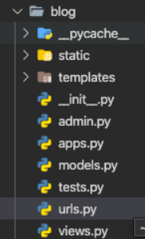
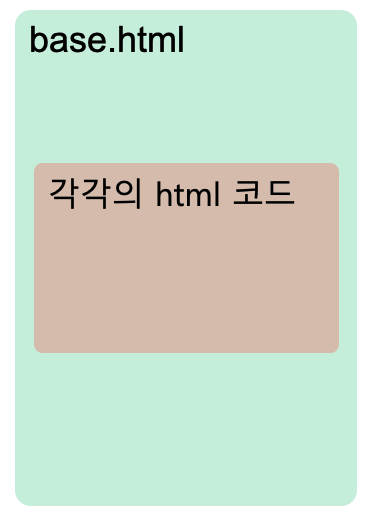
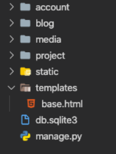
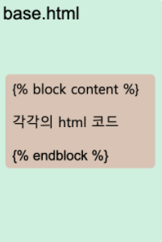
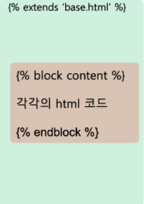

# 0818


## django[url 관리]

> app 단위로 url을 관리할 수 있다. 각 app에 urls.py를 만들어준다

urls.py

```python
urlpatterns = [
    path('admin/', admin.site.urls),
    path('', blog.views.index, name='index'),
    path('detail/<int:post_id>/', blog.views.detail, name='detail'),
    path('create/', blog.views.create, name='create'),
    path('delete/<int:post_id>/', blog.views.delete, name='delete'),
    path('update/<int:post_id>/', blog.views.update, name='update'),
    path('login/', account.views.login, name='login'),
    path('signup/', account.views.signup, name='signup'),
    path('logout/', account.views.logout, name='logout'),
] + static(settings.MEDIA_URL, document_root=settings.MEDIA_ROOT)
```

이전 포스트에서 계속해서 설정해준 url이다.

- 프로젝트 단위에서 url을 관리하면 웹 애플리케이션에 기능이 추가될수록 url은 더 많아지고, 가독성이 떨어지고, 유지보수 어려워짐
- django는 앱 단위로 url을 관리할 수 있다. app단위로 url을 관리하므로써 추후 app을 다른 프로젝트에 확장하기에도 편하다. 
- app 단위로 url을 관리하는 방법을 배워봅시다! 


> ### urls.py생성(app)

！【】（）

blog(app)내에 urls.py 파일을 하나 생성한다.

```python
from . import views
from django.urls import path

urlpatterns = [
    path('detail/<int:post_id>/', views.detail, name='detail'),
    path('create/', views.create, name='create'),
    path('delete/<int:post_id>/', views.delete, name='delete'),
    path('update/<int:post_id>/', views.update, name='update'),
]

```

그리고 urls.py에 blog app과 관련된 path를 모두 설정해준다.

>  #### urls.py 수정(project)

```python
from django.contrib import admin
from django.urls import path
import blog.views
import account.views
from django.conf import settings
from django.conf.urls.static import static

urlpatterns = [
    path('admin/', admin.site.urls),
    path('', blog.views.index, name='index'),
    path('detail/<int:post_id>/', blog.views.detail, name='detail'),
    path('create/', blog.views.create, name='create'),
    path('delete/<int:post_id>/', blog.views.delete, name='delete'),
    path('update/<int:post_id>/', blog.views.update, name='update'),
    path('login/', account.views.login, name='login'),
    path('signup/', account.views.signup, name='signup'),
    path('logout/', account.views.logout, name='logout'),
] + static(settings.MEDIA_URL, document_root=settings.MEDIA_ROOT)

```

project 디렉터리의 urls.py에서 include 메소드를 import 해준다음,

blog(app)과 관련된 path를 지우고 'path('blog/', include('blog.urls')),'로 수정한다.

```python
from django.contrib import admin
from django.urls import path, include
import blog.views
import account.views
from django.conf import settings
from django.conf.urls.static import static

urlpatterns = [
    path('admin/', admin.site.urls),
    path('', blog.views.index, name='index'),
    path('blog/', include('blog.urls')),
    path('login/', account.views.login, name='login'),
    path('signup/', account.views.signup, name='signup'),
    path('logout/', account.views.logout, name='logout'),
] + static(settings.MEDIA_URL, document_root=settings.MEDIA_ROOT)
```


> ### **view**(??)
>
> 한 가지 처리가 더 필요하다.
>
> 기존에 views.py 에서 redirect 메소드 안에 app명에 대한 명시가 필요하다.
>
> redirect 메소드를 아래와 같이 app명을 명시해주자
>
> ```
> return redirect('/blog/detail/' + str(post.id))
> ```


프로젝트 내의 모든 app을 같은 방식으로 처리해주면 urls.py는 아래처럼 보기 쉽고 간결해질 것이다.

```python
from django.contrib import admin
from django.urls import path, include
import blog.views
import account.views
from django.conf import settings
from django.conf.urls.static import static

urlpatterns = [
    path('admin/', admin.site.urls),
    path('', blog.views.index, name='index'),
    path('blog/', include('blog.urls')),
    path('account/', include('account.urls')),
] + static(settings.MEDIA_URL, document_root=settings.MEDIA_ROOT)
```


물론 아직까지 url에 설정해준 path가 적어 큰 효과를 볼 수 없을 수도있지만,

애플리케이션이 커지면서 url을 app 단위로 관리하는 것은 중요하다.

또한, Django가 app 단위로 기능을 개발하는데의 이점을 최대한 가져갈 수 있다.


## django[템플릿 확장]

> 템플릿 확장을 통해 html 코드 작성을 간결하게 한다


> ### html 코드의 중복

html 코드를 작성하다보면, html 파일마다 html 태그, head태그 등 중복되는 코드가 발생한다.

```html
<!DOCTYPE html>
<html lang="en">
<head>
    <meta charset="UTF-8">
    <meta name="viewport" content="width=device-width, initial-scale=1.0">
    <title>Document</title>

    <link rel="stylesheet" href="https://stackpath.bootstrapcdn.com/bootstrap/4.5.0/css/bootstrap.min.css" integrity="sha384-9aIt2nRpC12Uk9gS9baDl411NQApFmC26EwAOH8WgZl5MYYxFfc+NcPb1dKGj7Sk" crossorigin="anonymous">
    <script src="https://code.jquery.com/jquery-3.5.1.slim.min.js" integrity="sha384-DfXdz2htPH0lsSSs5nCTpuj/zy4C+OGpamoFVy38MVBnE+IbbVYUew+OrCXaRkfj" crossorigin="anonymous"></script>
    <script src="https://cdn.jsdelivr.net/npm/popper.js@1.16.0/dist/umd/popper.min.js" integrity="sha384-Q6E9RHvbIyZFJoft+2mJbHaEWldlvI9IOYy5n3zV9zzTtmI3UksdQRVvoxMfooAo" crossorigin="anonymous"></script>
    <script src="https://stackpath.bootstrapcdn.com/bootstrap/4.5.0/js/bootstrap.min.js" integrity="sha384-OgVRvuATP1z7JjHLkuOU7Xw704+h835Lr+6QL9UvYjZE3Ipu6Tp75j7Bh/kR0JKI" crossorigin="anonymous"></script>
</head>
<body>
    
    <ul class="nav">
        <li class="nav-item">
            <a class="nav-link active" href="#"></a>
        </li>

        
            <li class="nav-item">
                <a class="nav-link" href="">새 글쓰기</a>
            </li>
            <li class="nav-item">
                <a class="nav-link" href="#" >{{user.username}}</a>
            </li>
            <li class="nav-item">
                <a class="nav-link" href="">로그아웃</a>
            </li>
        
            <li class="nav-item">
                <a class="nav-link" href="">회원가입</a>
            </li>
            <li class="nav-item">
                <a class="nav-link" href="">로그인</a>
            </li>
        
      </ul>
```

이러한 소스 코드의 중복은 번거로울 뿐만 아니라 가독성마저 떨어뜨리게 된다.

Django에서는 템플릿 확장을 통해 이러한 문제점을 해결할 수 있다.

하나의 중복된 코드를 저장해두는 base.html을 만들고, 그 안에 담겨져야할 다른 html 코드에 적용한다.




> #### base.html 생성

프로젝트 내에 templates 디렉터리를 하나 생성하고 그 안에 base.html 파일을 생성한다.




base.html 내에 중복되는 소스 코드들과 다른 소스 코드의 내용이 들어갈 ' ... ' 템플릿 태그를 작성한다.

```html
<!DOCTYPE html>
<html lang="en">
<head>
    <meta charset="UTF-8">
    <meta name="viewport" content="width=device-width, initial-scale=1.0">
    <title>Document</title>

    <link rel="stylesheet" href="https://stackpath.bootstrapcdn.com/bootstrap/4.5.0/css/bootstrap.min.css" integrity="sha384-9aIt2nRpC12Uk9gS9baDl411NQApFmC26EwAOH8WgZl5MYYxFfc+NcPb1dKGj7Sk" crossorigin="anonymous">
    <script src="https://code.jquery.com/jquery-3.5.1.slim.min.js" integrity="sha384-DfXdz2htPH0lsSSs5nCTpuj/zy4C+OGpamoFVy38MVBnE+IbbVYUew+OrCXaRkfj" crossorigin="anonymous"></script>
    <script src="https://cdn.jsdelivr.net/npm/popper.js@1.16.0/dist/umd/popper.min.js" integrity="sha384-Q6E9RHvbIyZFJoft+2mJbHaEWldlvI9IOYy5n3zV9zzTtmI3UksdQRVvoxMfooAo" crossorigin="anonymous"></script>
    <script src="https://stackpath.bootstrapcdn.com/bootstrap/4.5.0/js/bootstrap.min.js" integrity="sha384-OgVRvuATP1z7JjHLkuOU7Xw704+h835Lr+6QL9UvYjZE3Ipu6Tp75j7Bh/kR0JKI" crossorigin="anonymous"></script>
</head>
<body>
    
    <ul class="nav">
        <li class="nav-item">
            <a class="nav-link active" href="#"></a>
        </li>

        
            <li class="nav-item">
                <a class="nav-link" href="">새 글쓰기</a>
            </li>
            <li class="nav-item">
                <a class="nav-link" href="#" >{{user.username}}</a>
            </li>
            <li class="nav-item">
                <a class="nav-link" href="">로그아웃</a>
            </li>
        
            <li class="nav-item">
                <a class="nav-link" href="">회원가입</a>
            </li>
            <li class="nav-item">
                <a class="nav-link" href="">로그인</a>
            </li>
        
    </ul>

    
    
</body>
</html>
```





> #### setting.py 수정

```python
TEMPLATES = [
    {
        'BACKEND': 'django.template.backends.django.DjangoTemplates',
        'DIRS': [os.path.join(BASE_DIR, 'templates')],
        'APP_DIRS': True,
        'OPTIONS': {
            'context_processors': [
                'django.template.context_processors.debug',
                'django.template.context_processors.request',
                'django.contrib.auth.context_processors.auth',
                'django.contrib.messages.context_processors.messages',
            ],
        },
    },
]
```

settings.py 에서 TEMPLATES 리스트 내의 'DIRS' 의 value로 'os.path.join(BASE_DIR, 'templates')],'를 작성한다.


> #### 템플릿 확장

다른 html 코드에 base.html에 작성한 중복된 코드를 모두 제거하고, 각각의 html 파일에 필요한 소스코드만 ' ... ' 템플릿 태그로 감싸고 작성한다.

index.html

```html


    
        <div class="card w-75">
            <div class="card-body">
                <h5 class="card-title">{{post.title}}</h5>
                <p class="card-text">{{post.pub_date }}</p>
                <p class="card-text">{{post.user.username}}</p>
                <a href="" class="btn btn-primary">자세히 보기</a>
            </div>
        </div>
    

```




출처:[https://dheldh77.tistory.com/entry/Django-%ED%85%9C%ED%94%8C%EB%A6%BF-%ED%99%95%EC%9E%A5?category=738924](https://dheldh77.tistory.com/entry/Django-템플릿-확장?category=738924)

19일 보충 공부 자료

- https://tutorial.djangogirls.org/ko/template_extending/
- https://www.youtube.com/playlist?list=PL6gx4Cwl9DGBlmzzFcLgDhKTTfNLfX1IK

- 장고걸스 튜토리얼(https://tutorial.djangogirls.org/ko/) 튜토리얼을 따라하면서 하나의 사이트를 만들 수 있다. 전체적으로 개념잡기 좋음. 대충 MVT패턴이 어떤식으로 돌아가는지 머리속에 감이 잡힌다.