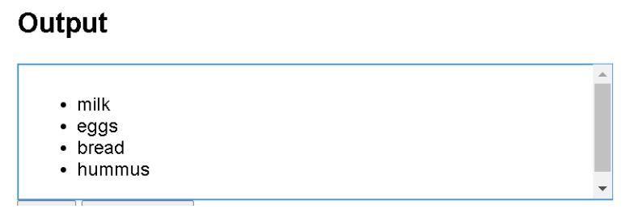
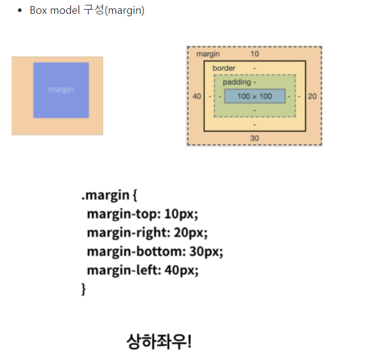
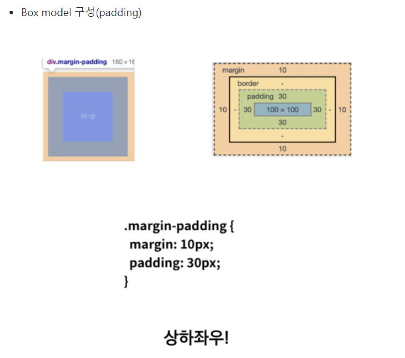

## web test 준비

https://www.google.com/search?q=css+dinner&oq=css+dinner&aqs=chrome..69i57j0l7.3961j0j7&sourceid=chrome&ie=UTF-8 css dinner

### HTML

> 웹 컨텐츠의 의미와 구조를 정의할때 사용하는 언어

**Hyper**

- 텍스트 등의 정보가 동일 선상에 있는 것이 아니라 다중으로 연결되어 있는 상태

**Hyper text**

- 하이퍼링크를 통해 사용자가 한 문서에서 다른 문서로 즉시 접근할 수 있는 텍스트
- 하이퍼 텍스트가 쓰인 기술등 중 가장 중요한 2가지 (http, html)

**Markup Language**

- 특정 텍스트에 역할을 부여하는, 따라서 "마크업을 한다" 라고 하는 건 제목이 제목이라하고 본문이 본문이라고 마킹을 하는 것이다. 이건 단순히 글자가 커지는게 아니고, 의미론적으로 가장 핵심 주제를 의미한다!


### HTML 기본구조

**DOM**

**요소(element)**

**속성(attribute)**

~~**이 세가지가 있는데, 일단 지금 안외워짐. 넘어가고 다시하는걸로**~~


#### 기본 html 구성

```html
<!DOCTYPE html> 
<html>
    <head> #1
        <meta charset="UTF-8"> #2
        <title>건강 설문</title> #3
    </head>
    <body>
        #4
    </body>
</html>
```

- #1 : head 안에 있는 내용은 이 페이지의 정보! 
- #2 : 인코딩 작업인데, 인코딩을 지정해주는 것이 매우 중요하다. 인코딩이란?? 컴퓨터는 이진법으로 이루어진 수들만 저장할 수 있는데 어떻게 저장할지 방식을 지정해주는 것이고, 인코딩을 하면 다른 컴퓨터에서 열었을때도 같게 보인다.
- #3 : title은 페이지의 제목 이름을 나타낸다.
- html에서 들여쓰기는 필수가 아님. 가독성을 위해서 함. 


#### html 기능 설명

```html
#1
<body>
   
</body>


#2
<body>
	<h1>싸피 데일리 건강 설문</h1>
    <p>싸피에서는 교육생 여러분들의 건강 상태를 매일 매일 확입합니다. 협조 바랍니다.</p>
</body>


#3
<body>
	<form action="https://www.naver.com"> 
</body>   
```


- #1 : 이미지 삽입하는 img 태그이다. 

- #2 :`h1`은 제목으로 보여지는 태그, `p`태그는 paragraph 태그, 제목과는 다르게 본문 느낌으로 글자가 쓰여진다.

- #3 : `form` 이란 사용자의 데이터를 서버에 전송하는 방법이다. 일반적으로 로그인을 위해 아이디/비밀번호를 입력할때/ 회원가입을 위해 개인정보 입력할때/ 블로그나 게시판에 글을 작성하거나, 파일을 전송할때/ 폼을 이용한다. method는 전송방식인데, 두가지가 있는데 하나는 get이고 하나는 post이다

  - GET: 데이터 조회용(서버의 데이터를 변경할 목적이 아니고, 조회만!) 전송할 데이터를 문자열 형태로 URL 뒤에 인수로 붙여서 전송한다. 그래서 보안성이 없어서 누구나 전송의 내용을 볼 수 있다!! A태그를 이용할 경우 일반적으로 GET방식 전송만 가능하나 자바스크립트를 이용하면 POST방식으로 전송이 가능하다! 
  - POST: 데이터 수정용, 서버의 데이터를 변경할 목적! 파일의 형태로 전송됨으로써 url 상에 나타나지 않아 보안성이 있다. 일반적으로 from은 post형식으로 전송된다! 

  

```html
<body>
    <div>
        <p>체온</p>
        <label for="under">37.5도 미만</label> #1
        <input type="radio" name="temp" id="under" value="37.5미만"> #2
        <label for="upper">37.5도 이상</label>
        <input type="radio" name="temp" id="upper" value="37.5미만">
    </div>
</body>    
```


- #1 : `id`를 `label`과 같게 주면 글자를 클릭했을때 체크가 된다!! 그 말은 글자를 선택하면 옆에 있는 체크에 표시가 된다는 것. 더 편함 
- #2 : 만약에 두 개 각각의 name이 다르면 두개 다 선택이 가능함. 그렇게 되면 안되니까 name을 똑같이 줘서 둘 중 하나만 선택가능하게 한다!! 


#### 구글 검색기 만들어보기

```python
<!DOCTYPE html>
<html lang="en">
<head>
    <meta charset="UTF-8">
    <title>구글 검색기</title>
</head>
<body>
    <h1>구글 검색기</h1>
    <form action="http://www.google.com/search">
        <label for="keyword">검색어를 입력하세요:</label>
        <input type="text" id="keyword" name="q">       #1
        <input type="submit" value="검색">
    </form>
</body>
</html>
```

- `name`값은 실제 구글이 검색할때 쓰는 key값(쿼리의 약자)
- `https://www.google.com/search?q=`


### 각 기능 설명!!! 이거 헷갈림

- `label` 입력란 앞에 정보를 적음

- `for`에 name을 적고 아래 `input`에서 `id`로 name을 주면 실제 web에서 label 글을 클릭했을때 input창에 커서가 감(연결이 된다는 것)

- `input`사용자로부터 정보를 입력받을 수 있다.

  - `name`을 그냥 키 값으로 생각하면 된다. `name`에 fullname이라는 `key`로 내가 적은 이름(input값)이 value로 전달됨

    ex) `http://naver.com/?fullname=내가적은이름&class-no=2&temp=37.5미만` 이런식으로 전달되는 것임

  - `name`을 똑같이 주면 여러개 중 하나가 선택됨(input type이 체크하는 형태인데 여러개 모두 선택되지 않고 한개만 선택되게 하기 위해 사용)

- 태그사이에 있는 이름은 화면에 표시될 text이고, value에 적은 것은 정보가 전달될때 사용됨


### 시맨틱 태그

> 모두에게!! 콘텐츠의 의미를 명확히 설명하는 태그이다.

**장점은?**

1. 개발자에게 가독성이 좋아진다.
   - 개발자가 의도한 요소의 의미가 명확히 드러나고, 코드의 가독성 up, 유지보수 eaiser


2. 접근성이 좋아진다.
   - HTML 문서는 HTML 언어와 사람이 읽을 수 있는 content의 조합인데, 검색엔진은 HTML 코드만 잘 읽는다.  그래서 이 검색엔진이 HTML을 잘 이해하도록 시맨틱 태그 사용이 권장되고, 그러면 검색엔진도 무슨 내용인지 이해할 수 있게 된다!! ~~**(라고 하는데 이게 근데 뭔말이지? 이거 한 기억이 없다.)**~~


**시멘틱 웹**

- 웹에 존재하는 수많은 웹페이지들에 메타데이터를 부여하여, 기존의 단순한 데이터 집합이었던 웹페이지를 '의미'와 '관련성'을 가지는 거대한 데이터베이스로 구축하고자 하는 발상이다....

  div같은 태그가 아니라 h1 의미론적인 걸 부여하면서 가독성도 높이고!! 그런 말임!! 


#### 그룹컨텐츠

- `<p>`
- `<hr>`
- `<ol>` 등


#### 텍스트 관련 요소

- `<a>` : 하이퍼링크

  ```
  <a href="https://www.naver.com">네어비로 고고!</a>
  ```

  ```html
  <p>A link to my <a href="https://www.mozilla.org/" title="The Mozilla homepage" target="_blank">favorite website</a>.</p>
  ```

  - `href`: 이 속성에는 연결하고 싶은 웹주소 지정

  - `title`: `title` 속성은 링크에 대한 추가 정보를 나타낸다!! 마우스를 링크에 대면 타이틀값이 나옴

  - `target`: 링크가 어떻게 열릴 것인지 지정함.`target="_blank"` 이건 링크를 새탭에서 보여주고,현재 탭에서 링크를 보여주고싶다면 이 속성을 생략한다!!

  

- `<b>`vs `<strong>` : 글자를 굵게 만들어줌. b는 그냥 굵게, strong은 강조를 한다. 스크린리더가 읽을때 강조를 해줌

- `<i> `vs `<em>`: 글자 기울림(i는 그냥 이탤릭체이고, em은 이탤릭체로 강조를 한다는 의미가 부여되어 있다)

- `<br>`: 줄바꿈

- `<form>`: 서버에서 처리될 데이터를 제공하는 역할, 기본속성은 action과 method가 있는데 자세한건 위에 있음.

- `<input>`: 다양한 타입을 가지는 입력 데이터 필드임. 공통속성으로는 name, placeholder/required/autofocus가 있음

  

#### LISTS

- **Unordered**

  쇼핑 리스트 항목이 예이다. 순서 없는 리스트를 정렬하기 위해 `ul` 요소로 감싸준다. 그리고 마지막으로 그 안의 리스트 항목을 `<li>`(list items) 태그로 감싸준다.

  ```html
  <ul>
      <li>milk</li>
      <li>eggs</li>
      <li>bread</li>
      <li>hummus</li>
  </ul>
  ```

  

  

- **Ordered**

  `<ol>`태그로 감싸는 것 제외하고 마크업 구조는 순서가 없는 리스트와 동일하다.


#### `<div> and <span>`

- `<span>`

  : inline non-semantic element, which you should only use if you cant think if a better semantic text element to wrap uour element, or you want to add any specific meaning. 

  이 태그 안에 컨텐츠가 없다면 해당 부분은 아무 변화가 없지만, 그 안에 객체가 들어간다면 그 객체의 크기만큼 공간이 할당된다

- `<div>`

  : : block level non-semantic element, which you should only use if you can't think of a better semantic block element to use, or don't want to add any specific meaning. For example, imagine a shopping cart widget that you could choose to pull up at any point during your time on an e-commerce site: 

  division의 약자임. 콘텐츠가 어떠한 의미도 갖고 있지 않음을 의미함. 논리적인 구분을 정의하는 태그이고 각각의 블록을 갖는다. 주로 레이아웃을 잡는 용도! class 속성을 같이 사용한다.


#### `table`

- `<table>`: 테이블을 만드는 태그
- `<th>`: 테이블의 헤더부분을 만드는 태그
- `<tr>`: 테이블의 행을 만드는 태그
- `<td>`: 테이블의 열을 만드는 태그
- `<colspan>`: 가로 합병(열 합병)
- `<rowspan>`: 세로 합병(행 합병)
- 각 열의 의미에 따라 thead, tbody, tfoot 태그로 구분지을 수 있다.


## CSS

> 스타일, 레이아웃 등을 통해 HTML이 사용자에게 어떻게 표시되는지를 지정하는 언어이다!
>
> 사용자에게 문서(HTML)를 표시하는 방법을 지정하는 언어이당

- css 구문은 선택자와 함께 열린다. 스타일을 지정할 html 요소를 선택함. 
- 각 쌍은 우리가 선택한 요소의 속성을 지정하고 속성에 부여할 값을 지정한다.


**선언문**

- 속성(Property)
  - 사람이 읽을 수 있는 식별자

- `{}` 선택자(selector) , 선언 요소는 `속성:값;` 이렇게 되어 있음

- 값(Value)

  - 각 속성에는 값을 부여한다. 값은 어떻게(글꼴을 이걸로, 배경 색을 저걸로) 스타일 기능을 변경할 건지 나타낸다. 

- 정의하는 방법은 세가지 있는데

  - 인라인: HTML 태그의 style 속성에 CSS 코드를 넣는 방법

    - 꾸미는데 한계가 있음. 재사용이 불가능한 단점!

  - 내부 참조: HTML 문서 안의 `<style>과 </style>`안에 CSS 코드를 넣는 방법

    - HTML 문서안의 여러 요소를 한번에 꾸밀 수 있는 장점이 있지만 또 다른 HTML문서에는 적용할 수 없는 단점!! 

  - 외부 참조: 외부 css파일을 head 내 link를 통해 불러오기/ 이게 가장 일반적인 방법이다!! 

    - 연결해줘야하기 때문에 적용을 원하는 html 문서와 연결하는 방법이다. 

    - ```html
      <link rel="stylesheet" href="style.css">
      ```

      


#### CSS Selector 선택자

- html 문서에서 특정한 요소를 선택하여 스타일링 하기 위해서는 반드시 선택자라는 개념이 필요함
- 기초 선택자는 "전체, 타입, 클래스, 아이디, 속성"

```html
<head>
    <style>
    * {
      color: red;
    }
    h2 { 
        color: orange;
    }
    h3,
    h4 { 
      font-size: 10px;
    }
    .green { 
      color: green;
    }
    #purple { 
        color: purple;
    }
    .box > p { 
      font-size: 30px;
    }
    .box p {
      color: blue;
    }
  </style>
```

- `*` : 전체 선택자 / 당연히 전체에 적용하겠다는 뜻임
- `.` : 클래스 선택자 / 클래스를 생성, 클래스를 두개 주고 싶다면 공백을 주고 연달아 적으면 되고 쉼표 적으면 안됨 `<h1 class="green box">`
- `#` : id 선택자 / 문서상에서 유일한 선택자만 명시하기 위해 하는것이고, 다중에서 선택해서 하면 안됨. 오류는 안나지만 안쓰는게 convention
- `>`: 자식선택자/  예를 들어 `.box > p` 이렇게 적으면 box 클래스 바로 안에 있는 p태그(두단계아래는 안되고 바로 그 아래만, 직계자손만 )  그리고 `.box p `이렇게 적으면 클래스 안의 모든 p태그를 바꿔준다.


#### 우선순위

```css
<style>
    p {
      color: orange;
    }
    h2 {
      color: darkviolet !important; #1
    }
    .blue 
      color: blue; 
    }
    .green {
      color: green; 
    }
    #red { #3
      color: red; 
    }
  </style>
</head>
<body>
  <p>1</p>
  <p class="blue">2</p>
  <p class="blue green">3</p> #2
  <p class="green blue">4</p>
  <p id="red" class="blue">5</p> #3
  <h2 id="red" class="blue">6</h2> 
  <p id="red" class="blue" style="color: yellow;">7</p> #우선순위가 인라인이 더 높아서 이건 안바뀌고 색 그대로
  <h2 id="red" class="blue" style="color: yellow;">8</h2>
</body>
```


- #1 : `!important `: 사용시 주의!! 반드시 필요한 경우가 아니면 사용하지 말자! css구문은 흐름대로 아래로 떨어지는데 이건 흐름을 끊어버림. 웬만하면 클래스 선택자로 사용!! 이 h2태그는 important에 의해 violet 색으로 되고, 나머지는 blue
- 우선순위는 "인라인 > id 선택자 > class 선택자> 요소 선택자> 소스코드"
  - 전체 선택자는 요소 선택자에 들어간다. 
- #2 : 클래스가 두개 적용되있다. 그래도  마지막에 적힌 클래스에 의헤 green이 되는게 아님. 위에 적힌 style태그의 마지막에 선언된 green 클래스에 의해 green이 적용되는거임 이거주의! 
- #3 : 5번 선택자 우선순위에서 class보다 id가 높기 때문에 바뀜. id는 링크 이동, 라벨테스트할때 주로 쓰고 지양하는게 좋다고 함. 


### CSS 단위 

**(상대) 크기 단위**

**px**

- 모니터 해상도의 한 화소인 '픽셀'을 기준
- 픽셀의 크기는 변하지 않기 때문에 고정적 단위

**%**

- 백분율 단위
- 가변적인 레이아웃에서 자주 사용함 

**em**

- em은 상속의 영향을 받음, rem은 최상위 요소를 기준으로 결정됨
- 상황에 따라 각기 다른 값을 가질 수 있다.

**rem**

- 최상위 요소인 html을 절대 단위를 기준으로 삼음. 상속의 영향 안받음! 상속에 영향을 받지 않기 때문에 대부분의 경우 `rem`을 많이 사용한다!!

**viewport**

- (스크롤을 내리지 않는 상태에서) 웹 페이즈를 방문한 유저에게 현재 보이는 웹 컨텐츠의 영역
- viewport를 기준으로 한 상대적인 사이즈
- 주로 스마트폰이나 태블릿 디바이스의 화면을 일컫는 용어로 사용됨!! 
- vw, vh


```html
<!DOCTYPE html>
<html lang="en">
<head>
  <meta charset="UTF-8">
  <meta name="viewport" content="width=device-width, initial-scale=1.0">
  <title>Document</title>
  <style>
    .em {
      font-size: 1.5em; 
    }
    .rem {
      font-size: 1.5rem; 
    }
  </style>
  
</head>
<body>
  <ul class="em"> 
    <li class="em">em</li> #1
    <li class="rem">rem</li> #2
    <li>no class</li>
  </ul>
</body>
</html>
```


- #1, #2 모두 사이즈를 갖게 주었지만 실제 출력값은 다름
- #1 : 이게 실제 폰트가 36px로 뜬다. html 기본 폰트는 16px임. 부모에 사이즈가 em으로 설정되어 있음. em을 쓰면 고정이 안될 수 있음. rem을 쓰면 내가 원하는 값이 나옴. em은 부모와 상대적 크기 비교때 사용한다. (`16*1.5*1.5(부모사이즈)`)
- #2 : 이건 24px(`16px*1.5`)


### 색상 단위

- **색상 표현 단위**

  1. 색상 키워드
     - 색상 키워드는 대소문자를 구분하지 않는 식별자로, red, blue, black처럼 특정 색을 나타낸다
  2. RGB 색상
     - 빨강, 초록, 파랑을 통해 특정 색을 표현
     - 16진수 표기법이나 함수형 표기법으로 사용
     - a는 alpha(투명도)가 추가된 것
  3. HSL 색상
     - 색상, 채도, 명도를 통해 특정 색상을 표현
     - a는 alpha(투명도)가 추가된 것


### Box Model

> 웹 디자인은 contents를 담을 box model을 정의하고, CSS 속성을 통해 스타일(배경, 폰트와 텍스트 등)과 위치 및 정렬을 지정하는 것

- 모든 html 요소는 box형태임. 
- 하나의 박스는 네개의 영역으로 되어있음(content/padding/border/margin)


1. Content

   - 글이나 이미지, 비디오 등 요소의 실제 내용

     

2. Padding(안쪽 여백)

   - Border 안쪽의 내부 여백/배경색, 이미지 지정 가능

   

3. Border(테두리 여백)

   

4. Margin(바깥쪽 여백)

   - 테두리 바깥의 외부 여백
   - 배경색 지정 불가


**실제 코드예시로 알아보자~~~**

#### Box model 구성(margin/padding)

- 상하좌우

  ```html
  .margin-1{
  margin:10px;
  }
  ```

  

- 상하/좌우

  ```html
  .margin-2{
  margin:10px 20px;
  }
  ```

  

- 상/좌우/하

  ```html
  .margin-3{
  margin:10px 20px 30px;
  }
  ```

  

- 상/우/하/좌

  ```html
  .margin-4{
  margin:10px 20px 30px 40px;
  }
  ```


```html
<head>
  <style>
    .bowl {
      width: 500px;
      border-width: 2px;
      border-style: dashed;
      border-color: black;
      margin-top: 10px ; #1
      margin-bottom: 30px; 
    }
    .box2 {
      width: 500px;
      border: 2px solid red;
      margin: 0 auto;  #2
    }
  </style>
</head>
```

- #1: 만약에 위쪽에 마진을 주면 당연히 아래로 움직인다.
- #2 : 가운데 정렬, 근데 이거 왜 이렇게 되는지 잘 모르겠다 몰라








