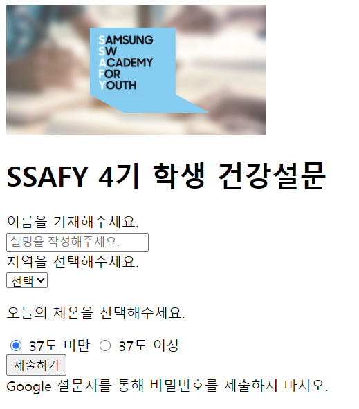

### 0810 html




```html
<!DOCTYPE html>
<html>
<head>
  <meta charset="UTF-8">
  <title>my first markup</title>
</head>
<body>

  <header>
    <a href="https://www.ssafy.com">
      
    </a>
    <h1>SSAFY 4기 학생 건강설문</h1>
  </header>
    
  <section>
    
    #1
    <form action="#" method="GET">
      <div>
        <label for="name">이름을 기재해주세요.</label><br> 
        <input type="text" id="name" placeholder="실명을 작성해주세요." autofocus>
      </div>
      
        
      #2
      <div>
        <label for="region">지역을 선택해주세요.</label><br>
        <select name='region' id="region" required> 
          <option value="">선택</option> 
          <option value="서울" disabled>서울</option>
          <option value="대전">대전</option>
          <option value="광주">광주</option>
          <option value="구미">구미</option>
        </select>
      </div>
      
        
        
      #3
      <div>
        <p>오늘의 체온을 선택해주세요.</p>
        <input type="radio" name="body-heat" id="normal" value="normal" checked>
        <label for="normal">37도 미만</label>
        <input type="radio" name="body-heat" id="warning" value="warning">
        <label for="warning">37도 이상</label>
      </div>

      <input type="submit" value="제출하기">
    </form>
  </section>

  <footer>
    Google 설문지를 통해 비밀번호를 제출하지 마시오.
  </footer>
</body>
</html>
```


#1 : label의 for 값과 양식의 id값이 같으면 연결된다. 라벨값을 누르면 양식에 입력될 수 있도록 커서가 깜빡거리게 된다!!

#2 :

- required 속성값은 폼 데이터가 서버로 제출되기 전에 사용자가 반드시 드롭다운 리스트의 값을 선택해야 함을 명시한다.
- name값은 쉽게 생각하면 키 값으로 생각하면 된다(자세한건 webquiz파일에 있음). name값은 키값으로 사용되서 region=value이런식으로 가게 됨. 그래서 하나만 선택할 수 있는거야
- 그리고 value값은 폼 데이터가 서버로 제출되는 값이다!! 설문조사를 받는 사람은 value값을 갖게 됨

