## django Auth

>  오늘의 대주제는 인증!! user에대한 인증과 request에 대한 인증!
>
> 크게 두가지만 기억하자! User object와 Web request!! 


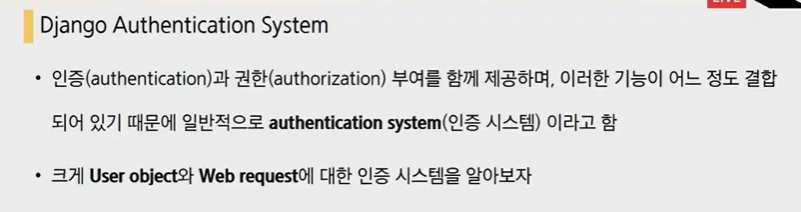


### 가상환경만들기

python -m venv venv 

인터프리터로 venv선택하고

 pip install -r requirements.txt 해서 install!


### 0.시작

article은 게시글에 대한 역할, user에 대한 역할을 할 앱을 하나 더 만들자, and lets name it 'accounts'

1) python manange.py startapp accounts

2) 장고가 이 앱의 존재를 모르니까, settings에 추가를 하자 

3) account의 urls.py를 만들자

```python
from django.urls import path

app_name = 'accounts'
urlpatterns = [
    
]
```

4) 프로젝트의 urls.py에 accouts 등록

```python
urlpatterns = [
    path('admin/', admin.site.urls),
    path('articles/', include('articles.urls')),
    path('accounts/',include('accounts.urls')),
]
```


### 1. 회원가입

> 장고는 인증에 관련된 빌트인 폼들을 제공한다. 그 기능을 잘 가져다 써보자.
>
> 회원가입(UserCreationForm) 
>
> 로그인(AuthenticationForm)
>
> google 'django authentication' - click using - built in forms -  `UserCreationForm`[¶](https://docs.djangoproject.com/en/3.1/topics/auth/default/#django.contrib.auth.forms.UserCreationForm)
>
> 장고가 제공하는 클래스인 UserCreationForm을 가져다가 쓸꺼다!!


코드로 가자. signup만들자. 두가지 역할이 필요하다. 회원가입 작성 페이지와 회원가입 적용시키는 로직, 전자는 get 후자는 post.user도 crud를 벗어날수가 없음. 이건 create view함수를 만드는 것과 동일함

(1) urls.py

```python
from django.urls import path
from . import views

app_name = 'accounts'
urlpatterns = [
    path('signup/',views.signup, name='signup'),
]

```

**매일 헷갈리는것 정리하기**

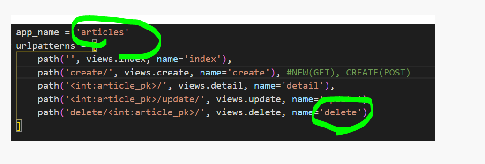

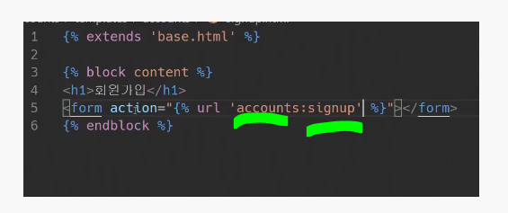

html에서 accounts:sign up은 앞은 app_name, 뒤에는 url에서 name! 

**app_name이 acoounts에서 signup으로 이름붙인 url로 가세요**


(2) views.py

user도 crud를 벗어날수가 없음. 이건 create view함수를 만드는 것과 동일함

```python
from django.contrib.auth.forms import UserCreationForm #1
def signup(request):
    if request.method == 'POST':
        pass
    else:
        form = UserCreationForm()
    context = {
        'form':form,
    }
    return render(request,'accounts/signup.html',context)

```

#1 : forms.py를 만들지 않고 이미 만들어져있는걸 쓸꺼니까 import를 할거다


(3) signup.html

​	accounts 앱에서 templates 폴더 만들고, 그 안에 accounts 폴더 만들고, 그 안에 signup.html 만들	자

```html



<h1>회원가입</h1>
 뭔가를 만들어달라고 하는 요청이니까 POST 
<form action="" method="POST">
  
  {{ form.as_p }}
  <input type="submit">
</form>

```


그리고 여기서 서버를 열어서 accounts/signup에 들어가면, 아래처럼 장고가 기본으로 아래처럼 만들어준다.아래 화면은 usercreationform의 기본! 알아서 장고가 만들어준다!

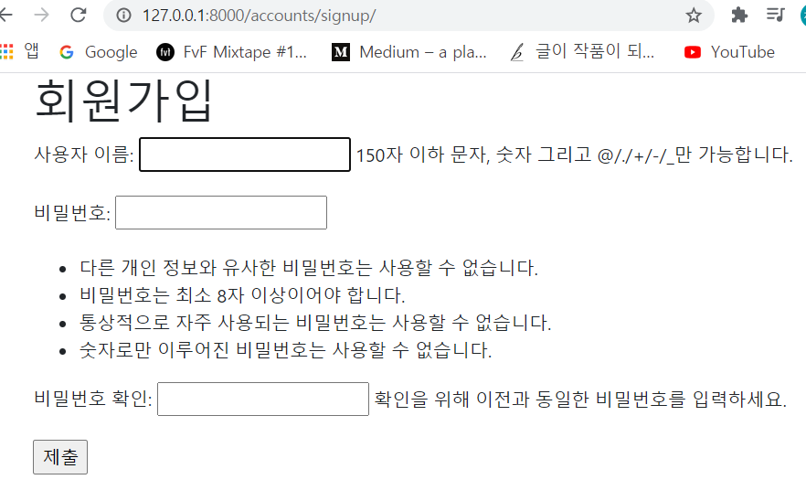


(5) views.py를 다 채워준다

articles의 create와 같다!

```python
from django.shortcuts import render,redirect
def signup(request):
    if request.method == 'POST':
        form = UserCreationForm(request.POST)
        if form.is_valid():
            form.save()
            return redirect('articles:index')
    else:
        #forms.py를 만들지 않고 이미 만들어져있는걸 쓸꺼니까 import를 할거야
        form = UserCreationForm()
    context = {
        'form':form,
    }
    return render(request,'accounts/signup.html',context)

```


(6) 그리고 회원 가입해서 user 등록하고, superuser 해서 관리자등록한 다음에 확인함

(7) articles화면에서 회원가입으로 바로 갈 수 있게 base.html을 수정해보자

```html
<body>
  <div class="container">
    <a href="">SIGN UP</a>
    
    
  </div>
```


### 2. 로그인

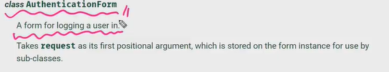

모델폼이 아니고, 첫번째 인자로 요청이 들어간다. usercreation은 request가 아니고, request.post라는 데이터가 들어갔다. 반면 이 폼은 첫번째 위치인자로 무조건 request가 들어간다.

로그인도 결국 두가지 역할 수행. 로그인 페이지, 로그인 로직. sign up은 user를 create한다. login은 session을 create한다. 

**개념 정리,what is session, cookie?**

html의 특징을 알아야 하는데, html의 특징은 연결성이 없다 

로그인을 하고 나면 계속 로그인이 되어 있다. 다른 페이지로 넘어가도 계속 로그인. 그런데 html의 특성상 이건 불가능함. 그런데 연결성이 있는것처럼 만드는게 쿠키와 세션이다. 다른 페이지로 넘어가도 로그인이 안풀리게 하기 위해 쿠키랑 계속 같이 보낸다. 그런데 쿠키는 가벼운 데이터를 저장하기 때문에, 

**Cookie**

- 웹페이지 요청과 함께 쿠키 값도 같이 전송(request+cookie)

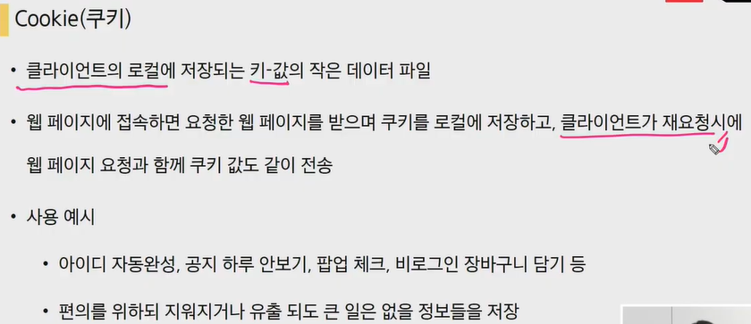


**Session(세션)**

- 주로 로그인 상태 유지에 사용한다. 

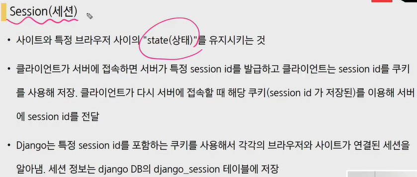

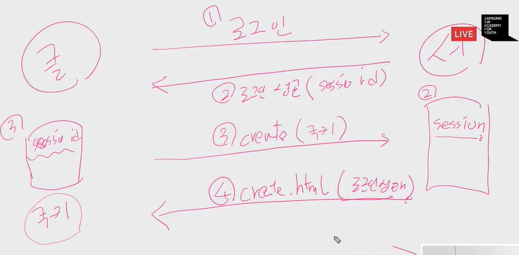

1) 로그인 하고 싶어, 2)로그인 성공(그런데 session_id 발급, 그전에 서버는 session_id를 저장한다) 3) 클라이언트는 쿠키에 session_id를 저장, 그리고 예를 들어 클라이언트가 create page로 간다치면, 이 요청에 쿠키를 같이 보냄. 그 안에 session id가 있으니까, 로그인 되어있는 상태까지 감. 그러면 4)create.html문서 주는데 로그인된 상태로 같이 보내주는 것임! 

이 과정이 내부적으로 돌고 있기 때문에 연결이 되어있는 것처럼 보이는 것이다. 그래서 쿠키를 삭제했을때 로그인이 되는 이유는 쿠키삭제하면 세션아이디가 지워지고, 세션아이디가 지워진 상태로 쿠키가 가면 서버입장에서는 로그인정보가 없는거야.그래서 로그아웃이 되는거임

(클라이언트(브라우저)- 요청을 보내는 대상, 서버- 클라이언트에게 네트워크(http)를 통해 정보를 제공하는 컴퓨터 시스템으로 컴퓨터 프로그램 또는 장치를 의미)

##### 즉, HTTP 쿠키는 상태가 있는 세션을 만들도록 해준다!!

다시 돌아와보자면, signup은 create user, 그리고 로그인은 create session! 

> **실습**
>
> **쿠키 캐념 이해하기**
>
> 로그인
>
> 1. 나(클라이언트) - naver.com에 로그인할 수 있는 페이지 달라고 요청함
> 2. 서버는 아아디, 비번 적어서 나한테 줘라고 하고, 그 페이지에 다시 '나'는 아이디, 비번 적어서 네이버에 제출한다. 네이버는 아이디랑 비번 맞는지 확인하고, 응답을 줄때 팔찌(쿠키)를 채워서 메인페이지를 같이 돌려보내주는거다.
> 3. 그리고 다른 서비스(로그인이 필요한 서비스-메일) 요청을 할때 이 쿠키가 자동으로 같이 서버로 보내진다. 
> 4. 서버측에서는 쿠키를 보고, 얘가 로그인한애구나 안한애구나를 가려서 메일화면을 보여준다든지 안보여준다든지의 응답을 한다.
>
> **세션 개념 이해하기**
>
> 로그인 - 송빈산
>
> 로그인을 했더니 서버로부터 1001 쿠키를 받았다. 이걸 계속 가지고 다니는거다(종이팔찌), 서버에서는 1001이 송빈산인지 최주아인지 누구인지 알아야하니까 저장을 해놓는 것이다(서버에서는 1001은 송빈산이라고 저장을 함. 그런데 쿠키를 작성하는 방식이 너무 쉬우면 속일 수 있기 때문에, 보안에 취약해짐(쿠키만 알면 다른사람인척 할 수 있기 때문에 even dont know id, pw) 그래서 복잡한 번호(규칙성을 찾을 수 없는)를 서버에 저장시켜놓음. 쿠키가 실제로 누구인지 저장하고 있는게 세션! 
>
> 메인 목표: 다른 사람인척을 못하게!!
>
> (코미디빅리그- 방청객, 입장번호-노란색/초록색 스티커붙여줌, 노란색은 1번 대기열, 초록색은 2번째줄 대기열, 스티커는 쿠키임. 
>
> 서버에 저장한 노란색은 1번에 앉아야하고, 초록색은 2번에 앉아야하고, 이런걸 적어놓은것을 세션이라고 한다)
>
> 


**form과 model form의 차이**

> form은 모델과 밀접한 관계가 없을때, 모델폼은 밀접한 관계가 있을때 쓴다.
>
> 회원가입을 할 때는 user model(이메일, 아이디. 비번, 이름, 주소가 있는데 다 채워야한다. 모델폼과 밀접하게 관련되어있음. 
>
> 회원가입 - usermodel, uscreaationform-modelform-data=request.POST,
>
> 반면, 로그인은 아이디,비번만 필요하다.장고가 판단하기에 이건 밀접한 관계는 아니다. 그래서 그냥 authenticationform!!
>
> 

> Form: 폼이기 때문에 메타클래스 없음(모델 폼x, 직접 필드를 작성, username, password) 
>
> UserCreationForm은 모델폼이다. 그래서 메타클래스가 존재한다. 그런데 authentication,, 이거 뭔차이야? 

(1) urls.py

`path('login/',views.login, name='login'),`


(2) views.py 

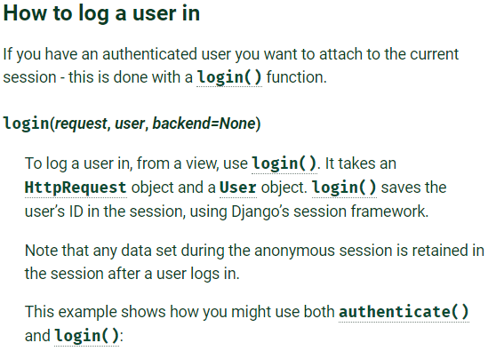

```python
from django.shortcuts import render,redirect
from django.contrib.auth import login as auth_login #1
from django.contrib.auth.forms import UserCreationForm,AuthenticationForm 

def login(request):
    if request.method == 'POST':

        form=AuthenticationForm(request, request.POST)
        if form.is_valid():
            #로그인
            auth_login(request,form.get_user()) #2
            return redirect('articles:index')
               
    else:
        form=AuthenticationForm()
    context = {
        'form':form,
    }
    return render(request,'accounts/login.html',context)

```

원래대로 하면 login 이름이 겹쳐서 #1 처럼 이름을 바꿔주고 하면 로긴이 정상적으로 이뤄짐. 


로그인에 성공했다면, 쿠키에 세션 아이디가 들어있음. 그리고 new로 가도 세션아이디가 유지되어있음. 그말은 즉슨, 계속해서 로그인되어있다는 것을 장고서버에 알리는 것이다. 로그아웃을 할려면 쿠키에 세션아이디를 없애면 로그아웃된 상태

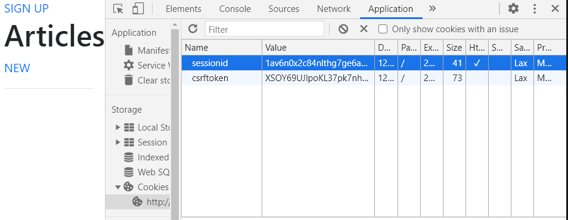


화면에 접속했을때 user name이 보이게 base.html을 수정해보자

```html
<body>
  <div class="container">
    <h3>Hello, {{ user.username }}</h3> #1
    <a href="">SIGN UP</a>
    <a href="">Login</a>
    
    
  </div>
```

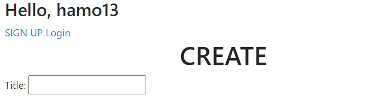


#1:  context_processor라는 이름으로 장고가 기본적으로 사용할수 있는 것을 넣어줌. 우리가 방금 사용한것은 auth이다. view에서 아무것도 보낸 것이 없는데, 템플릿에서 기본적으로  user라는 키워드를 바로 사용할 수 있는 것은 장고가 기본적으로 템플릿에서 context_processor를 제공하고 있기 때문이다.


> **로그아웃 개념 이해하기**
>
> 회원가입은 user를 create
>
> 로그인은 session을 create
>
> 로그아웃은 session을 delete


로그아웃

(1) urls.py


(2) views.py


(3) base.html


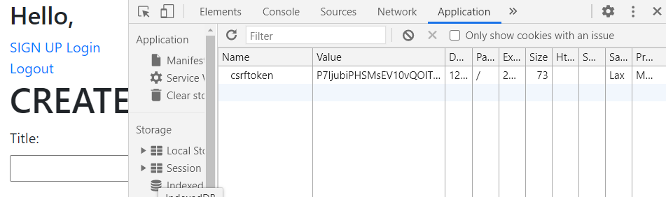

로그아웃은 request에 있는 session_id를 지우고, DB에서도 지운다. 전자를 지운 이유는 같은 브라우저를 다른 사람이 사용할 수 있고, 그러면 브라우저에 남겨진 아이디를 다른 사람이 사용할 수도 있기 때문이다! 남겨두는 방식도 있다. 쿠키에서 강제로 지우면(로그아웃 함수를 실행말고 개발자도구에서 쿠키를 지움) 그러면 sql테이블에서는 남겨져있고, 유효기간동안 남아있다. 

 

**추가 개념**

> 유효기간 늘리기 및 갱신하기
>
> ##### settings.py 
>
> ```python
> DAYS_IN_SECOND=86400 #상수로 설정, 모두가 알 수 있게 what it means
> SESSION_COOKIE_AGE = DAYS_IN_SECOND #1
> SESSION_SAVE_EVERY_REQUEST=True #2
> ```
>
> #1 : 유효기간 늘리기, 하루로 
>
> #2 : 사용자가 요청을 할때마다 계속 갱신하기, 계속 하루가 유지되는 것, 디폴트는 false라서 true로 바꿔보자. 요청을 보낸다면 하루 유지할 수 있다! 


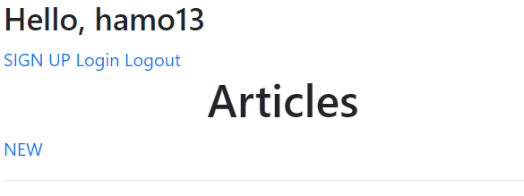

여기서 이상한건? 로그인을 이미했는데 로그인 버튼이 보인다. 로그인된 사용자에 대한 권한설정을 바꿔야한다. 상식적으로 로그인 버튼이 보여서도 안되고 접속도 되면 안된다.

**is_authenticated**

- User class의 속성
- 사용자가 인증되었는지 확인하는 방법
- User에 항상 true이며, annonymousUser에 대해서 항상 false
- 단 이것은 권한과 관련없으며 사용자가 활성화상태이거나 유효한 세션을 가지고 있는지도 확인하지 않는다.

즉, 이 속성을 통해서 if문을 작성할 수 있다. 다만, 자세한 권한과 관련이 없다. 

##### 

base.html을 수정해보자

```html
<body>
  <div class="container">
    <h3>Hello, {{ user.username }}</h3>
    
      <a href="">Logout</a>
    
      <a href="">SIGN UP</a>
      <a href="">Login</a>
    
    
    
```


그런데 버튼만 가린것이지 본질적으로 가린게 아니다. 템플릿단에서 가린것. 하지만 주소를 직접 알고 들어오는 사용자들을 막기 위해 어디서는 view를 수정해야 한다. 

**views.py**

```python
def signup(request):
    if request.user.is_authenticated:
        return redirect('articles:index')

    if request.method == 'POST':
        form = UserCreationForm(request.POST)
        if form.is_valid():
            form.save()
            return redirect('articles:index')
    else:
        #forms.py를 만들지 않고 이미 만들어져있는걸 쓸꺼니까 import를 할거야
        form = UserCreationForm()
    context = {
        'form':form,
    }
    return render(request,'accounts/signup.html',context)
    
def login(request):
    if request.user.is_authenticated:
        return redirect('articles:index')
    ---후략---
```

이렇게 만약에 로그인이 되어있다면 아래함수가 실행되지 않도록 redirect


다듬는 과정. 비로그인 상태로 뉴를 누르면, 로그인 상태로 보내게 하자!

base.html에서 if문을 써서 수정해보자

```html



  <h1 class="text-center">Articles</h1>
  
    <a href="">NEW</a>
  
    <a href="">[새 글을 작성하려면 로그인 하세요 ]</a>
  
  <hr>
  
    <p>글 번호: {{ article.pk }}</p>
    <p>글 제목: {{ article.title }}</p>
    <p>글 내용: {{ article.content }}</p>
    <a href="">[detail]</a>
    <hr>
  

```

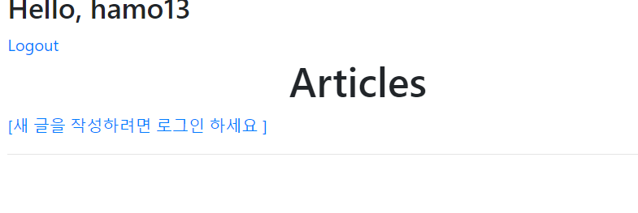

그런데 문제점은 html에서만 막았기 때문에 url로 들어오는 사용자는 여전히 new에 접속할 수 있게 된다. 

로그인이 안되어 있으면 로그인 페이지로 보낼것이다!! 인덱스로 가라 , 이게 아니라 로그엔페이지로! 아까랑 다름. 이런 기능을 하는 데코레이터가 있다, which is login required decorator

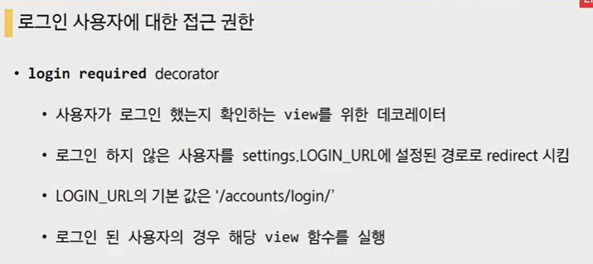

accounts/login 이 기본값이기 때문에, 유저에 대한 이름을 accounts라는 이름을 썼던 것이다. 


article>views.py에서 데코레이터를 삽입하고 수정하자. 로그인이 되있는 상태에서만 수정,삭제 할 수 있게

```python
from django.contrib.auth.decorators import login_required

@login_required
@require_http_methods(['GET', 'POST'])
def create(request):
    if request.method == 'POST':
        form = ArticleForm(request.POST) 
        if form.is_valid():
            article = form.save()
            return redirect('articles:detail', article.pk)
    else:
        form = ArticleForm()
    context = {
        'form': form,
    }
    return render(request, 'articles/create.html', context)

@login_required
@require_http_methods(['GET', 'POST'])
def update(request, pk):
    article = Article.objects.get(pk=pk)
    if request.method == 'POST':
        form = ArticleForm(request.POST, instance=article)
        if form.is_valid():
            form.save()
            return redirect('articles:detail', article.pk)
    else:
        form = ArticleForm(instance=article)
    context = {
        'form': form,
        'article': article,
    }
    return render(request, 'articles/update.html', context)

@login_required
@require_POST
def delete(request, pk):
    article = Article.objects.get(pk=pk)
    article.delete()
    return redirect('articles:index')

```


데코레이터는 단순하게 login페이지로 갈 뿐 아니라, 니가 로그인에 성공하면 원래 니가 가려고 했던 페이지로 바로 보내줄께! 라고 하는거다. 데코레이터는 넥스트 파라미터를 제공하고 있음!!user-friendly funcution!

그런데 위에처럼 데코레이터만 붙인다고 되는게아니고, accounts의 views를 수정해야한다

```python
def login(request):
    if request.user.is_authenticated:
        return redirect('articles:index')

    if request.method == 'POST':
        form=AuthenticationForm(request, request.POST)
        if form.is_valid():
            #로그인
            auth_login(request,form.get_user())
            return redirect(request.GET.get('next') or 'articles:index')
        ---생략---
```

그리고 만약에 서버를 키고 로그인 하지 않은 상태로 `http://127.0.0.1:8000/accounts/login/?next=/articles/create/ `  이렇게 하면, 당연히 login창으로 리다이렉트되고, 로그인에 성공하면 인덱스 페이지가 아닌 next 다음에 있는 articles/create페이지로 가게 된다. 


여기까지 했을때 문제가 있다. 데코레이터 두개가 엉킬 때가 있음

```python
@login_required
@require_POST
def delete(request, pk):
    article = Article.objects.get(pk=pk)
    article.delete()
    return redirect('articles:index')
```


예를 들어 

1. 비로그인 상태로 POST로 delete했다.
2. login_required로 인해서 로그인 페이지로 리다이렉트+next 파라미터(/delete/) 가지고 
3. 로그인 페이지에서 로그인 성공
4. next 파라미터 주소로 redirect됨
5. required_POST로 인해 405에러 발생

-> login_required 데코레이터는 get method 요청을 처리할 수 있는 view에서만 사용가능함


그래서 아래처럼 수정해준다.

```python
@require_POST
def delete(request, pk):
    if request.user.is_authenticated:
        article = Article.objects.get(pk=pk)
        article.delete()
    return redirect('articles:index')
```


### 3. 회원 수정

`class UserChangeForm`

(1) urls.py

```python
app_name = 'accounts'
urlpatterns = [
    path('signup/',views.signup, name='signup'),
    path('login/',views.login, name='login'),
    path('logout/',views.logout, name='logout'),
    path('update/',views.update, name='update'),
]
```

(2) views.py

```python
def update(request):
    #1. 회원 수정 페이지 보여주는 view, 2. 수정로직
    if request.method=="POST":
        pass
    else:
        form=UserChangeForm()
    context={
        'form':form,
    }
    return render(request,'accounts/update.html',context)
```


(3) update.html

```html



<h1>회원정보 수정</h1>
<form action="" method="POST">
  
  {{ form.as_p }}
  <input type="submit">
</form>


```


base.html 수정

```html
<body>
  <div class="container">
    <h3>Hello, {{ user.username }}</h3>
    
      <a href="">정보수정</a>
      ---후략---
```


이렇게 하고 서버를 열고, 로그인하고 정보수정페이지를 들어가게 되면, 문제가 있다. 일반 사용자인데,자기가 자기자신을 staff로 만들수 있다. admin페이지와 같아진다. 

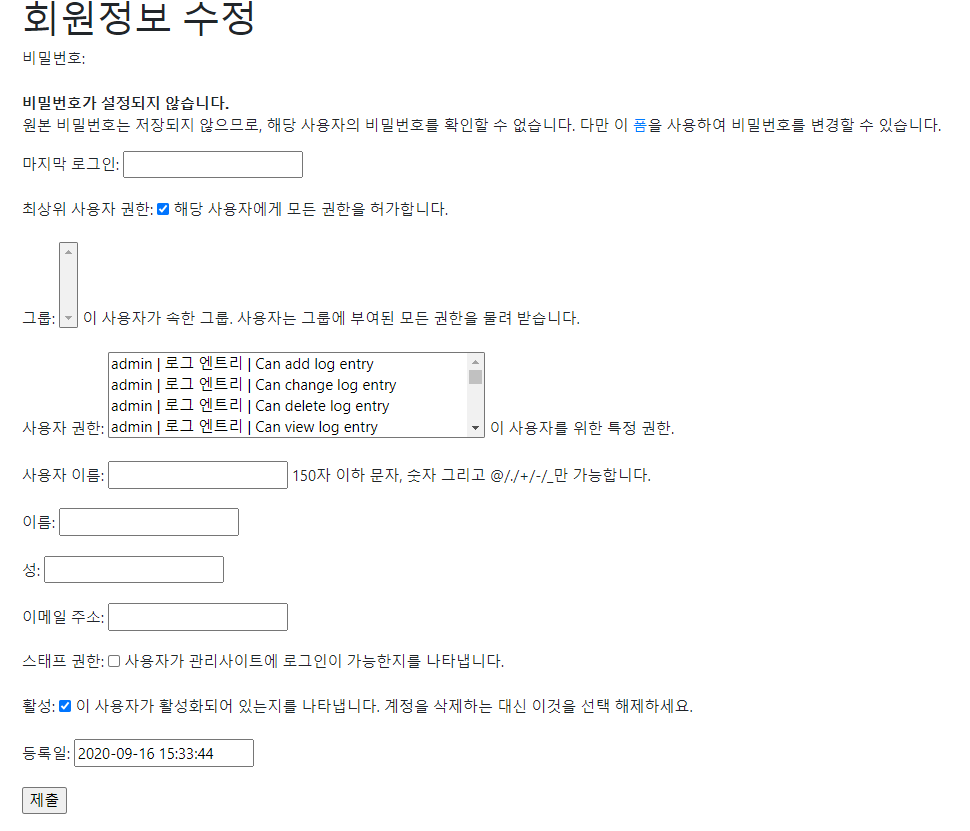


그렇다면 어떻게 해결해야 할까? 처음으로 상속을 통해서 cutomizing해야한다. 결국 accounts에서 forms.py를 만들어야한다!! 

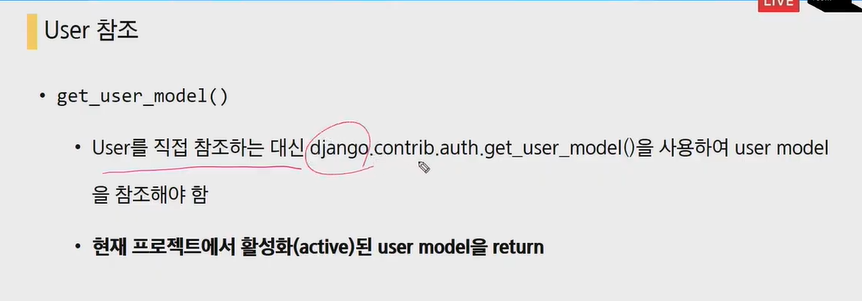


#### forms.py

user는 직접 참고 불가!

```PYTHON
from django.contrib.auth.forms import UserChangeForm
from django.contrib.auth import get_user_model

class CustomUserChangeForm(UserChangeForm):

    class Meta:
        #우리가 원하는 필드만 보고 싶어
        #수정할때 필요한 필드는? 이메일, 이름, 성
        #user는 직접 참조하면 안된다 
        
        model=get_user_model()
        fields=('email','first_name','last_name',)
```


views.py 수정하자 !! 

```PYTHON
from django.contrib.auth.forms import UserCreationForm,AuthenticationForm
from .forms import CustomUserChangeForm

def update(request):
    #1. 회원 수정 페이지 보여주는 view, 2. 수정로직
    if request.method=="POST":
        pass
    else:
        form=CustomUserChangeForm()
    context={
        'form':form,
    }
    return render(request,'accounts/update.html',context)
    
```


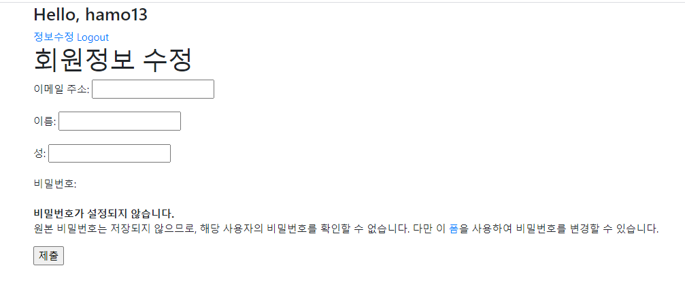

문제는 기존의 데이터가 아직 안넣어져 있음. article에서 업데이트를 할때, instance를 이용했다. instance에 기존의 내용을 넣어준다.

```python
def update(request):
    #1. 회원 수정 페이지 보여주는 view, 2. 수정로직
    if request.method=="POST":
        pass
    else:
        form=CustomUserChangeForm(instance=request.user)
    context={
        'form':form,
    }
    return render(request,'accounts/update.html',context)
    
```

이렇게 하고 admin으로 들어가서 정보 저장하고, 다시 정보수정으로 들어가면 아래처럼 과거의 정보를 보여준다.

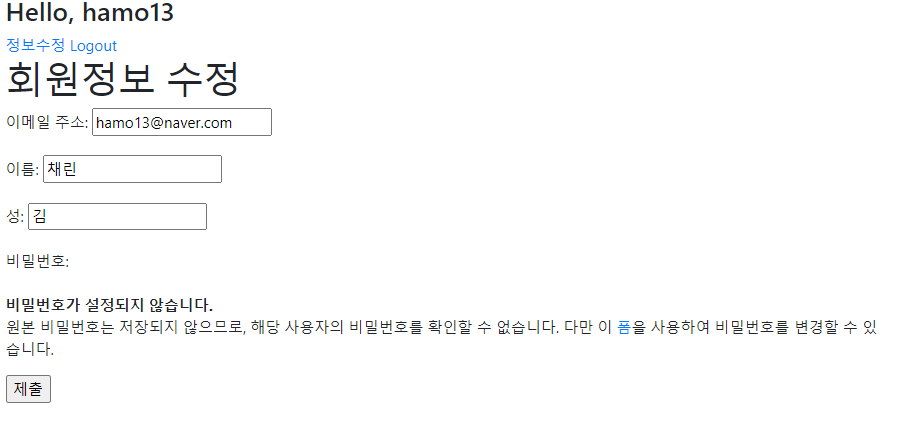

이제 남은건 정보수정하고, 제출! views.py를 고쳐줍시다

```python
from django.contrib.auth.decorators import login_required

@login_required
def update(request):
    #1. 회원 수정 페이지 보여주는 view, 2. 수정로직
    if request.method=="POST":
        #모델폼이기 때문에 첫번째 인자가 데이터인 request.POST, 그리고 과거의 데이터를 같이! instance
        form = CustomUserChangeForm(request.POST, instance=request.user)
        if form.is_valid():
            form.save()
            return redirect('articles:index')
    
    else:
        form=CustomUserChangeForm(instance=request.user)
    context={
        'form':form,
    }
    return render(request,'accounts/update.html',context)
```


### 4. 회원 탈퇴

