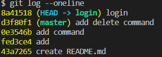
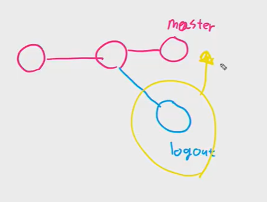
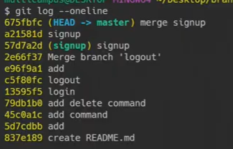
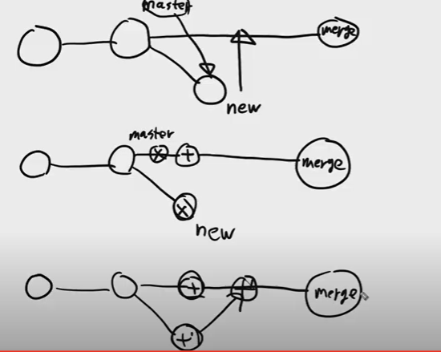
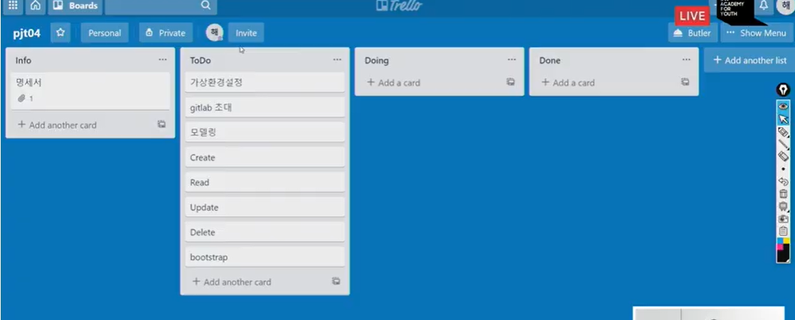
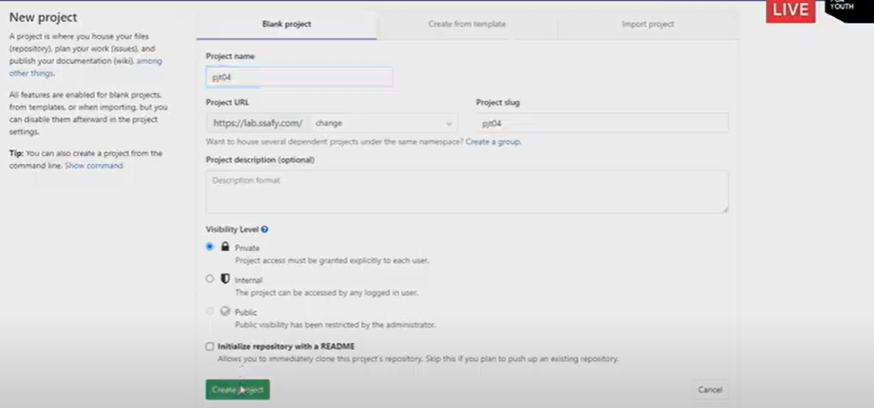

## GIT 심화

#### branch

폴더 만들기 - vs code - git init - readme.md 파일 만들기 

master가 가장 중요한 메인 줄기. 메인줄기가 마스터라고 볼 수 있고, 뻗어나가는 새로운 가지를 만들어보자. 마스터라고 하는 분기점은 매우 중요하고, 함부로 건드리면 안된다. 새로운 기능을 추가하기 위헤서는 마스터(메인 코드)에 바로 수정하는게 아니라, 특정 기능만을 위한 브랜치를 따로 빼서 작업한 뒤 테스트가 모두 완료되고, 사용자에게 배포할 수 있을때 그때서야 마스터코드에 새로운 코드를 넣는다. 

첫번째로 첫번째 commit을 남겼다(README를 생성할때 남겼던 커밋) 그리고 두번째 커밋은 add라는 이름으로 커밋을 함. 이 상태에서 브랜치를 생성함(crud). 원래는 마스터라는 브랜치만 있었는데, 새로운 브랜치를 추가했다. 브랜치를 추가한다는 것은 

상태마다 브랜치가 코드를 다르게 가고 있다! 

- `git branch` 

현재 가지들의 목록을 보여주는 명령어. 지금까지는 가장 중요한 메인줄기 하나만 자동으로 형성되어 있는 상태이다. 별표가 있는것이 활성화되어 있는 브랜치

- `git branch <new branch name>` 

새로운 브랜치를 만드는 것. 

- `git switch <branch name> ` 

브랜치로 이동하기. 이걸 하고 나면 `kimch@DESKTOP-29092RV MINGW64 ~/Desktop/branch (master)` 여기서 (master)의 이름이 <brand name>으로 변한다. 

- `git branch -d <branch name>`

브랜치 삭제하기

### 로그인 기능을 만들어보자

맨 처음 해야 할 일은 브랜치를 생성해야함. 로그인이라는 이름을 가진 브랜치를 생성하자

`git branch login`

이 브랜치에 새로운 기능을 만들거니까, login으로 이동하자

`git switch login`

여기서 코드를 작성한다. 그리고 코드를 작성한 뒤, add, commit을 한 이후 다시 master로 돌아오면 login일때 작성한 코드가 없어짐. 그리고 다시 login으로 돌아오면 다시 살아나있음.

git log를 했을때 나오는 HEAD는 현재 지금 내가 상태에 있는지를 알려준다.

방법1.fastforward 

빨기감기를 통해서 과거의 데이터를 현재의 데이터로 싱크를 맞춰줌

master에 login이 반영되야 사용자가 쓸 수 있다. -> `merge`

로그인이라는 브랜치를 마스터 옆으로 합치자. 코드는 최신 데이터로 수정된 상태. 로그인이라는 기능은 완성이 되어 있다. 로그인기능이 더 이상 수정할 필요가 없을때, 브랜치를 지워주면 된다,(`git branch -d login`)

방법2. 브랜치를 나누고, 마스터 방법 수정?

(수정 필요)근데 이건 위랑 다르게 충돌이 일어날 수 있음

마스터와 signup이라는 새로운브랜치에 같은 signup함수를 만든다. 둘다 수정이 되어 있는데, 문제가 발생한다. mege conflit이 일어날 수 있다 -> 충돌 해결(노트 수정 필요)

마스터에서 작성했던 signup과 signup에서 작성했던 signup이 합쳐져서 최종적으로 마스터에는 merge signup이 생성됨

 그리고 다 merge한 이후에 signu브랜치를 삭제한다.

1) 첫번째 방법

2) 두번째 방법

3) 세번째 방법- merge 충돌 -> 수정 -> 다시 merge

--

pjt04 폴더 만들기

django-admin startporject pjt04 .

git ignore

git init

git add .

git commit -m 'startproject'

--

깃랩

pjt04

git remote add origin {주소}

git push orgin maser

 업로드 완료

member 추가

-----

todo 카드 하나가 commit이면 좋다.

model부터 코드 작성

브랜치를 쓰고 싶다면?

pjt04안에서 

`git branch template`

`git switch template`

templates폴더 만들고,base.html 만들고, 부트스트랩이나 

뭐하고(template branch 역할 끝)

`git add . `

`git commit -m '베이스 구조 정의'`

`git switch master`

`git merge template` (마스터 코드에 template반영돰)

`git branch -d template` 

`git log --oneline`: 마스터에 반영되고 템플릿은 삭제됨

____

git push origin master! 하고 다른 사람이 pull하면 끝

b는 pjt04 프로젝트 새로 만들고, 

origin 주소 바꿔서 업로드해야함

git remote add pjt04 {주소이름}

!!!!!

git remote치면 두개 나옴 (origin:a랑 연결된것, pjt04:나의 원격저장소)

