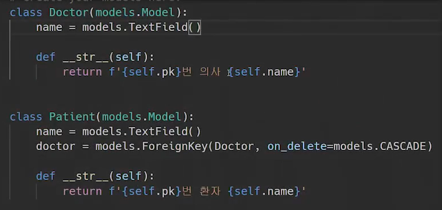
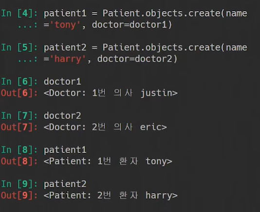
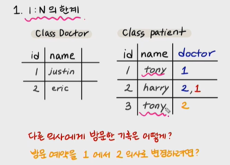
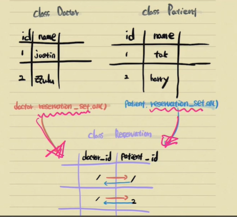
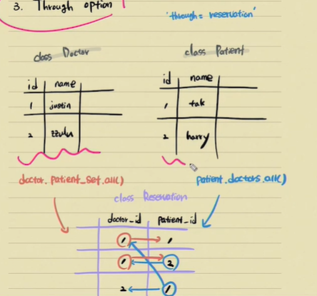

###  0.buildup for m:n model

목표: 우리 병원에 내원하는 환자와 의사간의 예약 시스템을 구축해보자. 



의사가 1이 되고, 환자가 n이기 때문에 의사에 대한 외래키를 환자가 들고 있다. shell_plus를 키고, 작업을 해보자

```python
doctor1 = Doctor.objects.create(name='justine')
doctor2 = Doctor.objects.create(name='eric')

patient1 = Patient.objects.create(name='tony', doctor=doctor1)
patient2 = Patient.objects.create(name='harry', doctor=doctor2)
```



만약, 1번 환자가 1번 의사가 마음에 안들어서 다른 의사로 바꾸고 싶다. 그런데 방법이 없다. 

```python
patient3 = Patient.objects.create(name='tony', doctor=doctor2)

#이렇게 하면 수정되는게 아니라 테이블에 추가된다
```

만약 1번 의사, 2번 의사 모두에게 진료를 받고 싶다면?

```python
patient4 = Patient.objects.create(name='harry', doctor=doctor1, doctor=doctor2)

#이렇게 쓰면 문법적으로 불가능! 
```





문제점 : 방문예약을 바꾸는것이 불가능하고(새로운 객체를 생성해야함) 그리고 다른 의사를 방문한 기록을 남길 수 없다. then how to fix it?

--> 1:n이 안돼! 그럼 이 둘의 예약관계를 저장하는 다른 테이블이 필요하지 않을까? 의사와 환자의 외래키를 모두 갖고 있는 테이블! 1번의사는 환자1,2를 진료하고 있고, 2번환자는 의사 1,2에게 진료를 받고 있다. 이렇게 두개의 테이블 가운데 역할을 해주는 게 중개모델이다! 각각의 모델과 1:n의 관계를 맺을것


새로운 중개모델을 만들어보자. 환자 모델안에 의사에 대한 외래키를 주석처리하고, 모델을 만든다.


```python
class Reservation(modles.Model):
    doctor = models.ForeignKey(Doctor,on_delete=models.CASCADE)
    patient = models.ForeignKey(Patient,on_delete=models.CASCADE)
    
    def __str__(self):
        return f'{self.doctor.pk}번 의사의 {self.patient.pk}번 환자'
```

```python
doctor1 = Doctor.objects.create(name='justine')
patient1 = Patient.objects.create(name='tony')

#진료테이블
reservation1=Reservation.objects.create(doctor=doctor1, patient=patient1)
```

이 상황에서 의사의 입장에서 오늘 진료볼 환자를 볼려면, 역참조이다. 아래처럼!

1:n의 한계가 어느정도 극복했다.

```python
doctor1.reservation_set.all()

patient1.reservation_set.all()
```




역참조로 하지 말고, 바로 조회를 할 수 없을까? 

!! manytomanyfield!! 

(m:n의 관계에서는 외래키가 어느쪽에 있어도 상관없다)

```python
class Patient(models.Model):
    name = models.TextField()
    doctors = models.ManyToManyField(Doctor,through='Reservation')

    def __str__(self):
        return f'{self.pk}번 환자 {self.name}'
```




설명: 여전히 닥터는 doctor.patient_set.all()로 정보를 가져오고 있다. 그럼 닥터도 똑같이 인스턴스를 만들어주자. 현재 환자가 m:n필드를 갖고 있기 때문에 닥터는 역참조 하는것이다. 

patient: 필드가 있는 곳! 얘는 그냥 닥터를 참조. 

문제는 참조되는 닥터가! patient를 참조할려면 어떻게 해야하나? 그게 바로 역참조이다. 여기서 포인트는 필드가 누구에게 작성되어 있는지! 

```python
class Patient(models.Model):
    name = models.TextField()
    #의사가 1이고 환자가 n이 되기 때문에 foreignkey를 환자가 들고 있다.
    #manytomany는 복수형!
    #related_name= doctor가 pateint를 참조할때 명령어, 참조되는 대상이 참조하는 대상을 참조하는 것이 역참조이다
    doctors = models.ManyToManyField(Doctor, through='Reservation ', related_name='patients')
```


그런데 중개모델을 통하지 않고, 직접 참조할 수 있다. ㅋ

**m:m field는 중개모델을 직접 만들지 않아도, 중개모델이 생성된다!** 중개모델을 고려하지 않아도 된다. 


_____________________________

### 1. ManyToManyField(to, **options)

출처 : https://brunch.co.kr/@ddangdol/6


> 다대다 관계다. 모델이 관련된 클래스며, 재귀 및 지연을 포함하여  FoerignKey와 동일하게 동작한다. 관련된 객체를 필드의 RelatedManager를 사용하여 추가하고, 삭제하고, 생성할 수 있다.
>
> - django는 M:N의 관계를 나타내는 중개 테이블을 만든다.
> - 테이블 이름은 ManyToManyField의 이름과 이를 포함하는 모델의 이름을 조합하여 생성한다.

Arguments : ManyToManyField는 관계 함수를 제어할 수 있는 추가인수 세트(모두 옵셔널)을 허용한다.

ManyToManyField.related_name 

: ForeignKey.related_name과 같다.

ManyToManyField.related_query_name

: ForeginKey.related_query_name과 같다.

ManyToManyField.symmetrical

: 오직 self에 대한 ManyToManyField 정의에 사용된다. 아래 모델을 고려해보자

```PYTHON
from django.db import models

class Person(models.Model):
    friends = models.ManyToManyField("self")
```

Django가 이 모델을 처리할때, 그 자신에 대한 ManyToManyField임을 식별하고, 결과적으로 Person 클래스에 person_set 속성을 추가하지 않는다. 대신 ManyToManyField를 대칭이라고 가정하게 된것이다. 내가 너의 친구라면, 너는 나의 친구이다.

self를 사용하는 many-to-any 관계에서 대칭을 원하지 않는다면, symmetrical을 False로 셋팅해라!


### 좋아요 기능 구현하기

> - Article은 여러 user로부터 likes를 받을 수 있고, user 또한 여러 article에게 likes를 줄 수 있다 : **ManyToManyField!**
>
> - Article모델에서는 이미 user필드에서 User모델과 1:N의 관계가 설정되어 있기 때문에 M:N 관계를 설정하려고 하면 User모델에서 Article을 참조하는 이름이 중복되서 오류가 발생함. 이를 방지하기 위해 related_name을 지정해준다.
>
>   **주의**
>
>   - article.user => 게시글을 작성한 유저 --- 1:N
>   - article.like_users => 게시글을 좋아요한 유저 --- M:N
>   - user.like_article => 유저가 좋아요를 누른 게시글(역참조, related_name) --- M:N
>   - user.article_set => 유저가 작성한 게시글(역참조) --- 1:N
>   - articles_article_like_user라는 테이블이 생성됨(좋아요를 누를때마다 데이터가 이곳에 저장됨)


**models.py**

```python
# Create your models here.

class Article(models.Model):
    user = models.ForeignKey(settings.AUTH_USER_MODEL, on_delete=models.CASCADE)
    #유저가 좋아요한 모든글을 역참조할때의 NAME을 만들어줘야지(realeted_name)
    #related_name은 optinal argument이지만, 필수적일때가 있다 depending on certain circum-
    #'like_users' 이 게시글에 좋아요 한 유저들을 조회
    #'like_articles' 유저가 좋아요 한 게시글들 조회
    like_users = models.ManyToManyField(settings.AUTH_USER_MODEL,related_name='like_articles')
    title = models.CharField(max_length=10)
    content = models.TextField()
    created_at = models.DateTimeField(auto_now_add=True)
    updated_at = models.DateTimeField(auto_now=True)
    
    def __str__(self):
        return self.title


class Comment(models.Model):
    article = models.ForeignKey(Article, on_delete=models.CASCADE)
    user = models.ForeignKey(settings.AUTH_USER_MODEL, on_delete=models.CASCADE)
    content = models.CharField(max_length=200)
    created_at = models.DateTimeField(auto_now_add=True)
    updated_at = models.DateTimeField(auto_now=True)

    def __str__(self):
        return self.content
```


**urls.py**

```python
app_name = 'articles'
urlpatterns = [
    ...
    #어떤 게시글에 좋아요를 눌렀는지 pk필요하다
    path('<int:article_pk>/like/', views.like, name='like'),
]

```


**views.py**

- POST request만 받기로 하자 : @require_POST
- like buttons를 누르면 Article 모델의 like_users 필드에 해당 user을 추가하자: add()
- 이미 like button을 누른 사용자가 또 다시 누르면 좋아요 취소를 하자: remove()

```python
#좋아요도 결국 db의 테이블을 조작하기 때문에, post로만 받는게 좋을것같당
@require_POST
def like(request, article_pk):
    # 비로그인 유저는 안되고, 사용자만 가능
    if request.user.is_authenticated:
        #게시글 없으면, 404에러 보여주고! 
        article = get_object_or_404(Article, pk=article_pk)
        # user가 article에 좋아요를 눌렀는지 안눌렀는지
        
        # 1-1. user가 article을 좋아요 누른 전체유저에 포함이 되어있는지 안되어있는지.
        #article모델에서 like_users: article에 좋아요한 모든 유저를 조회
        # if request.user in article.like_users.all():
        
        # 1-2. user가 article을 좋아요 누른 전체유저에 존재하는지.
        # filter, filter는 여러개를 쓸때 쓰고, 하나만 찾을때는 .get을 썼는데 왜 여기서는
        # filter를 썼을까? 심지어 pk로 찾는데, .get()는 없으면 에러임. 근데 이상황에서는
        # 좋아요를 안누른 유저도 정상적 상황임. 에러발생시키면 안됨.
        # filter의 특징은 그 해당조건에 맞는 쿼리셋을 리턴한다. 해당유저가 좋아요를 안눌렀으면 빈쿼리셋을
        # 리턴하고, false로 가서 else로 간다. 
        # exites() : 쿼리셋에 한 개이상의 값이 있다면 트루를 리턴한다!
        if article.like_users.filter(pk=request.user.pk).exists():
            # 좋아요 취소
            #아티클에 좋아요를 누른 유저에서 request.user을 지운다
            article.like_users.remove(request.user)
        else:
            # 좋아요
            article.like_users.add(request.user)
        return redirect('articles:index')
    return redirect('accounts:login')

```


**index.html**

인풋태그는 커스터마이징 힘들어서 버튼으로. 버튼은 디폴트가 submit! 

```python
--생략--
<form action="" method="POST" class="d-inline">
      
      
        <button class="btn btn-link" style="color: crimson;">
          <i class="fas fa-heart"></i>
        </button>
      
        <button class="btn btn-link" style="color: black;">
          <i class="fas fa-heart"></i>
        </button>
      
    </form>
```


> ## 추가학습
>
> https://wikidocs.net/71791
>
> 질문 또는 답글에 추천(좋아요)를 할 수 있는 기능을 추가해보자.
>
> 
>
> ## 모델변경
>
> 우선 Question 모델에 추천인(voter) 속성을 추가해보자. 하나의 질문에 여러명이 추천할 수 있고, 한 명이 여러개의 질문에 추천할 수 있으므로 이런 경우 다대다 관계를 의미하는 ManyToManyField를 사용해야 한다.
>
> **models.py**
>
> ```python
> class Question(models.Model):
>     author = models.ForeignKey(User,on_delete=models.CASCADE)
>     subject = models.CharField(max_length=200)
>     content = models.TextField()
>     create_date = models.DateTimeField()
>     modify_date = models.DateTimeField(null=True, blank=True)
>     voter = models.ManyToManyField(User)  # voter 추가
>     
>     def __str__(self):
>         return self.subject
> ```
>
> `voter = models.ManyToManyField(User)`처럼 추천인(voter) 속성을 ManyToManyField 관계로 추가해주었다. 그런데 이렇게 수정하고 서버를 실행하거나 makemigrations 명령을 실행하면 다음과 같은 오류가 난다.
>
> ```shell
> ERRORS:
> pybo.Question.author: (fields.E304) Reverse accessor for 'Question.author' clashes with reverse accessor for 'Question.voter'.
>         HINT: Add or change a related_name argument to the definition for 'Question.author' or 'Question.voter'.
> pybo.Question.voter: (fields.E304) Reverse accessor for 'Question.voter' clashes with reverse accessor for 'Question.author'.
>         HINT: Add or change a related_name argument to the definition for 'Question.voter' or 'Question.author'.
> 
> System check identified 2 issues (0 silenced).
> ```
>
> 오류의 내용은 Question 모델에서 사용한 author와 voter가 모두 User모델로 참조되고 있기 때문에, `User.question_set`처럼 User모델을 통해서 Qustion 데이터에 접근하려고 할때 author를 기준으로 할지 voter를 기준으로 할지 명확하지 않다는 오류이다. 
>
> 이를 해결하기 위해서는 related_name이라는 옵션을 추가해서 해결할 수 있다. 다음처럼 Question 모델을 변경해보자
>
> ```python
> class Question(models.Model):
>     author = models.ForeignKey(User, on_delete=models.CASCADE, related_name='author_question') #수정
>     subject = models.CharField(max_length=200)
>     content = models.TextField()
>     create_date = models.DateTimeField()
>     modify_date = models.DateTimeField(null=True, blank=True)
>     voter = models.ManyToManyField(User, related_name='voter_question') #수정
> ```
>
> author에는 related_name='author_question'라는 옵션을 지정하고 voter에는 related_name='voter_question'라는 옵션을 지정했다. 
>
> 이렇게 하면 이제 특정 사용자가 작성한 질문을 얻기 위해서는 `current_user.author_question.all() `처럼 사용할 수 있다. 마찬가지로 특정 사용자가 투표한 질문을 얻기 위해서는 `current_user.voter_quetion.all()`처럼 사용할 수 있다(current_user는 특정 사용자 의미) 
>
> 이제 마찬가지의 방법으로 Answer모델에도 추천인(voter) 속성을 다음처럼 추가하도록 하자.
>
> **models.py**
>
> ```python
> class Answer(models.Model):
>     author=models.ForeignKey(User,on_delete=models.CASCADE, related_name='author_answer')
>     question = models.ForeignKey(Question, on_delete=models.CASCADE)
>     content = models.TextField()
>     create_date = models.DateTimeField()
>     modify_date = models.DateTimeField(null=True, blank=True)
>     voter = models.ManyToManyField(User, related_name='voter_answer')    
> ```
>
> Answer모델에도 author와 voter속성에 related_name 옵션을 추가해주었다. 이제 모델이 변경되었으니 makemigrations와 migrate를 실행하자
>
> 
>
> **질문추천 url**
>
> ```python
> urlpatterns = [
>     ...
> 
>     # vote_views.py
>     path('vote/question/<int:question_id>/', vote_views.vote_question, name='vote_question'),
> 
> ]
> ```
>
> **질문 추천 뷰와 함수**
>
> ```python
> @login_required(login_url='common:login')
> def vote_question(request, question_id):
>     """
>     pybo 질문추천등록
>     """
>     question = get_object_or_404(Question, pk=question_id)
>     if request.user == question.author:
>         messages.error(request, '본인이 작성한 글은 추천할수 없습니다')
>     else:
>         question.voter.add(request.user)
>     return redirect('pybo:detail', question_id=question.id)
> ```
>
> 


### 팔로워 기능 구현하기

> 일반적으로 팔로워는 그 사람에 대해서 이뤄지기 때문에 프로필 페이지가 존재한다. 이 프로필 페이지에 그 사람에 대한 팔로워 버튼을 만들어보자! 

 ### 0. user의 프로필 페이지 만들기

`accounts>urls.py`

```python
path('<username>/', views.profile, name='profile'),
```

`accounts>views.py`

```python
def profile(request,username):
    #이 프로필이 누구의 프로필인지 알아야 한다.
    #views.py에서 유저모델을 참조할려면, get_user_model을 사용해야함
    #models.py에서만 settings.~ 어쩌고 써야함 
    User=get_user_model()
    person = get_object_or_404(User, username=username)
    context = {
        'person':person,
    }
    return render(request,'accounts/profile.html',context)
```

`profile.html`

```html



<h1 class='text-center'>{{ person.username }}의 프로필</h1>
<hr>
<!--팔로우,팔로잉 페이지 뜯어서 _follow에 만들고, 여기 include!-->


<hr>

<h2>{{ person.username }}이 작성한 게시글</h2>
 유저에서 아티클을 참조하는 것이기 때문에 역참조!  

  <div>{{ article.title }}</div>

<hr>

<h2>{{ person.username }}이 작성한 댓글</h2>
 댓글은 유저에 입장에서 n이고, 댓글의 입장에서 유저는 1. 이것도 역참조 

  <div>{{ comment.content }}</div>

<hr>

<h2>{{ person.username }}이 좋아요 한 게시글</h2>
 이 유저가 좋아요 한 모든 게시물, related_name을 like_articles라고 함  

  <div>{{article.title}}</div>


<hr>

<a href="">[back]</a>


```

~~역참조,,,,할때 너무 헷갈린다. 변수가,,ㅁ~~

~~진자 다 이 html 다헷갈림 ㅈㄴ 모르겠음 ,,,,,,,,,,,,,,,,~~


~~user가 좋아요한 모든 게시글을 조회해야한다... 근데 왜 역참조를 써야하지?~~

~~like_users는 그 게시물에 좋아요를 누른 모든 유저들, 정보는 아티클모델에 있다. 이제  유저에서! 게시물을 찾아야 한다.~~ 


### 1. 팔로우 

**models.py**

```python
# Create your models here.
class User(AbstractUser):
    #followings = models.ManyToManyField('self')이렇게 하면 대칭, 팔로잉하면 자동 팔로워
    #대칭이 있는 상태면 역참조 안만들어준다
    #대칭이 꺼졌기 때문에 역참조! related_name => followers!

    #매니투매니필드는 절대 이 유저모델에 새 컬럼이 추가되는게아니라! 
    #중개모델이 생성된다.
    followings = models.ManyToManyField('self', symmetrical=False, related_name='followers')
```


**urls.py**

```python
path('<int:user_pk>/follow/', views.follow, name='follow'),
```


**views.py**

```python
@require_POST
def follow(request, user_pk):
    # 상대방
    you = get_object_or_404(get_user_model(), pk=user_pk)
    # 나(request안에 들어있음)
    me = request.user

    if me != you:
        # if user in person.followers.all():
        #내가 저기 존재한다면! 내가 저 팔로워리스트에 존재한다면
        if you.followers.filter(pk=me.pk).exists():
            #빠져야하고
            you.followers.remove(me)
        else:
            you.followers.add(me)
    # 내 프로필에서 팔로우하는게 아니라 상대방 프로필 들어가서 
    # 상대 팔로우하는거니까 you.username으로 redirect!
    return redirect('accounts:profile', you.username)
```

if you.followers.filter(pk=me.pk).exists(): 이것도 모르겠음 ㅗ

**_follow.html**

```html
<!--팔로워 수/ 팔로잉 수 -->
<div class="jumbotron">
  
    <p class="lead">
      팔로워 수: {{ person.followers.all | length }} / 팔로잉 수 : {{ person.followings.all | length }} 
    </p>
    <!--팔로우 버튼/ 언팔로우버튼-->
    <!--내 프로필에서는 팔로우버튼 보면 안되니까-->
     
      <form action="" method='POST'>
        
        
          <button class='btn btn-secondary'>Unfollow</button>
        
          <button class='btn btn-primary'>Follow</button>
        
      </form>
    
  
</div>
```

