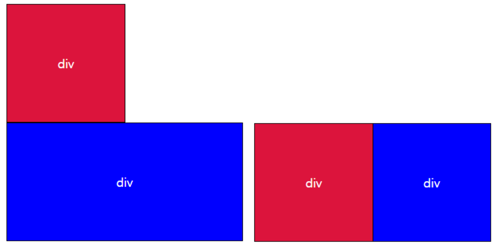
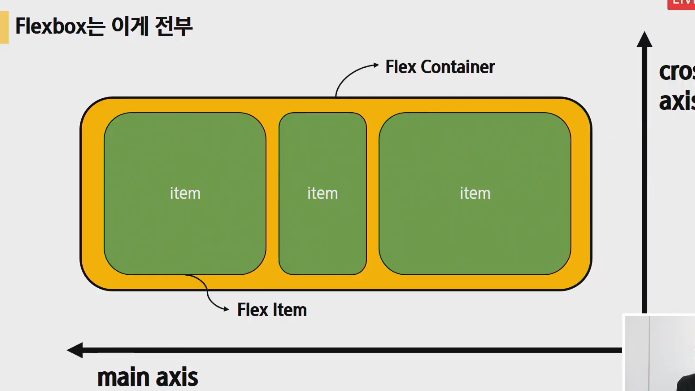
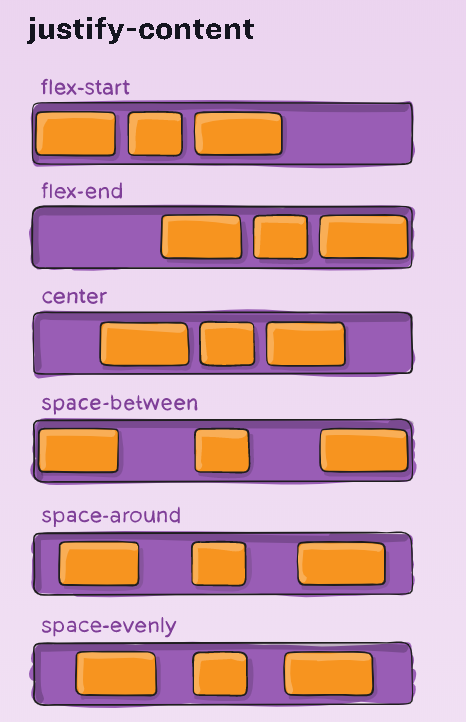
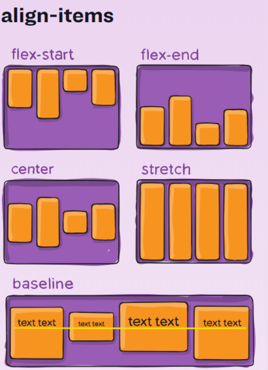
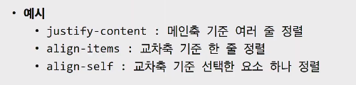
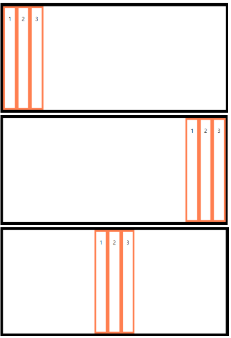
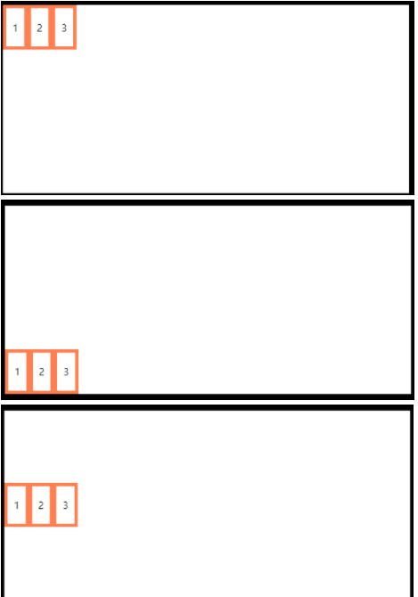

# CSS layout

- 웹페이지에 포함되는 요소들을 취합하고 그것들이 어디에 놓일지 제어하는 기술
- display, position, float, flexbox, grid에 대해서 배울 것이다
- 오늘의 큰 주제는 float, flexbox, gird


## Float

> 한 요소(element)가 정상흐름(normal flow)으로부터 빠져 텍스트 및 인라인(inline) 요소가 그 주위를 감싸 자기 컨테이너의 좌, 우측을 따라 배치되어야 함을 지정한다. 
>
> 속성으로는 `none`, `left`, `right`가 있다.


**clearfix**

- float 요소와 다른 텍스트가 아닌 block 요소간의 레이아웃 깨짐을 막기 위해 다음과 같이 작성한다

- 헤더 태그 다음에 가상 요소를 만드는 것임.

    가상요소 (::after)로 내용이 빈 블럭을 만들고, 이 가상요소는 foat left, right(both)를 무시한다는 것임. 너네 float되도 나 뜬거 무시할거임. 빨간색 떠도 위로 올라가지 않고 무시하는 속성을 가지게 된다

  ```css
  /*float 속성을 적용한 요소의 부모요소에 적용한다*/
  /*부모 태그 다음에 가상 요소(::after)로 내용이 빈(content:"") 블럭(display:block;)을 만들고,/*
  /*이 가상요소는 float left, right, (both)를 초기화 한다는 뜻*/
  
  .clearfix::after{
      content: "";
      display: block;
      clear: both;
  }
  ```

- floatleft된 애들을 막을려면 그 부모요소에 줘야 한다. 가상요소를 만듦으로써!!!

  포인트는 부모에 클래스를 주는것이 포인트임. 네이버에서도 플로트를 사용하고 있음

  지식, 쇼핑, 바가 왼쪽으로 플로트되어 있음


**추가 **




```html
<body>
    <div class="box1" style="float:left'">div</div>
    <div class="box2">div</div>
</body>
```

- float: left를 적용했을때 빨간 블럭 밑으로 파란 블럭이 존재하게 된다.(이게뭔소리지???) 블럭이 body로 부터 떨어져 나와 자유로운 상태이기 때문에 저런 현상이 발생한다.
- 이런 현상을 막기 위해서 float 속성을 적용한 요소에 내용이 빈 부모를 인위적으로 만들어 방지한다.

```css
.clearfix::after {
    content: "";
    display: block;
    clear: both
}
```

```html
<header class="clearfix">
    <div class="box1" style="float:left">div</div>
</header>
<div class="box2">div</div>
```


## Display

> (display 개념부족으로 추가) 
>
> display CSS 속성은 요소를 블록과 인라인 요소 중 어느쪽으로 처리할지와 함께 자식 요소를 배치할때 사용할 레이아웃을 설정한다.


**block**

- 쌓이는 박스
- 요소는 블록 요소 상자를 생성하여 일반 흐름에서 요소 앞뒤에 줄 바꿈을 생성한다.
- 블록 레벨 요소 안에 인라인  레벨 요소가 들어갈 수 있다

**inline**

- 줄바꿈이 일어나지 않는 행의 일부 요소
- content 너비만큼 가로 폭을 차지
- width, height, margin-top, margin-bottom을 지정할 수 없음
- 상하 여백은 line-height로 지정

**inline-block**

- inline 처럼 텍스트 흐름대로 나열, block처럼 박스 형태이기 block 속성 사용가능.

**none**

- 해당 요소를 화면에서 사라지게 하며 요소의 공간조차 사라지게 한다.
- `visibility: hidden;`은 해당 요소를 화면에서 사라지게는 하나 공간은 사라지지 않는다.


## Flexbox

> 일명 flexbox라 불리는 Flexible Box module은 flexbox 인터페이스 내의 아이템 간 공간 배분과 강력한 정렬 기능을 제공하기 위한 1차원 레이아웃 모델로 설계되었다.
>
> 웹페이지의 컨테이너에 아이템의 폭과 높이 또는 순서를 변경해서 웹페이지의 사용 가능한 공간을 최대한 채우고 이를 디바이스 종류에 따라 유연하게 반영하도록 하는 개념

- 이미지 주변에 텍스트를 감싸는 목적으로 돌아감(cf, float은 legacy layout으로 불림)
- css flexible box layout 
  - 1차원 레이아웃을 만드는 것(한방향 정렬)
  - 요소와 축! 두가지만 기억하자

**핵심 개념**

- **요소**
  - flex container
  - flex items
- **축**
  - main axis(메인축)
  - cross axis(교차축)



- flex container가 부모임

- flex item이 자식

- 동시에 움직이지 않음, 오른쪽으로 가면서 위로 가지 않음, main축으로 어떻게 정렬할지 교차축으로 어떻게 정렬할지만 결정

- 위 4개의 개념만 잘 알고 있으면 된다

- 부모 요소에 `display:flex`혹은 `inline flex`를 작성하는 것부터 시작한다.

- 속성

  - flex-direction(배치 방향 설정)
  - justify-content(메인 축 방향 정렬),
  - align-items(한 줄), align-content(여러 줄), align-self(개별요소) (교차 축 방향 정렬)
  - flex-wrap, flex-flow, flex-grow

  


## flex에 적용하는 속성






**flex container**

- flexbox 레이아웃을 형성하는 가장 기본적인 모델
- flexbox가 놓여있는 영역
- flex 컨테이너를 생성하려면 영역 내의 컨테이너 요소의 display 값을 flex 혹은 inline-flex로 지정
- flex 컨테이너를 선언시 아래와 같이 기본 값이 지정
  - item은 행으로 나열
  - item은 주축의 시작 선에서 시작
  - item은 교차축의 크기를 채우기 위해 늘어남
  - `flex-wrap` 속성은 `nowrap`으로 지정


```
Tip !

justify - main axis
align - cross axis

content - 여러 줄
items - 한 줄
self - 개별 요소
```


**flex-direction**

>  쌓이는 방향 설정 (main-axis 의 방향만 바뀜. flex 는 single-direction layout concept 이기 때문)

- row (기본값)
  - 가로로 요소가 쌓임
  - row 는 주축의 방향을 왼쪽에서 오른쪽으로 흐르게 한다.
- row-reverse
- column
  - 세로로 요소가 쌓임
  - column 은 주축의 방향을 위에서 아래로 흐르게 한다.
- column-reverse


**flex-wrap**

>  item들이 강제로 한 줄에 배치 되게 할 것인지 여부 설정

- nowrap (기본 값)
  - 모든 아이템들 한 줄에 나타내려고 함 (그래서 자리가 없어도 튀어나옴)
- wrap : 넘치면 그 다음 줄로
- wrap-reverse : 넘치면 그 윗줄로 (역순)


**flex-flow**

>  flex-direction 과 flex-wrap 의 shorthand

```css
flex-flow: row nowrap;
```


**justify-content**

> main axis 정렬
>
> `flex-direction: row` 기준으로 작성됨

- flex-start (기본 값)
  - 시작 지점에서 쌓임(왼쪽 → 오른쪽)
- flex-end
  - 쌓이는 방향이 반대 (`flex-direction: row-reverse` 와는 다르다. 아이템의 순서는 그대로 정렬만 우측에 되는 것.)
- center
- space-between
  - 좌우 정렬 (item 들 간격 동일)
- space-around
  - 균등 좌우 정렬 (내부 요소 여백은 외곽 여백의 2배)
- space-evenly
  - 균등 정렬 (내부 요소 여백과 외각 여백 모두 동일)


**align-items**

> cross axis 여러 줄 정렬
>
> `flex-direction: row` 기준으로 작성됨

- stretch (기본 값)
  - 컨테이너를 가득 채움
- flex-start
  - 위
- flex-end
  - 아래
- center
- baseline
  - item 내부의 text에 기준선을 맞춤


**align-self**

> align-items 와 동일 (단, 개별 item 에 적용)

- auto (기본 값)
- flex-start
- flex-end
- center
- baseline
- stretch
  - 부모 컨테이너에 자동으로 맞춰서 늘어난다. (Stretch 'auto'-sized items to fit the container)


**order**

- 기본 값 : 0
- 작은 숫자 일수록 앞(왼쪽)으로 이동.


**flex-grow**

- 기본 값 : 0
- 주축에서 남는 공간을 항목들에게 분배하는 방법
- 각 아이템의 상대적 비율을 정하는 것이 아님
- 음수는 불가능





```html
<div class="box1 flex-container">
    <div class="box2 item1">1</div>
    <div class="box2 item2">2</div>
    <div class="box2 item3">3</div>
</div>
```

```html
.flex-container {
    display : flex; 
    flex-direction: row;
}
```

순서대로 justify-content : flex-start, flex-end, center




순서대로 align-items: flex-start, flex-end, center




## 실습 flexbox


```html
<style>
    .flex-container{
        display: flex;
    }
</style>
```


## For more details

`display: flex`

- 부모에게 디스플레이 박스를 주는게 플렉스 박스의 시작이다. 플렉스를 안주면 각각 아이템은 블락이기 때문에 한줄씩 되있다. 메인축 기준(row) 아이템이 행으로 나열된다. 
- 아이템은 행으로 나열된다. 아이템은 메인축의 시작 선에서 시작한다. 아이템은 크로스축의 크기를 채우기 위해 늘어난다. 

`flex-direction: row`

- 이건 디폴트 값임. 없어도 되는 코드임.

`flex-wrap: wrap`

- 넘치면 아래로 떨어지게 되는 코드
- 만약 ``flex-wrap: row-reverse`이렇게 하면 디폴트 값인 왼->오 에서 오-> 왼으로 방향이 바뀐다.

`flex-direction: column`

- 이렇게 코드를 작성하면 메인축은 세로가 되었고, 그 에 따라 크로스축은 가로축이 되었다. (which means 메인이 컬럼으로 바뀜)
- `flex-direction: column-reverse`


**메인축 정렬**

`justify-content: flex-start`

`justify-content: flex-end`

`justify-content: center`

`justify-content: space-between` 

- 처음과 끝을 양쪽 끝으로 보내는것이 space between의 특징임

`justify-content: space-around`

- 내부 요소끼리의 공간이 외부 공간의 두배라고 생각하면 됨

`justify-content: space-evenly`

- 내부요소 공간=외부요소 공간, 균등 정렬


**크로스축 정렬**

`align-itmes: flex-start`

`align-itmes: flex-end`

`align-itmes: flex-center`

`align-itmes: baseline`


**self**

- self의 특징은 부모 컨텐츠에게 주는게 아니라 자식요소에 직접 속성을 부여하는 것이다

- order의 디폴트값은 0이다. 숫자가 작을 수록 앞에 배치된다.

- `flex-grow`

  그로우는 남는 여백을 나눠서 분배를 하는 것이고, 주의할 것은 비율로 나눈다는 것이 아님. 만약 1,2,3에 각각 1,2,3을 주면 남은 여백을 1,2,3으로 나눠서 준다는 뜻이다.1:2:3아님. 음수는 사용할 수 없음


## flexbox 실습2

- flexbox를 이용해서 어제 만들었던 카드를 다시 만들어보았다


```css
.container {
  width: 1200px;
  margin: 50px auto;
}

.card {
  display: flex;
  flex-direction: column;
  justify-content: space-between;
  width: 700px;
  border: 2px dashed black;
  margin: 0 auto;
}

.card-nav {
  display: flex;
  justify-content: center;
  background-color: green;
}

.card-header {
  padding: 18px;
}

.card-img {
  display: block;
  width: 100%;
  height: 330px;
}

.card-img-description {
  display: flex;
  flex-direction: column;
  align-items: center;
}

```


## For more details

```css
.card {
  display: flex;
  flex-direction: column;
  justify-content: space-between;
  width: 700px;
  border: 2px dashed black;
  margin: 0 auto;
}
```

- `flex-direction: column;`
  - 자료가 위에서부터 아래로 쌓여야 하기 때문에 메인축은 column이 되어야 한다.
- `justify-content: space-between;`
  - 이거 뭐지? 무슨 차이인지 잘 모르겠음
- `margin: 0 auto;` 
  - 이걸 하니까 카드가 브라우저 한가운데로 옮겨짐,(??) 


```css
.card-nav {
  display: flex;
  justify-content: center;
  background-color: green;
}
```

- `justify-content: center;`

  - 오늘의 명소가 가운데 있기 때문에 메인축 기준 가운데로 이동시키는 위 코드를 입력

    

```css
.card-img-description {
  display: flex;
  flex-direction: column;
  align-items: center;
  background-color: green;
  height: 70px;
  /*위까지 코드를 작성하면 좌우 기준으로 가운데 정렬은 되는데
    위아래 정렬도 필요하다.메인축을 기준으로 가운데를 해야함.
    메인축이 세로이기 때문에 아래처럼 코드를 작성한다! */
  justify-content: center;
}

```

- `flex-direction: column;`
  - 제주도 성산일출봉이 세로로 쌓여야 하기 때문에 메인축을 column으로 지정
- `align-items: center;`
  - 크로스축은 이때 가로가 됨. center를 쓰면 (나중에 추가)


