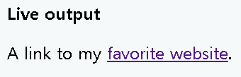
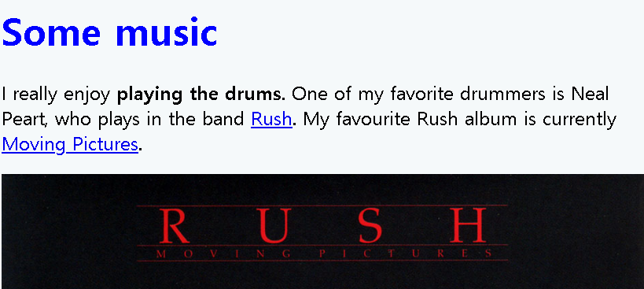
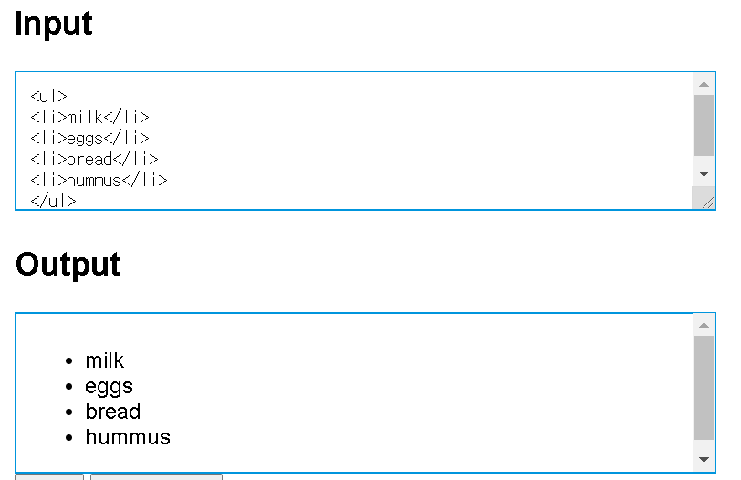

## HTML


## HTML 요소(element)의 구조

`<p>My cat is very grumpy</p>`

`<p>`: opening tag

`My cat is very grumpy`: Content

`</p>`: closing tag

`<p>My cat is very grumpy</p>`:element(여는 태그,닫는태그,내용을 통틀어 요소라고 한다.)


## 속성(Attributes)

`<p class="editor-note">My cat is grumpy</p>`

- 요소 이름 다음에 바로 오는 속성은 요소 이름과 속성 사이에 공백이 있어야 되고, 하나 이상의 속성들이 있는 경우엔 속성 사이엔 공백이 있어야 한다.
- 속성 이름 다음엔 등호(=)가 붙는다
- 속성 값은 열고 닫는 따옴표로 감싸야 한다.


### 실습 : 요소에 속성 추가하기

또 다른 요소 중 하나인 `<a>`요소는 "anchor"를 의미하는데, 닻이 배를 항구로 연결하듯 텍스트로 감싸소 하이퍼링크로 만든다. 이 요소는 여러 속성을 가질 수 있지만아래에 있는 두개가 주료 사용된다.

- `href`: 이 속성에는 연결하고 싶은 웹 주소를 지정한다. 그 예로, `href="https://www.naver.com"`
- `title`: `title`속성은 링크에 대한 추가 정보를 나타낸다. 그 예로, `title="The Mozilla homepage" ` 이 내용은 링크 위로 마우스를 옮겼을 때 나타난다.
- `target`:`target`속성은 링크가 어떻게 열릴 것인지 지정한다. 예를 들어 `target="_blank"`는 링크를 새탭에서 보여준다. 현재 탭에서 링크를 보여 주고 싶다면 이 속성을 생략한다.

```html
<p>A link to my <a href="https://www.mozilla.org/" title="The Mozilla homepage" target="_blank">favorite website</a>.</p>
```




## HTML 문서의 구조

```html
<!DOCTYPE html> #문서형식
<html> #html요소
    <head>
        #인코딩, utf-8에는 전세계에서 사용되는 언어 대부분 포함
        <meta charset="utf-8"> 
        #title요소, 페이지 제목이 설정됨
        <title>My test page</title>
    </head>
    <body>
        #텍스트, 이미지, 비디오, 게임 등 페이지에 표시되는
        #모든 콘텐츠 포함됨
        <p>This is my page</p>
    </body>
</html>
```


- head></head>`: `<head>요소이다. 이 요소는 이용자에게는 보이지 않지만 검색 결과에 노출 될 키워드, 홈페이지 설명, css스타일 등 HTML 페이지의 모든 내용을 담고 있다.


- ```html
  <h1>Some music</h1>
  <p>
      I really enjoy <strong>playting the drums</strong>.One of my favorite dummers is Neat Peart, who plays in the band <a href="https://en.wikipedia.org/wiki/Rush_%28band%29" title="Rush Wikipedia article">Rush</a>.
  </p>
  
  ```

  

- Rush에 커서를 올리면 Rush Wikipedia article이 뜬다.


## HTML head란?

페이지를 열 때 브라우저에 표시되는 `body`요소와 다르게,  head의 내용은 페이지에 표시되지 않는다. 대신에 head의 내용이 하는 일은 페이지에 대한 metadata를 포함하는 것이다.

```html
<head>
    <meta charset="utf-8">
    <title>My test page</title>
</head>
```


## 제목 달기

  head는 body에서 최상위부분에 들어가는 `h1`요소와 헷갈릴 수 있다. `h1`요소는 가끔 title을 가리키기도 하지만 이것은 엄연히 다르다.

- `h1`요소는 일반적으로 페이지당 한번씩 사용되는데, 페이지 내용물의 제목이나 뉴스의 헤드라인을 표시하기 위해서 페이지를 열 때 브라우저에 표시된다.
- `title`은 HTML 문서 전체의 타이틀을 표현하기 위한 메타데이터이다.


## 메타 데이터

많은 `<meta>`요소가  `name`과 `content`속성을 가진다

- `name`은 메타 요소가 어떤 정보의 형태를 갖고 있는지 알려줌

- `content`는 실제 메타데이터의 컨텐츠이다.

  

## 기본과 단락

HTML에서 각 단락은 `<p>`요소 안에 둘러싸여 있어야 한다.

또한 제목도 heading 요소 안에 둘러싸여 있어야 한다. heading 요소에는 총 6개가 있다-`<h1>,<h2>,<h3>,<h4>,<h5>,<h6>`. 메인제목이 h1, 소제목이 나머지.

가급적이면 페이지 당 하나의 `<h1>`만 사용해야 한다.


## Lists

- Unordered 

  쇼핑 리스트 항목이 예이다. 순서 없는 리스트를 정렬하기 위해 `<ul>` element로 감싸준다

  ```html
  <ul>
      mlik
      eggs
      bread
      hummus
  </ul>
  ```

  마지막으로 그 안의 리스트 항목을 `<li>`(list item) 태그로 감싸준다

  ```html
  <ul>
      <li>milk</li>
      <li>eggs</li>
      <li>bread</li>
      <li>hummus</li>
  </ul>
  ```

  ！【】（）


- Ordered

  `<ul>`태그가 아닌 `<ol>`태그로 감싸는 것을 제외하고는 마크업 구조는 순서가 없는 리스트와 동일하다.

  ```html
  <ol>
    <li>Drive to the end of the road</li>
    <li>Turn right</li>
    <li>Go straight across the first two roundabouts</li>
    <li>Turn left at the third roundabout</li>
    <li>The school is on your right, 300 meters up the road</li>
  </ol>
  ```

  

## 시맨틱 태그

- header `<header>`

  :A big strip across the top with a big headig,logo,tagline. usually stays the same from one webpage to another

- nevigation bar

  : `<nav>`

- main content

  : `<main> ` with various content subsections represented by `<article>`, `<section>` and `<div>`elements

- aside: 사이드에 위치한 공간, 메인 콘텐츠와 관련성이 적은 콘텐츠

- footer

  : `<footer>`A strip across the bottom of the page that contains fine print, copyright notices, or contact info,etc. it's a place to put common information(like the header) but usaually, that infor is not ciritical or secondary to the webpage itself. 

**왜 사용?**

- 의미부여

  : Semantic 마크업을 사용하는 행위는 문서에 의미를 부여해주는 행위이다. 

### `<div>` and `<span>`

- `<span>`

  : inline non-semantic element, which you should only use if you cant think of a better semantic text element to wrap your content, or don't want to add any specific meaning/ 아무런 의미를 갖지 않는 요소이다. `<span>`태그 안에 컨텐츠가 없다면 해당 부분은 아무 변화가 없지만, `<span>`태그  내에 객체가 들어간다면, 그 객체의 크기만큼 공간이 할당된다. 


- `<div>`

  : block level non-semantic element, which you should only use if you can't think of a better semantic block element to use, or don't want to add any specific meaning. For example, imagine a shopping cart widget that you could choose to pull up at any point during your time on an e-commerce site:/ division의 약자로 포함하고 있는 컨텐츠가 어떠한 의미도 갖지 않음을 의미함. 논리적인 구분을 정의하는 태그이며, 각각의 블록을 갖는다. 주로 레이아웃을 잡는 용도로 쓰이고, class 속성을 같이 사용한다


## table

- `<table>` : 테이블을 만드는 태그

- `<th>`: 테이블의 헤더부분을 만드는 태그

- `<tr>`: 테이블의 행을 만드는 태그

- `<td>`: 테이블의 열을 만드는 태그

- `<colspan>`: 가로 합병(열 합병)

- `<rowspan>`: 세로 합병(행 합병)

  

- 각 열의 의미에 따라 thead, tbody, tfoot 태그로 구분지을 수 있다.

  

## Form

Form 이란 사용자가 입력한 정보를 서버로 전송하기 위한 컴포넌트를 의미한다. Form 엘리먼트로 시작하고, 이 엘리먼트의 하위에 Form 컴포넌트들이 위치한다. 

- 서버에서 처리될 데이터를 제공하는 역할
- 기본속성은 action/method

https://opentutorials.org/module/2/14 form 이 뭐지? 

